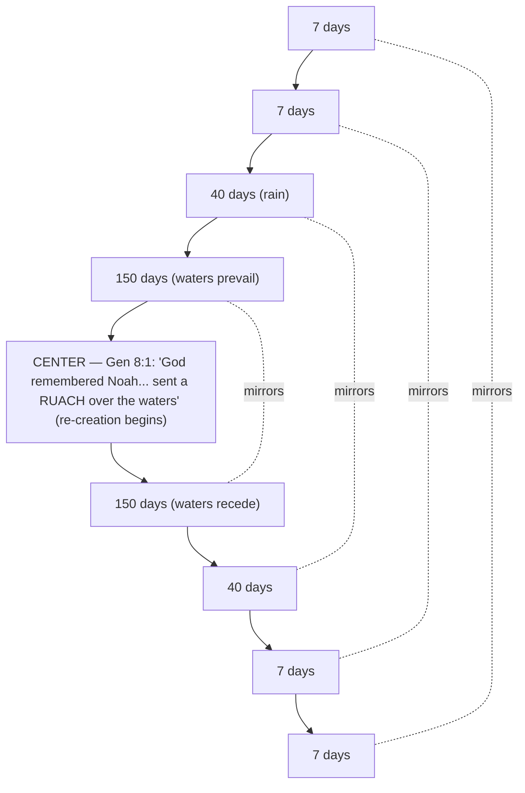
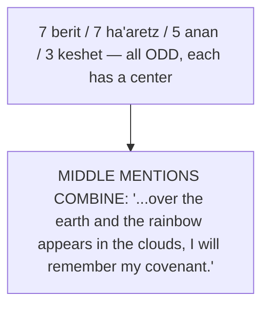

# His Bow in the Clouds

**BEMA 4 · Session 1** — Genesis (Noah and the Flood: Genesis 6–9)
Source transcript: `transcripts/1-04-his-bow-in-the-clouds.md`
Speakers: Marty Solomon, Brent Billings, **Elle Grover Fricks** (guest — M.A., Bible in its ancient Near Eastern context, Hebrew University of Jerusalem)

> **Session 1 arc — partnership.** Session 1 traces a God who keeps seeking partners to help him redeem a good creation. The flood story fits the arc precisely: a God grieved by violence who, rather than ruling by fear, disarms himself and binds himself to creation in covenant. Cited: *Marty* — "he keeps wanting to find people to help him redeem it."

---

## Key Lessons

The flood story is a *second* creation account, and the God revealed in it holds the same priorities the earlier Session 1 episodes have been building — redemption over destruction, relationship over fear.

- **God hangs up his war-bow — he disarms himself rather than rule by fear.** The *keshet* is a weapon, hung in the clouds pointed *upward*, back toward God, not aimed at the earth. Cited: *Marty* — "this God in Genesis doesn't try to leverage fear... he gives away all of his leverage because he doesn't want that kind of relationship. He wants a different kind of relationship." / *Elle* — "The implement of war—same word."

- **God's concern is violence/evil, not human "annoyance."** Reframing Gilgamesh: the pagan gods exterminate humanity for making noise; the God of Genesis grieves violence and immediately moves to save. Cited: *Elle* — "The people are annoying... God's problem, when we read Genesis 6, is evil, right? Violence being done against the earth, being done against people."

- **"Even though" — God commits to creation despite humanity, not because of its merit.** The "every inclination... only evil all the time" phrase bookends the story: it *prompts* the flood at the start and is *overruled* at the end. Cited: *Marty* — "even though every inclination of the human heart... even if it is true... Even though I will not destroy creation." / *Marty* calls "even though" "one of my favorite two words in the preface of Genesis."

- **This is a re-creation: God Sabbaths from destroying.** The ark narrative replays the creation days (ruach over water, light through the window, waters above/below) in order, and should land — like creation — on a Sabbath. Cited: *Marty* — "in this second creation story, a reaffirmation of the creation story, God's going to Sabbath again, but this time he's going to Sabbath from destroying."

- **The author reframes the folk stories his audience already knew.** Scripture isn't inventing a flood tale from scratch; it retells the common ancient Near East deluge to say "God is not who you thought." Cited: *Marty* — "the author is purposely retelling and reframing the folk stories that they are used to... 'Let me invite you to reframe what you assume about the world, about who God is.'"

- **"Remember" is covenant-fidelity, and God keeps the sign for himself.** In the suzerain-vassal world the vassal keeps the sign; here the suzerain keeps it so the covenant can never lapse. Cited: *Marty* — "He's going to put the sign in the sky for him to remember. If you ever forget, even if you lose the sign, God says, I'm going to remember."

---

## East/West Lens

Only the categories the episode actually engages, each with a cited quote.

- **Words (word-pictures, sound, repetition over abstract definition).** The lesson lives in Hebrew word-counts, onomatopoeia, and a weapon-word for "bow." Cited: *Elle* — "Ruach is onomatopoeic for breath... you can kind of imagine the sound, kh-kh-kh right? That end is kind of like an exhale there."

- **Numbers (quality/symbol over quantity).** The counts 7/7/40/150 and 7-7-5-3 are structural and symbolic, not mere tallies — odd numbers create a center. Cited: *Marty* — "odd numbers are kind of like little mini chiasms, you could say? ... You have a center."

- **God's description (nature of the relationship over abstract attributes).** "God remembered Noah" and "I will remember my covenant" describe relationship/fidelity, not literal divine forgetting. Cited: *Elle* — "Surely if God is omniscient, He doesn't forget anything, and thus how can He remember something?"

- **God's existence / portrayal (monotheism assumed; one God in control vs. a frightened pantheon).** Cited: *Elle* — on Gilgamesh, "they seem to have the situation really out of control... cowering like curs... Oh, there's no sense of that happening in the biblical account." / *Marty* — "the dynamic of polytheism versus monotheism stands out here."

- **Truth (religious/experiential 'who/why' over scientific 'how/what').** The hosts refuse the "did it literally happen?" question in favor of what the story reveals about God. Cited: *Marty* — "this story is inviting us to learn something about who God is, not just tell us about what happened."

---

## Recurring Through-lines

Motifs genuinely surfaced by *this* episode (explicitly cited or clearly implied); none forced.

- **Trust the story (the Session 1 arc).** The flood retelling exists precisely to overturn the pagan picture of God — God is in control, set against violence, quick to redeem. Cited: *Elle* — "a God who is in control, a God who is set against violence, and a God who is quick to want to get things back on the right track for humanity and creation and accomplish some redemption."

- **God seeks partners to redeem a good creation (partnership).** The flood is not God abandoning creation but re-committing to it. Cited: *Marty* — "We've been trying to make this case for the last few episodes about God's good creation and how he feels about it... he keeps wanting to find people to help him redeem it."

- **Re-creation / Sabbath pattern (structural link back to Genesis 1).** The ark story reruns the creation sequence and lands on Sabbath. Cited: *Marty* — "Everything in the Ark story happens again in the exact same order as the creation story... at the end, we should be waiting for Sabbath."

- **The *ruach* over the waters (callback to the creation study).** Same word, same image, now re-starting the world. Cited: *Brent* — "we talked about this in Genesis 1, right?" / *Marty* — "we had ruach over water before... in the creation story."

- **The lullaby effect (reading posture / method through-line).** Over-familiarity numbs us to the problems that are the doorway in. Cited: *Elle* — "there's a lot of lullaby effect going on, at least for me, so that when I read the story, I go, 'Uh-huh, uh-huh, uh-huh.'"

Note: the "master the beast / sin crouching" and "knowing when to say enough" motifs from earlier episodes are **not** a focus here and are not forced into this guide.

---

## Narrative Tensions

| # | Surface problem | Tag | Cited quote (speaker) | Verse + link | Resolution / status |
|---|---|---|---|---|---|
| 1 | "Every inclination of the thoughts of the human heart was **only evil all the time**" — an extreme superlative that cannot be literally true, since Noah is righteous. | `contradiction` | *Brent*: "Is it really that bad? ... We're literally about to be told about somebody who did not fall into that." | [Genesis 6:5](https://www.biblegateway.com/passage/?search=Genesis%206%3A5&version=NIV) | **Hebraic lens:** Hyperbole for literary effect; it functions as a chiasm bookend — stated to prompt the flood, then overruled by God's "even though" at the end. |
| 2 | God was "so happy" with his creation, yet moves to destroy it wholesale — isn't there a better way? | `logic-gap` | *Brent*: "this is God's creation that he was so happy with... how could he just totally destroy it? Like, isn't there a better way?" | [Genesis 6:5](https://www.biblegateway.com/passage/?search=Genesis%206%3A5&version=NIV) | **Hebraic lens:** The very next move is a rescue plan; the story subverts "destroy" into "re-create," revealing a God whose aim is redemption. |
| 3 | God sets out to wipe out creation but "almost immediately starts subverting his own plan." | `logic-gap` | *Marty*: "this God almost immediately starts subverting his own plan, which is a problem for me in the story." | [Genesis 8:1](https://www.biblegateway.com/passage/?search=Genesis%208%3A1&version=NIV) | **Hebraic lens:** The "problem" is the point — unlike the Gilgamesh gods who lose control, this God is in control and bends the story toward salvation. |
| 4 | Why the pile of oddly specific details (dimensions, counts of clean/unclean animals)? | `unstated-cultural-assumption` | *Elle*: "there's lots of these seemingly random details... why are these here? Why are they important? Why are they included?" | [Genesis 6:5](https://www.biblegateway.com/passage/?search=Genesis%206%3A5&version=NIV) | **Hebraic lens:** Details aren't random; the numeric structure (7/7/40/150...) builds the chiasm, and the specifics echo/subvert the familiar Gilgamesh ark instructions. |
| 5 | The covenant/rainbow passage says essentially the same thing over and over ("Did I accidentally read that three times?"). | `unstated-cultural-assumption` | *Brent*: "Did I accidentally read that three times, Marty?" | [Genesis 9:8-17](https://www.biblegateway.com/passage/?search=Genesis%209%3A8-17&version=NIV) | **Hebraic lens:** Deliberate repetition encodes counted keywords (*berit* 7, *ha'aretz* 7, *anan* 5, *keshet* 3) whose middle mentions form a hidden central phrase. |
| 6 | "But God **remembered** Noah" — an omniscient God cannot forget, so how can he "remember"? | `translation-disagreement` | *Elle*: "Surely if God is omniscient, He doesn't forget anything, and thus how can He remember something?" | [Genesis 8:1](https://www.biblegateway.com/passage/?search=Genesis%208%3A1&version=NIV) | **Hebraic lens:** "Remember" is covenant-faithfulness language (suzerain-vassal), not recall; God keeps the sign *for himself* so the covenant can never lapse. |
| 7 | Many cultures tell nearly identical flood stories — does that mean the Bible copied, or that the flood even happened? | `unstated-cultural-assumption` | *Marty*: "I thought the Bible was really, really unique... And then people start to wonder, did this story even happen?" | [Genesis 6:5](https://www.biblegateway.com/passage/?search=Genesis%206%3A5&version=NIV) | **Open — dance with it.** Hosts offer "cultural memory" as a possibility and explicitly decline the "did it happen?" question in favor of "who is this God?" |
| 8 | A covenant "sign" normally protects the weaker party, but God keeps the sign for *himself* — a suzerain giving away all leverage. | `unstated-cultural-assumption` | *Marty*: "what kind of suzerain would give away their leverage? ... this God in Genesis doesn't try to leverage fear." | [Genesis 9:12-16](https://www.biblegateway.com/passage/?search=Genesis%209%3A12-16&version=NIV) | **Hebraic lens:** Against the suzerain-vassal norm (cf. the Amarna letters), God disarms and binds *himself*, redefining the relationship as grace rather than fear. |

---

## Chiasms & Structure

The episode identifies **two nested structures**: the large flood chiasm (found via the number pattern 7-7-40-150 // 150-40-7-7), and a smaller "mini-chiasm" formed by the middle mentions of four counted keywords in Genesis 9. Cited: *Elle* — "I believe that smells like a chiasm"; *Brent* identifies the center as "8, verse 1."

### 1. The flood chiasm (centered on Genesis 8:1)

**Prose:** The counted days mirror outward from a single hinge — Genesis 8:1, "God remembered Noah... and he sent a *ruach* over the earth." That center deliberately echoes the *ruach* hovering over the waters in Genesis 1, marking the flood as a re-creation that should resolve, like creation, in Sabbath — here a Sabbath *from destroying*. The "every inclination... only evil" phrase (6:5) and its "even though" echo at the end act as outer bookends. Cited: *Marty* — "The chiasm is going to be built off of 7, 7, 40, 150, 150, 40, 7, 7."

### 2. The keyword mini-chiasm (Genesis 9:8-17)

Four keywords recur in odd counts, each creating a center; the **middle mentions**, read together, form a hidden central phrase:

- *berit* (covenant) ×7 → middle = 4th
- *ha'aretz* (earth) ×7 → middle = 4th
- *anan* (cloud) ×5 → middle = 3rd
- *keshet* (bow) ×3 → middle = 2nd

**Prose:** The repetition that made Brent feel he'd "read that three times" is the mechanism: the central occurrence of each counted word lines up to spell the covenant's heart. The "bow" (*keshet*) is a war-bow, hung pointing *upward* toward God — the warrior-God disarming himself. Cited: *Marty* — "what if the fourth berit, what if the fourth ha'aretz, what if the third anan, and the second rainbow—wouldn't it be weird if the all the middle mentions made up a phrase in the middle of this section? In fact, it does."

---

## Terminology

- **ruach (רוּחַ)** — wind / breath / spirit; onomatopoeic for an exhale. The *ruach* sent over the floodwaters (8:1) echoes the *ruach* over the waters in creation (Gen 1), and is the word for the Spirit of God. Cited: *Elle* — "it's also the word that is used for the [Spirit] of God... it can be translated, always, 'spirit' or 'breath'... that's the word behind 'spirit' and 'breath' and 'wind.'"
- **berit (בְּרִית)** — covenant; appears 7× in Genesis 9:8-17. Cited: *Marty* — "one of them is the word for covenant, Hebrew word is berit. So covenant shows up seven times in the story."
- **ha'aretz (הָאָרֶץ)** — the land / the earth; appears 7× in the passage. Cited: *Marty* — "You got the word ha'aretz—the land, the earth. It's going to show up seven times in this section."
- **anan (עָנָן)** — cloud(s); appears 5× in Hebrew (one is a doubled "clouds clouding" form that reads as 4× in English). Cited: *Marty* — "The word anan shows up five times in the Hebrew—that's the word for clouds."
- **keshet (קֶשֶׁת)** — bow — the implement of war, not "rainbow"; appears 3×, hung in the clouds pointed upward toward God. Cited: *Elle* — "The implement of war—same word." / *Marty* — "That word is keshet, if I'm right there."
- **suzerain-vassal covenant** — the ancient Near East treaty form (powerful suzerain / subject vassal); normally the vassal keeps the sign/receipt and must remember and produce it. Genesis inverts it — God keeps the sign himself. Cited: *Marty* — "there's a powerful party, the suzerain, and then there's the vassal, the subject. And as long as you, as a vassal, as long as you serve the suzerain, then you fall under that suzerain's protection."

---

## Illustrations & References

- **The children's-story "flannel graph" Noah vs. "lots of dead bodies."** The over-familiar, sanitized retelling sets up the lullaby effect the hosts want to break. Cited: *Elle* — "Lots of dead bodies on the flannel graph as well." / *Marty* — "It's a lovely little children's story with the animals and the flannel graph going into the big wooden boat. We are so used to this story."
- **The Epic of Gilgamesh (Sumerian/Mesopotamian flood tablets).** Elle reads three excerpts — the cause of the flood ("the great god was roused by the clamor... the uproar of mankind is intolerable"), the ark instructions ("These are the measurements of the bark as you shall build her..."), and the unleashing ("Even the gods were terrified at the flood... cowering like curs") — to contrast an out-of-control, annoyed pantheon with Genesis's one God in control. Cited: *Elle* — "we can really feel these contrasts about what God might be saying about himself... when we look at it."
- **Ur / Abraham's origin ties the audience to this world.** Cited: *Elle* — "it says that Avraham is from Ur and Ur is one of the central cities of the kingdom of Sumer."
- **The Amarna letters (historical suzerain-vassal example).** Bronze-Age tablets where vassal city-states call on Egypt: "I have paid my taxes every single year, and yet I'm still beset... I need you, my Suzerain, to come and rescue me." The "even though" of Genesis answers this norm with grace. Cited: *Elle* — "even then the arrow is loosed towards me rather than toward you. And I will yet come and rescue you from yourself, 'even though every inclination of your heart is toward evil.'"
- **John Walton, *The Lost World of the Flood*** — recommended for the ancient Near East flood context. Cited: *Marty* — "John Walton is a great source. He does a book about the lost world of the flood."
- **Rabbi David Fohrman** — the teaching that the ark story replays the creation days in order, and that the keyword middle-mentions form a central phrase. Cited: *Marty* — "Rabbi Foreman's done a teaching where he actually follows like day four, day five, day six."
- **Cultural memory** — a proposed reason many cultures preserve a flood (and an Abraham) narrative. Cited: *Marty* — "Cultural memory refers to the fact of—all cultures remember this because it really actually happened."

---

## Discussion Questions

1. God hangs his war-bow in the clouds pointed back at himself — he gives away all his leverage. Where in your relationships are you tempted to keep "leverage" or the threat of consequence, and what would it look like to disarm the way God does?
2. In Gilgamesh the gods destroy humanity for being *annoying*; in Genesis God grieves *violence*. How does it change your picture of God to see that his concern is harm done to people and the earth, not his own inconvenience?
3. "Even though every inclination of the human heart..." — God commits to creation despite us, not because we've earned it. Where do you still assume God's commitment to you depends on your performance (your "tribute"), like a vassal paying taxes?
4. The ark story is a re-creation that resolves in a Sabbath *from destroying*. What would it mean for you to "rest from destroying" — to stop a pattern of tearing down (yourself, others, or something you've built)?
5. The hosts refuse the "did it literally happen?" question in favor of "who is this God?" When you read a hard or strange passage, which question do you default to — and what might you gain by sitting with the second one?
6. The whole lesson depends on getting past the "lullaby effect" of an over-familiar story. What other stories have you heard so many times that you've stopped hearing them — and what might reopen them?

---

## Sources

- Transcript: `1-04-his-bow-in-the-clouds.md`
- [Genesis 6:5](https://www.biblegateway.com/passage/?search=Genesis%206%3A5&version=NIV)
- [Genesis 8:1](https://www.biblegateway.com/passage/?search=Genesis%208%3A1&version=NIV)
- [Genesis 9:8-17](https://www.biblegateway.com/passage/?search=Genesis%209%3A8-17&version=NIV)
- [Genesis 9:12-16](https://www.biblegateway.com/passage/?search=Genesis%209%3A12-16&version=NIV)
- Referenced by the hosts (ancient Near East context): The Epic of Gilgamesh (Sumerian/Mesopotamian flood tablets); John Walton, *The Lost World of the Flood*; Rabbi David Fohrman (Noah chiasm patterned on the creation days, and the keyword middle-mentions); the Amarna letters (suzerain-vassal example); "cultural memory."
