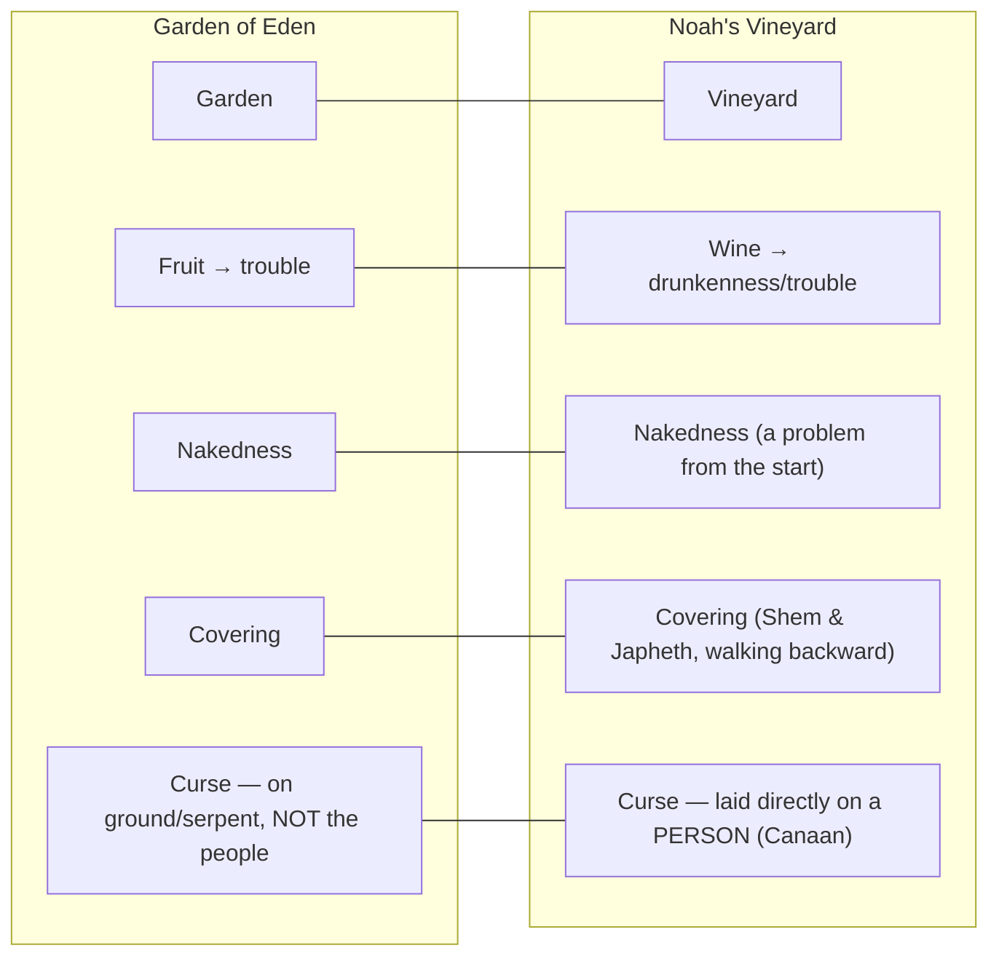

# A Misplaced Curse

**BEMA 5 · Session 1** — Genesis (Noah's vineyard and curse: Genesis 9:18–29; with Deuteronomy 22:30)
Source transcript: `transcripts/1-05-a-misplaced-curse.md`
Speakers: Marty Solomon (host), Brent Billings (co-host), **Reed Dent** (guest — BEMA teaching team; campus minister, Campus Christian Fellowship, Truman State University)

> **Session 1 arc — partnership.** Session 1 traces a God who keeps seeking partners to help him redeem a good creation, repeatedly inviting people to trust his way over their own. This episode is the next beat in that invitation: just as Adam and Eve were invited to trust the limit on *creating* and Noah's generation faced the limit on *destroying*, Noah himself is now invited to stop the cycle of destruction — and, tragically, refuses. Cited: *Marty* — "the flood was about learning how to stop destroying. So the next story is now the invitation for Noah to trust. Can you stop destroying? And the answer to that question ends up tragically being no."

---

## Key Lessons

The Noah story "that nobody usually talks about" — not the ark but the vineyard, the drunkenness, and a curse that lands on the wrong person. Read as a deliberate re-run of the Garden of Eden, with the Midrash's startling castration reading exposing the true subject: the cancerous spread of **vengeance**.

- **The real failure is Noah's, not Ham's — and the lesson is the danger of vengeance.** If the story is about castration and Noah's vengeful overreaction (rather than Ham's sin), the offender shifts from Ham to Noah. Cited: *Marty* — "if the lesson isn't about Ham's wrong, but about Noah's wrong, then obviously the offender just became who?" / *Reed* — "Noah." / *Marty* — "vengeance never truly stays where it ought to... that becomes the lesson for the story."

- **Noah is "playing the God character" — badly.** The word used for Noah's curse is elsewhere reserved for God; Noah steps into God's role and does it poorly, cursing a *person* when God in Eden refused to. Cited: *Marty* — "the word that it uses for Noah's curse is only used for God... So Noah's playing the God character here." / *Reed* — "But it seems like not very well." / *Reed* — "in the garden story... God is not actually cursing the people. He curses the ground. He curses the serpent... And here, Noah... lays it on a person where it's not supposed to be."

- **Vengeance refuses to stay put — it falls on children, grandchildren, and whole nations.** The curse skips the offender and lands on Canaan, dramatizing how vengeance escapes its bounds. Cited: *Marty* — "Vengeance has a way of kind of sneaking out and being uncontrolled. Because it's about our kids and our grandkids and our descendants, and it even becomes about nations and people groups."

- **This story deliberately parallels the Garden of Eden — same elements, tragic re-run.** A garden (vineyard), fruit, nakedness, covering, and a curse all reappear. Cited: *Marty* — "the story of this vineyard paralleling the story of the Garden of Eden... We should expect to see a garden... fruit and bad things coming from the fruit... a story about nakedness... covering the nakedness... There should be a curse. We got that."

- **The glory of the Hebrew Scriptures is their capacity for self-criticism.** The text may be confessing that Israel's own enemies trace partly to Noah's — our — failure, not only to others' sin. Cited: *Reed* — "This is one of the things that I love the most about the Hebrew Scriptures is the capacity for self-criticism to say, 'Maybe we were wrong.'" / *Marty* — "could it be that... a whole lot of this actually is our fault, Noah's fault?"

- **The principle (not law) of First Mention frames an image by where it first appears.** The first vineyard here can color later vineyards; the first "love" appears in the Akedah. Cited: *Marty* — "When you see a unique idea, word, or image, the Jewish mind... will often go, 'Where did I hear that first?'... Like, where's the first time we see the word love? It's actually in the Akedah."

---

## East/West Lens

Only the categories the episode actually engages, each with a cited quote.

- **Words (idioms and word-pictures over flat literalism).** "To see nakedness" / "to uncover nakedness" are idioms that mean far more than looking — sexual union, abuse, or "seeing as taking." Cited: *Marty* — "These expressions of nakedness are Hebrew idioms that usually refer to something else... It can refer to sexual union... It could be something like molestation... Or it could be the concept of seeing as in taking."

- **Hearing/perceiving (shema as a model for depth of a verb).** Just as *shema* means more than "hear," "see" can mean more than "look." Cited: *Marty* — "The same idea in the Hebrew word 'shema.' You can listen to something and then you can hear it. You can understand it, perceive it, obey it... In the same way that to see nakedness can be so much deeper than to just look at."

- **Numbers (quality/symbol over quantity).** Four rivers in Eden and the number four for the nations point to a missing fourth son, not arithmetic. Cited: *Brent* — "the number four is often used to refer to the Gentiles or... anyone outside of the Jewish people... but there's only three sons to do it."

- **Commentary / method (Eastern discovery over Western outline).** Midrash doesn't hand you the point; it leads you "around the block" to discover it. Cited: *Marty* — "In the Eastern world, they believe in the process of discovery... they wanna get you to find it too... the Midrash takes you all the way around the block to go right next door."

- **Truth (meaning over mechanics — don't get lost in the "how").** Westerners stall on "how did he not wake up?"; that question can miss the point. Cited: *Marty* — "a lot of Westerners will get hung up in the details. How did he not wake up in the midst of a castration? And I think we might be getting a little lost in the details."

---

## Recurring Through-lines

Motifs genuinely surfaced by *this* episode (explicitly cited or clearly implied); none forced.

- **Trust the story (the Session 1 arc).** The vineyard story is one more installment of the same invitation to trust God's way; the hosts explicitly frame it against the earlier creation/flood beats. Cited: *Marty* — "the flood was about learning how to stop destroying... the next story is now the invitation for Noah to trust. Can you stop destroying?"

- **Knowing when to stop / say "enough" (partnership through restraint).** The arc of "stop creating" and "stop destroying" continues; Noah is invited to let the cycle end with him. Cited: *Marty* — "if only Noah could have... decided to know when to stop destroying, to say the cycle's going to stop with me."

- **Made in the image of God — living out of it.** Noah bears the image but fails to live from it, grasping God's role (the curse) rather than God's restraint. Cited: *Marty* — "If only Noah could have been made in the image of God, he was. But if only Noah could have lived out of that image."

- **Re-run / parallel of earlier stories (reading method through-line).** As the flood paralleled creation, the vineyard parallels Eden — the Bible teaches by echo. Cited: *Marty* — "We noticed how the flood paralleled the story of creation. And now here it is, it continues again, the story of this vineyard paralleling the story of the Garden of Eden."

- **The lullaby effect / familiarity with idioms.** We already carry one of these idioms ("Adam knew his wife") without noticing it, which is exactly why the others slip past us. Cited: *Brent* — "We're familiar with some of these idioms, just not this one necessarily."

Note: The "master the beast / sin crouching" motif from earlier episodes is adjacent (vengeance as an uncontrolled force) but is **not** named here and is not forced into this guide.

---

## Narrative Tensions

| # | Surface problem | Tag | Cited quote (speaker) | Verse + link | Resolution / status |
|---|---|---|---|---|---|
| 1 | A dark vineyard-and-curse story lands jarringly right after the hope of post-flood new creation. | `logic-gap` | *Reed*: "following right on the heels of new creation... It seems just pretty jarring." | [Genesis 9:18-20](https://www.biblegateway.com/passage/?search=Genesis%209%3A18-20&version=NIV) | **Hebraic lens:** The jarring tone is intentional — it mirrors Eden's fall, re-running the "will you trust the limit?" question with Noah now failing it. |
| 2 | Why is merely *seeing* a father naked so grave that it provokes a curse? | `unstated-cultural-assumption` | *Reed*: "it might be awkward to see your dad naked, but... is it curse worthy and even curse worthy to his son?" | [Genesis 9:22-24](https://www.biblegateway.com/passage/?search=Genesis%209%3A22-24&version=NIV) | **Hebraic lens:** "See / uncover nakedness" is an idiom for sexual union, abuse, or a "taking." The Midrash reads it as castration, which raises the stakes beyond embarrassment. |
| 3 | Noah curses **Canaan** — a grandson who never appears in the action (and, on some readings, isn't yet born). | `logic-gap` | *Reed*: "He's cursing the wrong guy." / *Reed*: "Who wasn't even present in the action of the story." | [Genesis 9:25](https://www.biblegateway.com/passage/?search=Genesis%209%3A25&version=NIV) | **Hebraic lens:** If Ham castrated Noah (robbing him of a fourth son), Noah avenges himself on Ham's *progeny* — the point being how vengeance misfires onto the innocent. |
| 4 | "Canaan" is named conspicuously and repeatedly in a story where he does nothing. | `unstated-cultural-assumption` | *Reed*: "is it weird or conspicuous that the name is Canaan?" / *Brent*: "really hammering home this Canaan idea." | [Genesis 9:18](https://www.biblegateway.com/passage/?search=Genesis%209%3A18&version=NIV) | **Hebraic lens:** The names in the surrounding genealogy are nations (Mitzrayim/Egypt, Kush, Canaan); the text foreshadows Israel's later conflict with the Canaanites — possibly rooted in Noah's own failure. |
| 5 | The vineyard→grapes→wine→drunkenness happens in a single breath, though a real vineyard takes years. | `time-jump` | *Brent*: "this is a very compressed story." / *Marty*: "it's at least four years before you have grapes." | [Genesis 9:20-21](https://www.biblegateway.com/passage/?search=Genesis%209%3A20-21&version=NIV) | **Open — dance with it.** The compression flags the first mention of a vineyard (principle of First Mention) rather than reporting elapsed time. |
| 6 | The list of sons appears in shifting, non-birth order across the surrounding text. | `contradiction` | *Brent*: "it's in a different order than we see it in other places... It's not consistent." | [Genesis 9:18-19](https://www.biblegateway.com/passage/?search=Genesis%209%3A18-19&version=NIV) | **Hebraic lens:** The unstable order signals that order itself is meaningful here — something to be read, not an error. |
| 7 | Textual critics (e.g., Michael Heiser) read Ham's act as incest with Noah's wife, yet Jewish/Christian Midrash avoids that "easy" reading. | `translation-disagreement` | *Marty*: "a lot of textual critics will say... Ham is sleeping with Noah's wife... However, Christian or Jewish Midrash never went that direction, which I find so interesting." | [Deuteronomy 22:30](https://www.biblegateway.com/passage/?search=Deuteronomy%2022%3A30&version=NIV) | **Hebraic lens:** The Midrash's choice of castration over incest reframes the story from Ham's sexual sin to Noah's vengeance — the self-critical reading the hosts find more instructive. |

---

## Chiasms & Structure

The episode does not lay out a formal chiasm for this passage. Instead it builds its reading on a **parallel-structure argument**: the vineyard story deliberately re-runs the Garden of Eden, element for element, with the decisive meaning found in where the two diverge. Cited: *Reed* — "I often find that the meatiest part of the treasure, for me, is in what then is different. Where does it diverge?"

**Prose:** The parallels establish the frame; the divergences carry the lesson. In Eden the nakedness begins innocent ("naked and unashamed") and only later becomes a problem, whereas here it is a problem "from the get-go." Most importantly, in Eden God curses the ground and the serpent but *not* the humans — while Noah, in a "vengeful rage," lays the curse directly on a person, and the wrong one. Cited: *Reed* — "in this story the nakedness is already a problem from the get-go; whereas in the Adam and Eve story they were naked and unashamed." / *Reed* — "I just imagine him in this vengeful rage doing his sort of worst impression of God... And then he lays it on a person where it's not supposed to be... he puts it on the wrong person."

---

## Terminology

- **Canaan (כנען)** — Ham's son, named conspicuously and repeatedly though he never acts in the story; foreshadows Israel's later relationship with the Canaanites. Cited: *Marty* — "all these names, so many of these names, most of these names are names of larger nations and people groups."
- **shema (שמע)** — "to hear," but far deeper: to listen, perceive, understand, and obey. Invoked as the model for how "to see" can mean more than looking. Cited: *Marty* — "the word 'shema' is so much deeper than just 'hear.' In the same way that to see nakedness can be so much deeper than to just look at."
- **"to see / uncover nakedness"** — Hebrew idioms that usually point beyond literal looking: sexual union, abuse/molestation, or "seeing as taking." The Jewish Midrash reads Ham's act as castration, explaining why Noah curses Ham's *progeny*. Cited: *Marty* — "What the Jewish Midrash says is that Ham castrated his father." / *Brent*: "Adam knew his wife Eve and she became pregnant... We're familiar with some of these idioms."
- **Midrash** — ancient Jewish commentary that teaches by leading the reader to *discover* meaning rather than stating it; "a way of burying treasure." Cited: *Marty* — "the Midrash takes you all the way around the block to go right next door."
- **Principle (not Law) of First Mention** — the Jewish habit of letting an image's first appearance frame its later meaning; called a principle because it is not absolute. Cited: *Marty* — "we prefer to call a principle because it's not really a law... that first story that will kind of frame what that image is supposed to be able to communicate to us."
- **Akedah** — the binding of Isaac (Abraham sacrificing Isaac); cited as the first appearance of a particular word for *love*. Cited: *Marty* — "A particular word for love is in the Akedah, the story of Abraham sacrificing Isaac."

---

## Illustrations & References

- **The Noah story "nobody talks about."** Framing device: everyone knows the ark; almost no one preaches the vineyard and the curse. Cited: *Marty* — "Everybody talks about the boat, the flood, the ark, and very few people talk about the vineyard, the curse."
- **The Western shelf of commentaries vs. ancient Jewish commentary.** A picture of how Western Bible study works (library, outline, bullet points, proofs) set against the Eastern mode of discovery. Cited: *Marty* — "we go to our library and we have a shelf of commentaries... a very Western way of communicating information."
- **The four rivers of Eden → the "missing" fourth son.** Rivers (like trees) picture lineage/descendants; four rivers in Eden's parallel paragraph imply a fourth son Noah should have had, but castration prevents it. Cited: *Marty* — "there were four rivers in what would have been the parallel paragraph... There's supposed to be four sons. But if Ham has castrated Noah... unable to have a fourth son."
- **Noah's "What have you done?" — echoing God in the garden.** Noah steps into God's role, repeating God's Eden question. Cited: *Brent* — "he comes out like, 'What is going on? What happened here?' And that was God's question back in the garden." / *Marty* — "Like Noah's playing the God character."
- **The David narratives — heroes portrayed with real flaws.** The Hebrew Scriptures refuse to flatter their kings, modeling self-criticism. Cited: *Reed* — "David is portrayed as being very problematic and having a lot of issues... The Hebrew scriptures decide to actually look at the problems that maybe we have created."
- **Israel/Palestine (at the time of recording).** A contemporary, poetic (not technical) illustration of how vengeance spills across generations and nations. Cited: *Marty* — "You could poetically, I'm not saying technically, poetically say that this kind of stuff is why vengeance can be so dangerous."
- **The Midrashic castration tale (lion on the ark).** A deliberately "crazy" story — Noah feeding a lion, his genitals shredded — flagged as revisited in Session 6; an example of Midrash's non-literal mode. Cited: *Marty* — "the story about Noah feeding a lion on the ark and gets his genitals shredded—and that's how the castration happened... it's a crazy story."
- **Dr. Michael Heiser** — cited for the textual-critical reading that Ham slept with Noah's wife. Cited: *Marty* — "I think Dr. Michael Heiser had this perspective... Ham is sleeping with Noah's wife."
- **Richard Rohr** — quoted on self-criticism. Cited: *Reed* — "Richard Rohr said that any nation that loses the capacity for self-criticism will become idolatrous."

---

## Discussion Questions

1. The hosts argue the real offender in this story is **Noah**, not Ham — the lesson is the danger of vengeance, not someone else's sin. Where are you more comfortable focusing on another person's wrong than on your own reaction to it?
2. Noah "plays the God character" and does it badly — grasping the role of judge instead of God's restraint (who, in Eden, would not curse the people). Where are you tempted to take up a role (judge, avenger, fixer) that isn't yours to hold?
3. The curse lands on Canaan — a grandson who did nothing. How have you seen vengeance or bitterness "sneak out" and fall on people (children, coworkers, whole communities) who were never part of the original offense?
4. Reed praises the Hebrew Scriptures' "capacity for self-criticism" — the willingness to say "maybe we were wrong." What would it look like for you, your family, or your community to tell your own story that honestly?
5. After the curse, Noah "lived 350 years and then he died" — Brent notes he "just sat in his bitterness." What does unresolved vengeance cost over a long life, and where might you need to let a cycle "stop with me"?
6. The Midrash leads you "around the block to go right next door" — making you discover the point rather than handing it to you. How does being made to *discover* meaning change the way a passage sticks with you, compared to being told the answer?

---

## Sources

- Transcript: `1-05-a-misplaced-curse.md`
- [Genesis 9:18-19](https://www.biblegateway.com/passage/?search=Genesis%209%3A18-19&version=NIV)
- [Genesis 9:18-20](https://www.biblegateway.com/passage/?search=Genesis%209%3A18-20&version=NIV)
- [Genesis 9:20-21](https://www.biblegateway.com/passage/?search=Genesis%209%3A20-21&version=NIV)
- [Genesis 9:22-24](https://www.biblegateway.com/passage/?search=Genesis%209%3A22-24&version=NIV)
- [Genesis 9:25](https://www.biblegateway.com/passage/?search=Genesis%209%3A25&version=NIV)
- [Genesis 9:18-29](https://www.biblegateway.com/passage/?search=Genesis%209%3A18-29&version=NIV)
- [Deuteronomy 22:30](https://www.biblegateway.com/passage/?search=Deuteronomy%2022%3A30&version=NIV)
- Referenced by the hosts: Midrash (ancient Jewish commentary; the castration reading, incl. the Session 6 "lion on the ark" tale); Dr. Michael Heiser (textual-critical incest reading); Richard Rohr ("any nation that loses the capacity for self-criticism will become idolatrous"); the principle of First Mention; the Akedah (first mention of *love*).
