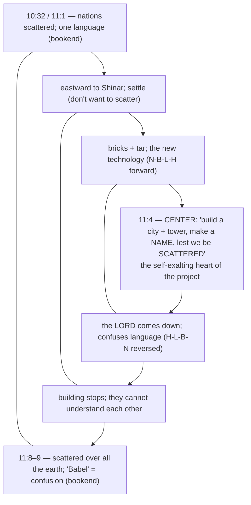

# A Tale of a Tower

BEMA 6 · Session 1
Source transcript: `~/workspace/bema/transcripts/1-6-a-tale-of-a-tower.md`
Book: Genesis (Genesis 11:1–9; with 10:32 and 10:8–10)
Guest: Josh Bossé (BEMA teaching team; Impact campus ministry; "Midrash Josh")

> The Tower of Babel read as the climax of a chain of "know when to say enough" stories. Evil has been organizing itself upward — from an individual (Cain), to a family (brothers), to a people (a table of names), and now to a **civilization** with a warrior-king (Nimrod) at its head. The hosts argue the scattering is not a curse but a strategic, redemptive nudge: God refuses to let humanity accomplish great things until it learns to listen to one another. The arc of Session 1 is **partnership** — being invited back toward Eden's shalom and stewardship *with* God and *with* each other.

## Key Lessons

- **The scattering of Babel is not punishment — it's a strategic, redemptive move.** Via Fohrman, Marty: *"the scattering of humankind is not framed in the Hebrew story as a punishment. It's framed as a strategic move on God's part."* And: *"There's no 'curse' in the story of Babel. There's just a 'situation.'"* God doesn't remove humanity's ability to do amazing things — *"Notice he didn't take their ability to accomplish amazing things away"* — he sets conditions so those things can only be built by caring for the good of others.
- **Technology is amoral; the question is what you do with it.** The Hebrew discourse break ("and they said") after the bricks are made signals God's *silence* — he has nothing to say about the brick. Marty: *"The brick and the technology isn't the problem... Technology is, what would we say, amoral? It's what we do with it... Are we gonna use this to build God's world, God's way?"* God only "comes down" once he sees the brick turned toward a self-exalting tower.
- **Learning another's language requires self-emptying — that's the redemptive project.** Marty: *"the only way I can learn a language is to completely empty myself, start from scratch, and learn from somebody else."* The confused languages aren't a dead end but an invitation: *"if you ever want to learn how to listen, how to learn from each other, how to love your enemy, I think Jesus would say."* The lesson lands squarely on tribalism and polarization — *"as long as there is heavy lines about us and them, just enjoy being scattered all over the earth."*
- **This is a "trust the story" refusal — Nimrod is its opposite.** Marty: *"Nimrod's the opposite of trusting the story... he's trying to get them back to that good creation, partner with me, tree of life kind of imagery."* God is pulling humanity back "west" — toward Eden's shalom and partnership — against their eastward drift. Brent: *"What was the garden? What were we trying to accomplish with the garden?"* Marty: *"that shalom, that wholeness, that stewardship, that partnership with God."*
- **The lesson is generational and never fully "solved."** Brent notes Marty said the same thing eight years ago and still struggles; Josh: *"this is big stuff on like a humanity scale... something we work out sometimes through generations... not just some small, easy lesson that we just fix and then move on."*

## East/West Lens

- **Words (abstract definition vs word-picture/idiom)** — East/West *as direction* carries image, not just geography. Josh: *"east is often a symbol of the past and west is the future... we can see a lot of the eastern movement symbolically, maybe as kind of a regression, like wanting to go back to how things were rather than moving forward."* The "and they said" discourse principle also encodes meaning in form rather than statement.
- **Numbers / symbol & the "whole earth"** — **eretz** can mean a local *land*, not the planet, reframing the scope of "the whole earth had one language." Josh: *"the word eretz that's used there in the Hebrew to talk about the whole land had one language. It could be a local area."*
- **Truth over time (static vs dynamic/discovery)** — Midrash and Fohrman's consonant-pattern work are discovery-driven, not propositional. Marty: *"Josh isn't just... making up arbitrary things, like these are things that the Jews have also noticed about the way the Text works... that's how Jewish commentary works."* Meaning is dug up over generations, not merely stated once.
- **Community vs individual** — The whole lesson is communal: humanity *"continue[s] to progress as a whole"* only by learning others' languages. Marty confesses his low teamwork scores — *"I haven't learned the lesson of Babel."* Josh contrasts Cain being told to stay *"united in community"* with Babel's *"perverse community that is trying to stick together at all costs."*
- **Truth (how/what vs who/why)** — The hosts refuse to litigate the tower's engineering and instead ask *why* God intervenes. Marty: *"this isn't that God is necessarily threatened by their advances... I'm trying to bring you back to my intention."*

## Episode Flow (coverage backbone)

A sequential walkthrough of every teaching beat in the episode, in order. Used to verify full coverage.

1. **Setup / review of the arc.** Brent asks "where are we at this point?" Marty frames a chain of stories: creation → "know when to say enough" (stop creating); flood → middle of the "wave of destruction" (stop destroying). Humanity keeps refusing to trust the story. *(Marty: "God keeps saying, look at this good creation, know when to say enough, but they don't.")*
2. **Reading the text.** Brent reads Genesis 10:32 (the pickup verse) through 11:9.
3. **Problems: eastward movement.** Brent notes "moving eastward... seems to be a problem"; Marty adds the poetic drift away from Eden; Josh gives the east=past / west=future image.
4. **Evil organizing itself.** Marty traces evil scaling up (individual → family → people → tower/city/civilization); Josh: the flood was disorganized, "this is a concerted effort... evil is getting organized and that's scary."
5. **Problem: fear of being scattered.** Marty and Brent flag that nobody threatened to scatter them; the worry is self-generated and they want to settle at the furthest point from Eden.
6. **Problem: one language vs many.** Brent notes chapter 10 gives each nation its own language (10:5, 10:31) before 11:1 says "one language."
7. **The insertion in Shem's genealogy / Nimrod.** Marty shows the tower interrupts a genealogy right at Shem; Josh reads 10:8–10 — Nimrod the *gibor* warrior-hunter, an imperial name-taking project. Brent reads the Nimrod passage; Josh notes "Babylon" = *Babel*.
8. **Midrash disclaimer.** Marty: Josh isn't inventing this — Jewish tradition long connected Nimrod to the tower (though it "gets wonky").
9. **The chiasm (Fohrman).** N-B-L-H forward, H-L-B-N reversed; 11:4 as center; 10:32–11:9 as bookends.
10. **Parallel to Cain & Abel.** Sacrifices/tower reaching heaven; God intervening; wandering vs settling; naming a city / making a name.
11. **Problems revisited with Nimrod lens.** Is God threatened? Why forbid accomplishment? Gesenius: Nimrod = "rebel."
12. **Technology is amoral.** The "and they said" break = God's silence about the brick; the internet analogy; God reacts only to the tower.
13. **Josh on "why a tower?"** A hierarchy with one man on top; a kingdom "so strong that not even God can knock me down" after the flood.
14. **Scattering as strategy, not curse.** Babel = confusion/disorientation; different languages force self-emptying and care for others.
15. **Application / closing.** Polarization, "us and them," love of enemy; Marty's teamwork confession; Brent's "you said the same thing eight years ago"; Josh's generational-scale note; Marty's "hold my beer" image of God.

**Coverage verification:** All three cited passages (10:32; 11:1–9; 10:8–10), the chiasm, the Cain & Abel parallel, every named Hebrew term (eretz, gibor, Nimrod, Babel, N-B-L-H, "and they said"), every named reference (Fohrman, Hofberger/Aleph Beta, Gesenius/Blue Letter Bible, Midrash, Michael W. Smith), and the three/four stated "problems" are each carried into a section below.

## Recurring Through-lines

Motifs genuinely present in *this* episode (explicit + genuinely implied). Flagged for cross-reference; not re-explained here.

- **Trust the story (the session arc itself).** Explicit as the next beat in the "know when to say enough" chain (creation→stop creating; flood→stop destroying). Marty: *"They haven't learned how to trust the story... Nimrod's the opposite of trusting the story."* God's desire to bring humanity back to Eden's shalom and **partnership** is constant across Session 1.
- **Know when to say enough.** Explicitly invoked as the governing lesson, callback to Josh's earlier teaching. Josh (closing): the scattering is *"a very gentle kind of nudge... talk about knowing how to say 'enough.'"*
- **Sin as failing to master the animal instinct ("master the beast").** Genuinely implied: Nimrod the *gibor* who "hunts people" is the un-mastered impulse scaled up to empire — evil *organized and civilized*. Josh: *"evil is getting organized and that's scary."*
- **Partnership / return to Eden (shalom & stewardship).** Explicit: Marty names *"that shalom, that wholeness, that stewardship, that partnership with God"* as what God is drawing humanity back toward ("go west").

## Narrative Tensions

Each entry: surface problem, classification tag, cited quote, normalized verse citation + link, and resolution or open flag.

| Surface problem | Tag | Cited quote (speaker) | Verse citation + link | Resolution / status |
|---|---|---|---|---|
| Chapter 10 says the nations each had **their own languages**, then 11:1 says the "whole world had one language." | `contradiction` | Brent: *"how do they have the same language?... now the whole earth had one language. What?"* | [Genesis 10:31–11:1](https://www.biblegateway.com/passage/?search=Genesis%2010%3A31-11%3A1&version=NIV) | **Resolved (Hebraic lens):** The tower story is *inserted* into the genealogy; **eretz** may mean a local *land* (Nimrod's conquered territory), not the planet — one language within one empire. |
| The people fear "being scattered," but nobody ever threatened to scatter them. Where does the worry come from? | `logic-gap` | Brent: *"it's not like he threatens to scatter them before... where does that worry even come from? That's weird."* | [Genesis 11:4](https://www.biblegateway.com/passage/?search=Genesis%2011%3A4&version=NIV) | **Resolved (interpretive):** The fear is self-generated control/legacy-anxiety (make a name, don't disperse) — the opposite of trusting the story; it exposes the heart behind the tower. |
| Why does God seem *threatened*, as if the project might actually succeed against him? | `unstated-cultural-assumption` | Marty: *"is God threatened by their advances?... 'if I don't do something, they're going to be able to do anything.'"* | [Genesis 11:6](https://www.biblegateway.com/passage/?search=Genesis%2011%3A6&version=NIV) | **Resolved (Hebraic lens):** Not threat but redirection — organized evil (Nimrod = "rebel") settling furthest from Eden; God acts "to get you back west," not out of fear. |
| Why would God *not want* humans to accomplish what they set their minds to? ("I can do all things...") | `unstated-cultural-assumption` | Marty: *"why doesn't God want them to accomplish anything? That felt weird."* | [Genesis 11:6](https://www.biblegateway.com/passage/?search=Genesis%2011%3A6&version=NIV) | **Resolved (interpretive):** He doesn't forbid accomplishment; he conditions it on self-emptying love — different languages mean they can only build great things *together*, for others' good. |
| Is the scattering a punishment/curse? | `translation-disagreement` | Marty (via Fohrman): *"the scattering... is not framed in the Hebrew story as a punishment... Babel means confusion, disorientation. It's not a curse."* | [Genesis 11:8–9](https://www.biblegateway.com/passage/?search=Genesis%2011%3A8-9&version=NIV) | **Resolved (Hebraic lens):** "Babel" = confusion/disorientation, framed as a strategic situation, not a curse — a redemptive constraint. |
| Why interrupt Shem's genealogy with a tale about Nimrod and a tower at all? | `logic-gap` | Josh: *"it interrupts it right as it gets to Shem... record scratch hold up. Let's talk about this tower."* | [Genesis 10:8–10](https://www.biblegateway.com/passage/?search=Genesis%2010%3A8-10&version=NIV) | **Resolved (interpretive):** The insertion links Nimrod (Babel = his city) to the tower — organized evil breaking into the chosen line's story. (Supported by Jewish tradition, acknowledged as "wonky.") |

## Chiasms & Structure

The hosts explicitly identify a chiasm, following Rabbi David Fohrman. The story plays four Hebrew consonants — **nun, bet, lamed, he/chet (N-B-L-H)** — in order through the first half, then reverses them (**H-L-B-N**) in the second half, with **Genesis 11:4** ("let us build... a tower... make a name for ourselves... lest we be scattered") as the center. The bookends run from 10:32 to 11:8–9. Marty: *"it's very clear that there's something, whether it's supernatural or designed by the author."*

Prose: the inverted structure points like an arrow to 11:4 — the *name-making, anti-scattering* ambition is the true subject. Marty notes you can sense the chiasm thematically in English even without parsing the Hebrew consonants (*"I don't think you have to be a Hebrew scholar to necessarily sense the chiasm"*); the full N-B-L-H / H-L-B-N mirror requires the Hebrew.

### Parallel panel: Babel ↔ Cain and Abel

Following the episode's running pattern (each story parallels an earlier one), Babel mirrors Cain & Abel — and, as always, the "treasure" is in the divergences. Josh: *"Cain and Abel, naturally."*

| Element | Cain & Abel | Babel |
|---|---|---|
| Offerings / ascent toward heaven | two sacrifices rising to God's presence | a tower "reaching to the heavens" |
| God intervenes | warns Cain ("sin at the door"), urging him to stay | comes down (after 11:4) to confuse/redirect |
| Community posture | told to stay united as family (he refuses) | a "perverse community" sticking together at all costs |
| Wandering vs settling | cursed to **wander**, then builds a **city** | refuses to wander, tries to **settle** |
| Names / legacy | names his city after his son | "make a **name** for ourselves" |

## Terminology

- **eretz** (ארץ) — "land / earth"; "the whole *eretz* had one language" may be a local region, not the planet. Josh: *"the word eretz that's used there in the Hebrew to talk about the whole land had one language. It could be a local area."*
- **gibor** (גבור) — "mighty man / warrior," with martial, militaristic force; used of Nimrod, "a *gibor* hunter — a warrior who hunts." Josh: *"in the Hebrew the word is gibor, which has very martial militaristic implications... he is the first guy who was a warrior."*
- **Nimrod** (נמרוד) — per Gesenius (via Blue Letter Bible) the name means **"rebel"**; Jewish tradition ties him to leading the tower project. Josh: *"according to Gesenius the name Nimrod means rebel."*
- **Babel** (בבל) — the tower's name, identical to the Hebrew for "Babylon" among Nimrod's cities; means **"confusion / disorientation."** Josh: *"the word there that is translated as Babylon is just Babel. It is literally the same as the name of the tower."* Marty (via Fohrman): *"the Hebrew word for Babel means confusion, disorientation. It's not a curse."*
- **N-B-L-H** (nun, bet, lamed, he/chet) — Fohrman's consonant pattern that runs forward through the first half, then reverses (H-L-B-N) across the second, marking the chiasm. Marty: *"he showed how on the back half of the story, it went H, L, B, N."*
- **"and they said"** — Hebrew discourse principle: repeating the speech formula after a speaker has just spoken signals a *break* in which nothing happened — here, God's telling silence after the bricks are made. Marty: *"it means that there was a break and nothing happened... God says, '... cool.' Like He says nothing."*

## Illustrations & Images

- **The internet (technology is amoral).** Marty: *"Think about the internet... think about all the good that can be done with the internet... Think of all the bad that's been done with the internet... Technology isn't the issue... It's what we do with it."*
- **The three little pigs (straw/sticks → brick houses).** Josh frames the leap in building technology: *"if you were used to having a house made of straw or a house made of sticks... 'oh me and my friends invented bricks'... 'we're gonna build better houses.'"* — but they built a tower instead.
- **A tower to out-reach the flood.** Josh: *"maybe if I just build something high enough the flood can't get me, God can't get me up here... 'I'm gonna build a kingdom so strong that not even God can knock me down.'"*
- **"Go west, young man."** Marty's directional image of return toward Eden: *"We need to go west, young man, as the good Michael W. Smith song said."*
- **God's "hold my beer" moment.** Marty's closing image of the divine council panicking while God redirects: *"God's like, 'Oh, no. Check this out. Watch this.'"*
- **Marty's teamwork scores (self-disclosure).** *"I get low scores for teamwork. I just don't like group projects... it's because I haven't learned the lesson of Babel."*

## References & Resources Named

- **Rabbi David Fohrman** — the N-B-L-H consonant chiasm; the reading of the scattering as a strategic, non-punitive act; "Babel = confusion." Marty: *"I was learning this from Rabbi David Fohrman."*
- **Hofberger Institute** — where Marty first heard this, "before there was Aleph Beta." Marty: *"there was a place called the Hofberger Institute."*
- **Aleph Beta** — Fohrman's later teaching platform ("the fluffy videos... the really entertaining, awesome teachings").
- **Gesenius** (Hebrew lexicon), cited via **Blue Letter Bible** — for Nimrod meaning "rebel." Josh: *"I just double checked this on blue letter. Apparently according to Gesenius the name Nimrod means rebel."*
- **Midrash / Jewish tradition on Nimrod** — extensive (and "wonky") traditions connecting Nimrod to leading the tower project. Marty: *"the Jews have thought about this. They notice this."*
- **Michael W. Smith — "Go West Young Man"** — referenced in passing for the westward-return image.
- **BEMA episode 233** — Josh's full introduction; Brent's honor-system warning not to finish it yet (spoiler for a later story).

## Callbacks

- **"Know when to say enough" (Josh's earlier teaching).** Explicitly recalled at the top and bottom of the episode. Brent: *"Hopefully a lesson that's still fresh in everyone's mind."* Josh (closing): *"talk about knowing how to say 'enough.'"*
- **The arc so far: creation → flood.** Marty's review ties Babel into the running chain — creation stories ("stop creating") and the flood ("stop destroying"); Babel is the next beat.
- **Earlier parallels (Noah/vineyard ↔ Adam/Eve; flood ↔ creation).** Marty: *"We looked at how Noah and the vineyard paralleled Adam and Eve in the garden, how the flood paralleled creation"* — setting up Babel ↔ Cain & Abel.
- **The garden / Eden.** Brent: *"What was the garden? What were we trying to accomplish with the garden?"* Marty answers with shalom, stewardship, partnership — the destination God is pulling humanity back toward.
- **The original (eight-years-ago) episode.** Brent: *"in the original version of this episode, eight years ago, you said the same thing and it continues to be a struggle."*

## Discussion Questions

1. If the scattering is a "strategic move," not a punishment, how does that change the way you've understood Babel? What is God actually protecting humanity *from* — and *for*?
2. Marty says technology is amoral: God had "nothing to say" about the brick, only about the tower. Name a modern technology (the hosts use the internet). What would it look like to use it "to build God's world, God's way"?
3. "The only way I can learn a language is to completely empty myself." Where is self-emptying the price of listening to someone unlike you? Where do you resist paying it?
4. The lesson lands on tribalism — "as long as there is heavy lines about us and them, just enjoy being scattered." Where are the "us and them" lines in your own context, and what's the first step across one?
5. Nimrod means "rebel" and may have built the tower to be beyond even God's reach after the flood. How is a tower against the flood a *failure to trust the story*? Where do you build towers of control against fear?
6. Marty admits he's scored low on teamwork for years and still struggles with the "lesson of Babel." What recurring lesson do you keep having to relearn — and why is it so hard to change?

## Sources

- Transcript: `1-6-a-tale-of-a-tower.md`
- [Genesis 10:8–10 (NIV)](https://www.biblegateway.com/passage/?search=Genesis%2010%3A8-10&version=NIV)
- [Genesis 10:31–11:1 (NIV)](https://www.biblegateway.com/passage/?search=Genesis%2010%3A31-11%3A1&version=NIV)
- [Genesis 11:1–9 (full, NIV)](https://www.biblegateway.com/passage/?search=Genesis%2011%3A1-9&version=NIV)
- [Genesis 11:4 (NIV)](https://www.biblegateway.com/passage/?search=Genesis%2011%3A4&version=NIV)
- [Genesis 11:6 (NIV)](https://www.biblegateway.com/passage/?search=Genesis%2011%3A6&version=NIV)
- [Genesis 11:8–9 (NIV)](https://www.biblegateway.com/passage/?search=Genesis%2011%3A8-9&version=NIV)
- Referenced resources named in the episode (not web-fetched): Rabbi David Fohrman (N-B-L-H chiasm; non-punitive scattering); Hofberger Institute / Aleph Beta; Gesenius lexicon via Blue Letter Bible; Jewish Midrash/tradition on Nimrod; Michael W. Smith, "Go West Young Man"; BEMA episode 233.
