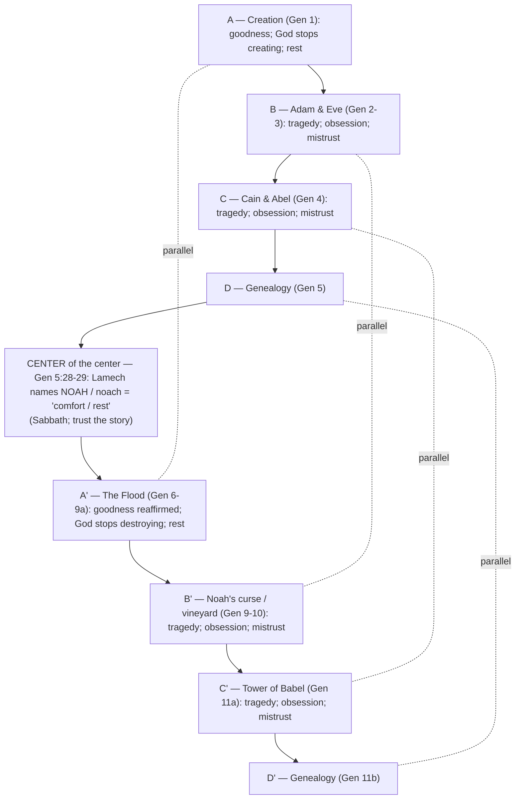

# The Preface

BEMA 7 · Session 1
Source transcript: `~/workspace/bema/transcripts/1-7-the-preface.md`
Book: Genesis (review of Genesis 1–11; center text Genesis 5:28–29)
Hosts: Marty Solomon (host), Brent Billings (co-host)

> A synthesis episode with no new stories. The hosts step back over Genesis 1–11 and read it as the **preface** to God's larger narrative — eight stories that each turn out to be a chiasm, which together form a *chiasm of chiasms*. Its center, the naming of Noah ("comfort/rest") in Genesis 5:28–29, makes the same point the individual stories kept making: **trust the story** — that creation is good, that there is enough, that God loves and intends good for the world. The preface is an invitation to reframe who we think God is, who we are, and what God is doing. In the Session 1 arc of **partnership**, this is the capstone of the backstory: before God calls a partner (Abraham, the "introduction"), the preface resets our assumptions about the God who seeks that partnership.

## Key Lessons

- **Genesis 1–11 is the "preface"; Genesis 12–50 is the "introduction"; Exodus–Revelation is the story.** Marty frames the whole Bible with a Tolkien analogy — the preface gives backstory and reframes the world, the introduction sets up the plot and characters. Marty: *"In Genesis 1-11, He's working with what I like to call the preface... High level backstory, stories of origin, big meta level conversations about what the world is like, who is God, who is mankind."* And: *"in the introduction, I'm going to get introduced to Abraham, the family of God."*
- **The preface is eight stories, and every one of them is a chiasm.** Marty: *"The preface is made up of eight essential stories"* — creation, Adam and Eve, Cain and Abel, a genealogy, the flood, Noah's curse, the Tower of Babel, and another genealogy. *"Every story ended up being a chiasm. We didn't always talk about the chiasm, but every story, we talked about a lot of them and every story when you go back ends up being a chiasm."*
- **The eight stories parallel one another — and together form a "chiasm of chiasms."** Not an inverted parallelism but an ABCD-ABCD parallelism. Marty: *"There is a chiasm of chiasms. It all relates to one another... you can see the ABCD-ABCD nature of this chiasm. So it's not an inverted parallelism. It's a parallelism."*
- **The center is the naming of Noah — and "Noah" means comfort/rest.** Marty: *"here's the passage, Genesis 5:28-29, that lies as I see it at the center of the chiasm... the center of the center is literally the name Noah. Noah means in the Hebrew 'comfort,' noach, 'comfort.'"* The verse says Noah will relieve the labor and painful toil of the cursed ground — which, Marty and Brent agree, *"Sounds like Sabbath, sounds like rest, sounds like trusting the story."*
- **The whole preface is one sustained invitation: trust the story.** Marty: *"the preface of God's story really is an invitation to what we're going to say over and over again: Trust the Story... trust that creation is good, trust that there's enough, trust that God loves creation, trust that God has the best interest in mind for creation."*
- **The preface asks *us* to reframe our theology — especially the idea of an angry Old Testament God.** Marty: *"the beginning of God's story, the preface, is an invitation to reframe our understanding of the world... it's asking us to rethink and reframe what we understand about the world. Who is God? Is God full of wrath?"* He confronts the inherited split directly: *"I grew up in a Christian world that told me the Old Testament God, the Jewish God, was an angry God... But God has always been loving. From the opening pages."*
- **Discovery is the point — the teacher deliberately leaves treasure for the student to find.** Brent and Marty close by refusing to lay out every remaining chiasm. Brent: *"we want to give you tools. We don't want to give you all the answers... we don't want to rob you of that chance to make your own discoveries."*

## East/West Lens

- **Numbers / structure as symbol (vs. quantity).** The literary architecture — chiasm within chiasm — *carries* the meaning; form is content. Marty: *"to have a chiasm of chiasms. I had a teacher once that used to always use the joke... it's almost like the writers of Scripture had help... this is beyond what just a mere human being on his own... should be able to accomplish."*
- **Words as word-picture/idiom (vs. abstract definition).** A name is not just a label but a loaded picture: *noach* ("comfort/rest") encodes the point of the whole structure. Marty: *"Noah means in the Hebrew 'comfort,' noach, 'comfort.' And this verse tells us how Noah is going to provide this comfort."*
- **Truth over time: dynamic/discovery (vs. static delivery).** Meaning is dug up by the community over time, not merely stated — and the teacher protects that process. Brent: *"we want to make these discoveries. That's the point. We want to make the discovery. If we just tell you everything on the podcast... we're going to start to speed up."*
- **Community over individual.** The breakthrough came communally — a student saw what the teacher could not yet see. Marty: *"no greater affirmation... exists for a teacher than watching students actually go beyond you and excel in the things that they see."*
- **Truth as who/why (vs. how/what).** The reframe is not about mechanics of origins but about God's character and relationship to creation. Marty: *"We're being invited to reframe what we understand about what God is doing in the world and how he relates to it."*

## Recurring Through-lines

- **Trust the story (the arc itself).** This episode names the thread explicitly and makes it the thesis of the entire preface. Marty: *"the preface of God's story really is an invitation to what we're going to say over and over again: Trust the Story."* The phrase is first named in `1-1-trust-the-story`; here it is shown to be the center of the whole Genesis 1–11 structure. Recurs across Session 1; condensed again at the Session 1 capstone (episode 32).
- **Knowing when to say "enough" / the goodness of creation.** Explicitly present as the recurring content of the chiasms: creation = *"a God who knew when to stop, when to say enough,"* and the flood = *"a God who knew how to stop, stop destroying."* Anchored in `1-2-knowing-when-to-say-enough`; flagged here as the repeated motif, not re-explained.
- **Sabbath / rest.** The center text resolves into rest: Brent — *"Sounds like rest"*; Marty — *"sounds like Sabbath, sounds like rest."* Genuinely present as the payload of the chiasm of chiasms.
- **The tragedy/obsession/mistrust pattern (failure to trust).** Marty traces it across the fallen stories: *"Instead of a good story, it was about tragedy. Instead of stopping, there was an obsession... Instead of rest, there was mistrust."* The dark mirror of trusting the story; recurs through the Adam-and-Eve, Cain-and-Abel, Noah's-curse, and Babel episodes.
- **God is loving from the opening pages (not angry-then-nice).** Genuinely implied as a session-long reframe: Marty — *"God has always been loving. From the opening pages, this was a God that sat with Cain and pled with him."* Builds on the character of God surfaced in `1-3-master-the-beast` (the Cain narrative) and `1-4-his-bow-in-the-clouds` (the flood).

## Episode Flow

A walk through the whole episode in order, so every teaching point is covered. (This is a slide-driven synthesis episode; the hosts repeatedly note the slides are *"super helpful."*)

1. **Framing: no new stories, just a look back.** Brent: *"we look back over the first 11 chapters of Genesis and work to understand their significance to the greater narrative of Scripture."* Marty: *"there's no new stories today... we are going to look back over the group of stories."*
2. **Slide 1 — the outline of God's story (Tolkien analogy).** Preface (Genesis 1–11) = backstory that reframes the world, like the opening of *The Lord of the Rings*; introduction (Genesis 12–50) = the setup/plot with Abraham; the rest (Exodus–Revelation) = the story of deliverance/salvation. Marty: *"it's going to introduce you to Middle Earth, because Middle Earth's a little different than the world we live in."*
3. **Slide 2 — the eight stories.** Creation; Adam and Eve (Gen 2–3); Cain and Abel (Gen 4); a genealogy (Gen 5); the flood (Gen 6–9a); Noah's curse / the vineyard (rest of Gen 9–10); the Tower of Babel (Gen 11a); another genealogy (Gen 11b). Marty: *"these eight sections, these eight stories."*
4. **The shared pattern across the stories.** Each had "problems" that drew them in; each is a chiasm; the good stories (creation, flood) are about goodness/stopping/rest, while the fallen stories (Adam and Eve, Cain and Abel, Noah's curse, Babel) are about tragedy/obsession/mistrust. Marty: *"every story when you go back ends up being a chiasm."*
5. **Slide 3 — the parallels (arrows).** Brent: *"it seems like there's some parallels happening here."* The stories mirror each other down the list.
6. **The Paris Shewey discovery (origin story of the insight).** Teaching on a whiteboard at Washington State University, Marty's first student recognized that all the chiasms together form one big chiasm. Marty: *"'Oh, so all of them actually are a chiasm. All of them together are like a big chiasm.'... There is a chiasm of chiasms."*
7. **Slide 4 — ABCD-ABCD parallelism, and the question of a center.** Marty: *"it's not an inverted parallelism. It's a parallelism... you could actually argue that there's really no center because the center exists on the other side as well."*
8. **Slide 5 — the center text: Genesis 5:28–29.** Brent reads Lamech naming Noah. Marty: *"the center of the center is literally the name Noah... noach, 'comfort.'"* Brent identifies the comfort as relief from *"the labor and painful toil."*
9. **The payoff: the chiasm of chiasms makes the same point as the smallest chiasm.** Rest / Sabbath / trust the story. Marty: *"This really is... an invitation to what we're going to say over and over again: Trust the Story."*
10. **The reframe: who is God, who are we, what is God doing.** Marty confronts the "angry OT God" assumption and insists God *"has always been loving,"* citing God pleading with Cain. *"The preface is inviting us to reframe some of our most central foundational assumptions when it comes to theology."*
11. **Closing: leave treasure for discovery; keep moving.** Brent and Marty intentionally leave several chiasms unlaid-out (e.g., *"How is the Tower of Babel... how does that mirror and parallel the story of Cain and Abel?"*), encouraging listeners to dig. Brent: *"we have to move forward... the best thing you can do at this point is to just get started."*

**Coverage check:** All five referenced slides are walked in order; all eight preface stories are named; the shared pattern (problems → chiasm → goodness/stopping/rest vs. tragedy/obsession/mistrust) is captured; the Tolkien preface/introduction analogy is included; the Paris Shewey discovery illustration is covered; the center text (Gen 5:28–29) and *noach* are defined; the theological reframe (angry-OT-God correction, Cain example) is included; the closing "leave it for discovery / keep moving" exhortation is noted. No teaching segment is left uncovered.

## Narrative Tensions

A synthesis episode, so most "doesn't-make-sense" moments were resolved in the earlier story episodes. The tensions this episode raises are structural and theological.

| Surface problem | Tag | Cited quote (speaker) | Verse citation + link | Resolution / status |
|---|---|---|---|---|
| How can eight independent stories each be a chiasm *and* also together form a single larger chiasm? That seems too designed to be accidental. | `unstated-cultural-assumption` | Marty: *"it's almost like the writers of Scripture had help... this is beyond what just a mere human being on his own... should be able to accomplish."* | [Genesis 1–11](https://www.biblegateway.com/passage/?search=Genesis%201-11&version=NIV) | **Resolved (Hebraic lens):** The structure is intentional literary artistry; form carries theology — the "chiasm of chiasms" is designed to point to its center. |
| Does an ABCD-ABCD parallelism even *have* a center? If both halves repeat, where is the middle? | `logic-gap` | Marty: *"a lot of times these ABCD-ABCDs don't necessarily have a center... you could actually argue that there's really no center because the center exists on the other side as well."* | [Genesis 5:28–29](https://www.biblegateway.com/passage/?search=Genesis%205%3A28-29&version=NIV) | **Resolved (interpretive):** Marty locates a functional center in the genealogy's naming of Noah (Gen 5:28–29) — the "center of the center" is the name itself. |
| Isn't the God of Genesis 1–11 an angry, wrathful God (e.g., the flood destroying the world)? | `unstated-cultural-assumption` | Marty: *"the God I'm finding in these stories, it seems like a God that might be angry on the surface, like the flood story... And yet by the time I'm done with the flood story, it's a God saving the whole world."* | [Genesis 6–9](https://www.biblegateway.com/passage/?search=Genesis%206-9&version=NIV) | **Resolved (Hebraic lens):** Read whole, the preface shows a God who knows when to say "enough" and *saves* creation — *"God has always been loving. From the opening pages."* |
| If Noah brings "comfort," why does the ground stay cursed and the toil continue? What exactly does the comfort consist of? | `logic-gap` | Brent: *"He will relieve us of the labor and painful toil."* Marty: *"sounds like Sabbath, sounds like rest, sounds like trusting the story."* | [Genesis 5:29](https://www.biblegateway.com/passage/?search=Genesis%205%3A29&version=NIV) | **Resolved (interpretive):** The comfort is relational/postural — rest and trust in a good God and good creation (Sabbath), not the removal of all labor. |

## Chiasms & Structure

The episode's entire backbone is a chiasm. The eight preface stories run as a straight **ABCD-ABCD parallelism** (not an inverted mirror), and Marty reads the genealogy of Genesis 5 — specifically the naming of Noah in 5:28–29 — as its functional center. The "center of the center" is the name **Noah / noach ("comfort/rest")**, which resolves the whole structure into *trust the story* / Sabbath.

Prose: the two "good" stories (creation, flood) echo each other — both about the goodness of creation, a God who knows when to stop (creating / destroying), and rest. The fallen stories (Adam and Eve, Cain and Abel, Noah's curse, Babel) echo each other as tragedy/obsession/mistrust. Sitting between the first genealogy's lines, the naming of Noah ("comfort/rest") functions as the hinge that reveals the whole structure's thesis. Marty notes the center is debatable precisely because an ABCD-ABCD pattern repeats on both sides — *"the center exists on the other side as well"* — yet the naming verse supplies a thematic center that matches every smaller chiasm's point.

## Terminology

- **Noah / noach** (נח) — "comfort / rest." The center of the "chiasm of chiasms." Genesis 5:28–29 explains Noah will bring comfort from the painful toil of the cursed ground. Marty: *"Noah means in the Hebrew 'comfort,' noach, 'comfort.' And this verse tells us how Noah is going to provide this comfort."*
- **preface** — Marty's term for Genesis 1–11: high-level backstory/origin stories that reframe the world before the plot begins. Marty: *"I will always talk about this section, Genesis 1-11, as the preface."*
- **introduction** — Marty's term for Genesis 12–50: the setup of the plot and main characters (Abraham, the family of God). Marty: *"We're about ready to start going through the introduction... It's gonna be Genesis 12-50."*
- **chiasm of chiasms** — a parallelism in which each of the eight already-chiastic stories mirrors another, together forming one larger structure. Marty: *"There is a chiasm of chiasms. It all relates to one another."*
- **ABCD-ABCD parallelism** — a (non-inverted) parallel structure, contrasted with an inverted (ABC-CBA) chiasm. Marty: *"it's not an inverted parallelism. It's a parallelism."*
- **trust the story** — the series' recurring thesis, here shown to be the point of the whole preface. Marty: *"trust that creation is good, trust that there's enough, trust that God loves creation."*

## Illustrations & References

- **Tolkien — *The Lord of the Rings* / *The Hobbit* (preface vs. setup).** Marty uses the opening of *LOTR* to distinguish backstory from plot-setup: the "preface" dumps backstory and reshapes your sense of the world (Middle Earth, orcs, elves, dwarves, the Shire, hobbits), while the later chapters in the Shire are the "introduction" that sets up the ring and the plot. Marty: *"it's helping you reframe... reshape... rethink the world that you're looking at."*
- **Paris Shewey and the whiteboard (the discovery of the chiasm of chiasms).** Teaching his first-ever college group at Washington State University, Marty drew the chiasms on a whiteboard; his student Paris said all of them together form one big chiasm. Marty: *"it dawned on me what Paris was saying. I turned around and looked at the whiteboard and I went, 'Oh my goodness. There is a chiasm of chiasms.'"* Brent frames the pedagogy: *"your student flipped the script and brought you to the point of discovery."*
- **"The writers of Scripture had help" (a former teacher's joke).** A wry nod to the design evident in the nested structure. Marty: *"it's almost like the writers of Scripture had help, which is always supposed to be a little funny."*
- **God pleading with Cain (the loving God from the opening pages).** Cited as evidence the OT God is not merely wrathful. Marty: *"this was a God that sat with Cain and pled with him... 'sin is crouching at your door, but my position on you hasn't changed.'"* (Draws on the Cain narrative handled in `1-3-master-the-beast`.)

## Discussion Questions

1. Marty frames Genesis 1–11 as a "preface" that reframes the world before the plot starts. What assumptions did *you* bring to the opening chapters of Genesis — and how does reading them as a reframing preface (rather than a literal account of mechanics) change what you look for?
2. The "chiasm of chiasms" is said to make the same point as the smallest chiasm: trust the story. Why do you think the biblical authors would build the same message into both the smallest unit and the overall structure? Where else have you seen form carry meaning?
3. The center of the whole preface is a *name* — Noah / *noach*, "comfort/rest" — tucked inside a genealogy most readers skip. What might you be skimming past in Scripture that could turn out to be a center of gravity?
4. Marty says he was taught the "Old Testament God" was angry and only Jesus made God loving, but insists God "has always been loving... from the opening pages." Where have you inherited a split like that, and what in Genesis 1–11 pushes back on it?
5. Brent and Marty deliberately *leave* several chiasms unexplained so you can discover them (e.g., how Babel parallels Cain and Abel). Pick one of the eight stories and try to trace its chiasm or its parallel partner yourself — what did you find that the hosts didn't say?
6. The breakthrough came from a *student* teaching the teacher. Where in your own learning community might the person with the least "authority" be the one seeing the pattern first — and how do you make room for that?

## Sources

- Transcript: `1-7-the-preface.md`
- [Genesis 5:28–29 (center text, NIV)](https://www.biblegateway.com/passage/?search=Genesis%205%3A28-29&version=NIV)
- [Genesis 1–11 (the full "preface", NIV)](https://www.biblegateway.com/passage/?search=Genesis%201-11&version=NIV)
- [Genesis 6–9 (the flood, NIV)](https://www.biblegateway.com/passage/?search=Genesis%206-9&version=NIV)
- [Genesis 12–50 (the "introduction", NIV)](https://www.biblegateway.com/passage/?search=Genesis%2012-50&version=NIV)
- Referenced resources named in the episode (not web-fetched): J.R.R. Tolkien, *The Lord of the Rings* / *The Hobbit* (preface/introduction analogy); Paris Shewey (Washington State University student who first recognized the "chiasm of chiasms").
