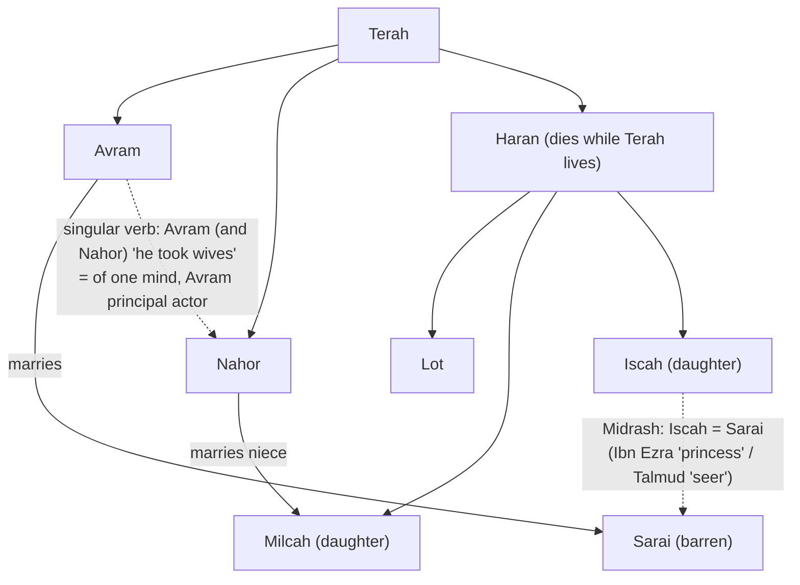

# Buried in a Genealogy

BEMA 8 · Session 1
Source transcript: `~/workspace/bema/transcripts/1-8-buried-in-a-genealogy.md`
Book: Genesis (center texts Genesis 11:27–32; Genesis 20:12)
Guest: Elle Grover Fricks (BEMA teaching team; Hebrew / ancient Near East)

> The rabbis' question — *why did God choose Avram?* — is answered not in Genesis 12 but in Genesis 11, "buried in a genealogy." Reading the Terah genealogy slowly (with Midrash and Hebrew syntax), the hosts find a man who, before any command of God, lays down his own name, legacy, and future to marry and protect a barren woman. God chooses the one character so far who already knows how to **trust the story** and put another's dignity above his own self-interest.

## Key Lessons

- **The reason God chose Avram is hidden in the genealogy, waiting to be discovered.** Marty: *"We don't meet Avram in Genesis 12. We meet Avram in Genesis 11, in the middle of a genealogy... the Jews say, oh no, let's look again."* Against the Calvinist "God just chose him by sovereign will" reading, the Jewish tradition insists the Text gives a reason — if you'll slow down and look twice.
- **Avram marries the barren woman — and in doing so lays down his own legacy.** Brent: *"He chooses the barren woman."* Elle: *"He is willing to sacrifice being the patriarch of his family. He cannot have his own beit av if he does not have kids... He's laying down his own potential to have a legacy for the sake of this woman."* This is self-sacrifice before Torah, before covenant, before God speaks.
- **Avram sees a woman's worth apart from what she can produce.** Elle: *"Women in this culture, their main function is their fertility. And Avram sees that narrative and says, 'No, I am willing to self-sacrifice because I see the value of this woman aside from what she can produce.'"* God chooses the one who honors another's humanity over cultural prestige.
- **Avram is the first character who contrasts the failures of the preface.** Marty: *"When I think about Cain and Abel... Noah and the vineyard... Tower of Babel... all of a sudden I meet somebody. God has found a character that's willing to trust the story and not work out of fear and insecurity... This is somebody who knows how to trust the story. And... the story tells us that we can in fact do this."* The arc turns from depravity toward possibility.
- **Even genealogies are God-breathed and worth mining.** Elle: *"If 2 Timothy is right... then all scripture is, etc., etc., including, maybe even especially, genealogies."* The whole episode is a demonstration that the "boring" lists carry the treasure.

## East/West Lens

- **Truth over time (static/told vs. dynamic/discovered)** — The core of why Midrash exists. Marty: *"the Eastern mind believes that truth is more powerful when we can discover it rather than just be told it... in the Hebrew world, you're trying to lead people to the answer because if they can discover it on their own, they'll have such a more intimate transformative experience with the lesson."*
- **The name as the story (concrete vs. abstract)** — A Hebrew name carries meaning. Elle on *Sarai*: the root means "commander," with the final *yud* possessive — *"her name means my commander"* — not a Disney princess but a ruler. Names are read as clues, not labels.
- **Grammar carries theology (relational "of one mind" vs. mere plurality)** — The singular verb "he took wives" marks Avram as principal actor *of one mind* with Nahor. Marty (via Fohrman): *"when you see this phrase described this way... they're of one mind. It's two people, but they're of one mind."* The syntax encodes shared, benevolent intent.
- **Honor/shame & the household (communal vs. individual)** — Worth is located in the *beit av* and in community-held knowledge (even a woman's cycle is communal). Elle: *"in their culture, there's all these customs... very community oriented for women as they experience their cycle. So if she doesn't have one, the whole community would know."*

## Recurring Through-lines

- **Trust the story (the Session 1 arc) — Avram is its first positive exemplar.** Marty names it directly: *"God has found a character that's willing to trust the story and not work out of fear and insecurity... This is somebody who knows how to trust the story."* After a preface of grasping and mistrust, Avram embodies the arc the whole session is building toward — partnership rooted in trust, not fear.
- **Knowing when to say "enough" / putting self aside.** Marty folds this episode back into the earlier lesson: *"This is somebody that knows when it's time to say enough, put self aside and give to others."* Avram's refusal to leverage Sarai for alliance or prestige is "enough" lived out. (Cross-reference `1-2-knowing-when-to-say-enough.md`; do not re-explain there.)
- **Contrast with the preface's failures (fear, insecurity, grasping).** The episode is explicitly measured against Adam & Eve, Cain & Abel, Noah's vineyard, and Babel — Marty: *"what a contrast."* Where those acted "out of fear and insecurity," Avram acts out of trust and compassion.
- **Midrash as a BEMA practice ("look, and then look again").** Elle: *"they're still working toward solving the same issue in the Text. Why is this here?"* The method of surfacing problems and letting Jewish tradition resolve them recurs across the podcast.

## Narrative Tensions

The hosts' signature move: name the literary *problems* in the passage, then let Hebrew and Midrash resolve them. ("Iscah's mention is a problem... She's not a problem. The literary mention seems to be a problem.")

| Surface problem | Tag | Cited quote (speaker) | Verse citation + link | Resolution / status |
|---|---|---|---|---|
| Why is Iscah even mentioned? She never returns in the story. | `logic-gap` | Marty: *"Iscah has no business being mentioned... Iscah is not going to come back up in the story as a direct reference. That seems to be somewhat of a literary problem."* | [Genesis 11:29](https://www.biblegateway.com/passage/?search=Genesis%2011%3A29&version=NIV) | **Resolved (Midrash):** Midrash identifies Iscah with Sarai (Ibn Ezra: Aramaic "princess" ≈ Hebrew *Sarai* "commander"; Talmud: "to see" = seer/prophetess). "Iscah's mentioned because she's actually Sarai." |
| Why does Sarai's barrenness appear at the *end* instead of when she is first named? | `logic-gap` | Marty: *"Where would you have expected the author to mention Sarai's barrenness?"* Elle: *"In an appositive phrase, when she's first mentioned."* | [Genesis 11:30](https://www.biblegateway.com/passage/?search=Genesis%2011%3A30&version=NIV) | **Resolved (Midrash):** If Iscah = Sarai, the delayed barrenness is "a whole part of this whole story" — the problems "fade away." |
| Nahor marries his niece Milcah — isn't that disturbing? | `unstated-cultural-assumption` | Marty: *"if they don't talk about Nahor marrying his niece, I'm gonna have some questions."* Elle: *"it's not common, but it also wasn't taboo... especially in higher families of wealth, of nobility."* | [Genesis 11:29](https://www.biblegateway.com/passage/?search=Genesis%2011%3A29&version=NIV) | **Resolved (historical):** In-family marriage kept legacy and provision within the *beit av*; marrying the orphaned niece rather than sending her off was going "above and beyond" to protect her. |
| Birth order seems scrambled — the youngest (Haran) already has children. | `logic-gap` | Marty: *"it would be weird if... Haran's the last born... that he is the one who's married with children. You would assume the firstborn."* | [Genesis 11:27-28](https://www.biblegateway.com/passage/?search=Genesis%2011%3A27-28&version=NIV) | **Held loosely:** As with Noah's sons, listed order ≠ birth order; the hosts caution not to over-assume. |
| Doesn't Genesis 20:12 ("my father's daughter") prove Sarai is literally Abram's half-sister, so the Midrash is wrong? | `translation-disagreement` | Brent (quoting): *"she really is my sister, the daughter of my father, though not of my mother."* Marty: *"It's deceptive in the English because in the Hebrew you have references of kin that are vertical and references... that are horizontal."* | [Genesis 20:12](https://www.biblegateway.com/passage/?search=Genesis%2020%3A12&version=NIV) | **Resolved (Hebrew semantics):** "Father" is vertical (any ancestor); "brother/sister" is horizontal (incl. niece/nephew). Avram is using Semitic kinship language to tell Avimelech the technical truth, not claiming a literal half-sister. |
| How could anyone know Sarai was barren at the time of marriage? | `unstated-cultural-assumption` | Marty: *"A lot of people will comment, well, how do they know she's barren?... I think the story assumes that they understand their barrenness."* | [Genesis 11:30](https://www.biblegateway.com/passage/?search=Genesis%2011%3A30&version=NIV) | **Resolved (historical):** Elle offers two paths — a prior marriage returned for infertility, or communally-known amenorrhea (diagnosed even by an *ashipu*). The barrenness was known, which deepens the cost of Avram's choice. |
| "Haran" (son) vs. "Haran/Charan" (place) — same English spelling, different words? | `translation-disagreement` | Brent: *"the location Haran... has two R's and the name from earlier only has one. Is there something in the Hebrew?"* Elle: *"In verse 31 it is 'Charan,' and in verse 27 it is 'Haran'... they are different words."* | [Genesis 11:31-32](https://www.biblegateway.com/passage/?search=Genesis%2011%3A31-32&version=NIV) | **Resolved (Hebrew):** Two distinct words (guttural *ch* vs. *h*); English obscures the difference, though the narrator may play on the homophony. |

## Chiasms & Structure

No chiasm is proposed or developed in this episode. The structural work here is a **slide-by-slide genealogy diagram** (Terah → three sons; marriages; the Midrashic re-linking of Iscah to Sarai) rather than a chiastic pattern, so this section is a diagram of the family/argument the hosts build, not a chiasm.

Prose: Walking the slides, the hosts surface the "problems" (Iscah's dangling mention, misplaced barrenness, the niece marriage) and then let Midrash collapse them by identifying Iscah with Sarai. The Hebrew singular verb reframes verse 29 so that Avram — not merely Nahor — is the principal, of-one-mind actor behind the benevolent marriages, setting up the episode's payoff: Avram deliberately chooses the barren niece.

## Terminology

- **Avram / Avraham** (אברם / אברהם) — "Abram / Abraham"; the hosts prefer the Hebrew pronunciation to keep the story "someone else's story from another time and another place." Marty: *"it helps remind me of the story as an ours. It's not mine."*
- **beit av** (בית אב) — "house of the father"; the patrilineal, patrilocal household around which lineage, inheritance, and identity revolve. To have no children is to have no *beit av* — the heart of Avram's sacrifice. Elle: *"He cannot have his own beit av if he does not have kids."*
- **Sarai** (שרי) — root = "commander / ruler" (as in commander of the army/bodyguards/prison), final *yud* possessive. Elle: *"her name means my commander"* — a ruler, "not of the Disney variety."
- **Iscah** (יסכה) — per Ibn Ezra (Aramaic) ≈ "princess"; per the Talmud ≈ "to see" (seer/prophetess). Midrash identifies Iscah with Sarai. Elle: *"Iscah is the alter ego, almost of Sarai, that she's a prophetess or a seer."*
- **"he took wives" (singular verb)** — Hebrew syntax: a singular verb with "Avram (and Nahor)" marks Avram as the principal, *of-one-mind* actor — same construction as Shem (and Japheth) covering Noah, and Moses (and Joshua/Caleb). Elle: *"it is a bit more like 'Avram married (and Nahor)' — almost in parentheses."*
- **Haran vs. Charan** — two distinct Hebrew words rendered alike in English: v. 27's *Haran* (the son) and v. 31's *Charan* (the place, with the guttural *ch*), homophonically linked but different.
- **mishpachah** (משפחה) — "family / clan"; horizontal kin terms (brother/sister) within it can mean niece/nephew/cousin, explaining Genesis 20:12. Marty: *"the term sister or brother is a horizontal term in the beit av."*
- **ashipu** — a Mesopotamian priest/healer/exorcist/"wizard" who diagnosed conditions like amenorrhea via divination, omens, and moral judgment. Elle: *"a priest, healer, exorcist, wizard from their culture who would have used divination, omens, moral judgment."*
- **tutella (tutela)** — the Roman legal system of guardianship/wardship for a woman after her father's death. Elle: *"there's a whole system for this in Rome, tutella, that goes back centuries and centuries."*
- **Midrash** — Jewish interpretive tradition that surfaces and resolves textual problems, leading the reader to discover meaning. Marty: *"Midrash is trying to open our eyes to things that we wouldn't see on a cursory reading."*

## Illustrations & Images

- **"Barista at Starbucks" (anachronism to feel the stakes).** Marty: *"It's not easy to just go get a job as a barista at Starbucks or find some way to take care of yourself."* Dramatizes how precarious an orphaned, unmarried daughter's position was.
- **"Mustache-twirling" villain vs. taking her under-wing.** Elle contrasts a creepy "I'll take you in" with genuine guardianship: *"if I think about it from my culture, like, 'Oh, ha ha, I'll take you in'... However in guardianship... choosing instead to marry her within the family is more of a taking her under the wings of the household."*
- **The absurd ancient "diagnostic manual."** Elle: *"'There's this man and he has pain in the night. This is because he has committed adultery... Also, while the doctor was walking to his house, he saw a pig. And so we know that this man will surely die.'"* Marty: *"Ha! Science!"* — shows the omen-and-moral-blame medical world Sarai would have faced.
- **Anglicized vs. Hebrew names ("Yeshayahu" = Isaiah).** Marty: *"When it's Yeshayahu, that's different. You don't catch that."* Opens the episode's theme that names (and their meanings) matter.

## References & Recommendations

- **_Epic of Eden_ by Sandra Richter** — recommended introductory treatment of suzerain-vassal covenants and the *beit av*. Marty: *"a great book to read. Just kind of touches in like suzerain-vassal covenants, the concept of a beit av."*
- **Ibn Ezra** — medieval Jewish commentator; Aramaic reading of "Iscah" as princess, identifying Iscah with Sarai. (Marty notes it's "wink, wink, nudge, nudge commentary," not a literal etymological claim.)
- **Talmud / rabbinic Midrash** — the tradition identifying Iscah as Sarai (seer/prophetess), grounding the later note that Abraham must heed everything Sarai says.
- **Jewish Women's Archive** — Elle's "favorite source for women characters in the Bible, learning about the Midrash and what it teaches about them."
- **Rabbi David Fohrman** — source of the "singular verb = of one mind" principle (Shem and Japheth; Avram and Nahor). Marty: *"when I heard this from Rabbi Foreman years ago."*
- **Code of Hammurabi** — cited on an orphaned daughter keeping her dowry even after her father's death.
- **2 Timothy 3:16** — alluded to ("all Scripture is God-breathed") in defense of studying genealogies.

## Callbacks

- **Noah and the vineyard — Shem (and Japheth) covering their father.** The singular-verb/"of one mind" principle is drawn straight from that earlier episode. Marty: *"when Shem and Japheth took the blanket, it was Shem's idea... but they were of one mind to do a benevolent act."* (See `1-5-a-misplaced-curse.md`.)
- **The table of nations / Noah's sons listed in differing orders.** Used to justify holding birth order loosely. Marty: *"We've seen that in the Noah story... one order of the sons coming out of the ark... another order in the table of nations."*
- **The preface's failing characters (Adam & Eve, Cain & Abel, Babel).** Explicitly contrasted with Avram as the first to "trust the story." Marty: *"when I think about Cain and Abel... Tower of Babel... what a contrast."*
- **Forward-pointing nod: women spotlighted in genealogies (Jesus's line).** Elle: *"if we jump way out in the story, we talk about Jesus's genealogy... there are women in his line. And that stands out."* A deliberate "spoiler alert" that this pattern recurs.

## Discussion Questions

1. The rabbis ask *why* God chose Avram; a Calvinist reading says simply "sovereign will." Which answer have you lived with — and what changes if the reason really is "buried in a genealogy" waiting to be discovered?
2. Avram marries the barren woman and so surrenders his own *beit av* — name, legacy, future. Where in your own life does "trusting the story" ask you to lay down a legacy or self-interest for another person's dignity?
3. Elle says Avram "sees the value of this woman aside from what she can produce." Where does your culture still measure people by what they produce, and how might you see someone's worth apart from it this week?
4. Midrash resolves the text's problems by *leading you to discover* rather than *telling you*. When has a truth you discovered yourself changed you more than one you were simply told? Why do you think that is?
5. Avram is the first character set in deliberate contrast to the preface's failures ("not work out of fear and insecurity"). Where do fear and insecurity drive your decisions — and what would the trusting alternative look like?
6. The hosts treat a "boring" genealogy as God-breathed treasure. What part of Scripture have you skimmed as filler that might reward a second, slower look?

## Sources

- Transcript: `1-8-buried-in-a-genealogy.md`
- [Genesis 11:27-32 (NIV)](https://www.biblegateway.com/passage/?search=Genesis%2011%3A27-32&version=NIV)
- [Genesis 20:12 (NIV)](https://www.biblegateway.com/passage/?search=Genesis%2020%3A12&version=NIV)
- Referenced resources named in the episode (not web-fetched): Sandra Richter, *Epic of Eden*; Ibn Ezra; Talmud / rabbinic Midrash; Jewish Women's Archive; Rabbi David Fohrman; Code of Hammurabi; 2 Timothy 3:16.
