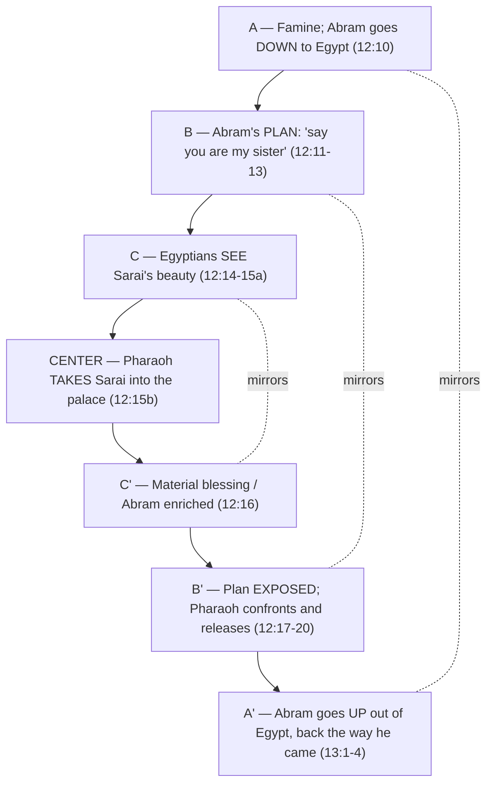

# Letting Go

**BEMA 9 · Session 1** — Genesis (The call of Abram and his first adventures: Genesis 12:1–14:24)
Source transcript: `transcripts/1-09-letting-go.md`

> **Session 1 arc — partnership.** God has found a partner willing to "do the right thing on behalf of others," and now the partnership gets its charter: *lech-lecha*, "Go." This episode watches Abram learn how to be God's partner the hard way — he leaves everything, builds a logical plan, watches it backfire in Egypt, and then has to decide whether a mistake will become his story. The lesson he keeps relearning is the backbone of the whole corpus: do the next right thing and **trust the story** — trust God to make good on God's own promises.

---

## Key Lessons

Read for the problems: the weird Canaanites-and-Perizzites verse, the "sister"/"brother" slippage, and the backwards walk out of Egypt are not clutter — they are the author linking stories and pointing at a constant priority. Abram is "no fantasy hero wearing a cape" — he is "just like you and me."

- **The call is a covenant partnership that is missional, not transactional.** God's blessing is "I want to bless everyone else, and I want to work through you to be that blessing." Cited: *Marty* — "this partnership that God's forming is missional in nature. It's not just transactional... through their covenantal partnership, God's going to bless the rest of the world." The thing God wants — to put the world back together through a partner — does not change; trust the story.

- **Abram builds altars and pitches tents — the anti-Babel posture.** Where Babel built a tower *for their own name* and tried to make themselves permanent, Abram builds "a different kind of tower" to God's name and stays mobile. Cited: *Marty* — "The tower that the people of Babel were building were for them and for their name. Avram builds a tower that's not for him... a tower to God and God's name... making himself mobile." Being God's partner means God is the fixture and I am the one following.

- **You can't control the circumstances the way you think you can.** The Egypt story is a chiasm whose lesson is that the best-laid plan is an illusion of control. Cited: *Marty* (via Fohrman) — "the lesson of the chiasm for Avram is that things don't always go as planned. You can't control the circumstances like you think you can... do what's right, trust the story, trust God to take care of the rest."

- **Being faithful and being responsible is a real tension — and failing it doesn't make you the villain.** Going down to Egypt in a famine is what *everybody* did; the deception is where it goes wrong, but even that comes from a man "doing his best to follow God." Cited: *Marty* — "who among us has not wrestled with the tension of what does it mean to be responsible and faithful? And what does it mean to trust?... Avram's just like you and me. He's not perfect."

- **Let go of your best logical plan and let God's promise be God's problem.** Abram brought Lot as the only logical way to become "a great nation," then surrenders exactly that plan — letting the lesser party (Lot) choose first. Cited: *Marty* — "Avram lets his best, logical, most reasonable plan go... 'God's promise is God's problem. I'm going to let God figure out God's promises, and I'm going to let Lot go.'"

- **A mistake does not have to become your story.** This is the heart of the episode: Abram sins, learns, and climbs right back into trusting the story — even doubling down in Genesis 14 by handing Lot back to the king of Sodom. Cited: *Marty* — "Avram makes a mistake, learns a lesson and does not let the mistake define him... 'I've made a mistake, but I'm going to trust that if I do the next right thing, this story can still be redemptive.'"

---

## East/West Lens

- **Words (word-pictures / idiom over definition).** *Lech-lecha* ("Go! / Go forth") and the layered kinship vocabulary carry freight English flattens. Cited: *Marty* — "Lech-lecha-go! A verse that I think a lot of us just read... And yet this is a huge, huge request that God's making."

- **Community over individual (the beit av).** Leaving is not individual independence — it is tearing yourself out of the whole household's living, faith, belonging, and shared story. Cited: *Marty* — "to leave your father's beit av... his father's household is what he belongs to... the whole extended family essentially lives together." To "leave would be a dishonoring thing to do."

- **Error & sin (wrong *doing* over wrong believing, and the slow repair of it).** Abram's failure is an action — a shrewd, deceptive plan — not a creed, and the story measures him by what he does next. Cited: *Marty* — "He's taking the truth and he's trying to deceive people with it... he has a plan that he's trying to shrewdly, even if deceptively, exploit here."

- **Truth over time (dynamic / unfolding understanding).** Abram's knowledge of God grows across the chapters; he does not start with a finished theology. Cited: *Brent* — "What does Abraham even understand about God at this point? Because like, we're going to see him come into this whole understanding over the next few chapters of who God is."

- **God's description (concrete relationship over abstract attribute).** God "shows up" and "finally speaks," defining the partnership in relational, covenantal terms rather than issuing an abstract decree. Cited: *Marty* — "we have God kind of defining this partnership. He shows up with a blessing like this... 'I want to partner with you, Abraham.'"

---

## Recurring Through-lines

- **Trust the story (the backbone arc).** This episode is one of the clearest statements of the arc: Abram's whole journey is a cycle of making a plan, watching it fail, and choosing to "trust the story" again. Cited: *Marty* — "do what's right, trust the story, trust God to take care of the rest." He "trusted the story in Genesis 13, and he doubles down on trusting the story in Genesis 14." The constancy of God's priority — bless the world through a faithful partner — is what Abram learns to lean back into. This is the arc the whole corpus keeps returning to.

- **Sin as failing to master the animal instinct ("master the beast").** Grasping for control — forcing the plan with Lot, forcing the plan in Egypt — is the impulse Abram must learn to let go. The explicit tie is Cain and Abel: two relatives quarreling in a field. Cited: *Marty* — "Have we heard a story... already in the Genesis narrative about two brothers arguing in a field?" / *Brent* — "that one didn't work out very well." Abram refuses to let the field-quarrel escalate the way Cain's did; he masters the impulse and lets Lot pick. Same dynamic anchored in `1-03-master-the-beast.md`.

- **Human being vs. human doing (identity motif).** Abram's worth as a partner is tied to *character* — justice, caring for others first — more than output; God lifts Abram's eyes to the blessing only *after* Abram's character is shown. Cited: *Marty* — "Now that you've shown me your character, now that you've let Lot go first and you let Lot pick, now I want you to lift your eyes." Carried from the "being, not doing" thread of the earlier episodes.

- **The problems are on purpose (method motif).** The paired oddities (sister/brother, Canaanites/Perizzites, the backwards walk) are deliberate authorial links inviting the reader to connect the two stories. Cited: *Marty* — "These stories as Rabbi Foreman taught it are supposed to be linked. The author wants you to say what's happened in this story is connected to what happened in the last story."

---

## Narrative Tensions

The table below also serves as the episode's coverage backbone, walking the text in order from Genesis 12:1 through 14:24.

| # | Surface problem | Tag | Cited quote (speaker) | Verse + link | Resolution / status |
|---|---|---|---|---|---|
| 1 | "Go from your father's household" reads like a small ask to us, but makes little sense in a world where no one leaves the *beit av*. | `unstated-cultural-assumption` | *Marty*: "this is a huge, huge request... Everybody stays in your father's house... Actually to leave would be a dishonoring thing to do." | [Genesis 12:1](https://www.biblegateway.com/passage/?search=Genesis%2012%3A1&version=NIV) | **Hebraic lens:** The *beit av* is the whole engine of life, faith, and identity; the call's weight is leaving a god-and-culture world, not just a home. |
| 2 | Why does Abram take Lot at all? Caring for a dead brother's son would fall to the father, not to Abram. | `logic-gap` | *Brent*: "it is weird... wouldn't it fall to the father?" | [Genesis 12:4-5](https://www.biblegateway.com/passage/?search=Genesis%2012%3A4-5&version=NIV) | **Resolved (Fohrman):** Abram, told he'll become "a great nation" but married to a barren Sarai, logically concludes the nation must come through Lot — so he brings him. |
| 3 | God promises *land* — but the Babel story just taught that God doesn't want people to settle. Won't Abram "set up shop"? | `contradiction` | *Marty*: "no, God, don't promise Avram land... what do you think Avram's going to do?" / *Brent*: "let's set up shop." | [Genesis 12:6-7](https://www.biblegateway.com/passage/?search=Genesis%2012%3A6-7&version=NIV) | **Hebraic lens:** Abram builds an *altar*, not a tower — a tower to God's name — and stays mobile; the anti-Babel posture resolves the apparent clash. |
| 4 | The repeated altars-and-tents refrain seems like travel-log filler. | `logic-gap` | *Marty*: "There's those same repeated ideas that Avram is building altars and pitching tents." | [Genesis 12:8-9](https://www.biblegateway.com/passage/?search=Genesis%2012%3A8-9&version=NIV) | **Hebraic lens:** The repetition is characterization — a tent is "temporary"; Abram makes God permanent and himself mobile, the inverse of Babel. |
| 5 | "To live there for a while" in Egypt sounds off for a man who's been doing only temporary tents. | `logic-gap` | *Brent*: "I noticed that phrase, to live there for a while, which is not what he's been doing up to this point." | [Genesis 12:10](https://www.biblegateway.com/passage/?search=Genesis%2012%3A10&version=NIV) | **Open — dance with it.** The hosts flag the shift (toward Egypt, toward settling-ish) as the early tremor of a plan that will "head south," without flattening it. |
| 6 | Is Abram just a coward throwing his wife on the chopping block to save his own skin? | `unstated-cultural-assumption` | *Marty*: "we just throw Avram right under the bus... There's more to it when you look at the words." | [Genesis 12:11-13](https://www.biblegateway.com/passage/?search=Genesis%2012%3A11-13&version=NIV) | **Resolved (ANE context):** "Be treated well" means *materially blessed*; via the *mohar*, Abram plans to let suitors court "his sister," collect the gifts, and slip out — shrewd deception, not mere cowardice. |
| 7 | The "she is my sister" line — is it even a lie? | `translation-disagreement` | *Marty*: "a deceptive half-truth, or we might even say a deceptive full truth." | [Genesis 12:13](https://www.biblegateway.com/passage/?search=Genesis%2012%3A13&version=NIV) | **Resolved (Hebraic kinship):** Vertical terms (father) and horizontal terms (sister) are catch-alls; Sarai as "sister" is technically true in the Semitic sense, weaponized to deceive. |
| 8 | The plan "works" — and then catastrophically fails when Sarai is taken. | `logic-gap` | *Marty*: "Whoopsie daisy. There's one person that doesn't court first and then ask." | [Genesis 12:14-16](https://www.biblegateway.com/passage/?search=Genesis%2012%3A14-16&version=NIV) | **Resolved (power dynamic):** Pharaoh "sees and takes" — the one actor outside the courting economy Abram engineered his plan around. |
| 9 | Why doesn't Pharaoh kill the deceiver or demand the wealth back? | `logic-gap` | *Brent*: "crazy that he doesn't make him give all the stuff back and crazy that he doesn't kill him for deceiving him." | [Genesis 12:17-20](https://www.biblegateway.com/passage/?search=Genesis%2012%3A17-20&version=NIV) | **Open / interpretive:** The hosts name it "by the grace of God" — Abram leaves with the material blessing intact; left as a wild, unresolved mercy. |
| 10 | The chapter break at Genesis 13:1 makes this look like a new story, and the verses sound oddly familiar. | `unstated-cultural-assumption` | *Marty*: "ignore that big old 13 verse 1... keep reading as if this is the same story." / *Brent*: "We got a chiasm." | [Genesis 13:1-4](https://www.biblegateway.com/passage/?search=Genesis%2013%3A1-4&version=NIV) | **Resolved (structure):** The backwards walk out of Egypt mirrors the walk in — a chiasm centered on Pharaoh taking Sarai (12:15). |
| 11 | The random "Canaanites and Perizzites" note (and Lot called "brother") feels like an intrusive aside. | `logic-gap` | *Marty*: "a really weird verse about the Canaanites and the Perizzites... He calls Lot his brother. Is Lot his brother?" | [Genesis 13:5-9](https://www.biblegateway.com/passage/?search=Genesis%2013%3A5-9&version=NIV) | **Resolved (authorial link):** The repeated peoples and the sister→brother mirror deliberately bind the Egypt and Lot stories, asking whether Abram has learned anything. |
| 12 | Why does the patriarch (Abram) let the nephew (Lot) choose first? | `unstated-cultural-assumption` | *Marty*: "who's the one that has the patriarchal upper hand?" / *Brent*: "Avram does." | [Genesis 13:10-13](https://www.biblegateway.com/passage/?search=Genesis%2013%3A10-13&version=NIV) | **Resolved (character):** Abram surrenders his rightful advantage and his own best plan (Lot = the nation), doing the right thing and letting God sort the promise. |
| 13 | Abram only "lifts his eyes" after Lot leaves — why the delay? | `logic-gap` | *Marty*: "Avram doesn't even look up in the story until God tells them to." | [Genesis 13:14-18](https://www.biblegateway.com/passage/?search=Genesis%2013%3A14-18&version=NIV) | **Hebraic lens:** God waits until Abram's character is shown ("now that you've let Lot go first"), then reveals the blessing — a reward of posture, not grasping. |
| 14 | After rescuing Lot, Abram gives *everything* — including Lot — back to the king of Sodom. Didn't God just hand Lot back? | `logic-gap` | *Marty*: "if I was in Avram's shoes, I would be like, 'now God's given me Lot back'... but he doesn't. He trusts in the right thing." | [Genesis 14:21-24](https://www.biblegateway.com/passage/?search=Genesis%2014%3A21-24&version=NIV) | **Resolved (arc):** Abram "doubles down on trusting the story" — he refuses to make the king's gift his own leverage and lets God keep owning the promise. (Lot's next appearance: in the gates of Sodom, Gen 19.) |

**Coverage check:** The fourteen tensions trace the passage in order — Gen 12:1 (the call / *beit av*), 12:4-5 (taking Lot), 12:6-7 (land promise / altar), 12:8-9 (altars & tents), 12:10 (down to Egypt), 12:11-16 (the "sister" plan and its backfire), 12:17-20 (Pharaoh releases Abram), 13:1-4 (the mirrored walk out / chiasm), 13:5-13 (the Lot quarrel, Canaanites/Perizzites, letting Lot pick), 13:14-18 (lifting the eyes / blessing), and 14:21-24 (giving it all back to the king of Sodom). No major movement of the episode's walk-through is left uncovered.

---

## Chiasms & Structure

The hosts explicitly identify a chiasm across the Egypt descent (Genesis 12:10–13:4): Abram walks *into* the land and then walks the same path *backwards* out of it, with Pharaoh seizing Sarai at the dead center. Cited: *Brent* — "We got a chiasm." / *Marty* — "the center is going to be that center paragraph where Pharaoh takes her, in fact, verse 15."

**Prose:** The story descends and ascends on a mirror image — down to Egypt / up out of Egypt, plan made / plan exposed, beauty noticed / wealth gained — folding around the moment Abram never planned for: Pharaoh simply *takes*. Cited: *Marty* (via Fohrman) — "the lesson of the chiasm for Avram is that things don't always go as planned. You can't control the circumstances like you think you can." The structure itself preaches the episode's point: control is an illusion, so do what's right and trust the story. The following Lot narrative is bound to this one by the author's repeated signals (sister→brother; Canaanites and Perizzites), inviting the reader to ask whether Abram has learned the chiasm's lesson.

---

## Terminology

- **lech-lecha (לך לך)** — "Go! / Go forth"; God's opening call to Abram in Genesis 12:1. Cited: *Marty* — "Lech-lecha-go!... this is a huge, huge request that God's making."
- **beit av (בית אב)** — "house of the father"; the household Abram must leave — business, faith, belonging, and cultural narrative bound together. Cited: *Marty* — "beit av-house of the father... his father's household is what he belongs to."
- **mishpachah (משפחה)** — "family," as distinct from *beit av* ("household"). Cited: *Marty* — "mishpucha, maybe more appropriately would be understood in the English, maybe, as 'family.'"
- **mohar (מהר)** — the bride price / dowry a suitor brings to the patriarch to woo the hand of a woman; the economic engine of Abram's "she is my sister" plan. Cited: *Marty* — "there's all kinds of discussion about things called the mohar, the dowry, the bride price. You come bringing gifts."
- **"sister" / "brother" as kinship catch-alls** — in the *beit av*, vertical terms (father = father, grandfather, any ancestor) and horizontal terms (sister/brother = niece, nephew, cousin) are broad; Sarai as "sister" is a deceptive truth, and Lot as "brother" (really nephew) deliberately links the two stories. Cited: *Marty* — "a father is my father, my grandfather, my great-grandfather... everything else falls under sister. That is a catch-all word."
- **"treated well" / materially blessed** — the Hebrew phrase behind "so that I will be treated well" means *materially blessed*, revealing the plan was about acquiring wealth, not just surviving. Cited: *Marty* — "That Hebrew phrase means materially blessed... he's not just trying to save his skin. He's trying to... he has a plan."

---

## Illustrations & References

**Illustrations used in the episode:**

- **Abram smashing Terah's idols (midrash).** The traditional tale: the night before leaving, Abram smashes all his father's idols but one, puts the axe in the last idol's hand, and when challenged says, "Then why do you bow down to them?" Cited: *Marty* — "he takes an axe and he smashes all the gods, except for one... 'Then why do you bow down to them?'" — illustrating that Abram leaves his father's gods, going where Terah stopped short.
- **"Living in your parents' basement."** A modern jab Marty flips to show how backwards the *beit av* world is from ours. Cited: *Marty* — "we give people a hard time, like, 'Oh, you're still living in your parents' basement'... But in their world, that was the cultural assumption."
- **Two kinds of towers.** Babel's tower (for the builders' name) versus Abram's altar (a tower to God's name) — the same act, opposite hearts. Cited: *Marty* — "Both stories are about towers, but they're two different kinds of towers." (Callback to the Tower of Babel episode.)
- **The grocery store in a famine.** Brent's everyday picture for why going to Egypt was simply what everyone did. Cited: *Brent* — "if my cupboard is empty, I'm going to go to the grocery store. That's just what everybody does. When there's a famine in their land, you go to Egypt."
- **No cape, no "A" on his chest.** Abram is not a flawless comic-book hero but an ordinary man doing his best. Cited: *Marty* — "Avram is no, like, fantasy hero wearing a cape with a gigantic 'A' on his chest."

**References & recommendations:**

- **Rabbi David Fohrman (Aleph Beta)** — the shaping teacher behind the episode: the Egypt chiasm and its lesson ("things don't always go as planned"), the Canaanites/Perizzites and sister/brother links binding the two stories, and the reading of why Abram brings Lot. Cited: *Marty* — "I learned this through Rabbi David Foreman over at Aleph Beta... He's been a really big shaping teaching voice for me."
- **The Nile Delta / *National Geographic*.** Marty recounts a cover article ranking the Nile Delta the most fertile soil on earth (~100 feet of farmable topsoil vs. ~6 feet in U.S. regions), explaining why Egypt is always the famine refuge. Cited: *Marty* — "there's a hundred feet of farmable topsoil in the Nile Delta. It's always the place you go when there's a famine."
- **Bible Gateway / Bible-app word search.** Brent's suggested exercise: search "Lot" in order to confirm Abram hands Lot back (Gen 14:16 → the king's request → Lot "in the gateway" of Sodom, Gen 19). Cited: *Brent* — "just do a search in your Bible app... for Lot or Bible Gateway... have everything show up in order."

---

## Callbacks

- **To episode 8 (Buried in a Genealogy):** the story of Abram "begins a little earlier than a lot of us would have thought," in Genesis 11, with Abram chosen because he "does the right thing on behalf of others." Cited: *Marty* — "the story of Avram probably begins a little earlier than a lot of us would have thought. It begins all the way back in Genesis 11."
- **To the Tower of Babel episode (Gen 11):** Babel's drive to *settle* and build a name versus Abram's altars and tents. Cited: *Marty* — "just think of two, three... episodes ago... the story of the Tower of Babel... this idea of settling... God doesn't want them to settle."
- **To Cain and Abel (episode 3, Master the Beast):** two relatives quarreling in a field — a pattern Abram refuses to let escalate. Cited: *Marty* — "Have we heard a story... about two brothers arguing in a field?" / *Brent*: "that one didn't work out very well."
- **Forward to Lot in Sodom (Gen 19):** Abram's handing Lot back is confirmed by Lot's next appearance "in the gateway of the city." Cited: *Brent* — "The two angels arrived at Sodom in the evening and Lot was sitting in the gateway of the city."

---

## Discussion Questions

1. God's call is "blessed to be a blessing" — missional, not transactional. Where are you tempted to treat God's blessing as something *for you* rather than something flowing *through* you to others?
2. Abram builds altars and pitches tents: he makes God permanent and himself mobile, the inverse of Babel. What in your life are you trying to make permanent that God might be asking you to hold loosely?
3. The chiasm's lesson is that "you can't control the circumstances like you think you can." Where have you built a shrewd, "foolproof" plan that worked and failed at the same time — and what did it teach you about control?
4. Marty names the real tension: "What does it mean to be responsible and faithful? And what does it mean to trust?" In your current decisions, how do you tell the difference between faithful action and grasping for control?
5. Abram lets Lot — his best logical plan for the promise — simply walk away, and later hands him back again. What is the "Lot" you are holding onto as *your* way of securing God's promise, and what would letting go look like?
6. The episode's heart is that "Avram makes a mistake... and does not let the mistake define him." Name a mistake you've let become your story. What would "doing the next right thing" look like as a way of trusting the story instead?

---

## Sources

- Transcript: `1-09-letting-go.md`
- [Genesis 12:1-20 (NIV)](https://www.biblegateway.com/passage/?search=Genesis%2012%3A1-20&version=NIV)
- [Genesis 12:1 (NIV)](https://www.biblegateway.com/passage/?search=Genesis%2012%3A1&version=NIV)
- [Genesis 12:4-5 (NIV)](https://www.biblegateway.com/passage/?search=Genesis%2012%3A4-5&version=NIV)
- [Genesis 12:6-7 (NIV)](https://www.biblegateway.com/passage/?search=Genesis%2012%3A6-7&version=NIV)
- [Genesis 12:8-9 (NIV)](https://www.biblegateway.com/passage/?search=Genesis%2012%3A8-9&version=NIV)
- [Genesis 12:10 (NIV)](https://www.biblegateway.com/passage/?search=Genesis%2012%3A10&version=NIV)
- [Genesis 12:11-16 (NIV)](https://www.biblegateway.com/passage/?search=Genesis%2012%3A11-16&version=NIV)
- [Genesis 12:17-20 (NIV)](https://www.biblegateway.com/passage/?search=Genesis%2012%3A17-20&version=NIV)
- [Genesis 13:1-18 (NIV)](https://www.biblegateway.com/passage/?search=Genesis%2013%3A1-18&version=NIV)
- [Genesis 14:21-24 (NIV)](https://www.biblegateway.com/passage/?search=Genesis%2014%3A21-24&version=NIV)
- [Genesis 19:1 (Lot in the gateway of Sodom, NIV)](https://www.biblegateway.com/passage/?search=Genesis%2019%3A1&version=NIV)
- Referenced resources named in the episode (not web-fetched): Rabbi David Fohrman / Aleph Beta (the Egypt chiasm and its "things don't always go as planned" lesson; the Canaanites/Perizzites and sister/brother links; why Abram brings Lot); the midrash of Abram smashing Terah's idols; *National Geographic* (Nile Delta as the most fertile soil on earth).
