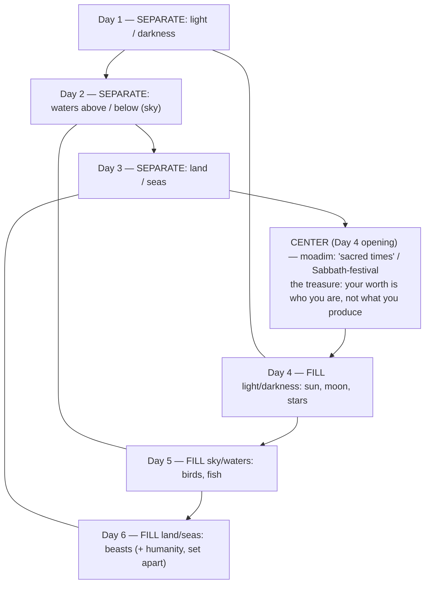

# Trust the Story

BEMA 1 · Session 1
Source transcript: `~/workspace/bema/transcripts/1-01-trust-the-story.md`
Book: Genesis (Genesis 1:1–2:3)

> **Session 1 overarching arc: partnership.** This is the **anchor episode for the phrase "trust the story" itself** — it is coined here. The hosts read Genesis 1 not as a science report but as a chiastic poem whose center-word (*moadim*, Sabbath/festival) delivers God's very first lesson to a people fresh out of slavery: your worth is in who you are, not what you produce. God's good creation invites humanity into partnership — to rest in it, enjoy it, and "take it somewhere."

## Key Lessons

- **"Trust the story" means trusting that God made a *good* creation — and that you are part of its goodness.** Marty: *"Day 7 has no end because it's God's invitation to trust the story... Trust that God has made a good creation, not a bad one. Trust that this is also true about you... We are not a mistake."* This is the arc in seed form: God's verdict over creation (*tov meod*, "very good") is constant, and the whole Bible is told from inside that goodness.
- **Start the story where God starts it — Genesis 1, not Genesis 3.** Marty: *"We love to start the story of the Bible in Genesis 3, with our sin and our struggle... But what we do is we miss the story of Genesis 1... this is where God means to start his story."* He adds: *"When we start the story too late, we end up telling the wrong story."* Starting too late tells the wrong story; God's priorities haven't moved — ours have.
- **Your value is in who you are (a human being), not what you produce (a human doing).** The first lesson God gives ex-slaves whose Egyptian value was brick-count: Marty: *"The very first lesson He wants to teach them is, 'I need you to know how to take a break.'"* And: *"You are not valued because of what you produce, but because of who you are."* The Jewish day beginning at sundown bakes this in — *"Your day starts with rest... not with brick making."*
- **Sabbath is a truth-telling, posture-shifting practice — from scarcity to abundance.** Marty: *"Sabbath is about telling me the truth that God loves me... It changes my posture from scarcity to abundance... If I trust the story, I'm not trying to preserve self... there's plenty for everybody."* The family mantra Marty offers: *"We rest, we play, no work, God loves us."* (Note Marty's caution: Gentiles need not adopt a *Jewish* Shabbat; Genesis 1 Sabbath is creation-wide, *"about Jew and Gentile and livestock and land."*)

## East/West Lens

- **Truth (how/what vs who/why)** — The episode's engine. Marty: *"the Western mind always wants to focus on what happened and how it happened... versus the who and the why... It's not about the how. It's about the Who, God, and the why."* The creation account *"isn't doing a very good job"* as a how/what report (light before the sun, days before the sun) precisely because that was never its concern.
- **Numbers (quantity vs quality/symbol)** — Patterns of 3, 7, and 10 structure the poem qualitatively. Marty: *"the first verse has 7 Hebrew words in it... the word earth appears 21 times... 7 times 3,"* plus the threeness of God, 3 days separating, 3 days filling. Numbers carry meaning, not just count.
- **Words (abstract definition vs word-picture/story)** — Genesis 1 is *"a form of poetry... It has a cadence to it,"* teaching through imagery and refrain (*"it was good," "evening and morning"*) rather than propositional definition.
- **Eternal life / life as quality (static vs dynamic)** — Marty: *"We always want to say that creation is perfect... but perfection is a Greek idea... It's static... creation wasn't perfect. Creation was good. It was dynamic. It was loaded with potential."* (*shalom* = wholeness, not static perfection.)
- **Community vs individual** — Sabbath is framed communally and even cosmically: *"This is about all of creation. This is about Jew and Gentile and livestock and land and fruit and trees and sky and rain."* Not an individual self-improvement practice.
- **Discovery vs information distribution** — The chiasm embodies the Eastern conviction that discovered truth transforms more deeply than delivered facts. Marty: *"the Western world, we like to just tell people, it's about information... The Easterner believes, I will understand that information on a deeper, more intimate level if I can discover it."*

## Recurring Through-lines

- **Trust the story (the arc itself) — named here for the first time.** This episode *is* the anchor for the arc. Crucially, Marty defines its scope narrowly: *"we're not talking about trust the story that God's telling in your life. We're talking about trust the story of Genesis 1."* Every later guide ties back to this: God's good verdict and constant priorities.
- **Partnership (Session 1 arc) — creation endowed to keep creating.** The goodness of creation is not a finished museum piece but an invitation to join in. Marty: *"God made creation, and then he endowed creation with the ability to keep creating and keep producing. He put mankind in the garden, and the next story told them to take it somewhere."* Humanity's place inside the good creation is the seedbed of the partnership theme that runs through Session 1.
- **Sin as failing to master the animal instinct ("master the beast").** Seeded obliquely: the story *"awkwardly want[s] to make humanity not a beast of the field"* — plucking the humanity paragraph out of the chiasm is what reveals the mirror. That deliberate separation of human from beast sets up the "master the beast" theme (anchor: `1-03-master-the-beast.md`). Flag for cross-reference; do not re-explain here.

## Narrative Tensions

Each entry: surface problem, classification tag, cited quote, normalized verse citation + link, and resolution or open flag.

| Surface problem | Tag | Cited quote (speaker) | Verse citation + link | Resolution / status |
|---|---|---|---|---|
| Light exists on Day 1 but the sun (its source) isn't made until Day 4; plants (Day 3) exist before the sun. | `logic-gap` | Marty: *"There's light without the source of that light. Light is made in Day 1. The source of that light, the sun, not showing up until Day 4. I have plants without the sun."* | [Genesis 1](https://www.biblegateway.com/passage/?search=Genesis%201&version=NIV) | **Resolved (Hebraic lens):** The text isn't a how/what science report but a who/why chiastic poem; this "problem" dissolves once read as poetry, not chronology. |
| "Days" are counted before the sun exists, yet days have always been measured by the sun. | `logic-gap` | Marty: *"how do we know that the first three days are even days?... we're not dealing with a science, a lab report."* | [Genesis 1:1-19](https://www.biblegateway.com/passage/?search=Genesis%201%3A1-19&version=NIV) | **Resolved (Hebraic lens):** The "day" cadence is a poetic/liturgical structure, not a clock. |
| "Evening and morning" is stated backwards from how we name a day (morning-then-evening). | `unstated-cultural-assumption` | Brent: *"it is backwards from how we typically think about a day... what is the purpose of evening and morning?"* | [Genesis 1:5](https://www.biblegateway.com/passage/?search=Genesis%201%3A5&version=NIV) | **Resolved (Hebraic lens):** The Jewish day begins at sundown/rest, not at waking/work — *"Your day starts with rest... not with brick making."* |
| Day 7 is the only day with no "evening and morning" closing refrain. | `logic-gap` | Marty: *"there's no evening and morning the 7th day... almost as if day 7 never ends."* | [Genesis 2:1-3](https://www.biblegateway.com/passage/?search=Genesis%202%3A1-3&version=NIV) | **Resolved (Hebraic lens):** The missing refrain is intentional — the open-ended 7th day is God's standing *invitation to trust the story* and enter his rest. |
| Why does an all-powerful God need to "rest"? | `unstated-cultural-assumption` | Marty: *"Does God need to rest? Is God out of divine creativity units?"* | [Genesis 2:2](https://www.biblegateway.com/passage/?search=Genesis%202%3A2&version=NIV) | **Resolved (Hebraic lens):** Not fatigue — completion. *"God rests because there's nothing more to do. Nothing is missing... The Hebrew concept here is shalom."* |
| The "goodness" refrain is missing on Day 2 but doubled on Day 3. | `logic-gap` | Marty: *"Actually, it's missing on Day 2, if you're paying attention, but it gets 2 of them on Day 3."* | [Genesis 1:6-13](https://www.biblegateway.com/passage/?search=Genesis%201%3A6-13&version=NIV) | **Open / noted:** The hosts flag the irregularity as part of the poem's deliberate patterning without resolving it in this episode. |

## Chiasms & Structure

The hosts describe Genesis 1 explicitly as a chiasm — both a parallel (ABC/ABC) *and* an inverted (ABCDCBA) one. Days 1–3 **separate**; Days 4–6 **fill** what was separated, in order (Day 4↔Day 1, Day 5↔Day 2, Day 6↔Day 3). Marty: *"Genesis 1 happens to be both... It is both ABC, ABC, and it is also ABCDCBA."* Plucking out the humanity paragraph on Day 6 reveals the *"baby, mommy, daddy, daddy, mommy, baby"* inverted mirror, whose center lands at Day 4 on the word **moadim** (*"sacred times"*/season/festival) — the treasure of the hunt.

Prose: The inverted chiasm functions *"like an arrow pointing you towards the center."* The center isn't a climactic act of creation but **rest/festival** — God's first lesson to liberated slaves. The humanity paragraph is deliberately *"awkward"* (humans could have been lumped with the beasts of Day 6) because the story is told *for humanity's* benefit, to locate us inside creation's goodness. Marty: *"this story is primarily about our place in it. Genesis 1 is being told for our benefit to tell us about who we are and our place in creation."*

## Terminology

- **Elohim** (אלהים) — "God," the name used in the creation account. Marty: *"Elohim is the word for God."*
- **tohu va'vohu** (תהו ובהו) — "formless and void" / "chaotic nothingness." Marty: *"If you put nothing in a blender and hit whip, you get tohu va'vohu... it's even worse. It's chaotic nothingness."*
- **ruach** (רוח) — "spirit / wind / breath"; the Spirit hovering over the waters. Marty: *"ruach is the word for spirit."*
- **merahephet** (מרחפת) — "hovering," like a Near-Eastern dove fixed in one spot with normal wingbeats. Marty: *"That's the idea of merahephet-ing."*
- **tov** / **tov meod** (טוב / טוב מאד) — "good" / "very good"; the refrain and God's verdict over humanity. Marty: *"God steps back after making humanity and says it is very good... Tov is good, meod is very."*
- **moad / moadim** (מועד / מועדים) — "season(s)" / "sacred times" / appointed festival; the chiasm's center word and one of four Hebrew Sabbath/festival terms (distinct from *the* Shabbat, the verb "to cease," and a non-seventh-day rest). Marty: *"this word is what ends up at the center of your chiasm... It's about parties and festivals. I need you to know how to party, God says."*
- **shalom** (שלום) — wholeness/peace, everything in its proper place; the state in which God rests. Marty: *"Nothing is missing. Nothing is lacking. The Hebrew concept here is shalom."*
- **chiasm / chiasmus** — an ancient literary mirroring device (ABC/CBA or ABCDCBA) used so the reader *discovers* rather than is merely told. Marty: *"A chiasm was like a treasure hunt... the author is burying something, some treasure that the author wants you to find."*

## Illustrations & Stories

- **Nothing in a blender.** Marty's picture of *tohu va'vohu*: *"If you put nothing in a blender and hit whip, you get tohu va'vohu... It's nothing, but it's even worse. It's chaotic nothingness."*
- **The hovering Near-Eastern dove.** For *merahephet*: a dove that *"hovers in a single spot, like just almost like a hummingbird... its wings are just moving like normal. And yet it just stays."*
- **The Hebrew slave and brick production.** The empire ties a person's worth to output: *"your value in Egypt as a Hebrew slave is tied to brick production. How many bricks can you make?"* — the backdrop against which God's first lesson lands.
- **The artist who must know when to stop** (via Rabbi David Fohrman). Michelangelo's *David* and Da Vinci's *Mona Lisa*: *"If there's one more chisel blow... he ruins the whole sculpture. He has to know when the sculpture is done."* (The hosts riff that the statue of David might *"need another strike or two from the chisel."*)
- **A father at his sleeping daughter's bedside.** Marty: *"I would sneak in there and just kind of sit by her bedside just to appreciate her. That's how God feels about His creation."*
- **Marty's Sabbath habits.** Not shaving his head (*"I don't have to shave my head today... God loves me"*) and not doing the dishes/making the bed — practices that *"[tell] me the truth that God loves me,"* even when his orderly instincts protest.

## References & Resources Cited

- **Rob Bell — "Everything Is Spiritual"** (live presentation, first tour, June/July 2006, the Black Sheep, Colorado Springs) — a major influence on the first two-thirds of this lesson. Marty: *"that's where I heard a lot of this content for the very first time."*
- **Rabbi David Fohrman** — recurring teacher (transcript body renders it "Forman"; corrected to the teacher's actual name); source of the artist/sculptor illustration. Marty: *"I'm going to say his name a lot. It's Rabbi David Fohrman."*
- **Kenneth Bailey** — scholar referenced on the varieties of chiasmus. Marty: *"Kenneth Bailey is a scholar that has talked about the multiple different kinds of chiasmus."*
- **_Sabbath as Resistance_ by Walter Brueggemann** — recommended on Sabbath. Marty: *"Walter Brueggemann has wrote about the Sabbath as Resistance... what an amazing idea."*
- **_The Sabbath_ by Abraham Joshua Heschel** — recommended as a dense Jewish classic (~120 pages). Marty: *"The Sabbath by Abraham Joshua Heschel. That's like a Jewish classic."*

Note: The hosts describe their citations as *"referenced resources"* rather than blanket *"recommended resources"* — take what is useful, leave the rest.

## Callbacks & Forward Pointers

- **Episode 0 / Episode -1 (prefatory).** Brent points new listeners back to Episode 0 (East/West cultural groundwork) and Episode -1 (the hosts' history). Brent: *"There is an Episode 0 that kind of lays out the broad cultural differences... Episode -1 is going to walk through a little bit of Marty's history and my history."*
- **The East/West framework from Episode 0.** Marty explicitly leans on it: *"we talked about this in episode zero, Brent, the Western mind always wants to focus on what happened and how it happened."*
- **Forward pointer: "we're going to study a lot of chiasms before we're done."** Marty: *"We're going to study a lot of chiasms before we're done. Brent, lots of them."* — this episode trains the reading tool used across the corpus.
- **Forward pointer: Sabbath "will be [about Judaism] later in the story."** Marty: *"this is not about Judaism yet. It will be later in the story."*

## Discussion Questions

1. Marty insists "trust the story" means trusting Genesis 1 specifically, not "the story God is telling in your life." Why does he draw that line so firmly, and how does starting at Genesis 1 instead of Genesis 3 change the story you've been told about yourself?
2. The Egyptian empire tied a slave's worth to brick production. Where does your own culture — or your own self-talk — tie worth to output? What would a weekly practice that *tells you the truth* instead look like?
3. The center of the chiasm turns out to be *moadim* (festival/Sabbath), which Marty admits feels "anticlimactic." Why might God make *rest* the treasure at the heart of the creation poem?
4. Marty distinguishes "creation was good/dynamic/loaded with potential" from the Greek idea of static "perfection." How does that distinction change the way you imagine God's intentions for the world — and for heaven?
5. Try Marty's family mantra as a group lens: "We rest, we play, no work, God loves us." Which of those four is hardest for you, and what does that reveal?
6. The 7th day has no "evening and morning." If that open-endedness is a standing invitation to trust, what are you being invited to trust right now that you'd rather resolve or control?
7. Marty says creation is "endowed with the ability to keep creating" and humanity is told to "take it somewhere." How does framing the good creation as a *partnership* (Session 1's arc) rather than a finished product reshape how you read the rest of Genesis?

## Sources

- Transcript: `1-01-trust-the-story.md`
- [Genesis 1 (NIV)](https://www.biblegateway.com/passage/?search=Genesis%201&version=NIV)
- [Genesis 1:5 (NIV)](https://www.biblegateway.com/passage/?search=Genesis%201%3A5&version=NIV)
- [Genesis 1:1-19 (NIV)](https://www.biblegateway.com/passage/?search=Genesis%201%3A1-19&version=NIV)
- [Genesis 1:6-13 (NIV)](https://www.biblegateway.com/passage/?search=Genesis%201%3A6-13&version=NIV)
- [Genesis 2:1-3 (NIV)](https://www.biblegateway.com/passage/?search=Genesis%202%3A1-3&version=NIV)
- [Genesis 2:2 (NIV)](https://www.biblegateway.com/passage/?search=Genesis%202%3A2&version=NIV)
- Referenced resources named in the episode (not web-fetched): Rob Bell, "Everything Is Spiritual" (2006); Rabbi David Fohrman; Kenneth Bailey; Walter Brueggemann, *Sabbath as Resistance*; Abraham Joshua Heschel, *The Sabbath*.
