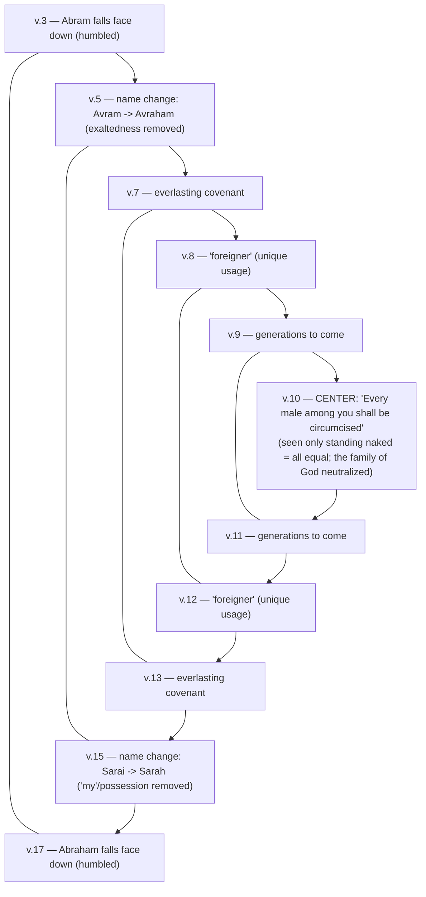

# Walking the Blood Path

BEMA 10 · Session 1
Source transcript: `~/workspace/bema/transcripts/1-10-walking-the-blood-path.md`
Book: Genesis (Genesis 15:1–21; Genesis 16 [summarized]; Genesis 17:1–21)

> Abram, a little cranky, demands collateral: "how can I know?" God answers with a betrothal — a **blood path covenant** — in which the lesser party is supposed to walk first. Abram won't put a toe in it, because he knows he'll fail. So God alone (the smoking firepot and flaming torch) walks the path *twice*, taking the penalty for both parties: "When you fail, Avram, I got you." The partnership is pure grace. Then, after the tragic consequences of Hagar and Ishmael, Genesis 17's chiasm shows God *sanctifying* that partner — removing exaltedness and possession, circumcising everyone equal before him, one mistake at a time.

## Key Lessons

- **Sometimes we want answers God won't give — because having them would wreck our story.** Marty: *"sometimes we think we want answers, but God doesn't want to give them to us... if we had them, we would screw our own story up just like Avram is going to."* God's silence (the repeated "and Abram said" with nothing between) is relational care, not aloofness.
- **The covenant is one-sided grace: God walks the blood path for both parties.** Abram realizes *"if I put my pinky toe in this blood path covenant, I am never going to be able to deliver... I'm going to fail."* So the presence of God passes through alone. Marty: *"I'm going to pay the price on your behalf. When you fail, I got you."* The gospel is already fully present in Genesis 15.
- **God has always been a God of grace — the "angry Old Testament God" is a misreading.** Marty: *"we're already running into the same grace-filled, Gospel-laden God... God didn't change later on... God has always been a God of grace... a God of forgiveness. This has always been who God was."*
- **Grace does not erase consequences.** Egypt came out *with* Abram — materially (goods, people like Hagar) and in his heart — and that becomes part of the story. Marty: *"there are consequences to our mistakes... It's not guilt... but our stories are tricky... and those consequences are real."* It will be "a whole lot harder to get Egypt out of his people than to get his people out of Egypt."
- **God grows a partner gradually — sanctification one story at a time.** Marty: *"He didn't demand this at the very beginning... He's slowly teaching them... slowly sanctifying them... making them into the people He wants them to be. One story, one mistake at a time."* The goal: a partner fit to bless *all nations*.
- **The Genesis 17 covenant dismantles the household power pyramid.** After Hagar's mistreatment, God removes "exaltedness" (Avram → Avraham) and "my/possession" (Sarai → Sarah), and circumcision — seen only when "standing naked" — equalizes everyone: *"we're all just people... we're going to equalize everybody in this family of God."*

## East/West Lens

- **Words (abstract definition vs. word-picture/idiom)** — "Count the stars" is read through the Hebrew word for *count* being close to *tell/recount*: God invites Abram to "tell that to the stars." Marty (via Elle): *"Go ahead and go tell that to the stars, Avram... Go think about my promise."*
- **Truth over time (static vs. dynamic/discovery)** — The chiasm is something the hosts (via Fohrman) *discover* on a second look: *"of course we have a chiasm here. And we probably should have caught it right from the very beginning."* Meaning emerges by rereading, not by being told up front.
- **Community vs. individual** — The covenant is about *families*, not kingdoms; the blood path is a betrothal between a patriarch and a bridegroom, and Genesis 17 reorders the whole *beit av* (slaves, servants, foreigners all circumcised). Marty: *"It's about families. It's about people, a father and a bridegroom."*
- **God's description (abstract attributes vs. concrete relationship)** — God is known by what he *does* in the story: he walks the path, he provides, he remembers. Marty: *"God made a promise to Avram to always provide... This is what we're asking God to remember."*
- **Truth (how/what vs. who/why)** — The hosts ask *why* God stays silent and *why* God removes pieces of names, rather than issuing propositional verdicts — reading character and intent, e.g., *"I hear God saying, 'We've got to do something... address this power pyramid abuse.'"*

## Recurring Through-lines

- **Trust the story (the Session 1 arc) — tested under pressure.** Abram's wrestling resolves into trust: after the "tell it to the stars" retreat, *"Avram believed the Lord and he credited it to Him as righteousness."* Marty: *"Avram... ends up going like, 'All right, God. All right. I'll believe this. I'll trust the story.'"* The whole session's partnership-through-trust arc runs straight through Genesis 15.
- **The evolving partnership between God and Abram.** Named at the top as the organizing thread. Brent: *"continuing our look at the evolving partnership between God and Avram."* Genesis 17 is explicitly God *shaping* the partner's character.
- **"Egypt gets inside you" — consequences of going down to Egypt.** The material-and-spiritual residue of Egypt (Hagar; Egyptian wealth; a divided heart) becomes a long-running problem for God's people. Marty: *"the thing that Egypt does to us is it gets inside of us... Avram's brought Egypt with him."* Forward-links to the Exodus.
- **The God who sees (Hagar) / God who hears the cry.** Introduced here as a theme to recur: *"'Okay, now I know that God sees me.' Which is going to be a big theme through the story of Genesis. The God who sees me."*
- **Altars/tents and mobility vs. towers and settling (Babel contrast).** Carried in from the review as the proof of Abram's character. Marty: *"he's the type of guy that will build altars and pitch tents rather than build towers and settle down."*

## Episode Flow

A walk through the whole episode in order, so every teaching point is covered. (A slide-driven episode; Brent notes the presentation and that one blood-path image "should pop up in your podcast app.")

1. **Review — where we are in the story.** Genesis 1–11 is the preface (origins/reframe); Genesis 12 onward is the introduction where "God finds a partner" willing to *trust the story*. Marty recaps Abram taking in the barren, orphaned niece Yiska. Marty: *"God... says, 'I need a partner.' And he partners with Avram... willing to give himself for the good of others."*
2. **Abram's character recapped.** He lets Lot pick the land, builds altars/pitches tents, "a little backwards from culture, but in all the right ways." Brent: *"he makes some pretty incredible choices to trust."*
3. **Gen 15:1 — "I am your shield, your very great reward."** Marty hears God almost "fist pumping": *"you're trusting the story. This is what the partnership looks like."*
4. **Gen 15:2–3 — Abram pushes back; the "and Abram said" silence.** The repeated speaker tag signals a break where **God says nothing** to "what reward?" (same device as Babel). The language sharpens: "I remain childless" → "you have given me no children... a servant."
5. **Gen 15:4–5 — God answers partially, then "tell it to the stars."** God promises a son "from your own body," then takes Abram outside — a "cosmological timeout" to recount his story and God's promise.
6. **Gen 15:6 — belief credited as righteousness.** The retreat gives "oomph" to the verse: Abram wrestles, then trusts. "A huge verse for us New Testament followers of Jesus."
7. **Gen 15:7–8 — Abram asks for collateral.** Still "a little cranky": *"how can I know that I will gain possession of it?"* Brent notes the Canaanites/Perizzites and warring kings make the doubt understandable.
8. **Gen 15:9–11 — the blood path set up.** God names the animals; Abram, uninstructed, immediately cuts them in half because he recognizes an ANE **betrothal (blood path) covenant**. Birds of prey gathering shows "these have been sitting there for a while."
9. **Who walks first?** The lesser party (the bridegroom) goes first; Abram realizes he must, and won't — *"Avraham ain't going nowhere"* — because he knows he'll fail to deliver.
10. **Gen 15:12 — deep sleep (tardemah).** Same Hebrew phrase as Adam when his partner was formed — "maybe the very first betrothal." Reinforces that this covenant *is* a betrothal.
11. **Gen 15:13–16 — the "weird paragraph" about 400 years in Egypt.** God names the coming consequence: Egypt is now part of the story (Abram "brought Egypt with him," including Hagar). Consequences are real but "it's not guilt."
12. **Gen 15:17–21 — God alone walks the path (twice).** Smoking firepot + flaming torch = the presence of God, passing through on Abram's behalf *and* his own: *"When you fail Avram, I got you."* Tied to the daily temple sacrifice ("God made a promise to always provide").
13. **Genesis 16 (summarized) — Hagar and Ishmael.** Abram and Sarai take the answer and "screw their own story up"; abuse of power erupts; Hagar flees; the angel draws out the promise until Hagar says, *"now I know that God sees me,"* and returns.
14. **Gen 17:1–21 — "walk before me faithfully and be blameless."** Heard in the context of Hagar's mistreatment: God moves to dismantle the household power pyramid.
15. **The Genesis 17 chiasm (via Fohrman).** Bookends: Abram falls face down (v.3) / Abraham falls face down (v.17); name changes (Avram→Avraham / Sarai→Sarah); everlasting covenant (v.7 / v.13); "foreigner" (v.8 / v.12); generations to come (v.9 / v.11); center = **"every male among you shall be circumcised"** (v.10).
16. **What the chiasm means.** Remove *exaltedness* (from Avram's name) and *possession* ("my" from Sarai's); circumcision is visible only "standing naked," where "we're all just people" — equalizing the family of God.
17. **Sanctification, slowly.** God adds "one more little wrinkle" each cycle of faithfulness/failure, shaping a partner to bless "all nations."
18. **Q&A on circumcision's origins.** African rites of passage (older males) vs. Egyptian priestly circumcision — which Abram/Sarai/Hagar may have encountered; possible "kingdom of priests" undertone. Resources named.

**Coverage check:** Both center texts (Gen 15 and Gen 17) are walked verse-block by verse-block; Genesis 16 is summarized as the hosts intended ("we're not going to read it all here"); the review framing, the "and Abram said" silence device, the "tell the stars" Hebrew teaching, the blood-path/betrothal mechanics and the lesser-party-goes-first point, the *tardemah* link to Adam, the 400-years-in-Egypt consequence, God walking the path twice, the temple-sacrifice tie-in, the Hagar "God sees me" theme, the full Genesis 17 chiasm with its center, the exaltedness/possession/equality readings, the gradual-sanctification lesson, and the closing circumcision-origins Q&A with resources are all covered. No teaching segment is left uncovered.

## Narrative Tensions

Each entry: surface problem, classification tag, cited quote, normalized verse citation + link, and resolution or open flag.

| Surface problem | Tag | Cited quote (speaker) | Verse citation + link | Resolution / status |
|---|---|---|---|---|
| God greets Abram warmly ("your very great reward") but then says *nothing* to his honest question. | `logic-gap` | Marty: *"Apparently God doesn't want to answer that question. Apparently God says nothing."* | [Genesis 15:1-3](https://www.biblegateway.com/passage/?search=Genesis%2015%3A1-3&version=NIV) | **Resolved (literary + theological):** The repeated "and Abram said" (same device as Babel) marks a silence; God withholds answers that would let Abram "screw his own story up." |
| God tells Abram to bring animals but never tells him to cut them up — Abram just starts cutting. | `unstated-cultural-assumption` | Brent: *"Avram's like, 'Okay,' and then he starts cutting them in half."* Marty: *"Did God tell him to cut anything up? No."* | [Genesis 15:9-10](https://www.biblegateway.com/passage/?search=Genesis%2015%3A9-10&version=NIV) | **Resolved (ANE context):** Abram recognizes a standard blood path / betrothal covenant and performs the known ritual without instruction. |
| Why does Abram set up the covenant and then not walk it (the birds of prey gather)? | `logic-gap` | Marty: *"Avraham ain't going nowhere. Because... if I put my pinky toe in this blood path covenant, I am never going to be able to deliver on my promise. I'm going to fail."* | [Genesis 15:11](https://www.biblegateway.com/passage/?search=Genesis%2015%3A11&version=NIV) | **Resolved:** As the lesser party he must go first, but he knows he cannot keep the covenant — so he waits; God resolves it by passing through alone. |
| God's long "400 years in Egypt" monologue feels out of place in a covenant-ratification scene. | `logic-gap` | Marty: *"it really is odd. It seems like it doesn't fit... why is God going into like..."* | [Genesis 15:13-16](https://www.biblegateway.com/passage/?search=Genesis%2015%3A13-16&version=NIV) | **Resolved (consequences theme):** Egypt "came out with" Abram; God names the real, coming consequences — Egypt is now part of the story (and of Hagar/Ishmael). |
| Who actually walks the blood path — and why does only one party pass through? | `logic-gap` | Marty: *"God walks through the blood path twice. God walks through on Avram's behalf and his behalf."* | [Genesis 15:17-18](https://www.biblegateway.com/passage/?search=Genesis%2015%3A17-18&version=NIV) | **Resolved (grace):** The smoking firepot + flaming torch = God's presence; God takes both parties' penalty: *"When you fail Avram, I got you."* |
| The Genesis 17 covenant text is maddeningly repetitive ("descendants after you... everlasting covenant..."). | `logic-gap` | Brent: *"you and your descendants after you and the covenants and blah blah blah."* | [Genesis 17:7-13](https://www.biblegateway.com/passage/?search=Genesis%2017%3A7-13&version=NIV) | **Resolved (chiasm):** The repetition is deliberate structure — a chiasm (via Fohrman) with circumcision at its center, like the Noah covenant chiasm. |
| Why change *both* names, and why these specific removals? | `translation-disagreement` | Marty: *"Avram... means exalted father... Avraham means father of many. So what got taken out of his name?"* Brent: *"The exaltedness."* | [Genesis 17:5](https://www.biblegateway.com/passage/?search=Genesis%2017%3A5&version=NIV) | **Resolved (Hebrew + Fohrman):** Removing "exalted" (Abram) and the possessive "my" (Sarai) dismantles the household power pyramid exposed by Hagar's mistreatment. |
| Why circumcision — and where did the idea even come from? | `unstated-cultural-assumption` | Brent: *"where did this idea even come from? Was that like a brand new idea?"* | [Genesis 17:9-14](https://www.biblegateway.com/passage/?search=Genesis%2017%3A9-14&version=NIV) | **Partially open:** The hosts offer options — African rites of passage; Egyptian *priestly* circumcision Abram/Sarai/Hagar may have known; a possible "kingdom of priests" undertone — but note "there's a lot we don't know." |

## Chiasms & Structure

The hosts (via Rabbi David Fohrman) lay out an explicit chiasm in **Genesis 17:1–21**. The bookends and matched pairs fold inward to a single center — "every male among you shall be circumcised" — and the removals along the way (exaltedness, possession) dismantle the household power pyramid exposed in Genesis 16.

Prose: Fohrman notes the repetition that made Brent's eyes glaze over is the tell — "of course we have a chiasm here." Reading inward, Abram is humbled (falls face down), his name loses its *exaltedness*, Sarai's name loses its possessive *my*, and the whole thing centers on circumcision — a mark visible only when "standing naked," where slave and patriarch look alike. The structure performs the theology: God is leveling the power pyramid that produced Hagar's abuse and shaping a just, equal partner.

(The hosts also flag a second, smaller structural echo: the Genesis 15 covenant mirrors a betrothal — the *tardemah* "deep sleep" ties it back to Adam's forming of his partner — but they do not lay this out as a formal chiasm.)

## Terminology

- **blood path covenant** — an ancient Near Eastern betrothal covenant: a heifer, goat, and ram (plus a dove and pigeon) are cut in half and arranged opposite each other so blood pools into a path between them; the parties walk it in white robes. Marty: *"an agreement between a greater party and a lesser party... It's about families... a father and a bridegroom."*
- **lesser party / greater party** — in the betrothal, the bridegroom (lesser) walks first because "the father has what the bridegroom wants"; the father (greater) follows. Each says, in effect, "if I don't deliver, you may do this in my blood."
- **"count the stars" / "tell"** — the Hebrew for *count* is etymologically close to *tell/recount*; a rabbinic reading hears God saying "go tell that to the stars." Marty: *"Go think about your story. Go think about my promise. Go tell that to the stars Avram."*
- **"and Abram said" (repeated tag)** — the same discourse device as the Tower of Babel: a repeated speaker tag signals a break in which the other party (here, God) said nothing. Marty: *"it means there's a break in the conversation."*
- **tardemah (deep sleep)** (תרדמה) — the same Hebrew phrase used of Adam when his partner was formed; here it frames the covenant as a betrothal. Marty: *"maybe the very first betrothal."*
- **smoking firepot + flaming torch** — smoke and fire symbolize the presence of God (cf. the desert pillars, Elijah, Isaiah 6); here God's presence passes through the blood path for both parties. Brent: *"the presence of God... smoke and fire."*
- **Avram → Avraham** (אברם / אברהם) — "exalted father" → "father of many"; the *exaltedness* is removed. Brent: *"The exaltedness."*
- **Sarai → Sarah** (שרי / שרה) — per rabbinic tradition "my princess" → "princess"; the possessive *my* is removed. Brent: *"The 'possession' part of it."*
- **beit av** (בית אב) — the patriarchal household; the "power pyramid" of slaves, servants, and foreigners that Genesis 17 reorders. Marty references "beit av, patriarchal dynamics" as the source of the Hagar conflict.
- **suzerain-vassal covenant** — a kingdom-level covenant (one king and a conquered people) that the hosts distinguish from the family-level blood path covenant. Marty: *"suzerain vassals, it's about kingdoms... A blood path covenant is a similar idea... but it's about families."*
- **"the God who sees me"** — Hagar's confession, flagged as a recurring Genesis theme. Marty: *"'now I know that God sees me.'"*

## Illustrations & Images

- **The blood-path presentation image.** Brent notes a specific image in the show notes/app depicting the halved animals arranged across a natural crevice so blood pools into a path. Brent: *"there is one image that will come a little bit later that... should pop up in your podcast app."*
- **"Cosmological timeout / personal retreat day."** Marty dramatizes "tell it to the stars" as God sending Abram out to recount his whole journey: *"a little personal retreat day... Go think about what you've been through."*
- **"God fist-pumping."** Marty imagines God's delight at Abram's trust in 15:1: *"I hear God like fist pumping as he, like, 'Yes!'"*
- **"If I put my pinky toe in this blood path..."** The vivid image of Abram refusing to step into the covenant he knows he'll break. Marty: *"Avraham ain't going nowhere."*
- **"Standing naked, we're all just people."** The chiasm's center made concrete — circumcision is noticed only when naked, where slave and patriarch are indistinguishable. Marty: *"we're all just people."*
- **"Get Egypt out of his people vs. his people out of Egypt."** A memorable inversion for the lingering grip of Egypt. Marty: *"a whole lot harder to get Egypt out of his people than to get his people out of Egypt."*

## References & Recommendations

- **Rabbi David Fohrman** (Aleph Beta) — source of the blood-path/betrothal reading of Genesis 15 and the Genesis 17 chiasm (name changes, exaltedness/possession removed, circumcision at the center, the "standing naked / all equal" point). Marty: *"something really interesting and peculiar here that I learned from Rabbi David Forman."*
- **Elle Grover Fricks** — the "count/tell the stars" Hebrew teaching. Marty: *"what I have learned from Elle as we've studied Hebrew together."*
- **_Epic of Eden_ by Sandra Richter** — evidence for circumcision in Egypt as a rite of passage done in large groups, contrasted with Israel's unique circumcision of eight-day-old infants. Brent: *"The Israelite practice of circumcision is unique in its practice of circumcising babies."*
- **George DeYoung — Under the Fig Tree** — ministry leading trips to Egypt; possible material on circumcision. Brent: *"He leads trips to Egypt. He might have some material on that."*
- **Anchor Bible Dictionary, Vol. 1** — article on circumcision by Robert G. Hall. Brent: *"there's an article by Robert G. Hall on circumcision."*
- **Wikipedia — history of male circumcision** — offered as an overview resource. Brent: *"might give you a little bit of an overview."*
- **The Samaritans** — cited as a people group still practicing blood-path-like covenants today. Marty: *"the Samaritans still have a similar practice even today."*

## Callbacks

- **Tower of Babel — the "and X said" silence device.** The repeated speaker tag with nothing between recurs from Babel. Marty: *"we saw this in the Tower of Babel episode where the people said stuff and then God said nothing."* (See `1-6-a-tale-of-a-tower.md`.)
- **Adam's "deep sleep" (tardemah).** The same Hebrew phrase links Genesis 15's covenant to the forming of Adam's partner — framing it as a betrothal. Marty: *"what happened while he was in a deep sleep?"* Brent: *"His partner was formed."*
- **Noah's covenant chiasm (rainbow and clouds).** The Genesis 17 repetition is matched to the Noah covenant's chiastic repetition. Marty: *"Sounds very reminiscent of when we were in Noah's story... That was a chiasm."* (See `1-4-his-bow-in-the-clouds.md`.)
- **Going down to Egypt (previous episode).** The Egypt consequence pays off the prior discussion of whether going to Egypt was wrong. Marty: *"this is last episode you said, is going down to Egypt necessarily a bad thing?"* (See `1-9-letting-go.md`.)
- **Altars/tents vs. towers (character review).** Abram's mobility over settling, carried in from the Babel contrast, is the proof of character that sets up Genesis 15. Marty: *"build altars and pitch tents rather than build towers and settle down."*
- **Forward-pointing nods.** "A huge verse for us New Testament followers" (Gen 15:6 → Galatians, "about 200 episodes from now"); the sacrifice of Isaac ("God made a promise to always provide"); and "the God who sees me" as a recurring Genesis theme.

## Discussion Questions

1. Marty argues God sometimes withholds answers because having them would let us "screw our own story up." When has an *unanswered* prayer or an unresolved question turned out to protect you? How do you tell the difference between God's silence and God's absence?
2. In the blood path covenant, the lesser party walks first — and Abram refuses because he knows he'll fail. Where do you hesitate to "step into" a commitment because you're sure you can't keep it? What changes if the covenant depends on God's faithfulness, not yours?
3. God walks the path for both parties: "When you fail, Avram, I got you." Where do you still live as if the covenant depends on your performance? What would it look like to trust that God has already walked it for you?
4. The hosts insist God "has always been a God of grace," correcting the "angry Old Testament God" caricature. Where did that caricature come from in your own formation, and how does Genesis 15 challenge it?
5. Grace didn't erase consequences — "Egypt came out with" Abram and shaped the Hagar tragedy. Hold these together: how do you receive forgiveness *and* take real responsibility for the fallout of your choices without collapsing into guilt?
6. The Genesis 17 chiasm removes "exaltedness" and "possession" and levels everyone through circumcision — "we're all just people." Where is there a "power pyramid" in a family, church, or workplace you're part of, and what would God's leveling look like there?
7. God shapes his partner "one story, one mistake at a time." What's the next "little wrinkle" you sense God adding to form your character — and are you willing to be sanctified gradually rather than all at once?

## Sources

- Transcript: `1-10-walking-the-blood-path.md`
- [Genesis 15:1-21 (NIV)](https://www.biblegateway.com/passage/?search=Genesis%2015%3A1-21&version=NIV)
- [Genesis 15:1-3 (NIV)](https://www.biblegateway.com/passage/?search=Genesis%2015%3A1-3&version=NIV)
- [Genesis 15:5-6 (NIV)](https://www.biblegateway.com/passage/?search=Genesis%2015%3A5-6&version=NIV)
- [Genesis 15:9-11 (NIV)](https://www.biblegateway.com/passage/?search=Genesis%2015%3A9-11&version=NIV)
- [Genesis 15:13-16 (NIV)](https://www.biblegateway.com/passage/?search=Genesis%2015%3A13-16&version=NIV)
- [Genesis 15:17-21 (NIV)](https://www.biblegateway.com/passage/?search=Genesis%2015%3A17-21&version=NIV)
- [Genesis 16 (NIV)](https://www.biblegateway.com/passage/?search=Genesis%2016&version=NIV)
- [Genesis 17:1-21 (NIV)](https://www.biblegateway.com/passage/?search=Genesis%2017%3A1-21&version=NIV)
- Referenced resources named in the episode (not web-fetched): Rabbi David Fohrman / Aleph Beta; Elle Grover Fricks (Hebrew teaching); Sandra Richter, *Epic of Eden*; George DeYoung, Under the Fig Tree; *Anchor Bible Dictionary*, Vol. 1 (Robert G. Hall on circumcision); Wikipedia, history of male circumcision; the Samaritans (contemporary covenant practice).
