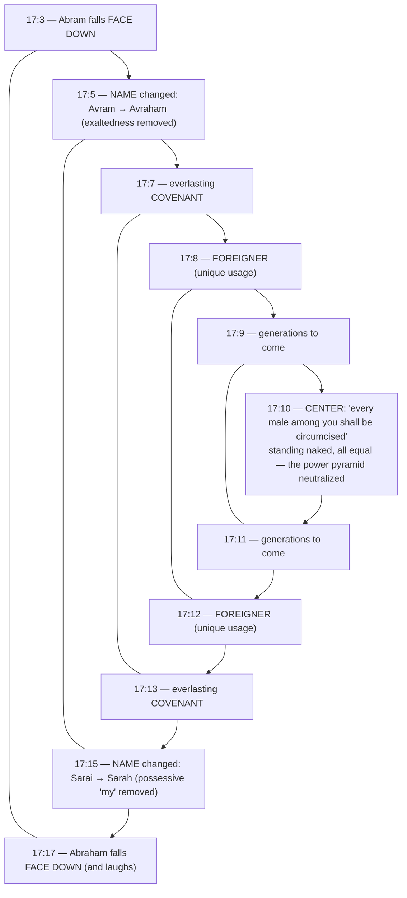

# Walking the Blood Path

BEMA 10 · Session 1
Source transcript: `~/workspace/bema/transcripts/1-walking-the-blood-path-10.md`
Book: Genesis (Genesis 15:1–21; 17:1–21; with Genesis 16 summarized)

> The covenant deepens. Abram wants collateral; God answers with a **blood-path (betrothal) covenant** — then walks it *alone*, taking Abram's share of the oath upon himself. The gospel of grace shows up in Genesis 15. Then, after the tragedy of Hagar, Genesis 17 reshapes the family: new names and circumcision strip away exaltedness, possession, and the household power pyramid.

## Key Lessons

- **God walks the blood path alone — "when you fail, I've got you."** Abram, the lesser party, can't put his "pinky toe" in because he knows he'll fail. So the smoking firepot and flaming torch (the presence of God) pass through for *both* parties. Marty: *"God walks through the blood path twice... I'm going to pay the price on your behalf. When you fail, Avram, I got you."* God's self-giving faithfulness is the fixed point of the whole arc.
- **The grace-filled God of Genesis 15 is the same God of the New Testament.** Marty: *"God didn't change later on in the story when he gets to the New Testament. God has always been a God of grace... a God of forgiveness."* This is the arc stated outright — **God does not change what he wants or what matters.**
- **Sometimes God withholds answers because having them would wreck our story.** When Abram demands answers, God is silent, then gives "a little" — and the next chapter (Hagar/Ishmael) shows Abram weaponizing that information into a plan that backfires. Marty: *"sometimes we think we want answers, but God doesn't want to give them to us... if we had them, we would screw our own story up."*
- **God sanctifies his partner gradually — one story, one failure at a time.** He didn't hand Abram Torah at Genesis 12. The renamings and circumcision in Genesis 17 come *after* Hagar's mistreatment, dismantling the household's abusive hierarchy. Marty: *"He's slowly teaching them... making them into the people He wants them to be. One story, one mistake at a time."*

## East/West Lens

- **Words (abstract definition vs word-picture/idiom)** — "Count the stars" plays on Hebrew *count ≈ tell/recount*; God invites Abram to "tell that to the stars" — recount his story. The repeated "and Abram said" again marks a conversational break (God's silence).
- **Numbers / symbol & name-meaning** — Names carry theology: **Avram** ("exalted father") → **Avraham** ("father of many") drops *exaltedness*; **Sarai** ("my princess/commander") → **Sarah** ("princess") drops the *possessive*.
- **Truth over time (static vs dynamic/discovery)** — Covenant and sign unfold progressively ("he didn't give them Torah in Genesis 12"); meaning is dug out via Fohrman's chiasm, not merely stated.
- **God's description (abstract attributes vs concrete relationship)** — God relates concretely through a betrothal-style covenant and meets Abram's crankiness in dialogue, rather than issuing abstract decrees.
- **Community vs individual** — Circumcision is a *communal*, equalizing sign; "standing naked, we're all just people" — slave or patriarch indistinguishable. The reform targets the whole *beit av*, not just an individual.

## Recurring Through-lines

- **Trust the story (the arc itself).** Abram "leans back into trusting the story," and the covenant itself is God underwriting the promise so Abram's inevitable failures don't end it. "Avram believed the Lord, and it was credited to him as righteousness" (15:6) is named as a huge trust-the-story moment. God's priorities (grace, faithfulness, blessing all nations) are constant. Recurs across the session; condensed at the Session 1 capstone (episode 32).
- **Sin as failing to master the animal instinct ("master the beast").** Present via Genesis 16: taking the withheld answer and forcing a plan (Hagar/Ishmael) is a failure to master grasping/control — and it breeds "power-pyramid" abuse. Genesis 17's reforms are God pulling the family back toward mastering that impulse. Same dynamic anchored in `1-master-the-beast-3.md`. Flag for cross-reference; do not re-explain there.
- **"Egypt gets inside you" (callback to episode 9).** Marty: *"Avram has brought Egypt with him... also brought Egypt with him in his heart."* Going down to Egypt wasn't the sin, but its consequences (Egyptian wealth, Egyptian Hagar) now shape the story — "harder to get Egypt out of his people than his people out of Egypt." Links to the Egypt descent of the prior episode.

## Narrative Tensions

Each entry: surface problem, classification tag, cited quote, normalized verse citation + link, and resolution or open flag.

| Surface problem | Tag | Cited quote (speaker) | Verse citation + link | Resolution / status |
|---|---|---|---|---|
| God says "I am your reward," but Abram pushes back — then God is silent to the "what reward?" question. | `logic-gap` | Marty: *"Apparently God doesn't want to answer that question. Apparently God says nothing."* | [Genesis 15:1-3](https://www.biblegateway.com/passage/?search=Genesis%2015%3A1-3&version=NIV) | **Resolved (Hebraic lens):** The repeated "and Abram said" marks God's deliberate silence — God withholds because the answer would be misused (Genesis 16). |
| God says "bring me a heifer, a goat..." but never says to cut them — yet Abram immediately cuts them in half. | `unstated-cultural-assumption` | Marty: *"Did God tell him to cut anything up?" Brent: "No!"* | [Genesis 15:9-10](https://www.biblegateway.com/passage/?search=Genesis%2015%3A9-10&version=NIV) | **Resolved (ANE context):** Abram recognizes the setup of a **blood-path betrothal covenant** and acts on the known ritual. |
| Who walks the blood path? The expected party (Abram, the lesser) never does. | `logic-gap` | Marty: *"Avraham ain't going nowhere... if I put my pinky toe in this blood path... I'm going to fail."* | [Genesis 15:12-17](https://www.biblegateway.com/passage/?search=Genesis%2015%3A12-17&version=NIV) | **Resolved (Hebraic lens):** God (firepot + torch) walks it for *both* parties — grace: God takes Abram's oath-penalty on himself. |
| Why the sudden, out-of-place monologue about 400 years of enslavement? | `logic-gap` | Marty: *"a really weird paragraph... it really is odd. It seems like it doesn't fit."* | [Genesis 15:13-16](https://www.biblegateway.com/passage/?search=Genesis%2015%3A13-16&version=NIV) | **Resolved (interpretive):** Consequences — Abram "brought Egypt with him"; the coming Egypt entanglement is now part of the story God must work out. |
| Why would God require circumcision — and why is *that* the center of Genesis 17? | `unstated-cultural-assumption` | Marty: *"where's the only time you're going to notice somebody's circumcision? If they're standing naked."* | [Genesis 17:10-14](https://www.biblegateway.com/passage/?search=Genesis%2017%3A10-14&version=NIV) | **Resolved (Hebraic/Fohrman):** A communal, equalizing sign that neutralizes the household power pyramid (slave vs. patriarch) exposed by Hagar's abuse. |
| Where did circumcision even come from — was it brand new? | `unstated-cultural-assumption` | Brent: *"where did this idea even come from?"* | [Genesis 17:1-14](https://www.biblegateway.com/passage/?search=Genesis%2017%3A1-14&version=NIV) | **Open / partially resolved:** Known in some African cultures (rite of passage) and in Egypt (tied to priesthood); Israel's uniqueness is infant (8th-day) circumcision — possibly hinting a "kingdom of priests." Hosts leave the origin partly open. |

## Chiasms & Structure

Two explicit structures. **(1)** The **blood-path covenant** itself (Genesis 15): paired halves of animals with a blood path between, and the stunning inversion of ritual expectation — God walks it alone. **(2)** The **Genesis 17 chiasm** (via Fohrman), centered on circumcision, framing the dismantling of the family's power pyramid.

Prose: The bookends (face-down, name-change, everlasting covenant, foreigner, generations) mirror around circumcision. The two renamings each *subtract* something — Abram's "exalted," Sarah's possessive "my" — enacting on the family what circumcision pictures: no exalted patriarch, no human possessions, everyone equal before God. God is re-forming his partner's household toward justice after Hagar.

## Terminology

- **"count the stars" / "tell"** — Hebrew *count* is etymologically near *to tell/recount*; a rabbinic reading hears "tell that to the stars." Marty (via Elle): *"the word for count... is very closely connected to the word to tell, to recount."*
- **"and Abram said" (repeated)** — discourse device marking a break with nothing in between — God's silence to the "what reward?" question.
- **tardemah / deep sleep** — the same phrase used of Adam when his partner was formed, framing the covenant as a betrothal. Marty: *"maybe the very first betrothal."*
- **Avram → Avraham** — "exalted father" → "father of many"; *exaltedness* removed.
- **Sarai → Sarah** — "my princess/commander" → "princess"; the possessive *my* removed.
- **blood path covenant** — an ANE betrothal covenant: a heifer, goat, ram, dove, and pigeon cut in half with a blood path between; the lesser party (bridegroom) normally walks it first. Marty: *"an Eastern way of saying, 'If I don't take care of your daughter, you may do this in my blood.'"* Here God alone passes through — the firepot and torch, "the presence of God."

## Discussion Questions

1. God walks the blood path alone, taking Abram's half of the oath. How does "when you fail, I've got you" reshape the way you understand covenant — and your own failures?
2. The hosts say God sometimes withholds answers because having them would wreck our story (Abram → Hagar). Where have you demanded an answer that, in hindsight, you're glad you didn't get — or got and misused?
3. "Harder to get Egypt out of his people than his people out of Egypt." What "Egypt" did you carry out of a hard season that still shapes you?
4. Genesis 17 strips "exalted" from Abram's name and "my" (possession) from Sarah's, and makes circumcision a leveling sign. Where might God be dismantling a hierarchy or sense of ownership in your own household or community?
5. God sanctifies gradually — "one story, one mistake at a time," never dumping all of Torah at once. How does that change your expectations of your own growth (and your patience with others')?
6. Abram "believed the Lord, and it was credited as righteousness" only *after* wrestling, demanding, and being met. What does it look like to arrive at trust *through* the arguing rather than instead of it?

## Sources

- Transcript: `1-walking-the-blood-path-10.md`
- [Genesis 15:1-21 (NIV)](https://www.biblegateway.com/passage/?search=Genesis%2015%3A1-21&version=NIV)
- [Genesis 15:1-3 (NIV)](https://www.biblegateway.com/passage/?search=Genesis%2015%3A1-3&version=NIV)
- [Genesis 15:9-10 (NIV)](https://www.biblegateway.com/passage/?search=Genesis%2015%3A9-10&version=NIV)
- [Genesis 15:12-17 (NIV)](https://www.biblegateway.com/passage/?search=Genesis%2015%3A12-17&version=NIV)
- [Genesis 16 (Hagar, NIV)](https://www.biblegateway.com/passage/?search=Genesis%2016&version=NIV)
- [Genesis 17:1-21 (NIV)](https://www.biblegateway.com/passage/?search=Genesis%2017%3A1-21&version=NIV)
- Referenced resources named in the episode (not web-fetched): Rabbi David Fohrman / Aleph Beta (blood-path reading; Genesis 17 chiasm); Elle Grover Fricks ("count/tell the stars"); Sandra Richter, *Epic of Eden* (circumcision in Egypt); George DeYoung, Under the Fig Tree; *Anchor Bible Dictionary* Vol. 1, Robert G. Hall article on circumcision; Wikipedia "history of male circumcision" (named as an overview).
