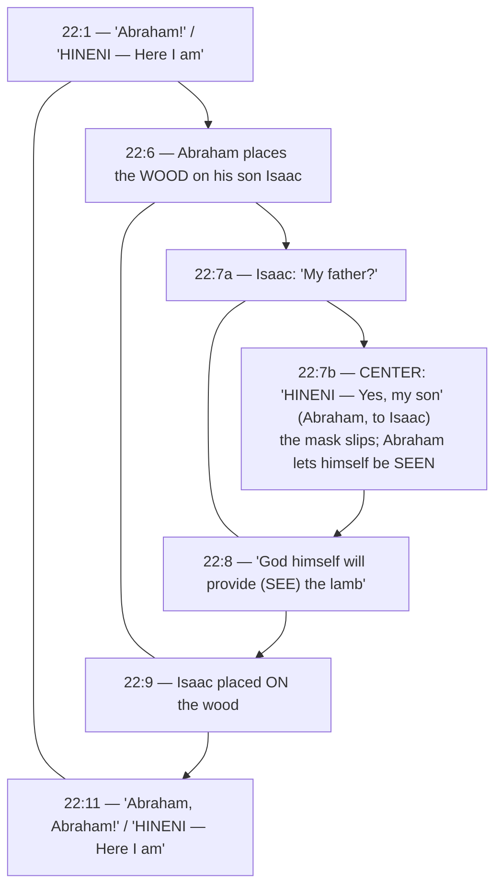

# Here I Am

BEMA 11 · Session 1
Source transcript: `~/workspace/bema/transcripts/1-11-here-i-am.md`
Book: Genesis (Genesis 18:1–15; 21:1–21; 22:1–14; with Genesis 19–20 summarized)

> A huge sweep of the Abraham story in one episode: the radical Eastern hospitality at Mamre, Abraham's *chutzpah* bartering over Sodom, the births and partings of Isaac and Ishmael, and the Akedah (binding of Isaac). Rabbi Fohrman's reading of the deliberately-paralleled Hagar (Gen 21) and Isaac (Gen 22) stories, and the thrice-repeated **Hineni ("Here I am")** chiasm, reveal a God who sees, who provides, and who will *not abandon* — and a partner, Abraham, who learns to be *seen* rather than to run and mask.

## Key Lessons

- **God is looking for a partner with *chutzpah*, not blind obedience.** When God announces judgment on Sodom, Abraham argues him down from fifty to ten. Marty: *"Avraham has this chutzpah to stand with God face to face on a hillside and say, 'No, you can't do that.'... what is it that God really wants from us? Does He just want like blind obedience, or does he want somebody that's going to lean in, have a little grit in their teeth."* God *leans into* the engager — this is the family trait of the whole arc.
- **The God we meet here is a "Gospel God" — grace, forgiveness, meeting us where we're at.** Marty: *"the same God of the Gospel of the New Testament is the same God we're seeing in the stories of Avraham... I call it a Gospel God."* The arc stated outright: God does not change what he wants.
- **The core of the Akedah is a *Hineni* God who will not abandon.** The chiasm's center is Abraham's "Here I am" to his son. Marty: *"we see a Hineni God, a God that says, 'When you need me, no matter what your circumstances, here I am.'"* God's final lesson: *"I'm not the God that's going to leave. I'm not the God that's going to ask for your firstborn son. I'm not like the other gods."*
- **Redemption is the willingness to *be seen* — especially inside trauma.** Josh: *"Avraham is willing to stand there and be seen... he has no moral defense here... even in that moment of powerlessness and, you know, right in the center of his trauma, he's willing to be seen, and that is such a vulnerable place."* Contrasted with Hagar, who "couldn't bear to be seen" and created distance.
- **Abraham has learned to *see others*.** Marty: *"Avram has learned his character to see others. Not perfectly, but he's learned how to see others... that's what we see here in the story of the Akedah."*
- **Our traumas and tragedies shape us — they are not abstract events in a vacuum.** On Ishmael the archer and his mother sitting "a bow shot" away: Marty: *"the traumas and the tragedies that we've been through end up... they're a part of our stories... These are things that deeply shape us, scar us, hurt us, enable us, empower us."*

## East/West Lens

- **Community / hospitality (collective honor vs individual convenience)** — The Eastern "premium on hospitality" drives the whole Mamre scene; a man recovering from circumcision *hurries* to serve strangers. Marty: *"In the Eastern world, there is this unbelievable premium on hospitality."* Illustrated by Bedouin Hadija and the Turkish honey-cakes.
- **Words (word-pictures, puns, sound-play vs abstract definitions)** — Meaning rides on Hebrew sound and root: *seah* ↔ "say a little"; "see / appear / afraid" share sound; Isaac (*yitzhak*) and Ishmael's "mocking" are the same root (*tsakhak*, laughter); "they went on together" is *echad*, "one."
- **Truth over time (dynamic discovery vs static statement)** — Abraham only gradually "becomes aware" the visitor is the LORD; the names *lord / God / LORD* track that discovery. Marty: *"there comes a point in the story where he becomes aware."*
- **Text as treasure dug out via literary device** — The Hagar/Isaac parallels and the Genesis 22 chiasm must be *excavated* (Fohrman). Marty: *"if we want to find a treasure buried, we will often look for literary devices."*
- **God's description (concrete relationship vs abstract attributes)** — God is named by concrete action in-story: "the God who sees me," "The LORD Will Provide" — where "provide" is literally the word *see*. Josh: *"the word there for 'find' is the word 'see.' God will see the lamb that he wants."*
- **Descriptive, not prescriptive** — The hard episodes (Genesis 20 deception; sending Hagar away) are not models to copy. Marty: *"the story that's not always prescriptive, but descriptive."*

## Recurring Through-lines

- **Trust the story (the arc itself).** Abraham keeps "trusting" through loss he was often called into; on Moriah "he's way out on a ledge of faith, and he is trusting that God is not actually asking this from him" (Josh). The recap frames the whole episode as the ongoing question, "Is he going to keep trusting?" — the backbone of Session 1.
- **The God who sees / being seen (session motif).** Explicitly named as "a theme." Marty: *"part of trusting the story is really truly believing that God sees us."* Runs from Hagar's "the God who sees me" through the Mamre see/appear/fear wordplay to "The LORD will provide" (= *see*). The episode's climactic reading is "the willingness to be seen."
- **Chutzpah — the family of God argues face-to-face.** Named as "an element and a component of the character of the family of God that we're going to see in multiple people." Abraham over Sodom is the anchor instance; its *apparent absence* at the Akedah is the episode's central tension.
- **Partnership / God sanctifying his partner gradually (Session 1 arc = partnership).** The recap: "God is expecting that this relationship is progressing... He takes them further into righteousness and justice." Abraham is "not a pure hero," a "messy faith, just like your faith."
- **"Master the beast" / insulator–assimilator–engager.** Via the Noah/Lot/Abraham typology: Lot "the assimilator" bows but won't look like a freak; Noah "the insulator"; Abraham "the engager" who stands and argues. Flag for cross-reference to `1-3-master-the-beast.md` and Session 6 Episode 210; do not re-explain there.
- **Laughter (Isaac) as a thread that can be told with a "good eye" or an "evil eye."** Sarah reframes her laughter redemptively in Genesis 21. Marty: *"she's figured out how to frame her story the way that she thinks God's inviting her to frame her story... she's told it with a good eye."*

## Narrative Tensions

Each entry: surface problem, classification tag, cited quote, normalized verse citation + link, and resolution or open flag.

| Surface problem | Tag | Cited quote (speaker) | Verse citation + link | Resolution / status |
|---|---|---|---|---|
| Why bake ~60 lbs of flour (≈80 loaves) and slaughter a calf for three passing strangers? | `unstated-cultural-assumption` | Marty: *"Feels like enough for three visitors... but maybe he did need 80 loaves of bread."* | [Genesis 18:6-8](https://www.biblegateway.com/passage/?search=Genesis%2018%3A6-8&version=NIV) | **Resolved (Eastern hospitality):** radical hospitality — "say a little, do a lot"; Jewish tradition even reads Sarah's baking as a miracle. |
| Why does the promised bread never actually appear in the story? | `logic-gap` | Josh: *"there's a question later of why the bread never comes out, which is explained if it's only Sarai making it."* | [Genesis 18:6-10](https://www.biblegateway.com/passage/?search=Genesis%2018%3A6-10&version=NIV) | **Resolved (Midrash, offered not endorsed):** rabbis say Sarah's menstrual cycle (cf. v.11) interrupted the baking. |
| Why is Sarah *afraid* when caught laughing? | `unstated-cultural-assumption` | Josh: *"the word for to be afraid sounds identical to the word for see... God has just struck at like her core insecurity."* | [Genesis 18:12-15](https://www.biblegateway.com/passage/?search=Genesis%2018%3A12-15&version=NIV) | **Resolved (Hebraic wordplay):** see/appear/fear sound-play — Sarah is "seen" at her core; ties to the God-who-sees motif. |
| God is about to "obliterate" Sodom — can God do that? | `theodicy / logic-gap` | Marty: *"Avraham engages with God... 'No, you can't do that.'"* | [Genesis 18:16-33](https://www.biblegateway.com/passage/?search=Genesis%2018%3A16-33&version=NIV) | **Open / deferred:** the three "stories of wrath" (flood, Sodom, Exodus) are flagged for a later dedicated treatment; here the point is Abraham's *chutzpah*. |
| God tells Abraham to drive out Hagar and Ishmael — and Abraham obeys. | `moral-problem` | Marty: *"this woman and her son are sent packing at God's discretion... it's a problem in the story."* | [Genesis 21:9-14](https://www.biblegateway.com/passage/?search=Genesis%2021%3A9-14&version=NIV) | **Open (named, not smoothed over):** hosts refuse a clean answer; only comfort is God's "I got them" — a nation promised. |
| The text never names Ishmael — only "the son of Hagar" / "the boy." | `logic-gap` | Josh: *"It never calls him Ishmael. It's so strange."* | [Genesis 21:9-21](https://www.biblegateway.com/passage/?search=Genesis%2021%3A9-21&version=NIV) | **Resolved (literary):** shifts the "center of gravity" onto *Hagar*, setting up her juxtaposition with Abraham. |
| Hagar "puts the boy under a bush" and is carried on her shoulder — yet Ishmael is ~13. | `contradiction / time-jump` | Marty: *"when I heard this story, I pictured a baby. I picture an infant."* | [Genesis 21:14-16](https://www.biblegateway.com/passage/?search=Genesis%2021%3A14-16&version=NIV) | **Resolved (literary signal):** ages are "moved" so Gen 21 and Gen 22 sit side-by-side as parallels; also pictures Ishmael's dependence/proxy of his mother. |
| God commands child sacrifice — "the perfect example of what's wrong with religion." | `moral-problem` | Marty: *"a story of God asking you to kill your son and a father willing to kill your son. This is what's wrong with religion."* | [Genesis 22:1-2](https://www.biblegateway.com/passage/?search=Genesis%2022%3A1-2&version=NIV) | **Resolved (lean-in reading):** the text *wants* the problem felt; in Abraham's world child sacrifice was "a very normal command," so the subversion is the point. |
| God says "your only son" — but Abraham has Ishmael, whom he loves. | `contradiction` | Josh: *"he has more than one son... Something weird going on here."* | [Genesis 22:2](https://www.biblegateway.com/passage/?search=Genesis%2022%3A2&version=NIV) | **Open flag:** "something weird going on in their communication" — left as a genuine puzzle. |
| Where is Abraham's *chutzpah*? He bargained for Sodom but is silent about his own son. | `logic-gap` | Josh: *"Where's this chutzpah now?... that's kind of crazy."* | [Genesis 22:1-10](https://www.biblegateway.com/passage/?search=Genesis%2022%3A1-10&version=NIV) | **Resolved (Midrash + chiasm):** the three-day walk read as protest ("the long way around"); Abraham reasons (per Hebrews) God will raise Isaac — his character shows in *not deserting*. |
| A one-day walk takes three days. | `time-jump` | Marty: *"that walk should have taken one day. And it says it takes him three days."* | [Genesis 22:3-4](https://www.biblegateway.com/passage/?search=Genesis%2022%3A4&version=NIV) | **Resolved (Midrash):** Abraham "walked the long way around... almost as an act of protest" — possibly around the Dead Sea (linking back to Sodom). |

## Chiasms & Structure

Two deliberate structures. **(1)** The **Hagar (Gen 21) ↔ Isaac (Gen 22) parallel panels** — the hosts walk a slide of matched phrases juxtaposing the two stories on purpose. **(2)** The **Genesis 22 *Hineni* chiasm** (via Fohrman), whose center is Abraham's "Here I am" to Isaac.

**The parallel panels (Marty, from the presentation):**

| Hagar (Genesis 21) | Isaac (Genesis 22) |
|---|---|
| 21:14a "early the next morning" | 22:3 "early the next morning" |
| 21:14b supplies set on Hagar's shoulders | 22:6 wood set on Isaac's shoulders |
| 21:15 puts the boy *under* brush | 22:9 puts the boy *on/over* brush |
| 21:19 Hagar *looks up* to see a well | 22:13 Abraham *looks up* to see a ram |
| 21:22-34 ends with a covenant (Beersheba) | 22 ends with a covenant |

Marty: *"These stories are meant to be put next to each other. They are parallel stories that were supposed to... be juxtaposing Hagar and Avraham."*

**The Genesis 22 chiasm:**

Prose: *Hineni* bookends the account (to God) and sits at its very center (to Isaac). Fohrman's reading: Abraham is "masking" on the way up — distracting, avoiding — until Isaac *interrupts* ("Father?") and Abraham is confronted. His answer, *Hineni*, is the hinge: he refuses to run, flee, or desert. Where Hagar *abandons* her son under a bush, Abraham will *not* abandon — and "they went on together" is the stronger Hebrew *echad*, "as one." Josh: *"it is, in fact, Hineni."* Marty: *"Avraham is not going to abandon... in that we see the character of God, a God who's not going to abandon us in our moment of greatest need."*

## Terminology

- **seah** (סאה) — a measure of flour (commonly ~20 lbs); "three seahs" ≈ 60 lbs ≈ ~80 loaves. Marty's pun: "say a little" ↔ *seah*. Josh: *"'say a little, do a lot.'"*
- **"to appear / to see" ↔ "to fear"** — running sound-play across Genesis 18–22: God "appears" (is seen), Abraham sees, "afraid" sounds like "see." Josh: *"the word for to be afraid sounds identical to the word for see."*
- **chutzpah** — "guts / fire in the belly / moxie"; the family-of-God trait of arguing face-to-face with God. Marty: *"a Hebrew word that means guts... fire in your belly."* (Josh: *"Moxie."*)
- **Isaac / Yitzhak** (יצחק) ↔ **tsakhak** (צחק) — "laughter"; Isaac is named for laughter; Ishmael's "mocking" (21:9) is the same root. Josh: *"the word there for mocking is the same word for laughter."*
- **Hineni** (הנני) — "Here I am / Behold me"; a statement of presence and attention. Marty: *"'Behold me, here I am. I'm here. I'm at attention. I'm at the ready.'"* Josh: *"there is a looking quality to that... a behold see me."* Echoed (per Marty) in Isaiah, Moses at the burning bush, and Jesus.
- **echad** (אחד) — "one"; "the two of them went on together" is literally "they went on together *as one*." Josh: *"It's the word echad, 'one.'... 'They went on together as one.'"*
- **"The LORD Will Provide" (provide = see)** — the name Abraham gives the place; "provide" is the word *see*. Josh: *"the word there for 'find' is the word 'see.' God will see the lamb that he wants."*
- **insulator / assimilator / engager** — Jewish typology: Noah insulates ("man in the fur coat"), Lot assimilates (sits in the city gates, bows but won't "look like a freak"), Abraham engages (argues on the hillside). Marty: *"He's the assimilator... Avraham... He's the engager."*

## Illustrations & Stories

- **Bedouin hospitality near Tel Arad (Hadija).** Marty's firsthand trip with Ray Vander Laan: a Muslim Bedouin village sends small children out to greet 54 strangers; Hadija bakes bread and brews honey tea until supplies run out; her dream is *"Salam"* — peace, "that we could all do this... forever in eternity." Ray: the village would "lay down their life on behalf of us as visitors." Illustrates the Eastern "premium on hospitality" behind Genesis 18.
- **Turkish honey-cakes during Ramadan.** A woman making "elephant ear" honey cakes to break her family's fast runs out to hand them to 50 passing Americans she hadn't even seen, then goes back to make more. A Muslim friend's explanation: *"Because we're all children of Abraham. And Abraham changed this corner of the world."*
- **The dad who distracts his child.** Josh's reading of masking: a parent distracts a child when he "can't fix a problem... I'm going to have to do something that my son is going to hate" — illuminating Abraham's hard, "being seen when you are not up to the task" walk up Moriah.
- **Starting therapy / counseling.** Marty likens Abraham's willingness to be seen to "the challenge of going to therapy... you're trying to open yourself up to be seen, to start a healing process."
- **Ishmael the archer and the "bow shot."** Hagar sits "a bow shot away"; Ishmael grows up an archer. Josh: *"he's used to the thing he wants being way far away"*; Marty: traumas "deeply shape our story."

## References

- **Rabbi David Fohrman** (Aleph Beta) — the deliberate Hagar/Isaac parallel panels; the Genesis 22 *Hineni* chiasm; the "masking vs. being seen" reading; the three-day walk as protest. Marty: *"You can hear Rabbi Foreman teach on this at Aleph Beta."*
- **Ray Vander Laan** — Marty's field experiences of Bedouin hospitality (Hadija near Tel Arad).
- **Book of Hebrews (11:17-19)** — alluded to: Abraham reasoned God could raise Isaac from the dead. Marty: *"if we believe Hebrews is inspired, this is what Avraham was thinking."*
- **BEMA Session 6, "The Man in the Fur Coat" (Episode 210)** — the Midrash framing Noah "insulator," Lot "assimilator," Abraham "engager." (Marty offers a conditional "hall pass" to listen ahead.)
- **Jewish Midrash / rabbinic tradition** — the miraculous bread; the menstrual-cycle reading of the missing bread; the long-way-around protest walk; "say a little, do a lot."

## Callbacks & Cross-References

- **Recap of Genesis 1–11 preface and Abram's call** (prior episodes) — "eleven chapters of just, 'Hey, everything is good... Trust me,'" and Abram "willing to set his insecurity aside... to the benefit of others."
- **The blood-path covenant and gradual sanctification** (`1-10-walking-the-blood-path.md`) — "God makes a blood path covenant... God is expecting that this relationship is progressing."
- **Mistreatment of Hagar** (prior episode) — "the dysfunction continues with the mistreatment of Hagar... God meets him there."
- **"The God who sees me" (Hagar)** — explicitly recalled: *"We've already seen Hagar say, 'The God who sees me.' This is a theme."*
- **Tower of Babel** (`1-6-a-tale-of-a-tower.md`) — Marty, on functioning out of insecurity: *"like the Tower of Babel, like the last time we had Josh on."*
- **The three "stories of wrath" (flood, Sodom, Exodus)** — flagged forward for a dedicated later treatment; Sodom and Gomorrah deferred here.
- **Jesus' "before Abraham was, I am"** — Marty's forward link: *"before Abraham decided to be present on the mountain, I was present on the mountain"* and the garden arrest ("Hineni").

## Discussion Questions

1. God argues *with* Abraham over Sodom and seems to *want* the pushback. Where in your life have you offered God "chutzpah" — and where have you defaulted to silent, "blind" compliance instead?
2. The episode's climax is Abraham's willingness to *be seen* in the middle of his trauma, contrasted with Hagar creating distance. Where are you more like Hagar (running, masking) and where are you learning to be seen?
3. The hosts refuse to tidy up the hardest problems — the expulsion of Hagar and the command to sacrifice Isaac. What is gained by letting a biblical "problem" stay a problem rather than explaining it away?
4. "The LORD will provide" is literally "the LORD will *see*." How does imagining a God who *sees* you (rather than merely supplies you) change the way you pray in a crisis?
5. Sarah reframes her laughter "with a good eye" in Genesis 21. Is there a painful chapter of your story you could learn to *tell* differently without lying about it?
6. Abraham "went on together as one" (*echad*) with Isaac only *after* letting his son see him unsure and vulnerable. Where might honesty about your own uncertainty actually deepen — rather than fracture — a relationship?

## Sources

- Transcript: `1-11-here-i-am.md`
- [Genesis 18:1-15 (NIV)](https://www.biblegateway.com/passage/?search=Genesis%2018%3A1-15&version=NIV)
- [Genesis 18:16-33 — Abraham bargains for Sodom (NIV)](https://www.biblegateway.com/passage/?search=Genesis%2018%3A16-33&version=NIV)
- [Genesis 19 — Sodom and Lot (NIV)](https://www.biblegateway.com/passage/?search=Genesis%2019&version=NIV)
- [Genesis 20 — Abraham and Abimelech (NIV)](https://www.biblegateway.com/passage/?search=Genesis%2020&version=NIV)
- [Genesis 21:1-21 (NIV)](https://www.biblegateway.com/passage/?search=Genesis%2021%3A1-21&version=NIV)
- [Genesis 22:1-14 (NIV)](https://www.biblegateway.com/passage/?search=Genesis%2022%3A1-14&version=NIV)
- [Hebrews 11:17-19 (NIV)](https://www.biblegateway.com/passage/?search=Hebrews%2011%3A17-19&version=NIV)
- Referenced resources named in the episode (not web-fetched): Rabbi David Fohrman / Aleph Beta (Hagar/Isaac parallels; Genesis 22 *Hineni* chiasm; masking-vs-seen; protest-walk); Ray Vander Laan (Bedouin hospitality field teaching); BEMA Session 6, Episode 210, "The Man in the Fur Coat" (insulator/assimilator/engager Midrash).
