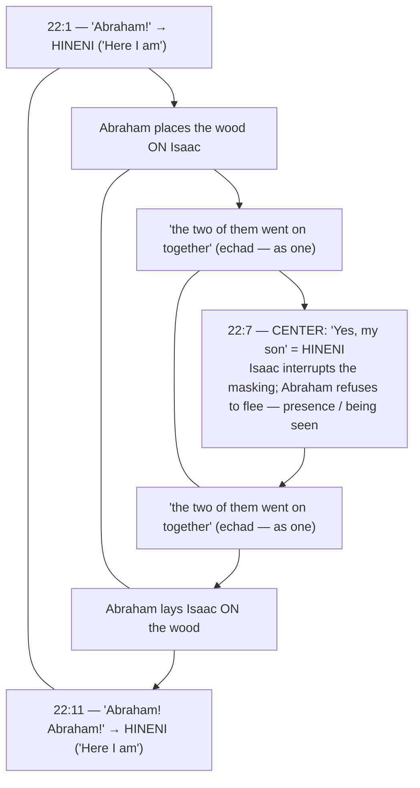

# Here I Am

BEMA 11 · Session 1
Source transcript: `~/workspace/bema/transcripts/1-here-i-am-11.md`
Book: Genesis (Genesis 18:1–15; 21:1–21; 22:1–14; with Genesis 18–20 summarized)
Guest: Josh Bossé (BEMA teaching team; Impact campus ministry)

> A sweeping episode covering Abraham's hospitality to three visitors, the bargaining over Sodom, the birth of Isaac, the sending-away of Hagar and Ishmael, and the climactic Akedah (binding of Isaac). The hosts read the Akedah through a chiasm centered on **Hineni** ("Here I am") — Abraham's refusal to abandon, mirroring a God who is present, who *sees*, and who provides.

## Key Lessons

- **God is a *Hineni* God — present, not abandoning, in our moment of greatest need.** The Akedah's center word is *Hineni* ("Here I am"), and the lesson of the chiasm is that Abraham, unlike Hagar, "is not going to abandon." Marty: *"We see a Hineni God, a God that says, 'When you need me, no matter what your circumstances, here I am.'"* God's constancy — presence and provision — is the arc's heartbeat; Marty even traces *Hineni* to Isaiah, the burning bush, and Jesus.
- **Being seen — and willing to be seen — is the thread of redemption.** From Hagar's "the God who sees me" to Abraham's "God will *see/provide* the lamb," the running wordplay on *see/appear/fear* culminates in Abraham letting Isaac see him vulnerable. Josh: *"his willingness to be seen... that is such a vulnerable place."* To trust the story is to believe God truly sees us.
- **God wants a partner with *chutzpah*, not blind obedience.** Abraham bargains God down over Sodom (50 → 10). Marty: *"Does He just want blind obedience, or does he want somebody that's going to lean in, have a little grit... God seems to be leaning into that."* The family of God is defined as *engagers* — contrasted with Noah the "insulator" and Lot the "assimilator."
- **Hospitality is the Eastern premium — "say a little, do a lot."** Abraham, recovering from circumcision, hurries to serve three strangers 60 pounds of flour (~80 loaves) after offering "a little bread." Josh: the rabbis say *"Say a little, do a lot."* Marty's Bedouin stories (Hadija; Ramadan honey cakes) ground this as a living reality — and tie Jew, Christian, and Muslim back to "father Abraham."

## East/West Lens

- **Words (word-picture/idiom & wordplay)** — The *see/appear/fear* cluster drives the chapters: God "appears" (is seen), Abraham "sees," "afraid" echoes "see." Josh: *"the word for to be afraid sounds identical to the word for see."* Also *tsakhak* (laughter) linking Isaac's name and Ishmael's "mocking."
- **Numbers / symbol** — "Three seahs" (~60 lbs) is a lavish symbol of hospitality ("say a little, do a lot"); the thrice-repeated *Hineni* structures the chiasm.
- **Community vs individual** — Hospitality and "going on together as *echad* (one)" are communal values; Abraham's vulnerability keeps Isaac walking *with* him, modeling how "we bring community... even in the midst of chaotic and testing moments."
- **Truth (how/what vs who/why)** — The hosts refuse to flatten the Akedah ("what's wrong with religion") and instead ask *why* — reading it against Abraham's known character rather than taking it at surface. Marty: *"those are problems... the Text is wanting us to lean in."*
- **God's description (abstract attributes vs concrete relationship)** — God is revealed as the one who *sees*, *provides*, and *stays present* — concrete relational names ("The LORD provides"), not abstract attributes.
- **Truth over time (static vs dynamic/discovery)** — Midrash (the three-day protest walk; raising-from-the-dead reasoning via Hebrews) and the chiasm teach by discovery.

## Recurring Through-lines

- **Trust the story (the arc itself).** Abraham's whole posture — hospitality, chutzpah, and finally *Hineni* on the mountain — is trust lived out, believing "God will see us... and that will be enough." The grace-filled "Gospel God" is explicitly the same God throughout: God does not change what he wants or what matters. Recurs across the session; condensed at the Session 1 capstone (episode 32).
- **Sin as failing to master the animal instinct ("master the beast").** Present by contrast and by its cost: the Hagar/Ishmael dysfunction (sending them away; the "son of Hagar" never named; mocking as inherited "poison") shows un-mastered family fear metastasizing, while Abraham masters fight-or-flight on the mountain by staying. Same dynamic anchored in `1-master-the-beast-3.md`. Flag for cross-reference; do not re-explain there.
- **"The God who sees me" (callback to Hagar, episode 10).** The seeing-theme returns and deepens here, binding Hagar's and Abraham's stories together.

## Narrative Tensions

Each entry: surface problem, classification tag, cited quote, normalized verse citation + link, and resolution or open flag.

| Surface problem | Tag | Cited quote (speaker) | Verse citation + link | Resolution / status |
|---|---|---|---|---|
| Abraham offers "a little bread," then produces ~60 lbs of flour / ~80 loaves for three guests. | `unstated-cultural-assumption` | Marty: *"that's 60 pounds of flour... 80 loaves... enough for three visitors?"* | [Genesis 18:1-8](https://www.biblegateway.com/passage/?search=Genesis%2018%3A1-8&version=NIV) | **Resolved (Eastern hospitality):** The excess *is* the point — "say a little, do a lot"; radical hospitality is the premium. |
| The promised bread never actually reaches the visitors. | `logic-gap` | Josh: *"there's a question later of why the bread never comes out, which is explained if it's only Sarai making it."* | [Genesis 18:6](https://www.biblegateway.com/passage/?search=Genesis%2018%3A6&version=NIV) | **Resolved (Midrash):** Rabbinic reading — Sarah alone was making it and was interrupted (menstrual-purity tradition). (Offered as Midrash, not fact.) |
| Where is Abraham's chutzpah at the Akedah? He bargained hard for Sodom but is silent about his own son. | `logic-gap` | Josh: *"Where's this chutzpah now?... of all the things to not stop God on, your only child."* | [Genesis 22:1-3](https://www.biblegateway.com/passage/?search=Genesis%2022%3A1-3&version=NIV) | **Resolved (Midrash/character):** The three-day walk (the long way, "almost as an act of protest") *is* his pushback; and per Hebrews he reasoned God would raise Isaac. |
| God calls Isaac Abraham's "only son" — but Ishmael exists and is loved. | `contradiction` | Josh: *"he has more than one son... Something weird going on here."* | [Genesis 22:2](https://www.biblegateway.com/passage/?search=Genesis%2022%3A2&version=NIV) | **Open — dance with it:** The hosts flag "something weird going on in their communication" without a clean resolution. |
| Ishmael is never named in Genesis 21 — only "the son of Hagar" / "the boy." | `logic-gap` | Josh: *"It doesn't say his name, never... It's so strange."* | [Genesis 21:9-14](https://www.biblegateway.com/passage/?search=Genesis%2021%3A9-14&version=NIV) | **Resolved (interpretive):** The naming shifts the center of gravity onto *Hagar*; the dysfunction is "coming out of" the boy as a proxy for his mother. |
| God tells Abraham to *send Hagar and Ishmael away* to near-death — morally disturbing. | `unstated-cultural-assumption` | Marty: *"this is one of the trickiest, stickiest problems in Torah... God just sent Hagar away."* | [Genesis 21:10-14](https://www.biblegateway.com/passage/?search=Genesis%2021%3A10-14&version=NIV) | **Open — dance with it:** Marty: *"I don't necessarily have this wonderful, amazing, clean, beautiful..."* — he refuses to paper over it; only "at least God says, I got them." |
| Hagar lays a ~13-year-old "boy" under a bush like an infant. | `logic-gap` | Marty: *"is that how you picture... I pictured a baby."* | [Genesis 21:14-16](https://www.biblegateway.com/passage/?search=Genesis%2021%3A14-16&version=NIV) | **Resolved (interpretive):** Reads as Ishmael's dependence/proxy status (carried "on her shoulder") rather than literal infancy. |
| Isn't the Akedah proof that religion commands evil (a father willing to kill his son)? | `unstated-cultural-assumption` | Marty: *"this story is the perfect example of what's wrong with religion."* | [Genesis 22:1-14](https://www.biblegateway.com/passage/?search=Genesis%2022%3A1-14&version=NIV) | **Resolved (Hebraic lens):** Read against Abraham's character and his world (surrounding peoples demanded child sacrifice); the lesson is a *Hineni*, non-abandoning God who does *not* want the firstborn — "I'm not like the other gods." |

## Chiasms & Structure

Two explicit structures. **(1)** A deliberate **parallel panel** between the Hagar story (Gen 21) and the Isaac/Akedah story (Gen 22): "early the next morning," supplies on the shoulder, the boy under/over brush, "looked up" to see (a well / a ram), each ending in a covenant. **(2)** The **Genesis 22 chiasm** (via Fohrman) centered on *Hineni*.

Prose: *Hineni* appears at the start, center, and end — a frame of presence. The center ("Yes, my son") is the moment Isaac interrupts Abraham's "masking," and Abraham chooses to stay and be seen rather than flee (fight-or-flight). Against the Hagar panel — where she sets her son down and withdraws "a bowshot away" — Abraham's refusal to abandon reveals the character of a *Hineni*, non-abandoning God. The Hagar/Isaac juxtaposition is deliberate authorial structure, not accident.

## Terminology

- **seah** (סאה) — a measure of flour (~20 lbs); "three seahs" ≈ 60 lbs ≈ ~80 loaves. Marty's pun: "say a little" ↔ *seah*.
- **"see / appear / fear"** — a running wordplay: God "appears" (is seen), Abraham "sees," "afraid" sounds like "see." Josh: *"the word for to be afraid sounds identical to the word for see."*
- **chutzpah** — "guts / nerve / fire in the belly"; the family of God's willingness to argue with God face-to-face. Marty: *"Avraham has this chutzpah to stand with God face to face on a hillside and say, 'No, you can't do that.'"*
- **Yitzhak / tsakhak** (יצחק / צחק) — Isaac / "laughter"; Isaac is named for laughter, and Ishmael's "mocking" (21:9) is the same root.
- **Hineni** (הנני) — "Here I am / Behold me"; the Akedah chiasm's framing and center word — presence and willingness to be seen. Marty traces it to Isaiah, the burning bush, and Jesus.
- **echad** (אחד) — "one"; "they went on together" reads as "as one." Josh: *"They went on together as one."*
- **insulator / assimilator / engager** — the Midrashic trio: Noah (insulator, "man in the fur coat"), Lot (assimilator, sits in Sodom's gates), Abraham (engager, bargains with God).

## Discussion Questions

1. The Akedah centers on *Hineni* — "Here I am." Where in your life is God asking you to be *present* and willing to be *seen*, rather than to fix or control the outcome?
2. Josh describes Abraham "masking" on the walk up the mountain and then dropping the mask when Isaac interrupts. When have you let someone see you "just figuring it out" — and what did staying (rather than fleeing) make possible?
3. God seems to *want* Abraham's chutzpah over Sodom. How do you tell the difference between faithful arguing-with-God and faithless rebellion? Where might God be inviting your pushback?
4. The hosts refuse to tidy up the sending-away of Hagar and Ishmael, calling it "deeply dysfunctional" and leaving it a problem. What's a biblical (or personal) story you're tempted to resolve too quickly — and can you "dance with it" instead?
5. "The God who sees me" runs from Hagar to Abraham. Do you actually believe God sees *you*? What changes when you do?
6. Marty's Bedouin hosts served everything they had to strangers and wished only for *salam*. What would "say a little, do a lot" hospitality cost you — and what might it heal?

## Sources

- Transcript: `1-here-i-am-11.md`
- [Genesis 18:1-15 (NIV)](https://www.biblegateway.com/passage/?search=Genesis%2018%3A1-15&version=NIV)
- [Genesis 18:1-8 (NIV)](https://www.biblegateway.com/passage/?search=Genesis%2018%3A1-8&version=NIV)
- [Genesis 18:16-33 (Sodom bargaining, NIV)](https://www.biblegateway.com/passage/?search=Genesis%2018%3A16-33&version=NIV)
- [Genesis 21:1-21 (NIV)](https://www.biblegateway.com/passage/?search=Genesis%2021%3A1-21&version=NIV)
- [Genesis 22:1-14 (NIV)](https://www.biblegateway.com/passage/?search=Genesis%2022%3A1-14&version=NIV)
- Referenced resources named in the episode (not web-fetched): Rabbi David Fohrman / Aleph Beta (Hagar/Isaac parallels; *Hineni* chiasm; masking reading; protest walk); Ray Vander Laan (Bedouin hospitality field experiences); Hebrews 11:17-19 (Abraham reasoned God could raise Isaac); BEMA Session 6 Episode 210 "The Man in the Fur Coat" (insulator/assimilator/engager).
