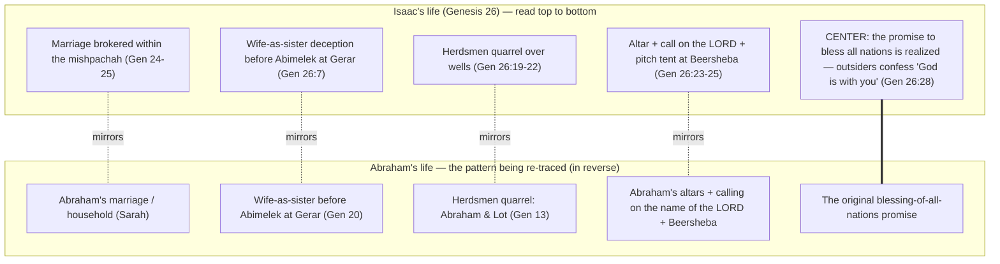

# A Mission Realized

BEMA 12 · Session 1
Source transcript: `transcripts/1-12-a-mission-realized.md`

## Key Lessons

- **The promise does not die with the one who received it — Isaac is "the generation that *kept* the mission and the promise."** Marty: *"It was one thing to be Abraham and be the one who received the mission and the promise, but Isaac was the generation that kept the mission and the promise."* This is the arc in miniature — **trust the story; God does not change what he wants or what matters.** What God wanted through Abraham (bless all nations, bring shalom) is the same thing he wants through Isaac. The mission is handed down, not reinvented.

- **God's priorities are constant across the generations — he reiterates and even expands the same promise to Isaac that he gave to Abraham.** Marty: *"This was the promise I made. This is the covenant that I'm working through. This is what I was going to do through your dad, and now I'm going to do through you."* God's desire never shifts between patriarchs (Genesis 26:2-5).

- **The mission is "realized" when outsiders see God in the way the family lives.** The chapter opens with Isaac being expelled (*"Move away from us. You have become too powerful for us"*) and closes with those same outsiders confessing, in Marty's framing, *"We see that God was with you."* The blessing-of-all-nations promise (the thing God has wanted since Abraham) becomes visible precisely because Isaac lives it out (Genesis 26:28).

- **Faithfulness is a radically material, physical thing — dirt, sweat, blood, and wells — not an abstract "saving of souls."** Marty: *"This is very material, physical shalom. This isn't spiritual realities... their souls are being saved because of the physical story that they're participating in."* God's constant concern is embodied shalom, worked out in ordinary labor and relationships.

- **The patriarchs repeat the sins AND the victories of their parents — and that is comforting, not disqualifying.** Marty: *"how many of us repeat the same sins of our parents... it's baked into our own spiritual DNA. And the same is true for these biblical characters."* The story is honest about human frailty while God stays faithful to the same purpose.

## East/West Lens

- **Community vs individual** — The whole betrothal hinges on *beit av* and *mishpachah*, not on an individual's romantic preference. Marty: *"The mishpucha in the Hebrew concept is the larger extended family. The beit av is your father's house."* Eliezer must find a wife from within the extended kin because identity and calling are corporate, not individual.

- **Faith (relational / experiential) over faith (intellectual / proof-text)** — Eliezer's confidence rests on watched experience and testimony, not doctrine. Marty: *"I have watched my master's house. I've watched who he is. I've watched his character and integrity... She's got to have the same spiritual DNA."* Faith here is relational formation passed through a family, not a creed.

- **Truth (religious & experiential — who/why) over truth (rational & scientific — how/what)** — The outsiders don't argue God's existence or attributes; they report an experience of him in Isaac's conduct. Marty paraphrases: *"We have seen that God is at work with you... We see God and we see God is with you."* Truth is encountered in lived relationship, not demonstrated by argument.

- **Words as word-pictures/story over abstract definitions** — The oath is a concrete gesture, not an abstract legal clause. Marty: *"you would usually do that by holding onto the covenant... swear by this thing, this agreement that we have with God, the people that we are."* The promise is embodied in an image (hand under the thigh / sign of the covenant).

## Recurring Through-lines

- **Trust the story (the arc itself).** Named and central this episode: God's covenant purpose is identical from Abraham to Isaac, down to the repeated language of altar-building and calling on the name of the LORD at Beersheba. Marty: *"That is absolutely Abraham language. We are literally walking back through the life of Abraham in Isaac's life."* God does not change what he wants or what matters — the single clearest demonstration of the arc so far in the session. This through-line recurs across the whole corpus; here it appears as a literal generational re-tracing of the father's story.

- *(Note: "Sin as failing to master the animal instinct" — the master-the-beast motif anchored in episode `1-3-master-the-beast.md` — is not explicitly engaged in this episode. Isaac's repetition of his father's deception is named as inherited human frailty but is not framed in the beast/instinct language, so it is not claimed here.)*

## Narrative Tensions

| Surface problem | Tag | Cited quote (speaker) | Verse citation + link | Resolution / status |
|---|---|---|---|---|
| An oath is sworn by one man putting his "hand under the thigh" of another — bizarre and faintly sexual to modern ears. | `unstated-cultural-assumption` | Brent: *"Yeah, what is the 'hand under the thigh' business? It's a strange phrase."* | Genesis 24:2 — https://www.biblegateway.com/passage/?search=Genesis%2024%3A2&version=NIV | **Resolved (Hebraic lens):** ancient oaths were sworn on the sign of a covenant; Abraham's covenant sign is circumcision, and thigh/feet are euphemisms for the groin. Marty: *"swear by this thing, this agreement that we have with God."* The gesture is a word-picture of covenant, not a sexualized act. |
| Isaac does the *exact* same wife-as-sister deception his father did — the narrative seems to just repeat an earlier story. | `contradiction` | Marty: *"He didn't go down to Egypt, but he still got... he still did what his father did. He's the same as his father. He's also different."* | Genesis 26:7 — https://www.biblegateway.com/passage/?search=Genesis%2026%3A7&version=NIV | **Resolved (Hebraic lens):** the repetition is intentional literary design — Isaac's life is deliberately "walking backwards" through Abraham's. It signals that the patriarchs inherit both sins and faith; the point is generational continuity, not a copy-paste error. |
| Is it the *same* Abimelek as in Abraham's day (Genesis 20), or a different king? The text is ambiguous. | `logic-gap` | Marty: *"it could be different guys. I'm not trying to say it's the exact same guy. But we're likely working with the same family, if not even the same exact guy."* | Genesis 20 — https://www.biblegateway.com/passage/?search=Genesis%2020&version=NIV ; Genesis 26:1 — https://www.biblegateway.com/passage/?search=Genesis%2026%3A1&version=NIV | **Open — dance with it.** The hosts note "Abimelek" means "my father is king," so it may be a dynastic title/descendant rather than one individual. They decline to resolve it; the text leaves it open. |
| Isaac keeps digging wells and keeps surrendering them without a fight — looks like passive weakness. | `unstated-cultural-assumption` | Marty: *"He doesn't fight back. He doesn't fight for his own rights. He submits and he blesses those that don't even deserve it. He dies to himself."* | Genesis 26:17-22 — https://www.biblegateway.com/passage/?search=Genesis%2026%3A17-22&version=NIV | **Resolved (Hebraic lens):** this is not doormat passivity but a *missional* choice — laying down rights to bless all nations, prefiguring what Jesus teaches. Marty: *"This is a missional choice that Isaac is making... This isn't Isaac letting himself be abused."* |
| The quarreling herdsmen episode feels like a stray detail dropped into Isaac's story. | `logic-gap` | Marty: *"Have we heard that before, Brent? ... Abraham and Lot... that whole story was all about the herdsmen quarreling."* | Genesis 13 — https://www.biblegateway.com/passage/?search=Genesis%2013&version=NIV | **Resolved (Hebraic lens):** it is a deliberate echo of the Abraham–Lot herdsmen quarrel; part of the pattern of Isaac's life re-tracing his father's, reinforcing the "trust the story" arc. |

## Chiasms & Structure

The hosts describe Isaac's narrative as a deliberate **reverse re-tracing of Abraham's life** — "walking backwards through the life of his father." This mirrored structure (Isaac's events line up with Abraham's in reverse order, converging on the shared promise of blessing) can be rendered as a mirror:

Prose: Marty traces Isaac's episodes and matches each to an earlier Abraham episode in reverse sequence — Genesis 20 (Abimelek) → Genesis 13 (herdsmen) → Beersheba altar language — until the sequence lands back on the foundational promise that opened Abraham's story: blessing all nations. The convergence point ("CENTER") is the *realization* of that promise when the outsiders declare God is with Isaac. This is a loosely-described mirrored structure, not labeled a "chiasm" by the hosts, but clearly center-weighted on the restated promise.

## Terminology

- **beit av** (בית אב) — "house of the father"; the immediate household, still large (brothers, nephews, servants). Marty: *"the beit av, the house of the father. It's the physical house that you live in."*
- **mishpachah / mishpucha** (משפחה) — the larger extended family/kin beyond the immediate *beit av*. Marty: *"The mishpucha in the Hebrew concept is the larger extended family... the house of Terah ends up becoming the larger mishpucha."* Eliezer must find Isaac's wife within this wider kin.
- **"hand under the thigh"** — an ancient covenant-oath gesture; swearing by the sign of the covenant (circumcision), thigh/feet as euphemism for the groin. Marty: *"swear by the covenant, swear by this thing, this agreement that we have with God, the people that we are."* (Brent's gloss: a "pinky promise.")
- **seah / "measures"** (hospitality marker) — recalled from Abraham's hospitality (the "60 pounds of flour" for the three visitors). Here the family's "spiritual DNA" of radical hospitality is the test Eliezer prays for: Rebekah's voluntary watering of ten camels (10-20 cistern trips each). Marty: *"He's asking for somebody who's committed to hospitality... that same kind of care for the stranger and the outsider."*

## Discussion Questions

1. Marty calls Isaac "the generation that *kept* the mission and the promise." Where in your own life or community are you a *keeper* rather than an *originator* of something God started before you — and what does faithfully "keeping" it ask of you?
2. Eliezer prays for a specific *kind* of person — one marked by radical hospitality — rather than specific features. What does it say about God's constant priorities that the test of a worthy partner is generosity to a stranger? How would that test land in your own circles today?
3. Isaac surrenders well after well without fighting, and the hosts insist this is a missional choice, not doormat passivity. Where is the line for you between laying down your rights to bless others and simply being taken advantage of? How do you tell the difference?
4. The outsiders move from "get out of here" to "we see that God is with you" purely because of how Isaac lived. What would it take for the people outside your community to say the same — and are we more tempted toward the "culture war" posture Marty critiques?
5. The patriarchs repeat the sins of their parents even while keeping the mission. What "inherited" patterns show up in your own spiritual DNA, and how does the honesty of these stories change the way you carry them?

## Sources

- Transcript: `1-12-a-mission-realized.md`
- Genesis 24:2 — https://www.biblegateway.com/passage/?search=Genesis%2024%3A2&version=NIV
- Genesis 26:1 — https://www.biblegateway.com/passage/?search=Genesis%2026%3A1&version=NIV
- Genesis 26:2-5 — https://www.biblegateway.com/passage/?search=Genesis%2026%3A2-5&version=NIV
- Genesis 26:7 — https://www.biblegateway.com/passage/?search=Genesis%2026%3A7&version=NIV
- Genesis 26:17-22 — https://www.biblegateway.com/passage/?search=Genesis%2026%3A17-22&version=NIV
- Genesis 26:23-25 — https://www.biblegateway.com/passage/?search=Genesis%2026%3A23-25&version=NIV
- Genesis 26:28 — https://www.biblegateway.com/passage/?search=Genesis%2026%3A28&version=NIV
- Genesis 20 — https://www.biblegateway.com/passage/?search=Genesis%2020&version=NIV
- Genesis 13 — https://www.biblegateway.com/passage/?search=Genesis%2013&version=NIV
- Hebrews 11 — https://www.biblegateway.com/passage/?search=Hebrews%2011&version=NIV
