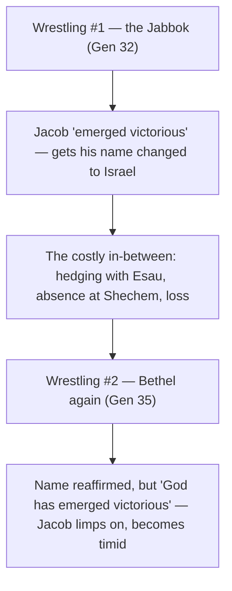

# Grappling with God, Part 2

BEMA 14 · Session 1
Source transcript: `~/workspace/bema/transcripts/1-14-grappling-with-god-part-2.md`
Book: Genesis (Genesis 32–35; close readings of 32:22–32; 33:1–17; 34:25–29; 35:1–20)
Guest: Reed Dent (BEMA teaching team; campus minister)

> Part two of the two-part Jacob survey. The man who "wasn't ready to wrestle yet" is finally left *alone* and wrestles until daybreak, emerging as **Israel** — the limping, renamed namesake of God's whole people. The hosts refuse a tidy "changed man" ending: Jacob reconciles with Esau, then keeps hedging, fails at Shechem, and loses Rachel. The driving claim: God loves **chutzpah**, but unchecked chutzpah is dangerous — "I wonder sometimes if Jacob ruined Jacob."

## Key Lessons

- **Transformation comes only when you're left *alone* with no deal to cut.** The wrestling begins the moment Jacob has nothing to hide behind. Reed: *"I love that it starts with, 'And Jacob was left alone.'... he has left alone with none of that, and it is just him being forced to struggle and wrestle."* The lifelong deceiver who always deployed his *beit av* as a shield or wheeled-and-dealed a bargain finally has neither.
- **God doesn't come to argue; he comes to wrestle.** With Jacob, God skips the battle of wits his whole life ran on. Reed (quoting Gandalf): *"'I didn't pass through fire and death to bandy crooked words with a witless worm.'... God is like, 'Okay, enough talk. Let's fight.'... no deception, no trickery... a test of your will and your endurance."* The one who built his life on words is met with something words can't win.
- **The wrestle is a lifetime, not a one-time victory.** Faith is an ongoing grapple, not a conclusion you reach and defend. Reed, on the man who wanted to preach "the exact same sermon with the exact same beliefs and confidence" in 25 years: *"where is the wrestling in that?... either you've gone limp... or... you think you have triumphed over God... It's a lifetime of wrestling that we're called to."* Marty makes it the whole BEMA posture: *"if I ever stop asking 'What if?', if I ever stop wrestling, abandon what we're doing here."*
- **Renewal is honest self-confrontation.** Jacob, who "spent his whole story lying essentially about who he was," finally answers the name question truthfully. Marty: *"now, in this key moment, he's just given up that fight and he's ready to just come to grips with his actual identity. And this ends up becoming the defining story for God's people."* Naming yourself truly ("Jacob" / heel-grasper) is the precondition for being renamed.
- **A name change isn't a magic reset — Jacob still isn't "there yet."** After Peniel and the tearful reunion, Jacob hedges with Esau, is absent/self-centered at Shechem, and the arc keeps going. Marty: *"Jacob's not done. He hasn't arrived. He's not this beautifully changed man."* And: *"these biblical characters, they're not just a light switch... God starts to change us. But we still are doing all kinds of stuff that doesn't read well."*
- **God loves your chutzpah — but unchecked, it costs.** Marty's closing reflection: *"God loves it. Just make sure you submit it to God because sometimes it can cause us all great pain. Unchecked chutzpah can have deep consequences."* He reads the once-bold Jacob collapsing into "this timid old man" and wonders: *"I don't think that God ruined Jacob. I wonder sometimes if Jacob ruined Jacob."*

## East/West Lens

- **Words / name-meaning & power** — Of everything to foreground mid-wrestle, the Text fixates on *names*. Marty: *"names in the Hebrew have unbelievable power. They define... you find your identity in your name... you were really picking a name to really prayerfully define... who this kid was going to be."* He mirrors it in naming his own children (Abigail Adaiah, Ezekiel Jacob). Jacob is literally forced to speak his own name before it can change.
- **Truth over time (static vs dynamic/discovery)** — Hebraic faith unfolds through struggle rather than freezing into certainty. Reed: *"It's a lifetime of wrestling that we're called to."* The Western impulse to "figure it out" and preach the identical sermon for 25 years is named as the failure mode.
- **Mystery / who-and-why over what-and-how** — The identity of the "man" is deliberately left unresolved; the hosts don't try to pin the mechanics. Marty (as Jacob): *"'Was it a man? Was it the angel of the Lord? Was it God? Was it a demon? I don't even know, but what I really did was I wrestled with God tonight.'"* The point is *whom* he met, not *what* it technically was.
- **Face / presence** — "Face" (Peniel) carries covenantal weight: to see a face is to encounter presence. Jacob to Esau: *"'to see your face is like seeing the face of God.'"* Marty connects it to the Midrash that the night's opponent was "the spirit of Esau."
- **Community vs individual (and the beit av)** — Esau's 400 men are read through the growing *beit av* / *mishpucha*, not as a plot number alone. Marty: *"he forfeited all of his... the Midrash teaches how much Jacob forfeited his inheritance. So now Esau inherited all of whatever that household was, all 318 that have been passed down."*
- **Blame & reflection over time** — The Hebrew "to my sorrow" can mean "my fault," opening a reading of Jacob's self-examination late in life. Marty: *"that Hebrew phrase to my sorrow could also be understood my fault... Jacob takes this blame on himself"* for Rachel's death, recalling his own rash curse over Laban's idols.

## Recurring Through-lines

- **Trust the story (the arc itself).** The episode is the hinge of the Jacob arc: the undeserving "mess" God kept showing up for is finally transformed through a wrestling he can't scheme his way out of — yet the arc refuses a clean resolution, trusting the messy, ongoing story over a tidy conversion. Marty: *"this ends up becoming the defining story for God's people."*
- **Master the beast / unmastered instinct.** Jacob's fire was always real but *unmastered*; here it is finally gripped by God, yet the lesson lands as warning — *"Unchecked chutzpah can have deep consequences... I wonder sometimes if Jacob ruined Jacob."* The same failure-to-master-the-animal dynamic anchored earlier in the session; flag for cross-reference, do not re-explain.
- **Chutzpah (callback to Abraham).** Jacob's defining trait is the same "fire in the belly" named in Abraham. Marty: *"God loves chutzpah... Loves the fire... And God loves your chutzpah. All of you Jacobs listening to this podcast."* Here the arc shows chutzpah being both why God chose him *and* what can wreck him.
- **Partnership (Session 1's overarching arc).** The whole review frames Genesis 12–50 as God finding and forming a *partner* — "the family of God." The Jabbok is where that partner receives the covenant name (Israel) the nation will carry. Marty: *"this is what God wants to partner with."*
- **Be fruitful and multiply → more children → tragedy → blame (callback to Adam/Eve, Noah).** Marty names the recurring Genesis pattern explicitly: *"We've heard that command with Adam and Eve... with Noah. Now we hear it again... I might be expecting more children... but we also might be expecting tragedy... somebody is going to get blamed."* Rachel's death and Ben-Oni/Benjamin complete the pattern.

## Narrative Tensions

Each entry: surface problem, classification tag, cited quote, normalized verse citation + link, and resolution or open flag.

| Surface problem | Tag | Cited quote (speaker) | Verse citation + link | Resolution / status |
|---|---|---|---|---|
| Why does Esau come with *400 men* — and why that number? | `unstated-cultural-assumption` | Brent: *"Abraham went and like saved Lot with 318 very specifically... here Esau is coming with even more than that."* | [Genesis 32:6](https://www.biblegateway.com/passage/?search=Genesis%2032%3A6&version=NIV) | **Resolved (cultural):** Jacob forfeited his inheritance when he fled; Esau inherited the whole growing *beit av* ("all 318... plus any other servants... born within that beit av"), so the larger number fits. |
| Jacob schemes a survival split, *then* prays for rescue — isn't that contradictory? | `logic-gap` | Reed: *"he's like, scheming this plan... That way, if somebody dies, only half of them will die. And then he's like, 'Oh, and by the way, please don't let anything bad happen to us.'"* | [Genesis 32:7-12](https://www.biblegateway.com/passage/?search=Genesis%2032%3A7-12&version=NIV) | **Open — dance with it:** Named as "funny" and characteristic of Jacob (cf. *Uncut Gems*); left as a portrait of a schemer, not resolved. |
| Who is the "man"? He appears from nowhere and refuses to be named. | `logic-gap` | Reed: *"This guy just shows up out of nowhere... totally unintroduced... why does this character want to remain anonymous?"* | [Genesis 32:24-29](https://www.biblegateway.com/passage/?search=Genesis%2032%3A24-29&version=NIV) | **Resolved (interpretive/mystery):** Identity left open on purpose; Jacob's own verdict is "I wrestled with God." Midrash: "the spirit of Esau." |
| A near-touch dislocates the hip — too easy for a wrestling match. | `logic-gap` | Reed (via Alter): *"it's not like a violent kind of... he just barely, almost barely touches him... so it's like a little bit miraculous."* | [Genesis 32:25](https://www.biblegateway.com/passage/?search=Genesis%2032%3A25&version=NIV) | **Resolved (interpretive):** Read as deliberately "miraculous," signaling the opponent is more than a man. |
| The man seems to be winning (hip out of socket), yet *he* begs to be released. | `logic-gap` | Reed: *"the very next line, the man is asking Jacob, let me go. So what gives? I thought Jacob was actually the wounded powerless one."* | [Genesis 32:25-26](https://www.biblegateway.com/passage/?search=Genesis%2032%3A25-26&version=NIV) | **Open — dance with it:** Flagged as a genuine puzzle; the paradox (wounded yet prevailing) is left to sit. |
| Why would Jacob even think to demand a *blessing* here? | `logic-gap` | Reed: *"how or why does Jacob think to ask for a blessing here?... is Jacob looking for a blessing from anything in the story at this point."* | [Genesis 32:26](https://www.biblegateway.com/passage/?search=Genesis%2032%3A26&version=NIV) | **Open — dance with it:** Raised as strange; no firm answer given beyond the arc's blessing-hunger. |
| "To see your face is like seeing the face of God" — odd thing to say to Esau. | `unstated-cultural-assumption` | Marty: *"I wonder if this gives credence to the midrash that Reed pointed out, that what he was really wrestling with was Esau."* | [Genesis 33:10](https://www.biblegateway.com/passage/?search=Genesis%2033%3A10&version=NIV) | **Resolved (interpretive):** The "face" echo (Peniel → Esau's face) is read as support for the "spirit of Esau" Midrash. |
| Did *both* brothers weep, or only Esau? | `translation-disagreement` | Brent: *"the NET translates it, 'then they both wept'... NIV says, 'they wept.'"*; Reed (Alter): *"the plural vav... is a scribal error... Esau alone weeps, Jacob remaining impassive."* | [Genesis 33:4](https://www.biblegateway.com/passage/?search=Genesis%2033%3A4&version=NIV) | **Open — dance with it:** Textual-critical ambiguity (Masoretic plural vs. conjectured scribal duplication) left unresolved; bears on whether Jacob is a "changed man." |
| Right after reconciliation, Jacob stalls Esau and slips away a different direction. | `logic-gap` | Reed: *"I hear it as resistance... he's making excuses, clearly... using the opportunity to get out when he can."* | [Genesis 33:12-17](https://www.biblegateway.com/passage/?search=Genesis%2033%3A12-17&version=NIV) | **Resolved (characterization):** Read as evidence Jacob "hasn't arrived" — not swindling, but still "not really telling the truth." |
| God renames Jacob "Israel" in ch. 35 — but that already happened at the Jabbok. | `logic-gap` | Reed: *"It already happened."*; Marty: *"why has God showed up to do this yet again? This seems weird."* | [Genesis 35:9-10](https://www.biblegateway.com/passage/?search=Genesis%2035%3A9-10&version=NIV) | **Open — dance with it:** Proposed as a second, costlier wrestling whose "in-between" the words don't record (bracketed by blessing + name, like the Jabbok). |

## Chiasms & Structure

No formal chiasm is laid out by the hosts for this passage; the episode is a macro survey across Genesis 32–35 rather than a close structural reading. The structural note worth capturing is the hosts' **two-wrestlings** framing — a deliberate parallel the episode builds:

Marty states the parallel directly: *"The first time Jacob wrestles with God... it seemed like Jacob emerged victorious on some level. He got his name changed... And yet the second time that his name changes, this time he will have wrestled with God and God has emerged victorious."*

## Terminology

- **Jacob → Israel / Yisrael** (ישראל) — "he struggles/fights with God"; the Jabbok name becoming the name of God's whole people, reaffirmed in Genesis 35. Marty: *"the name Israel, Yisrael will come from this story... this is what God's people are named after."*
- **Peniel / Penuel** (פניאל) — "face of God"; "I saw God face to face, and yet my life was spared." Linked to Jacob telling Esau *"to see your face is like seeing the face of God."*
- **beit av / mishpucha** — "father's house" / extended family-clan; the growing household that explains Esau's 400 men. Marty: *"all 318 that have been passed down, plus any other servants... born within that beit av... how that mishpucha keeps extending itself."*
- **chutzpah** — fire / guts / nerve; the trait God loves in Jacob and the trait that, unchecked, endangers him. Marty: *"God loves chutzpah... how powerful and how dangerous chutzpah can be for all of us."*
- **Ben-Oni** (בן אוני) — "son of my misery/sorrow"; Rachel's dying name for her last son.
- **Benjamin / Ben-Yamin** (בנימין) — "son of my right hand / son of favor"; the name Jacob gives instead. Marty: *"son of my right hand, favored son, son of favor."*
- **"to my sorrow" / "my fault"** — the Hebrew phrase Jacob later uses of Rachel's death can carry the sense "it is because of me." Marty (via Ray Vander Laan): *"Jacob takes this blame on himself... recalling his rash curse"* over Laban's hidden idols.

## Illustrations & Images

- **The troll at the river crossing / ghost-story vibes** — Reed frames the anonymous night-wrestler through folklore: *"an anonymous figure in the night who is blocking a crossing, like a river crossing... think about some of the fairy tales we know about trolls."* Marty extends it: God "interrupting" Jacob so he can't cross the Jabbok until he wrestles.
- **_Uncut Gems_ (Howard Ratner)** — Reed's picture of Jacob's compulsive scheming: *"he's getting into these like gambling troubles... 'I'll go make another bet on a different thing to pay off that bet'... not seeing that this is not sustainable."*
- **Gandalf vs. Wormtongue (The Two Towers)** — Reed: *"'I didn't pass through fire and death to bandy crooked words with a witless worm.'... God is like, 'Okay, enough talk. Let's fight.'"* — God refusing Jacob's lifelong game of words.
- **The "same sermon in 25 years" student** — Reed's foil for living faith: a 23-year-old who wanted to preach the identical sermon with identical confidence at 50 — *"where is the wrestling in that?"*
- **The pastor who banned "What if?"** — Marty's campus memory of a pastor telling students to stop asking "What if?"; Marty's counter-vow: *"if I ever stop wrestling, abandon what we're doing here."*
- **Marty naming his own children** — Abigail Adaiah ("made my heart rejoice," "an adornment of God") and Ezekiel Jacob — a lived example of names "prayerfully defining" a child's identity.
- **The wrestling-match endgame image** — Reed's picture of false "victory": standing with a foot on God's limp chest, chest out, "I figured it out" — versus a lifetime of wrestling.

## References & Recommendations

- **Robert Alter** (translation/commentary) — the "magic touch" of the hip; the textual note on whether "they both wept" (Masoretic plural *vav*) or Esau alone wept (a conjectured scribal duplication).
- **Ray Vander Laan ("Ray")** — the reading of Jacob blaming himself ("my fault") for Rachel's death via his rash curse over Laban's stolen idols.
- **Midrash** — the tradition that Jacob wrestled "the spirit of Esau" / his own demons in the night; also the teaching on how much inheritance Jacob forfeited.
- **_Uncut Gems_** (film; Adam Sandler as Howard Ratner) — Reed's analogy for Jacob's scheme-to-cover-a-scheme life.
- **J.R.R. Tolkien, _The Two Towers_** — Reed's Gandalf/Wormtongue allusion.

## Callbacks & Connections

- **"He's not ready for wrestling yet" (Part 1).** Marty explicitly reopens Reed's Part 1 line: *"Reed said maybe he's not ready to wrestle yet, but he's seen some years since then. Appears to be ready to wrestle now."* This episode is the payoff of that cliffhanger.
- **Bethel / "the certain place" (Part 1).** Reed wonders whether Jacob is "wandering around trying to find that weird place where he was nowhere... I want to have another experience like that," calling back the "middle of nowhere's nowhere" Bethel encounter.
- **Laban's stolen idols (Part 1 / Genesis 31).** The "get rid of the foreign gods" command recalls Rachel hiding Laban's idols under her — the hinge of Marty's "my fault" reading of Rachel's death.
- **Review of the whole introduction arc.** Marty recaps the preface (Genesis 1–11, "trust the story") and the family of God: Abraham "the father of faith," Isaac "the son of faithfulness" (episode "A Mission Realized"), and Jacob "the deceiving descendant."
- **Be fruitful and multiply (Adam/Eve, Noah).** Marty threads the recurring Genesis command and its tragic aftermath forward into Rachel's death and the blaming pattern (Adam/Eve; Noah cursing Canaan).
- **Forward to the Joseph story.** Marty flags Jacob's "best heroic moment" as still ahead in the Joseph narrative ("We'll let Elle have that one").

## Discussion Questions

1. The wrestling only starts once "Jacob was left alone" — no family to hide behind, no deal to cut. Where in your life do you most avoid being left alone with God, and what might that avoidance be protecting?
2. Reed says God "didn't pass through fire and death to bandy crooked words" — he comes to wrestle, not argue. Where have you been trying to *out-talk* God (or your own identity) instead of grappling honestly?
3. "It's a lifetime of wrestling that we're called to." Reed contrasts that with wanting to preach "the exact same sermon with the exact same beliefs" for 25 years. Which pulls at you more — the comfort of certainty or the call to keep wrestling?
4. Jacob gets a new name but still hedges with Esau and fails at Shechem. How do you make peace with real transformation that is partial and slow rather than a "flip of the switch"?
5. Marty: "God loves your chutzpah... but unchecked chutzpah can have deep consequences." Name a place your own fire/nerve is a gift — and a place it needs to be "submitted to God" before it costs you.
6. The hosts leave the night-wrestler unidentified, "both wept" unresolved, and the hip paradox open. Which unresolved knot in this story are you most tempted to force shut — and can you sit with it as part of the wrestle?
7. Marty wonders whether "Jacob ruined Jacob," collapsing from bold leader into timid old man. What's the difference between chutzpah that's been *mastered* and chutzpah that's simply been *broken*?

## Sources

- Transcript: `1-14-grappling-with-god-part-2.md`
- [Genesis 32 (NIV)](https://www.biblegateway.com/passage/?search=Genesis%2032&version=NIV)
- [Genesis 32:22-32 (the Jabbok wrestling, NIV)](https://www.biblegateway.com/passage/?search=Genesis%2032%3A22-32&version=NIV)
- [Genesis 33 (reunion with Esau, NIV)](https://www.biblegateway.com/passage/?search=Genesis%2033&version=NIV)
- [Genesis 34:25-29 (Shechem, NIV)](https://www.biblegateway.com/passage/?search=Genesis%2034%3A25-29&version=NIV)
- [Genesis 35:1-20 (Bethel, name reaffirmed, Rachel's death, NIV)](https://www.biblegateway.com/passage/?search=Genesis%2035%3A1-20&version=NIV)
- Referenced resources named in the episode (not web-fetched): Robert Alter (translation/commentary); Ray Vander Laan; Jewish Midrash; the film *Uncut Gems*; J.R.R. Tolkien, *The Two Towers*.
