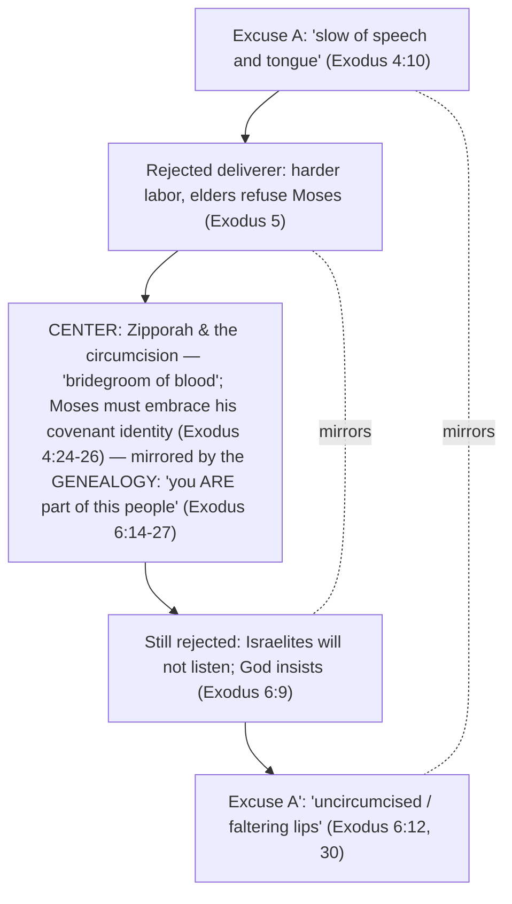

# A God Who Hears the Cry

BEMA 17 · Session 1
Source transcript: `transcripts/1-a-god-who-hears-the-cry-17.md`

## Key Lessons

- **God is a God who hears the cry — his arrival is driven by love and restoration, not by wrath.** Marty: *"God shows up to restore shalom, not to punish sin... It's not fundamentally about wrath and vengeance. It's about restoration."* This is the arc itself — **trust the story; God does not change what he wants or what matters.** From the blood path to the bow in the clouds, the story has been "grace, grace, grace, grace"; the so-called "stories of wrath" (Sodom, the Exodus) are *outliers*, and even they are stories of love. God's constant priority is shalom.

- **The "stories of wrath" are really stories of justice as rescue — God comes because of the *cry*, not the sin.** Marty, reading his own old note: *"When there is wickedness [rasha] that leads to a cry [tsa'aqah], God will hear that cry and come to judge [shaphat]."* Crucially: *"God never says that he's there because of the sin of Sodom and Gomorrah. He's there because he has heard the cry."* God's concern across the whole corpus is the mistreated and oppressed.

- **God wants partners who are available, not qualified.** Moses is the single most qualified person imaginable to lead the Exodus — raised in Pharaoh's house — yet *"God never breathes one single word about Moses' qualifications."* Marty: *"God's not interested in your qualifications. He's interested in your availability."* What God has always wanted is a willing partner (the Avram pattern), not a résumé.

- **You have to embrace your place in the covenant story before you can play your role in it.** Moses' real problem is an identity crisis, not a speech impediment. The uncircumcised son signals Moses saying, in effect, *"I don't deserve to be in the covenant."* Marty: *"if you can't even embrace your role in this larger covenant family... this story with Pharaoh is not going to work. You've got to accept the fact that you are a part of this story."*

- **Hebraic justice (*mishpat*) is restorative — making the world right — not merely retributive (*diyn*).** Marty contrasts American retributive law (deterrence by fear) with the restorative view: *"the main idea isn't retribution or fear. It's... making sure that whatever we do, we make the world right again."* Punishment (*diyn*) may serve restoration but is never the driving impetus.

## East/West Lens

- **Truth (religious & experiential — who/why) over truth (rational & scientific — how/what)** — The *Hagah* method answers questions in the Text and lived encounter, not in abstraction. Marty: *"The answer was never in an abstract, philosophical, logical explanation. The answer for the Jewish mind is always in the Text."*

- **God's description — nature of the relationship over nature of the being** — God never argues attributes or logic with Moses; he offers presence and relationship. Marty: *"God never turns around to Moshe and tries to argue with him about the logic... All he says is, 'I'm going to go with you and you need to trust the story.'"*

- **Error & sin as wrong behavior / restoration over wrong belief** — "Wickedness" (*rasha*) and "justice" (*shaphat/mishpat*) are about what is done to the vulnerable and how the world is set right, not about correct doctrine. Marty: *"God's here to restore shalom. God's here because of love."*

- **Words as word-pictures over abstract definitions** — "Uncircumcised lips" is a concrete image, not an abstract category. Marty: *"concretely, logically, does it make any sense?"* Brent: *"No. Not at all."* — the point is the vivid picture, decoded through the covenant sign.

## Recurring Through-lines

- **Trust the story (the arc itself).** Named repeatedly and tied directly to Moses' call: *"All he says is... 'you need to trust the story.'"* The review explicitly restates the whole Genesis arc as "creation is good, trust me" → Avram as the father of faith/trust → Isaac's faithfulness → Jacob's chutzpah → Judah's repentance and the Joseph cycle of reconciliation, "right back to where it started." God's priorities (shalom, justice, partnership) are shown to be constant from Genesis into Exodus. This through-line recurs across the whole corpus; here it is the explicit hinge between the Introduction (Genesis) and the Narrative (Exodus).

- *(Note: the "sin as failing to master the animal instinct" / master-the-beast motif, anchored in `1-master-the-beast-3.md`, is not engaged this episode. The *hagah* lion image appears but refers to the posture of meditating on the Text, not to mastering a base instinct, so the motif is not claimed.)*

## Narrative Tensions

| Surface problem | Tag | Cited quote (speaker) | Verse citation + link | Resolution / status |
|---|---|---|---|---|
| God sends Moses to Egypt, then immediately "sought to kill him" on the way — counterproductive and bizarre. | `logic-gap` | Marty: *"God shows up to kill him, which seems counterproductive if I'm God. It just is super weird."* | Exodus 4:24-26 — https://www.biblegateway.com/passage/?search=Exodus%204%3A24-26&version=NIV | **Resolved (Hebraic lens):** the Zipporah circumcision story sits structurally *between* Moses' two speech excuses; "uncircumcised lips" ties it to Moses' refusal to embrace his covenant identity. The confrontation forces Moses to accept his place in the covenant family before he can act. |
| It is unclear in the Hebrew whether God is about to kill Moses or the uncircumcised son. | `translation-disagreement` | Marty: *"in the Hebrew, you can't really tell if — is God showing up to kill Moses, or is God showing up to kill the uncircumcised son?... Some would argue one way, some another."* | Exodus 4:24 — https://www.biblegateway.com/passage/?search=Exodus%204%3A24&version=NIV | **Open — dance with it.** The hosts note the ambiguity and the nested quotation marks and decline to resolve the referent. |
| "Bridegroom of blood" and Zipporah touching Moses' "feet" with the foreskin are opaque and strange. | `unstated-cultural-assumption` | Brent: *"the bridegroom of blood phrase is pretty weird... That doesn't — that seems weird."* | Exodus 4:25-26 — https://www.biblegateway.com/passage/?search=Exodus%204%3A25-26&version=NIV | **Partially resolved / Open — dance with it.** *hatan* = "bridegroom / son-in-law"; "feet" may be a euphemism (a possible call-back to the blood path). Marty: *"who knows?"* The gesture's exact mechanics stay open; its covenant-identity meaning is the payoff. |
| Why does Moses — of all people — have an uncircumcised son and lack the covenant sign in his household? | `logic-gap` | Marty: *"why is Moses's son not carrying the sign of the covenant?... How is Moses's son not carrying circumcision? Like this is wild."* | Exodus 4:25 — https://www.biblegateway.com/passage/?search=Exodus%204%3A25&version=NIV | **Resolved (Hebraic lens):** it dramatizes Moses' identity crisis — he does not yet see himself as "one of them." The genealogy wedged into Exodus 6 answers it: "Moses, you *are* a part of this story." |
| "Slow of speech and tongue" is usually read as a speech impediment. | `translation-disagreement` | Marty: *"lots of people... say Moses must have had a speech impediment... I think this has to be crazy."* | Exodus 4:10 — https://www.biblegateway.com/passage/?search=Exodus%204%3A10&version=NIV ; Acts 7 — https://www.biblegateway.com/passage/?search=Acts%207&version=NIV | **Resolved (Hebraic lens + cross-text):** raised in Pharaoh's house, Moses had the best training on earth; Stephen (Acts 7) calls him "eloquent / powerful in speech." The excuse is insecurity/identity, not a disability. |
| Exodus 6:10-12 and Exodus 6:28-30 repeat almost verbatim — looks like a redundant doublet. | `contradiction` | Marty: *"Exodus 6:10-12 sounded a lot like Exodus 6:28-30, like almost the exact same thing."* Brent: *"I didn't see that coming."* | Exodus 6:10-30 — https://www.biblegateway.com/passage/?search=Exodus%206%3A10-30&version=NIV | **Resolved (Hebraic lens):** the near-identical speeches *bracket* Moses' genealogy — a deliberate frame whose point is "you are a part of this people." The repetition is structural, not accidental. |
| Sodom/Gomorrah and the Exodus look like straightforward "God's wrath punishing sin" stories. | `unstated-cultural-assumption` | Marty: *"I want to challenge that idea here today. God says that he has heard the cry... He's not there to punish the Egyptians for their sins."* | Genesis 18-19 — https://www.biblegateway.com/passage/?search=Genesis%2018-19&version=NIV ; Exodus 3:7-9 — https://www.biblegateway.com/passage/?search=Exodus%203%3A7-9&version=NIV | **Resolved (Hebraic lens):** four unique Torah words (*hatan, rasha, tsa'aqah, shaphat*) literarily bind the two stories; both are triggered by a *cry* of the oppressed. God comes to restore shalom (*mishpat*), not to vent wrath. (One open sub-question Marty raises: in Sodom, *who* is crying out?) |

## Chiasms & Structure

The hosts never say "chiasm," but they walk through a clearly mirrored, center-weighted structure: Moses' two matched speech excuses frame the Zipporah circumcision story and his genealogy, and the whole point sits in the middle — *embrace your covenant identity; you are part of this story.*

Prose: The matched outer frame is Moses' excuse stated two ways — "slow of speech and tongue" (Exodus 4:10) and "uncircumcised / faltering lips" (Exodus 6:12, 30). Marty: *"if we look at 4 and we look at 6... I wonder if there's something like right in the middle."* What sits in the middle is the Zipporah story — and, in the near-duplicate framing of Exodus 6:10-12 / 28-30, Moses' genealogy. The center carries the lesson: Moses' real excuse is "uncircumcised lips" (an uncircumcised, unembraced identity), and the genealogy answers it — "you are absolutely a part of this story."

## Terminology

- **hagah** (הגה) — the low rumbling growl of a lion; the posture of meditating over the Text ("you sit over the Text like a lion sits over its prey... He wants to eat all of it"). The basis for BEMA's "Hagah projects."
- **hatan** (חתן) — "bridegroom / son-in-law"; the "bridegroom of blood" of Exodus 4. Marty: *"that word only shows up four times in all of Torah... twice here"* and twice in the Genesis 18-19 story — a literary link between the two "wrath" stories.
- **"uncircumcised lips"** — Moses' Exodus 6 excuse ("faltering lips"), literally "uncircumcised of lips." Marty: *"what is Moses's — Moses has an identity crisis... 'I don't deserve to be in the covenant of circumcision.'"*
- **rasha** (רשע) — "wicked / wickedness." Marty: *"the first four are used — guess what two stories... Genesis 18 and the Exodus story."*
- **tsa'aqah** (צעקה) — "the cry of distress" of the abused/oppressed. Marty: *"God says, 'I'm here because I've heard the tsa'aqah.'"* Clusters in Sodom/Gomorrah and the Exodus (with the Esau cry in the middle).
- **shaphat** (שפט) — "to judge"; its first four Torah uses are again in these two stories; the root of *mishpat*.
- **mishpat** (משפט) — "justice," restorative — *"putting the world back together, putting things right, making things as they ought to be."*
- **diyn** (דין) — "justice," retributive. Marty: *"Sometimes mishpat will involve diyn... but diyn or punishment is not the driving impetus of God's arrival."*

## Discussion Questions

1. Marty insists God shows up because of the *cry*, not to punish sin — "stories of love," not wrath. How does rereading Sodom/Gomorrah and the Exodus as rescue change your picture of God? Where have you assumed wrath where the text points to restoration?
2. God never addresses Moses' qualifications, only his availability. Where in your own life have you disqualified yourself with an excuse that is really about identity or insecurity rather than ability?
3. The whole middle of this passage says: you must embrace your place in the covenant story before you can play your role in it. What does "embracing your place in the story" look like concretely for you right now?
4. Marty distinguishes restorative justice (*mishpat*) from retributive justice (*diyn*), and notes punishment can serve restoration but shouldn't drive it. Where do your instincts default to retribution, and what would a restoration-first response look like in a conflict you're facing?
5. The *Hagah* method says the answer is always "in the Text" — look again, and again, and ask better questions. Pick one "weird" passage that bugs you and sit over it like a lion: what better question could you ask of it this week?

## Sources

- Transcript: `1-a-god-who-hears-the-cry-17.md`
- Exodus 4:10 — https://www.biblegateway.com/passage/?search=Exodus%204%3A10&version=NIV
- Exodus 4:24-26 — https://www.biblegateway.com/passage/?search=Exodus%204%3A24-26&version=NIV
- Exodus 5 — https://www.biblegateway.com/passage/?search=Exodus%205&version=NIV
- Exodus 3:7-9 — https://www.biblegateway.com/passage/?search=Exodus%203%3A7-9&version=NIV
- Exodus 6:1-12 — https://www.biblegateway.com/passage/?search=Exodus%206%3A1-12&version=NIV
- Exodus 6:10-30 — https://www.biblegateway.com/passage/?search=Exodus%206%3A10-30&version=NIV
- Genesis 18-19 — https://www.biblegateway.com/passage/?search=Genesis%2018-19&version=NIV
- Acts 7 — https://www.biblegateway.com/passage/?search=Acts%207&version=NIV
- Ray Vander Laan, *That the World May Know*, Vol. 8 "God Heard Their Cry" (Focus on the Family) — recommended video series
- BibleProject — videos on *mishpat* / restorative justice
