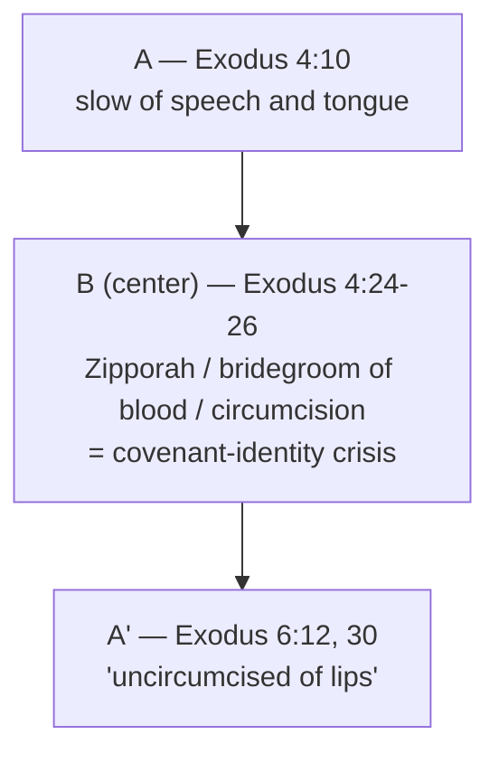

# A God Who Hears the Cry

BEMA 17 · Session 1
Source transcript: `~/workspace/bema/transcripts/1-17-a-god-who-hears-the-cry.md`
Book: Exodus (Exodus 4:21–26; 6:1–12; with references to Exodus 2, 3, 5; and Genesis 18–19)
Hosts: Marty Solomon (host) · Brent Billings (co-host)

> A pause at the hinge between the Introduction (Genesis 12–50) and the Narrative (Exodus) to ask two big-picture questions: **who are we?** and **who is this God?** A weird "Hagah project" — the Zipporah "bridegroom of blood" story — turns out to sit structurally between Moses' two speech excuses and expose his covenant-identity crisis. Then four rare Hebrew words bind Sodom/Gomorrah and the Exodus together and reframe both "stories of wrath": God shows up not primarily to punish sin but because *"I have heard the cry."* God is a God of **restorative justice** — he comes to restore shalom out of love.

## Episode Flow (coverage backbone)

1. **Recap of the arc so far.** Marty summarizes the Preface (Genesis 1–11, "trust me / creation is good") and the Introduction (Genesis 12–50): Avram = trust/faith, Isaac = faithfulness, Jacob = *chutzpah*, Joseph/Judah = confession, forgiveness, reconciliation — "the story of Genesis came full circle." Marty: *"Genesis 1-11 is kind of the Preface of the Story. Genesis 12-50 is like the Introduction to the Story... The narrative of God starts in Exodus."*
2. **Why pause.** Rather than flow straight into Exodus, the hosts "back up" to ask two higher-level questions over a couple episodes: *"who are we and who is this God?"* (today) and *"what is Egypt and what does Egypt represent?"* (next episode).
3. **The Hagah project set-up.** Definition of *hagah* (the lion's low growl; sitting over the Text like a lion over prey). Marty: *"the answer for the Jewish mind is always in the Text."*
4. **The Zipporah "bridegroom of blood" riddle (Exodus 4:21–26).** Brent reads it; the hosts catalog the problems — nested quotations, who God is trying to kill, the "bridegroom of blood" phrase, how Zipporah knows what to do, and above all *"why is Moses's son not carrying the sign of the covenant?"*
5. **Moses' background.** Very Hebrew baby, circumcised on the eighth day, kept three months, raised in Pharaoh's house → identity crisis / survivor's guilt. Marty rejects the "speech impediment" reading using Acts 7 (Moses "eloquent... powerful of tongue").
6. **The two speech excuses.** Exodus 4:10 ("slow of speech and tongue") and Exodus 6:12/30 ("faltering lips" = Hebrew "**uncircumcised** of lips"). The Zipporah circumcision story sits *between* them → Moses' refusal to embrace his covenant identity.
7. **Exodus 6 "God said... God said."** The Genesis-15-like repetition where Moses stays silent and God keeps speaking; and the genealogy wedged between 6:10–12 and 6:28–30 proving "Moses, you *are* a part of this story."
8. **Who are we?** "God isn't interested in your qualifications. He's interested in your availability." Moses is the most qualified person imaginable, yet God never argues qualifications — only availability.
9. **Who is this God? — the four-word link.** *hatan*, *rasha*, *tsa'aqah*, *shaphat* tie Sodom/Gomorrah (Genesis 18–19) and the Exodus together in Torah.
10. **Restorative vs retributive justice.** *mishpat* (restorative) vs *diyn* (retributive); the Native-American tribal-court illustration; the parenting illustration. Thesis: *"When there is wickedness that leads to a cry, God will hear that cry and come to judge"* — God shows up because of the **cry**, to restore shalom, not fundamentally for wrath.
11. **Wrap / what's next.** Pointer to the show-notes presentation (the four words and references), and a preview of the next episode on Egypt using Ray Vander Laan's *That the World May Know* Vol. 8, "God Heard Their Cry." Closing appeal about discipling the next generation and supporting the work.

**Coverage verification:** All eleven movements above are represented below under Key Lessons, East/West Lens, Narrative Tensions, Chiasms & Structure, Terminology, Illustrations, References, and Callbacks. Every point is backed by a transcript citation.

## Key Lessons

- **God wants your availability, not your qualifications.** Moses is the single most qualified candidate to lead the Exodus (raised in Pharaoh's house, knows the power pyramid), yet God never mentions qualifications. Marty: *"God isn't interested in your qualifications. He's interested in your availability... God will make you qualified. It only matters if you're available."* The question "who are we?" is answered: *"We are people that God is looking for partners. Are we available?"*
- **You have to embrace your place in the covenant story before the mission can work.** Moses' real obstacle isn't a speech defect but an identity crisis — he will not see himself as one of the covenant people (hence his son is uncircumcised). Marty (as God): *"if you can't even embrace your role in this larger covenant family, like this story with Pharaoh is not going to work. You've got to accept the fact that you are a part of this story and you have a role to play."* The wedged genealogy drives the point: *"you can examine your genealogy. You're absolutely a part of this story."*
- **These are not fundamentally "stories of wrath" — God shows up because he hears the cry.** Marty: *"God is not here to deal with the sin of Egypt. He's here because he's heard the cry of the Israelites."* Both Sodom/Gomorrah and the Exodus are *outliers* against a Genesis full of "grace, grace, grace, grace." The driving impetus is the *tsa'aqah*, not punishment.
- **God's justice is restorative (mishpat), not primarily retributive (diyn).** Marty: *"mishpat is restorative. It's about putting the world back together, putting things right, making things as they ought to be."* Punishment (*diyn*) may be part of restoration, but *"diyn or punishment is not the driving impetus of God's arrival... God's here to restore shalom. God's here because of love."*
- **The answer is always in the Text (hagah).** The whole episode models BEMA's method: a weird story is a riddle to be chewed on, not skipped. Marty: *"you sit over the Text like a lion sits over its prey... He wants to eat all of it. That's the idea of hagah."* Brent's closing: *"get the Text into you."*

## East/West Lens

- **Truth over time (static vs dynamic / discovery).** Meaning is *dug out* of the Text through the Hagah project rather than stated propositionally. Marty: *"The answer was never in an abstract, philosophical, logical explanation... The answer for the Jewish mind is always in the Text."*
- **Words (word-count / wordplay / structure).** The argument hinges on Hebrew word-frequency and placement — four rare words (*hatan*, *rasha*, *tsa'aqah*, *shaphat*) binding two stories, and the Zipporah story sitting *between* two "uncircumcised" speech excuses. Marty: *"these two stories are driven together, tied together in a literary sense, undeniably, by four distinct and unique words."*
- **Community vs individual.** Moses must be reconciled to a covenant *people*, not just given a personal gift; the genealogy locates him inside a *family*. Marty: *"you are a part of this people. And I need you to embrace who you are."*
- **Concrete vs abstract (how God is known).** God is defined by what he *does* — "I have heard the groaning," "I have heard the cry" — a concrete, relational, hearing God, not an abstract attribute. Marty: *"God is a God who hears the cry."*
- **Justice as restoration (East) vs retribution (West).** Explicitly staged through the tribal-court illustration: *"Western civilized law... is based off of a system of retribution... these other worldviews have a restorative view of justice."* This is the Hebraic *mishpat*.
- **Truth (who/why vs how/what).** God never debates the *logic/how* of Moses' qualifications; he addresses *who* Moses is and *why* he's being sent. Marty: *"It's not about the logic. It's not about the strategy. It's about the heart of Moshe for God."*

## Recurring Through-lines

- **Trust the story (the Session-1 arc; callback to `1-01-trust-the-story.md`).** The episode opens by retracing the whole arc of trust (Avram → Isaac → Jacob → Joseph/Judah) and lands on "trust the story" as God's one answer to Moses. Marty (as God): *"I'm going to go with you and you need to trust the story."* Marked as the overarching Session-1 motif (partnership through trust).
- **God finds a partner / the family of God (partnership — the Session-1 throughline).** "Who are we?" is answered in partnership terms: *"We are people that God is looking for partners. Are we available?"* Ties directly to the Introduction's claim that *"God finds a partner, and the family of God is born"* (Avram).
- **Chutzpah (callback to Abraham, ep. 11; Jacob, eps. 13–14).** Named in the recap as Jacob's key ingredient — *"Jacob brought chutzpah. He brought some fire... He wanted the mission of God."* Flagged as cross-reference; not re-explained here.
- **Stories of wrath deferred and now revisited (callback to `1-04-his-bow-in-the-clouds.md` and `1-10-walking-the-blood-path.md`).** Marty explicitly reaches back: *"I told you episodes ago... that we were going to come back to these stories of wrath."* The grace-saturated backdrop ("walking the blood path, putting the bow in the clouds... grace, grace, grace, grace") is recalled to frame Sodom/Exodus as outliers.
- **God hears the cry / restorative justice (mishpat) — seeded here for Session 2.** Marty flags the retributive counterpart for later: *"diyn is retributive justice. We'll talk more about this in session two."* The "God who hears the cry" motif is set as a spine running into the Exodus narrative.

## Narrative Tensions

Each entry: surface problem, classification tag, cited quote, normalized verse citation + link, and resolution or open flag.

| Surface problem | Tag | Cited quote (speaker) | Verse citation + link | Resolution / status |
|---|---|---|---|---|
| God sends Moses to Egypt, then "sought to kill him" on the way — counterproductive and bizarre. | `logic-gap` | Marty: *"God shows up to kill him, which seems counterproductive if I'm God. It just is super weird."* | [Exodus 4:24-26](https://www.biblegateway.com/passage/?search=Exodus%204%3A24-26&version=NIV) | **Open / dance with it:** even the target is ambiguous — *"you can't really tell if-is God showing up to kill Moses, or is God showing up to kill the uncircumcised son?"* |
| The passage is hard to follow — nested quotation marks obscure who is speaking to whom. | `logic-gap` | Brent: *"there's a bunch of nested quotation marks... who's talking at what point... is a little confusing."* | [Exodus 4:21-23](https://www.biblegateway.com/passage/?search=Exodus%204%3A21-23&version=NIV) | **Resolved (reading practice):** Marty's point that you benefit from *seeing* the text, not just hearing it. |
| "Bridegroom of blood" is an opaque phrase, and the verse "defines" it with "referring to circumcision" — which doesn't clarify. | `translation-disagreement` | Brent: *"the bridegroom of blood phrase is pretty weird... it defines it... but what?"* | [Exodus 4:25-26](https://www.biblegateway.com/passage/?search=Exodus%204%3A25-26&version=NIV) | **Resolved (lexical):** *hatan* = "bridegroom / son-in-law," a rare word that links this story to Genesis 18–19. |
| How does Zipporah know what to do, and why is Moses' own son uncircumcised? | `logic-gap` | Marty: *"why is Moses's son not carrying the sign of the covenant?... How is Moses's son not carrying circumcision?"* | [Exodus 4:24-26](https://www.biblegateway.com/passage/?search=Exodus%204%3A24-26&version=NIV) | **Resolved (interpretive):** Moses' refusal to embrace covenant identity ("I don't deserve to be in the covenant of circumcision"). |
| Does Zipporah touching "Moses' feet" with the foreskin echo the blood-path (and is "feet" a euphemism)? | `unstated-cultural-assumption` | Marty: *"'Is that a call back to the blood path?' Oh, maybe... feet can also be one of those euphemisms."* | [Exodus 4:25](https://www.biblegateway.com/passage/?search=Exodus%204%3A25&version=NIV) | **Open — dance with it:** *"I mean, who knows?"* |
| "Slow of speech and tongue" is read by many as a speech impediment. | `contradiction` | Marty: *"lots of people... say Moses must have had a speech impediment... Now, I think this has to be crazy."* | [Exodus 4:10](https://www.biblegateway.com/passage/?search=Exodus%204%3A10&version=NIV) | **Resolved (counter-reading):** Raised in Pharaoh's house with the best resources; Acts 7 calls him eloquent/powerful in speech. |
| "Faltering lips" — the NIV footnote says the Hebrew is "uncircumcised of lips." Can lips be circumcised? | `logic-gap` | Marty: *"do we circumcise lips?"* Brent: *"I hope not... Not at all."* | [Exodus 6:12](https://www.biblegateway.com/passage/?search=Exodus%206%3A12&version=NIV) | **Resolved (structural reading):** The "uncircumcised" wording points back to the Zipporah circumcision story and Moses' identity. |
| Exodus 6:10–12 and 6:28–30 are nearly identical — why the repetition? | `logic-gap` | Marty: *"Exodus 6:10-12 sounds very, very similar to Exodus 6:28-30 in essence."* | [Exodus 6:10-12](https://www.biblegateway.com/passage/?search=Exodus%206%3A10-12&version=NIV) | **Resolved (structure):** A genealogy sits between them — Marty: it proves *"you're absolutely a part of this story."* |
| "God said... God said" with no one else speaking — why does God keep restating himself? | `logic-gap` | Brent: *"God said and then nobody else has talked and it says God said."* | [Exodus 6:1-2](https://www.biblegateway.com/passage/?search=Exodus%206%3A1-2&version=NIV) | **Resolved (callback):** "This feels very Genesis 15-y" — Moses is silent/reluctant, so God keeps speaking. |
| Sodom/Gomorrah is usually preached as God punishing sin; the hosts challenge that frame. | `unstated-cultural-assumption` | Marty: *"God never says that he's there because of the sin of Sodom and Gomorrah. He's there because he has heard the cry."* | [Genesis 18:20-21](https://www.biblegateway.com/passage/?search=Genesis%2018%3A20-21&version=NIV) | **Resolved (thesis):** God comes because of the *tsa'aqah* to restore shalom, not primarily to punish. |
| If God came for the cry, "who's crying?" in Sodom and Gomorrah? | `logic-gap` | Marty: *"which raises a great question... of who's crying. Who is letting out a tsa'aqah?"* | [Genesis 19:13](https://www.biblegateway.com/passage/?search=Genesis%2019%3A13&version=NIV) | **Open — dance with it:** posed and left for the listener to pursue in the Text. |

## Chiasms & Structure

No formal chiasm is claimed, but the episode's central discovery is a deliberate **concentric placement**: Moses' two speech excuses frame the Zipporah circumcision story, so the covenant-identity problem sits structurally *in the middle* of the "uncircumcised lips" complaint. The hosts walk it out explicitly ("we look at 4 and we look at 6... I wonder if there's something like right in the middle").

| Position | Text | Content |
|---|---|---|
| Outer (A) | Exodus 4:10 | "slow of speech and tongue" (first speech excuse) |
| Center (B) | Exodus 4:24–26 | Zipporah / "bridegroom of blood" / circumcision (covenant-identity crisis) |
| Outer (A′) | Exodus 6:12, 30 | "faltering lips" = "**uncircumcised** of lips" (second speech excuse) |

Marty: *"this Hagah project story that we're asking about is actually right in the middle, and it makes so much... I speak with uncircumcised lips."*

A second structural device: the near-duplicate speeches of Exodus 6:10–12 and 6:28–30 bracket **Moses' genealogy** — the structure itself argues that Moses belongs to the covenant family. Marty: *"what sits right in between those?... Moses' genealogy. Because the whole point of this is that Moses, you are a part of the story."*

## Terminology

- **hagah** (הגה) — the low rumbling growl of a lion; a Hebrew onomatopoeia for the posture of meditating over the Text (sitting over it like a lion over its prey). Basis for BEMA's "Hagah projects." Marty: *"you sit over the Text like a lion sits over its prey."*
- **hatan** (חתן) — "bridegroom / son-in-law"; the word behind "bridegroom of blood." Used only four times in Torah — twice in Exodus 4:25–26 and twice in the Genesis 18–19 (Sodom/Lot) story. Marty: *"that word only shows up four times in all of Torah."*
- **"uncircumcised lips"** — the literal Hebrew behind "faltering lips" (Exodus 6:12/30; NIV footnote). Brent: *"The Hebrew is 'I am uncircumcised of lips.'"* Signals Moses' refusal to embrace his covenant identity.
- **rasha** (רשע) — "wicked / wickedness"; used eight times in Torah, its first four uses in the Sodom (Genesis 18:23, 25) and Exodus (Exodus 2:13; 9:27) stories.
- **tsa'aqah** (צעקה) — "the cry of distress" of someone being abused or oppressed. This form appears five times in Torah: Genesis 18:21; 19:13; Exodus 3:7, 3:9 (the Esau outcry sits in the middle). Marty: *"God says, 'I'm here because I've heard the tsa'aqah.'"*
- **shaphat** (שפט) — the verb "to judge"; a common word whose *first four* Torah uses fall in these same two stories (Genesis 18:26; 19:9; Exodus 2:14; 5:21).
- **mishpat** (משפט) — "justice," built on *shaphat*; **restorative** — "putting the world back together... making things as they ought to be."
- **diyn** (דין) — "justice" in the **retributive** sense; sometimes part of *mishpat* but not the driving impetus of God's arrival. Flagged for fuller treatment in Session 2.
- **shalom** (שלום) — wholeness/peace; what God shows up to *restore*. Marty: *"God shows up to restore shalom, not to punish sin."*

## Illustrations & Stories (from the hosts)

- **The lion over its prey (hagah).** The sensory picture — a lion's low growl, Brent's inserted lion-growl clip — dramatizes devouring the Text. Marty: *"He wants to read it. He wants to eat it. He wants to eat all of it."*
- **Charlton Heston's *The Ten Commandments* ("the Hebrew blanket").** Marty pokes at the film's claim that Pharaoh's daughter recognized Moses by a Hebrew-woven blanket — "not probably the way" — to make the point that the baby's circumcision already marked him as Hebrew.
- **The University of Idaho tribal-court visit.** Marty's lawyer friend recounts an indigenous tribal court explaining every year the contrast between Western **retributive** law and an Eastern/indigenous **restorative** view of justice — the lived analogy for *mishpat*. Marty: *"American law... is based off of a system of retribution... these other worldviews have a restorative view of justice."*
- **The parent breaking up a fight between his kids.** Marty's own-life illustration of restorative vs retributive motive: *"I want to save the one kid that's getting beat up. That's the driving impetus... the larger conversation is one driven by love and restoration."* He admits that on "worst days" anger "drives the car" — distinguishing shalom-restoration from vengeance.
- **"Hagah projects" with college students.** The classroom origin of the method — biblical "brain teasers" that look easy, then aren't. Brent: *"An exercise in frustration for many of us."*

## References & Resources (named in the episode)

- **Ray Vander Laan — *That the World May Know*, Volume 8: "God Heard Their Cry"** (Focus on the Family), lessons 1–3. Strongly recommended for *seeing* Egypt; Marty names RVL as "my main teacher... where I learned so much of what I share on the BEMA podcast." To be used in the next episode.
- **BibleProject** — videos on *mishpat* / restorative justice; Marty offers to put one in the show notes.
- **Acts 7 (Stephen's speech)** — cited to argue against the "speech impediment" reading: Moses was "eloquent of speech, powerful of tongue."
- **Genesis 18–19 (Sodom and Gomorrah)** — the companion "story of wrath," reread as a story where God hears the cry of the mistreated.
- **The show-notes presentation** — a slide deck of the four Hebrew words and their references, offered for listeners who want to *see* the data.

## Callbacks (explicit links the hosts make)

- **Genesis 15 — "God said... God said."** Marty: *"This feels very Genesis 15-y to me"* — Moses, like Avram, is reluctant/silent, so God keeps speaking (ties to `1-11-here-i-am.md`).
- **Walking the blood path & the bow in the clouds.** Named as the grace-saturated backdrop: *"walking the blood path, putting the bow in the clouds... it's just been grace, grace, grace, grace"* (ties to `1-10-walking-the-blood-path.md` and `1-04-his-bow-in-the-clouds.md`).
- **"We were going to come back to these stories of wrath."** A deliberate deferred-promise callback to earlier episodes, now paid off by revisiting Sodom/Gomorrah alongside the Exodus.
- **The Genesis arc recap.** Avram (trust/faith), Isaac (faithfulness), Jacob (chutzpah), Joseph/Judah (confession, forgiveness, reconciliation) — "the story of Genesis came full circle" (ties to `1-01-trust-the-story.md` through `1-16-out-of-the-pit.md`).
- **The Esau outcry.** Noted as the middle (fifth) occurrence of this form of *tsa'aqah* — "He cries out when he's deceived" (ties back to the Jacob/Esau material, eps. 13–15).

## Discussion Questions

1. Marty insists "God isn't interested in your qualifications. He's interested in your availability." Where have you disqualified yourself from something because you felt unqualified — and what would "being available" look like instead?
2. Moses' real block was refusing to see himself as part of the covenant family (his son was uncircumcised). Is there a story or community you believe in but hold yourself *outside* of? What keeps you from embracing your place in it?
3. The hosts argue Sodom/Gomorrah and the Exodus are about God *hearing the cry*, not primarily punishing sin. How does reframing these as stories of restorative love — rather than wrath — change the way you read the "angry God of the Old Testament"?
4. *Mishpat* (restorative) vs *diyn* (retributive): in a conflict you're facing, which one is actually driving you? Marty admits that on his "worst days" anger "drives the car." How do you tell the difference in yourself?
5. The whole episode is a *hagah* exercise — chewing on a weird text until it opens up. Pick one strange passage you usually skip. What question would you have to sit with "like a lion over its prey" instead of explaining away?
6. God is portrayed as the one who *hears the cry*. Whose *tsa'aqah* is near you — "a couple cubicles down," in your church, in your city — that you've learned to tune out? What would it mean to hear it the way this God does?

## Sources

- Transcript: `1-17-a-god-who-hears-the-cry.md`
- [Exodus 4:10 (NIV)](https://www.biblegateway.com/passage/?search=Exodus%204%3A10&version=NIV)
- [Exodus 4:21-26 (NIV)](https://www.biblegateway.com/passage/?search=Exodus%204%3A21-26&version=NIV)
- [Exodus 6:1-12 (NIV)](https://www.biblegateway.com/passage/?search=Exodus%206%3A1-12&version=NIV)
- [Exodus 6:28-30 (NIV)](https://www.biblegateway.com/passage/?search=Exodus%206%3A28-30&version=NIV)
- [Exodus 2 (NIV)](https://www.biblegateway.com/passage/?search=Exodus%202&version=NIV)
- [Exodus 3:7-9 (NIV)](https://www.biblegateway.com/passage/?search=Exodus%203%3A7-9&version=NIV)
- [Exodus 5 (bricks without straw, NIV)](https://www.biblegateway.com/passage/?search=Exodus%205&version=NIV)
- [Genesis 15 (NIV)](https://www.biblegateway.com/passage/?search=Genesis%2015&version=NIV)
- [Genesis 18-19 (Sodom and Gomorrah, NIV)](https://www.biblegateway.com/passage/?search=Genesis%2018-19&version=NIV)
- [Acts 7 (Stephen's speech, NIV)](https://www.biblegateway.com/passage/?search=Acts%207&version=NIV)
- Referenced resources named in the episode (not web-fetched): Ray Vander Laan — *That the World May Know*, Vol. 8 "God Heard Their Cry," lessons 1–3 (Focus on the Family); BibleProject videos on *mishpat* / restorative justice; the show-notes slide presentation of the four Hebrew words and their Torah references.
