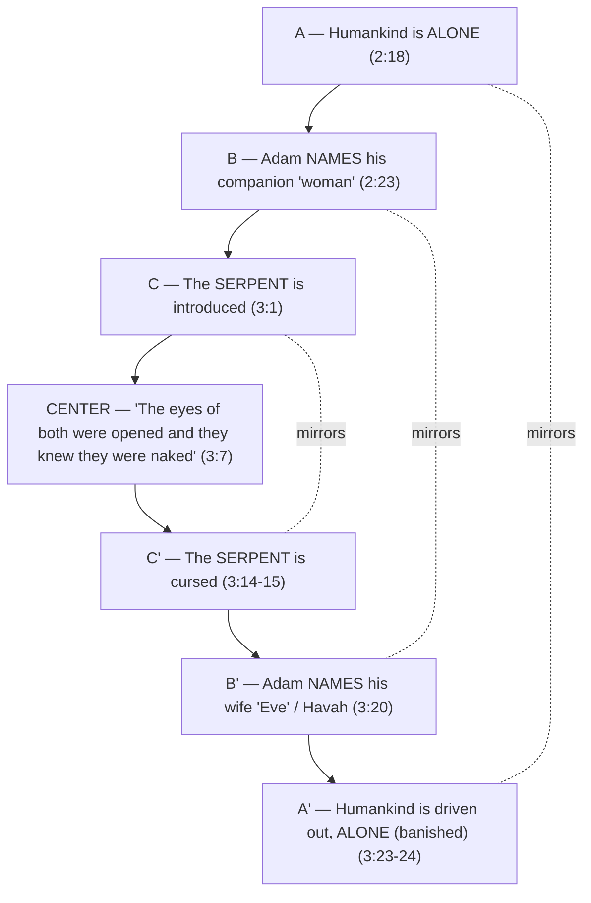

# Knowing When to Say "Enough"

**BEMA 2 · Session 1** — Genesis (Garden of Eden: Genesis 2:4–3:24)
Source transcript: `transcripts/1-knowing-when-to-say-enough-2.md`

---

## Key Lessons

The "problems" in Eden are not errors to resolve; they are intentional signposts planted by Eastern authors to point at a constant divine priority.

- **To be made in the image of God is to know when to say "enough."** The whole story turns on the Talmudic reading of *El Shaddai* as "the God who knows when to say enough." God is the artist who knows when to stop chiseling; a beast always acts on its desires, but a human made in God's image can harness desire. Cited: *Marty* — "El Shaddai means the God who knows when to say enough... We are made in the image of a God who knows when to stop. He invites us to be like him." This is the same priority God holds from creation onward — the arc never changes.

- **The sin is failing to master the animal/desire within.** Eve's new perception of the tree adds a third element — *desire* ("desirable for gaining wisdom"). The failure is acting on desire the way a beast does. Cited: *Marty* — "an animal is always going to act on its desires... But we—humanity—we are not beasts. We are made in the image of God." This is the explicit link to the master-the-beast through-line.

- **Humanity is complete only as male and female together — this is about all humanity, not merely marriage.** *Ish* and *ishah* are two parts of one whole; the "helper" is *ezer k'negdo*, the help that supports by opposing. Cited: *Marty* — "no one gender, no one expression of humanity has all of humanity in it... Only all those genders together can be the full image of God."

- **God meets us in our shame rather than arguing us out of it.** The story is awkwardly, relentlessly about nakedness. God's response to the fall is a compassionate covering. Cited: *Marty* — "God meets them in their shame, clothes them... 'I see you in your shame. I'm going to meet you here, and I'm going to love you through this.'" God's heart toward his people is constant — trust the story.

- **Read for problems, not past them.** The method itself is a lesson: the "lullaby effect" lulls familiar readers to sleep. Cited: *Marty* — "the problems are actually there on purpose. The problems are there to be problems."

---

## East/West Lens

- **Words (word-pictures/story over definitions).** The whole episode mines Hebrew sound and imagery that English flattens. Cited: *Marty* — "This is not fair to us in English, because we can't see what the original people who heard this story or read this story heard. Because in the Hebrew, there's a play on words." (*arowm / erowm / aruwm*.)

- **Error & sin (wrong behavior over wrong belief).** Sin here is enacted desire — doing — not a mistaken doctrine. Cited: *Marty* — "an animal is always going to act on its desires... humanity, we are not beasts... We know how to harness our creative desires for greater good."

- **Truth over time (dynamic/unfolding — our understanding grows, the truth doesn't move).** The hosts model letting understanding grow by re-reading a familiar story. Cited: *Marty* — "This was the thing that unlocked a whole new relationship with the Bible... we started looking at problems."

- **God's description (nature of the relationship/concrete experience over abstract attributes).** God "walks in the garden," asks "Where are you?" as a relational absence, not a locational question. Cited: *Marty* — "He's saying, 'You're supposed to be here. We're supposed to be walking in the garden. Where are you? You're missing.'"

- **Community vs individual (Hebraic starts with the whole).** The man is "humankind" (*adam*) and is only complete as a shared humanity split into two. Cited: *Marty* — "God took humanity and took a complete humanity and made it into two things... When you put them together, you have humanity."

---

## Recurring Through-lines

- **Trust the story (the arc).** The constancy of God's priority — self-control / knowing when to say enough — is presented as something God embodies from creation. Cited: *Marty* — "We met this God last week—the God who knows when to say enough." Linking creation (episode 1) to Eden (this episode) shows the priority does not shift. Recurs across the corpus as the backbone arc.

- **Sin as failing to master the animal instinct (the "master the beast" motif).** This episode is a primary feeder for that motif (anchored in `1-master-the-beast-3.md`). The text works deliberately to blur human and beast — the serpent talks, reasons, relates, and walks — so the dividing line becomes *mastery of desire*. Cited: *Marty* — "The story is working really hard to make it difficult to distinguish between the snake and humanity... an animal acts on their desires. It's what it means to be a beast. But we—humanity—we are not beasts." Link to arc: being God's image = saying "enough" to the beast within. Recurs: this directly sets up the Cain/Abel "sin crouching at the door, you must master it" teaching in episode 3.

---

## Narrative Tensions

| # | Surface problem | Tag | Cited quote (speaker) | Verse + link | Resolution / status |
|---|---|---|---|---|---|
| 1 | Two different creation accounts sit back-to-back and don't cleanly harmonize (Gen 1 already made male and female). | `contradiction` | *Marty*: "I thought we already did the story of creation... There are 2 different creation stories here. Not that there's 2 different creations, but there's 2 different ways of telling the story of creation." | [Genesis 2:4-7](https://www.biblegateway.com/passage/?search=Genesis%202%3A4-7&version=NIV) | **Hebraic lens:** Hebrew narrative tells the same truth from two angles (quality/relationship over chronology). Not a seam to patch — two tellings serving different emphases. |
| 2 | The four-rivers paragraph is oddly detailed and seems irrelevant to the Adam & Eve plot; translators arbitrarily attach "Tigris/Euphrates." | `translation-disagreement` | *Marty*: "what does this paragraph have to do with anything... the translators have just decided to associate those rivers with the Tigris and Euphrates... probably not even directly there in the language itself." | [Genesis 2:10-14](https://www.biblegateway.com/passage/?search=Genesis%202%3A10-14&version=NIV) | **Open — dance with it.** Hosts flag the oddity (one river possibly circling endlessly) without resolving it; attribution of names is uncertain. |
| 3 | "It is not good for man to be alone" — but instead of making the companion, God parades the animals for naming first. | `logic-gap` | *Marty*: "the next thing should be making his companion, but instead he gives them this project of naming the animals. That feels weird." | [Genesis 2:18-20](https://www.biblegateway.com/passage/?search=Genesis%202%3A18-20&version=NIV) | **Hebraic lens:** The animal parade establishes the human/beast boundary — "no suitable helper was found" because humanity is not a beast, setting up the story's real question. |
| 4 | The marriage statement in v.24 breaks the narrator's voice (parenthetical/later editorial comment). | `unstated-cultural-assumption` | *Brent*: "the Hebrew phrase *al-khen* introduces this... There's a textual reason why they call it a parenthetical or an editorial comment." | [Genesis 2:24](https://www.biblegateway.com/passage/?search=Genesis%202%3A24&version=NIV) | **Hebraic lens:** The *al-khen* particle marks a reflective aside; the story is bigger than marriage, so the editorial note applies the principle to marriage without limiting it to marriage. |
| 5 | A talking snake is treated as totally normal — the only other talking animal (Balaam's donkey) is a shock on purpose. | `unstated-cultural-assumption` | *Marty*: "we have a talking snake... the whole point of [Balaam's donkey] is that donkeys aren't supposed to talk... In this story, it's just like, 'oh yeah, cool, talking snake.'" | [Genesis 3:1](https://www.biblegateway.com/passage/?search=Genesis%203%3A1&version=NIV) | **Hebraic lens:** The normalized talking/walking serpent is intentional — it blurs beast and human (*aruwm*) to foreground the desire/mastery theme. |
| 6 | The "tree of the knowledge of good and evil" can't be that, since Eve already knows good from evil before eating. | `logic-gap` | *Marty*: "it's really not the tree of the knowledge of good and evil... she already has the knowledge of good and evil... they didn't possess the reason to be judged or punished until they eat from the tree a second time." | [Genesis 3:2-6](https://www.biblegateway.com/passage/?search=Genesis%203%3A2-6&version=NIV) | **Open — dance with it.** The hosts leave the identity of the tree unresolved; the point is desire and "enough," not a tidy label. |
| 7 | Eve adds "do not touch it" — a command God never gave. | `contradiction` | *Marty*: "Is that a part of the command that God gave? ... they have built some sense... they've added to the original." | [Genesis 3:3](https://www.biblegateway.com/passage/?search=Genesis%203%3A3&version=NIV) | **Hebraic lens:** A "fence around the Torah" (added safeguard); rabbis split on whether the fence helped or harmed — a live tension, not an error. |
| 8 | Who's telling the truth? God says "you will surely die"; the serpent says "you will not die" — and they don't immediately die. | `translation-disagreement` | *Marty*: "it seems here—like God's the one telling a fuzzy truth... the serpent's not directly lying... there's a lot of fuzzy half truths going on." | [Genesis 2:17](https://www.biblegateway.com/passage/?search=Genesis%202%3A17&version=NIV) | **Open — dance with it.** Deliberate literary ambiguity ("death" as relational/qualitative vs. immediate biological); the hosts explicitly refuse to flatten it. |
| 9 | The serpent says they'll "become like God" — but they are already made in God's image. | `logic-gap` | *Marty*: "the whole point of the story is that they have, they are like God... So what is that all about?" | [Genesis 3:5](https://www.biblegateway.com/passage/?search=Genesis%203%3A5&version=NIV) | **Hebraic lens:** The lie is a redefinition of "like God" — grasping by desire rather than imaging God by self-restraint ("enough"). |
| 10 | They make their own fig-leaf coverings, then God makes them garments — what happened to the first coverings? | `contradiction` | *Brent*: "they realized they were naked and they sewed fig leaves... But then later on, God makes them coverings. So what happened to their own coverings?" | [Genesis 3:7](https://www.biblegateway.com/passage/?search=Genesis%203%3A7&version=NIV) | **Hebraic lens:** Human coverings don't remove shame; God's act of clothing meets them in shame with compassion — the point is relational, not wardrobe continuity. |
| 11 | God's "Where are you?" to an omniscient God reads as not knowing. | `translation-disagreement` | *Marty*: "There can be two different expressions for 'where' in the Hebrew... What God says to Adam and Eve is the second one... 'You're supposed to be here... Where are you? You're missing.'" | [Genesis 3:9](https://www.biblegateway.com/passage/?search=Genesis%203%3A9&version=NIV) | **Hebraic lens:** Relational "where" (lament over absence), not locational — God grieves the broken walk, not a lost location. |

---

## Chiasms & Structure

The episode explicitly identifies a chiasm with nakedness ("eyes opened... they were naked") at the center.

**Prose:** The story opens and closes on **aloneness** (made because "not good to be alone" → banished from the garden). It frames the center with a **double naming** (first "woman" — *who she is*; then "Eve/Havah" — *what she does*) and with the **serpent** (introduced → cursed). At the dead center sits the awkward refrain the whole narrative keeps circling: their eyes opened and *they knew they were naked*. The center is reinforced by the triple drumbeat of nakedness — they notice it first after eating, Adam names it to God, and God answers "Who told you that you were naked?" Cited: *Marty* — "This feels like a chiasm... the middle statement of the chiasm is this, 'The eyes of both of them were opened and they realized they were naked.'"

---

## Terminology

- **adam / adamah** — *adam* = "man / humankind" (not yet a personal name); *adamah* = the ground/earth he is formed from. Cited: *Marty* — "Adam's name... really just means man, and not a name... humankind, is what that Hebrew expression literally refers to."
- **ish (איש) / ishah (אשה)** — "man" / "woman," sounding like two halves of one whole. Cited: *Marty* — "ish and ishah, they feel like they go together, like they're... two parts of a single whole."
- **ezer k'negdo (עזר כנגדו)** — "a helper suitable"; the help that supports by *opposing* (two planks leaning, each holding the other up). Cited: *Marty* — "She is the help that opposes. She supports the man by opposing him."
- **ruach (רוח)** — breath / wind / spirit; here "the breeze of the day" and the breath of life in Adam, tied by Brent to the fruit of the Spirit, self-control. Cited: *Marty* — "It actually says 'the breeze,' the ruach."
- **al-khen (על כן)** — "that is why / therefore"; the particle marking the parenthetical marriage note in 2:24 (per the NET footnotes). Cited: *Brent* — "the Hebrew phrase *al-khen* introduces this."
- **arowm / erowm / aruwm** — wordplay: *arowm* = "naked," *erowm* = "nakedness," *aruwm* = "crafty/shrewd" — the near-identical sounds blur human and serpent. Cited: *Marty* — "the word for naked is arowm... the word for crafty and shrewd is aruwm."
- **Havah (חוה)** — "Eve," "mother of all the living"; the post-fall name defining her by what she *does*. Cited: *Marty* — "Her name is Havah, because she is the mother of all the living... it's about what she can do."
- **El Shaddai (אל שדי)** — a name for God, rabbinically read (as a Talmudic acronym) as "the God who knows when to say enough." Cited: *Marty* — "El Shaddai means the God who knows when to say enough."

---

## Discussion Questions

1. If being made in the image of God means "knowing when to say enough," where in your own life is the hardest place to say enough — and what would self-restraint there look like as *imaging God* rather than mere willpower?
2. The story works to blur the line between the human and the beast (a talking, reasoning, walking serpent). If reasoning and relating don't define humanity, and *mastering desire* does, how does that reframe what "sin" is for you?
3. God answers the fall with "Who told you that you were naked?" — i.e., "What other voices have you been listening to?" What voices have shaped your shame, and how does God meeting people *in* their shame (clothing them) rather than arguing them out of it change how you relate to your own?
4. *Ezer k'negdo* is "the help that opposes." Where have you experienced support that came through loving opposition — someone calling out your best by pushing back — and how is that different from either flattery or hostility?
5. The hosts insist the "problems" in the text are there on purpose. Pick one tension above you'd rather resolve neatly. What might you lose if you forced it closed instead of "dancing with it"?

---

## Sources

- Transcript: `1-knowing-when-to-say-enough-2.md`
- [Genesis 2:4-7](https://www.biblegateway.com/passage/?search=Genesis%202%3A4-7&version=NIV)
- [Genesis 2:10-14](https://www.biblegateway.com/passage/?search=Genesis%202%3A10-14&version=NIV)
- [Genesis 2:17](https://www.biblegateway.com/passage/?search=Genesis%202%3A17&version=NIV)
- [Genesis 2:18-20](https://www.biblegateway.com/passage/?search=Genesis%202%3A18-20&version=NIV)
- [Genesis 2:23](https://www.biblegateway.com/passage/?search=Genesis%202%3A23&version=NIV)
- [Genesis 2:24](https://www.biblegateway.com/passage/?search=Genesis%202%3A24&version=NIV)
- [Genesis 3:1](https://www.biblegateway.com/passage/?search=Genesis%203%3A1&version=NIV)
- [Genesis 3:2-6](https://www.biblegateway.com/passage/?search=Genesis%203%3A2-6&version=NIV)
- [Genesis 3:3](https://www.biblegateway.com/passage/?search=Genesis%203%3A3&version=NIV)
- [Genesis 3:5](https://www.biblegateway.com/passage/?search=Genesis%203%3A5&version=NIV)
- [Genesis 3:7](https://www.biblegateway.com/passage/?search=Genesis%203%3A7&version=NIV)
- [Genesis 3:9](https://www.biblegateway.com/passage/?search=Genesis%203%3A9&version=NIV)
- [Genesis 3:14-24](https://www.biblegateway.com/passage/?search=Genesis%203%3A14-24&version=NIV)
