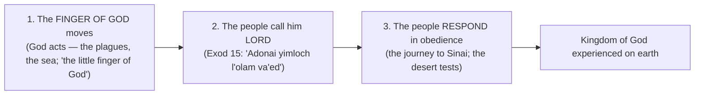

# With All Your Heart

BEMA 20 · Session 1
Source transcript: `~/workspace/bema/transcripts/1-with-all-your-heart-20.md`
Book: Exodus (Exodus 14; 15:22–27; 16:1–30; with Deuteronomy 8:1–3)
Guest: Reed Dent (BEMA teaching team; campus minister)

> The crossing of the Reed Sea and the first of three desert tests on the way to Sinai. The hosts reframe "test" as a measurement, not a pass/fail exam — God tests Israel's **heart** (the seat of the will) to *yada* (experientially know) what's in it, and to grow them. Marah's bitter well and the manna/Sabbath both ask the same question: *will you trust the story — live by every word — and take care of the one on the fringe?*

## Key Lessons

- **A biblical "test" is a measurement, not a pass/fail exam.** Marty: *"God doesn't test you just to see if you're going to pass. He tests you because He wants to live life together with you."* Deuteronomy 8: God tests "to *know* [yada] what was in your heart" — experiential, intimate knowing. Every test is a chance to *show* God your heart and to *grow* in him. God's purpose (relationship, formation) is constant.
- **"Man does not live by bread alone, but by every word" — trust means waiting on God's provision.** At Marah (one bitter well) they must learn the lesson before rounding the corner to Elim's twelve wells and seventy palms. Marty: *"there was enough for everybody if they just would have waited on the word."* The manna rules (gather only a day's worth; double on the sixth) train the same trust — and expose the "worry warts" (Marty includes himself) who hoard and find maggots.
- **The Kingdom of God comes when three things happen together.** Marty's rabbinic teaching: the **finger of God moves**, the people **call him Lord**, and the people **respond in obedience**. We love the first, settle for the second, and skip the third — but Sinai exists because *obedience* is the missing piece. Reed: the obedient and the praising "shouldn't be enemies... we gotta come together."
- **God's provision is communal: the strong gather extra so the weak lack nothing.** The manna "everyone had just enough" isn't magic but generosity — the Marah statute (per Midrash) that *the weak and marginalized drink first* lived out. Marty: *"everybody always had exactly what they needed."* Reed links it to Paul (2 Corinthians 8).

## East/West Lens

- **Words (word-picture / wordplay)** — **Marah** = "bitter" *and* "rebellious": the bitter well tests whether they'll be a bitter, rebellious people. **Yam Suph** = "Sea of Reeds," not "Red Sea."
- **Truth over time (dynamic/unfolding; historiographic vs. aesthetic)** — Reed on Exodus 14 (plain: "east wind") vs. 15 (poetic: "breath of God's nostrils"): both/and, not either/or. Buber: "history always contains an element of wonder"; Brueggemann's "imaginative remembering."
- **God's existence/description (concrete relationship vs abstract data)** — God tests "to know" via **yada** — experiential, not cerebral. Reed: *"I thought God was omniscient."* The point is relational knowing, not information.
- **Numbers / symbol** — Twelve wells (the tribes / people of God) and seventy palms (community, the Sanhedrin's seventy) signal "enough for everybody." Forty days = testing.
- **Community vs individual** — The whole lesson lands communally (gather so the fringe lacks nothing); provision and obedience are reckoned for the people, not just the person.

## Recurring Through-lines

- **Trust the story (the arc itself) — now in the desert.** The tests are trust-the-story in practice: will Israel believe there's "enough," wait on "every word," and let God provide? Marty frames the whole desert as the refining fire where God gets "Egypt out of them." God's priorities don't change — the desert is how a freed-but-still-Egypt-shaped people learn to trust. Recurs across the corpus; condensed at the Session 1 capstone (episode 32).
- **Sin as failing to master the animal instinct ("master the beast").** Present as the manna test of self-preservation: hoarding against tomorrow (the maggot-ridden extra) is the un-mastered scarcity/fear instinct; trusting the daily provision is mastering it. Marty confesses *"I would have been one of those anxiety-ridden worry warts."* Same dynamic anchored in `1-master-the-beast-3.md`. Flag for cross-reference; do not re-explain there.
- **"Egypt gets inside you" (callback to eps. 9–10, 16, 18).** Explicitly named: easy to get Israel out of Egypt, hard to get Egypt out of Israel; the desert tests are the extraction. Reed and Marty also push back on the condescension toward "those dumb Israelites" — we'd grumble too.
- **The weak/marginalized go first (callback to Sabbath/shalom, eps. 1, 18).** The Marah statute and manna generosity echo the shalom pattern of caring for those on the fringe — the opposite of empire's expendability.

## Narrative Tensions

Each entry: surface problem, classification tag, cited quote, normalized verse citation + link, and resolution or open flag.

| Surface problem | Tag | Cited quote (speaker) | Verse citation + link | Resolution / status |
|---|---|---|---|---|
| Why does God route Israel *south* into a dead end instead of the easy coastal highway? | `logic-gap` | Marty: *"they head south before they get beyond the Gulf... they're going to be hemmed in."* | [Exodus 14:1-4](https://www.biblegateway.com/passage/?search=Exodus%2014%3A1-4&version=NIV) | **Resolved (narrative):** The dead end sets up the crossing drama and the lesson that God, not geography, delivers them. |
| Is it the "Red Sea" (walls of water) or a marshy "Sea of Reeds" (secular reading)? | `translation-disagreement` | Marty: *"the Hebrew just literally is not the Red Sea. It is literally the Sea of Reeds."* | [Exodus 14:19-22](https://www.biblegateway.com/passage/?search=Exodus%2014%3A19-22&version=NIV) | **Resolved (lean to the text):** The text clearly depicts walls of water on dry ground; the hosts favor a crossing consistent with that over the marsh theory. |
| Moses says "be still," but God immediately says "Why cry to me? Move!" | `contradiction` | Reed: *"it's literally the next verse where God is like, 'Why are you crying to me? Move.'"* | [Exodus 14:13-16](https://www.biblegateway.com/passage/?search=Exodus%2014%3A13-16&version=NIV) | **Resolved (Hebraic lens):** *This* day's lesson is "stand and watch"; later God will say "move first." Different stage of trust, not a contradiction. |
| Chapters 14 and 15 describe the same event very differently (east wind vs. God's nostrils). | `contradiction` | Reed: *"which is it? And I think the point is it's a both/and."* | [Exodus 15:22-27](https://www.biblegateway.com/passage/?search=Exodus%2015%3A22-27&version=NIV) | **Resolved (interpretive):** Historiographic vs. aesthetic/ideological "levers" (Sternberg); an "imaginative remembering" of a real event — not a factual conflict. |
| God tests Israel "to know" their heart — but isn't God omniscient? | `logic-gap` | Reed: *"I thought God was omniscient."* | [Deuteronomy 8:1-3](https://www.biblegateway.com/passage/?search=Deuteronomy%208%3A1-3&version=NIV) | **Resolved (Hebraic lens):** *yada* = experiential/relational knowing, not data; God wants to experience the journey with them. |
| The text says a "law and statute" was given at Marah — but no statute is actually stated. | `logic-gap` | Marty: *"that's not actually a statute. There's no command... The Midrash points this out."* | [Exodus 15:25-26](https://www.biblegateway.com/passage/?search=Exodus%2015%3A25-26&version=NIV) | **Resolved (Midrash):** The unstated statute, per Midrash, is that the weak/marginalized drink first — borne out by the manna "everyone had enough." |
| God never mentioned meat — why does Moses promise it, and why does God honor it? | `logic-gap` | Marty: *"Moses seems to bring this up outside of God's instruction. God said nothing about meat."* | [Exodus 16:6-13](https://www.biblegateway.com/passage/?search=Exodus%2016%3A6-13&version=NIV) | **Open — dance with it:** Marty flags it as "crazy to me"; reads it as God honoring Moses "upping the ante," but leaves the mechanism unresolved. |

## Chiasms & Structure

No chiasm is identified. The structuring frame the hosts teach is the **threefold coming of the Kingdom of God** — three things that must happen together for the Kingdom (God's intended reign) to be experienced on earth.

Prose: Christians often celebrate step 1 (rescue) and settle at step 2 (confession), treating the story as finished — but Sinai exists because step 3 (obedience) completes the Kingdom. Marty notes you can taste real Kingdom in communities strong on obedience *or* on praise even when the other is weak; the fullness is all three together.

## Terminology

- **Yam Suph** (יַם־סוּף) — "Sea of Reeds," not "Red Sea"; a reedy/marshy body of water. Marty: *"the Hebrew just literally is not the Red Sea."*
- **yada** (יָדַע) — to know experientially/intimately, not merely data. God tests "to *know* what was in their heart." (As in "Adam *knew* his wife Eve.")
- **Marah** (מָרָה) — "bitter," the well's name; the root also carries "rebellious." Marty: *"marah can be bitter, and marah can be rebellious."*
- **lev / levav** (לֵב / לֵבָב) — the heart as the seat of the *will* and volition. Marty: *"the test of the heart is what are you going to choose?"*
- **Adonai yimloch l'olam va'ed** — "The LORD reigns forever and ever," sung at the sea — the first time Israel calls God *Adonai* with their own mouths.
- **omer** — the daily manna measure (debated: an Israelite omer ~just under a liter vs. an Egyptian *homer* ~a cup); "a tenth of an ephah." The point, Reed notes, is "everybody comes away with exactly what they need."

## Discussion Questions

1. Reframe "test" as a hot-tub test strip, not a school exam. How does seeing God's tests as *measurement + growth* rather than *pass/fail* change the way you read a hard season of your own?
2. At Marah there's one bitter well; around the corner, twelve wells and seventy palms. Where are you being asked to "wait on every word" before you can see the abundance that's just ahead?
3. The manna rules exposed the hoarders (Marty included). Where does scarcity-fear tempt you to grab tomorrow's provision today — and what would daily trust look like instead?
4. The Kingdom comes when God moves, people call him Lord, *and* people obey. Which of the three does your community over-emphasize, and which does it quietly skip?
5. God provided so "the one who gathered little lacked nothing" — the strong gather extra for the weak. What would it look like for your group to live that generosity concretely?
6. The hosts resist mocking "those dumb Israelites," admitting we'd grumble in the desert too. Where have you been quick to judge someone's lack of faith in a situation you've never actually endured?

## Sources

- Transcript: `1-with-all-your-heart-20.md`
- [Exodus 14:1-4 (NIV)](https://www.biblegateway.com/passage/?search=Exodus%2014%3A1-4&version=NIV)
- [Exodus 14:10-16 (NIV)](https://www.biblegateway.com/passage/?search=Exodus%2014%3A10-16&version=NIV)
- [Exodus 14:19-22 (NIV)](https://www.biblegateway.com/passage/?search=Exodus%2014%3A19-22&version=NIV)
- [Exodus 15:22-27 (NIV)](https://www.biblegateway.com/passage/?search=Exodus%2015%3A22-27&version=NIV)
- [Exodus 16:1-30 (NIV)](https://www.biblegateway.com/passage/?search=Exodus%2016%3A1-30&version=NIV)
- [Deuteronomy 8:1-3 (NIV)](https://www.biblegateway.com/passage/?search=Deuteronomy%208%3A1-3&version=NIV)
- [2 Corinthians 8 (NIV)](https://www.biblegateway.com/passage/?search=2%20Corinthians%208&version=NIV)
- Referenced resources named in the episode (not web-fetched): Bruce Feiler, *Walking the Bible*; Martin Buber (via W. Gunther Plaut's Torah commentary); Walter Brueggemann ("imaginative remembering"); Meir Sternberg, *The Poetics of Biblical Narrative*; Ray Vander Laan, *That the World May Know* Vols. 8–9; BibleProject (Exodus 14 vs. 15); Exodus Rabbah / Midrash (the song at the sea; the Marah statute; the communal manna reading).
