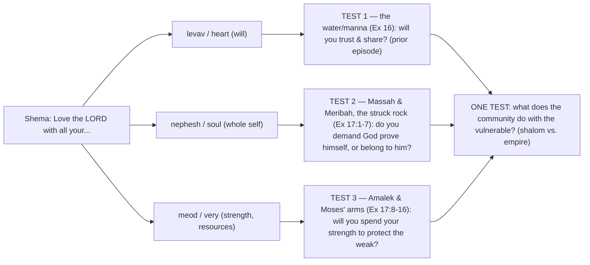

# With All Your Soul & "Very"

BEMA 21 · Session 1
Source transcript: `transcripts/1-with-all-your-soul-very-21.md`

## Key Lessons

- **The wilderness tests map onto the Shema — heart (*levav*), soul (*nephesh*), might (*meod*) — and all three are really one test: what the community does with the vulnerable.** Reed: *"all of these tests are actually kind of testing the same thing, which is what the community is doing with those who can't do for themselves."* This is the arc itself — **trust the story; God does not change what he wants or what matters.** From Genesis onward God has wanted a people who care for the outsider; here he is forming them to be exactly that before Sinai.

- **God is consistently a God who takes the blow on our behalf — the struck rock pictures God letting himself be struck.** With God standing *before* (*paniym*) the rock, the elders watching Moses *nakah* it see "Moses trying to kill the Holy One of Israel" (Reed). Marty: *"This is who God has always been through Genesis and Exodus... a God that will take the blow on your behalf."* The bow in the clouds, the blood path, the struck rock — one unchanging character.

- **There is a crucial difference between God testing us and us testing God.** The *nephesh* test is "God, you don't get me unless you do X" — a demand. Marty: *"Does God have you or does God only have you when He meets your demands?"* Contrast Gideon, who asks for reassurance ("help my unbelief") rather than making a demand. God's people are called to belong to God unconditionally.

- **Strength (*meod*) is given to be spent *for others* — "choose men who will fight for us."** The rabbinic reading of Exodus 17:9 ("choose for us") and the Gideon parallel (men who drink from their hands to make way for others) teach that *meod* is for the community. Marty: *"use it for the larger community... Use your strength for other people."* The Moses-arms-held-up story is about Aaron and Hur helping — strength shared.

- **Where you find the weak reveals shalom vs. empire.** Marty's rabbi: *"you will always know whether or not you're looking at a community of Shalom or a community of Empire based on where you find the weak and the marginalized."* On the fringes or crushed on the bottom = empire (the Amalekites attack the back); in the protected middle (the tribe of Dan guards the rear) = shalom. God's constant priority, embodied.

## East/West Lens

- **Error & sin as wrong behavior over wrong belief** — Reed reframes "they did not believe in God" (Ps 78): *"We talk about not believing in God as believing in the existence of God... what really makes God angry here... is that they doubt... God's generosity."* Unbelief is a lived posture (craving, demanding), not an intellectual position.

- **Community vs individual** — The whole lesson insists faithfulness is corporate: strength "for us," the marginalized in the middle, loving God *and* neighbor as inseparable. Marty: *"if you're loving God with all your heart and all your soul and all your might, then you will take care of all those around you."*

- **Words as word-pictures over abstract definitions** — Meaning rides on concrete images: *paniym* ("faces") placing God bodily before the rock, *nakah* evoking a killing-blow, *meod* literally "very," *Adonai Nissi* as a physical banner pointing to where the god resides. Marty on the banner: *"The banner always points the way to where the god is."*

- **God's description — nature of the relationship over abstract attributes** — The struck-rock scene reveals God by relational action (taking the blow), and Marty refuses even to draw God ("that seemed very sinful to me"), representing him only as a squiggle *between* Moses and the rock. God is known by how he stands *with* his people, not by a depiction.

## Recurring Through-lines

- **Trust the story (the arc itself).** Named in the review ("the goodness of creation, invitation to trust") and threaded throughout: the struck rock, the bow in the clouds, and the blood path are explicitly tied together as "the consistent character of God that we've seen on this whole journey... This is not some angry God." God's priorities — care for the vulnerable, self-giving love — are shown to be constant from Genesis through the wilderness. Recurs across the whole corpus.

- **A God who takes the blow / lays down his life for others.** A recurring BEMA image (bow in the clouds, the blood path) that reappears here as the struck rock — "a God that's willing to lay down His life on behalf of others." Linked to the arc and noted as cross-episode recurrence.

- *(Note: the "sin as failing to master the animal instinct" / master-the-beast motif, anchored in `1-master-the-beast-3.md`, is not engaged this episode. The people's craving and demanding is framed through the Shema-test lens and "testing God," not the beast/instinct lens, so the motif is not claimed.)*

## Narrative Tensions

| Surface problem | Tag | Cited quote (speaker) | Verse citation + link | Resolution / status |
|---|---|---|---|---|
| Psalm 78 says God's anger "flared up" and he killed the strongest even as he gave them what they craved — looks like petty divine wrath. | `contradiction` | Reed: *"what really makes God angry here in their disbelief is that they doubt... God's generosity... And God gets a little angry."* | Psalm 78:17-31 — https://www.biblegateway.com/passage/?search=Psalm%2078%3A17-31&version=NIV | **Resolved (Hebraic lens):** the offense is not survival-need but *demanding* God prove himself (testing God). Psalm 78 is inspired commentary exposing the craving/demand beneath the Exodus narrative. |
| Why is God's very first word to a terrified Moses "go out in front of the people" who want to stone him? | `logic-gap` | Marty: *"Moses has a legitimate concern. They're going to kill me. And God's like, yeah, step number one, I want you to go out in front of the people."* | Exodus 17:4-5 — https://www.biblegateway.com/passage/?search=Exodus%2017%3A4-5&version=NIV | **Resolved (Hebraic lens):** it is itself a *nephesh* test of Moses — "do I have you?" Moses must trust God with his own life before leading. |
| "I will stand before you by the rock" reads as flat English; its spatial sense is unclear. | `translation-disagreement` | Marty: *"The word for 'before' is the word paniym, and paniym is the Hebrew word for faces."* | Exodus 17:6 — https://www.biblegateway.com/passage/?search=Exodus%2017%3A6&version=NIV | **Resolved (Hebraic lens):** *paniym* places God physically *between* Moses and the rock-face; so when Moses strikes the rock, the elders see him striking *God* — the self-giving God picture. |
| Why strike a *rock* to get water, and why does the word choice matter? | `unstated-cultural-assumption` | Marty: *"That word nakah means to smite, to strike in order to kill."* | Exodus 17:6 — https://www.biblegateway.com/passage/?search=Exodus%2017%3A6&version=NIV | **Resolved (Hebraic lens):** *nakah* (used of Moses killing the Egyptian and God striking Egypt's gods) frames the blow as a killing-strike; with God before the rock, the picture is God absorbing the blow for the people. |
| "The LORD will have war with Amalek from generation to generation" / blotting out Amalek's name sounds like divine vendetta. | `unstated-cultural-assumption` | Marty: *"The Amalekites attacked the weak parts of the camp... God says, 'I hate this. It's so unjust... I want their name wiped out of history.'"* | Exodus 17:14-16 — https://www.biblegateway.com/passage/?search=Exodus%2017%3A14-16&version=NIV ; Deuteronomy 25 — https://www.biblegateway.com/passage/?search=Deuteronomy%2025&version=NIV | **Resolved (Hebraic lens):** the judgment targets *predation on the weak* — Amalek attacks the sick and slow at the back. It is God's justice for the vulnerable, not arbitrary wrath. |
| Does Moses holding up his staff work like a magic trick controlling the battle? | `unstated-cultural-assumption` | Marty: *"It's not a magic trick about his staff being in the air."* | Exodus 17:11-12 — https://www.biblegateway.com/passage/?search=Exodus%2017%3A11-12&version=NIV | **Resolved (Hebraic lens):** the raised staff is a *banner* (*Adonai Nissi*) pointing beyond Moses to God; and the story's real point is Aaron and Hur *holding Moses up* — strength shared for others. |
| Why "choose some of our men" — is that phrase doing any work? | `translation-disagreement` | Marty: *"that phrase 'for us'... kind of got translated away in the NIV."* | Exodus 17:9 — https://www.biblegateway.com/passage/?search=Exodus%2017%3A9&version=NIV | **Resolved (rabbinic lens):** the Hebrew "choose *for us*" can read "choose men who will fight *for us*" — for the community, not themselves. The Midrash links it to Gideon's hand-drinkers who made way for others. |

## Chiasms & Structure

No chiasm is present. The hosts instead lay out a clear **three-part structural model**: the wilderness tests map onto the three faculties of the Shema, and Reed observes all three converge on a single question — what the community does with those who cannot help themselves. This is a parallel/mapping structure (not a mirrored, center-weighted chiasm), so it is rendered as a mapping diagram rather than a chiasm:

Prose: Each faculty of the Shema gets a corresponding wilderness test — heart, then soul (the struck rock at Massah/Meribah), then might (the battle with Amalek and Moses' held-up arms). Reed's closing insight collapses them into one: *"all of these tests are actually kind of testing the same thing"* — whether this people can be the shalom community (weak in the middle) that God is about to make them at Sinai.

## Terminology

- **nephesh** (נֶפֶשׁ) — the soul: the whole essence of a person, body and spirit together. Marty: *"your soul is all of you... the sum total of that is your soul."* The second test asks whether God has you unconditionally.
- **meod** (מְאֹד) — "very"; translated "might/strength" — all your resources. Marty: *"It simply means with all your resources, with whatever you have to offer."* (cf. *tov meod*, "very good," Genesis 1.)
- **levav / lev** (לֵבָב / לֵב) — the heart, seat of the will (the first test).
- **tsa'aqah** (צְעָקָה) — the cry of the oppressed / endangered. Marty: *"I do not think Moses is being dramatic here... it's a tsa'aqah that goes up."*
- **paniym** (פָּנִים) — "faces," the word behind "before." Marty: *"'I will stand before you'... He is between Moses and the mountain."*
- **nakah** (נָכָה) — to strike / smite to kill; used of Moses killing the Egyptian and God striking Egypt's gods; now applied to striking the rock. Reed: *"Moses trying to kill the Holy One of Israel."*
- **Adonai Nissi** (יְהוָה נִסִּי) — "The LORD is my Banner," the altar name. Marty: *"The banner always points the way to where the god is."*
- **Shema / Ve'ahavta** (שְׁמַע / וְאָהַבְתָּ) — "Hear, O Israel... Love the LORD your God with all your heart, soul, and might" (+ "love your neighbor as yourself"). The "Jesus Shema" the hosts teach joins the two greatest commandments; the three tests map onto *levav / nephesh / meod*.

## Discussion Questions

1. Reed says all three wilderness tests are really one test — "what the community is doing with those who can't do for themselves." If someone watched *your* community, where would they find the weak and marginalized: on the fringes, on the bottom, or in the protected middle?
2. Marty distinguishes testing God ("you don't get me unless you do X") from asking for reassurance (Gideon). Where have you found yourself making demands of God as the price of your trust? What would unconditional belonging look like instead?
3. The struck rock pictures God taking the blow meant for the people. How does seeing that same self-giving character from the bow in the clouds to the blood path to the rock change your picture of the "Old Testament God"?
4. *Meod* — your "very" — is strength meant to be spent *for others* ("men who will fight for us"). What resources or strengths of yours are currently spent mostly on yourself that could be turned toward the vulnerable?
5. The banner (*Adonai Nissi*) points beyond Moses to God as the true provider. What "banners" in your life are you tempted to mistake for the point, rather than letting them point you to the One behind them?

## Sources

- Transcript: `1-with-all-your-soul-very-21.md`
- Exodus 17:1-16 — https://www.biblegateway.com/passage/?search=Exodus%2017%3A1-16&version=NIV
- Exodus 17:4-5 — https://www.biblegateway.com/passage/?search=Exodus%2017%3A4-5&version=NIV
- Exodus 17:6 — https://www.biblegateway.com/passage/?search=Exodus%2017%3A6&version=NIV
- Exodus 17:9 — https://www.biblegateway.com/passage/?search=Exodus%2017%3A9&version=NIV
- Exodus 17:11-12 — https://www.biblegateway.com/passage/?search=Exodus%2017%3A11-12&version=NIV
- Exodus 17:14-16 — https://www.biblegateway.com/passage/?search=Exodus%2017%3A14-16&version=NIV
- Psalm 78:17-31 — https://www.biblegateway.com/passage/?search=Psalm%2078%3A17-31&version=NIV
- Deuteronomy 25 (Amalek, blotting out the name) — https://www.biblegateway.com/passage/?search=Deuteronomy%2025&version=NIV
- Deuteronomy 6 (the Shema) — https://www.biblegateway.com/passage/?search=Deuteronomy%206&version=NIV
- Leviticus 19 (love your neighbor) — https://www.biblegateway.com/passage/?search=Leviticus%2019&version=NIV
- Judges 7 (Gideon and the 300) — https://www.biblegateway.com/passage/?search=Judges%207&version=NIV
- BEMA Episode 21B (recording of the Jesus Shema)
- LeAnn Dent, "God Spreads a Table in the Wilderness" (CCF, 2020)
