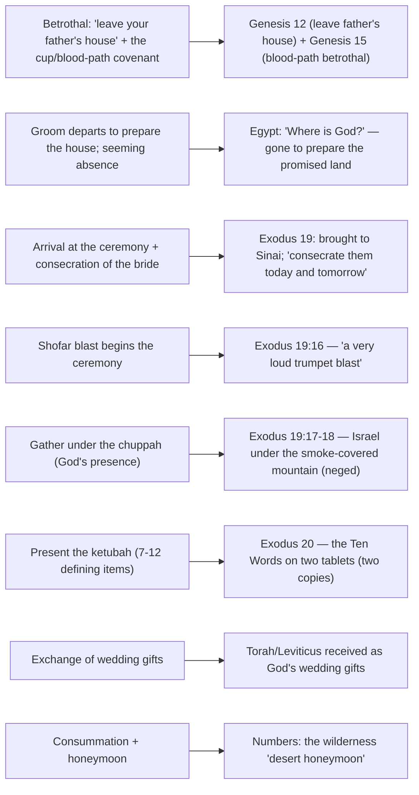

# Under the Chuppah

BEMA 22 · Session 1
Source transcript: `transcripts/1-22-under-the-chuppah.md`

## Key Lessons

- **The arrival at Sinai is not primarily a law-giving — it is a wedding.** The whole scene (Exodus 19-24) is told in the grammar of an ancient Eastern wedding. Marty: *"what we find is that the relationship between God and His people in Torah is told almost exactly like a wedding."* God brings Israel to the mountain to marry her; the covenant is a betrothal, not a contract of servitude.

- **The Ten Commandments are the *ketubah* — the wedding covenant that defines the relationship — not a list of cold rules.** Marty: *"Those Ten Commandments are not just two tablets with basic laws and rules on them. They are the ketubah, the wedding covenant defined on stone."* Reframed in wedding language they read as vows: "I am your husband... you are to have no other lovers... set aside a date night once a week just for the two of us... be satisfied with the stuff that we have together."

- **The law is a wedding gift, not a burden.** The Jewish instinct is to treasure Torah as the gift that makes relationship possible. Marty: *"The law isn't oppressive... The law is my wedding gift... Don't dismiss the law as if it's burdensome and horrible."* Leviticus and the whole Torah are received the way a bride receives wedding presents.

- **The golden calf is adultery committed in the middle of the wedding ceremony — and God's response reveals his unchanging character.** Marty: *"it's like the groom turns around to grab the ketubah under the chuppah. And as he turns back around, the bride is committing adultery."* Yet God's next move is to make new tablets: *"He's going to pick up right where He left off... This is that same God who would walk through a blood path... the same God who would put His bow in the clouds."* God resumes the wedding — this is the arc.

- **The whole bride must be present for the sign to work; the covenant is corporate.** The Sabbath is the "wedding ring" of this marriage, and it reaches everyone. Brent: *"it's not just you, but it's your family; it's your servants, your animals, any foreigners... a constant reminder. It's not a subtle sign."* Marty: *"Because it's about the whole bride... There's no part of the bride that can't be in."*

## East/West Lens

- **Covenant as relationship over contract** — The Hebraic reading hears "treasured possession" (Exodus 19:5) as marital, not transactional, language. Marty: *"That phrase 'treasured possession' is used even today in Jewish weddings. That's wedding talk... God is saying... you're going to be for me a wife, a bride."* Covenant is a marriage, defined by belonging, not a legal arrangement defined by terms.

- **Law as gift over law as restriction** — The Western instinct hears "commandments" and feels burden; the Eastern instinct hears "ten words/sayings" and sees vows. Marty: *"the Bible never actually calls them commandments, because they're not all commandments... I am your husband."* The first "word" is not even an imperative — it is self-giving identity.

- **Community over individual** — The sign of the covenant (Sabbath) explicitly includes sons, daughters, servants, animals, and the resident foreigner; the "worth" of the bride is read corporately. Marty: *"I don't say that you and me as individuals, but us together, we are the bride... why would the bride hurt herself?"*

- **Word-pictures over abstract definitions** — Meaning rides on concrete images drawn from lived marriage custom: the *chuppah* (canopy = God's hovering presence), the cup of covenant, the father building onto his house, the ritual bath (*mikvah*), the shofar blast. Marty on the chuppah: *"it symbolizes the presence of God. This wedding happens underneath God's presence."*

- **God's description — the nature of the relationship over abstract attributes** — God is revealed not by a list of properties but by what he does as a bridegroom: betrothing Abraham (Genesis 12/15), disappearing to "prepare a place," arriving for the ceremony, and — most strikingly — resuming the wedding after betrayal. Marty: *"'What kind of a God does this?' I have written in my notes."*

## Recurring Through-lines

- **Trust the story (the arc itself).** Marty opens with the full-corpus review — the preface ("the story is good"), fear-versus-trust, Empire versus Shalom — and lands the episode on God's constancy: *"This is that same God who would walk through a blood path. It's the same God who would put His bow in the clouds. It's the same God. It's the same God."* God's priorities and character do not change; the wedding resumes after the calf. Recurs across the whole corpus.

- **A God who takes the blow / lays down his life for others.** Explicitly linked here to the blood path and the bow in the clouds as the "same God" who, after adultery in the ceremony, picks up right where he left off and makes new tablets. The self-giving, covenant-keeping God is named as cross-episode recurrence (Genesis 9, Genesis 15, and the struck rock of the prior episode).

- **Empire versus Shalom / fear versus trust.** Named in the review as the governing narrative of Session 1: Marty: *"The narrative that we called The Tale of Two Kingdoms, Empire versus Shalom. And we could reframe it 'fear versus trust.'"* The wedding/ketubah is the shalom-kingdom's defining covenant. Anchored in `1-18-a-tale-of-two-kingdoms.md`.

- **The three tests of heart, soul, and might (the Shema).** The immediately-prior arc is carried forward as the courtship that leads to this wedding. Marty: *"on their way, they've had these three tests... God has tested their heart, their soul, and their very—their meod."* Anchored in the prior episodes (`1-20`, `1-21`).

- *(Note: the "master the beast" / sin-as-failing-to-master-the-animal-instinct motif, anchored in `1-03-master-the-beast.md`, is **not** engaged this episode. The sin of the golden calf is framed exclusively as marital adultery under the chuppah, not through the beast/instinct lens, so the motif is not claimed.)*

## Narrative Tensions

| Surface problem | Tag | Cited quote (speaker) | Verse citation + link | Resolution / status |
|---|---|---|---|---|
| Why spend an entire episode on ancient wedding customs when the text is about Sinai, Passover, and law? | `logic-gap` | Brent: *"Why would we be talking about weddings?"* / *"so far I'm hearing all kinds of things that sound familiar... but still nothing about Sinai that necessarily makes a connection."* | Exodus 19:5-6 — https://www.biblegateway.com/passage/?search=Exodus%2019%3A5-6&version=NIV | **Resolved (Hebraic lens):** Sinai is structured as a wedding — betrothal, consecration, shofar, chuppah, ketubah, gifts, consummation — so the custom *is* the key to the text. |
| "You will be my treasured possession" sounds like God acquiring property. | `translation-disagreement` | Marty: *"That phrase 'treasured possession' is used even today in Jewish weddings. That's wedding talk."* | Exodus 19:5-6 — https://www.biblegateway.com/passage/?search=Exodus%2019%3A5-6&version=NIV | **Resolved (Hebraic lens):** the phrase is near-exclusively *marital* language; God is proposing marriage, not claiming a possession. |
| "They stood at the foot of the mountain" seems like an incidental geographic detail. | `unstated-cultural-assumption` | Marty: *"some rabbis use the word under, they actually camp under the mountain... to put them under a chuppah... the word is actually neged... ezer k'negdo."* | Exodus 19:16-19 — https://www.biblegateway.com/passage/?search=Exodus%2019%3A16-19&version=NIV | **Resolved (Hebraic lens):** the rabbinic reading places Israel *under* the mountain as *under a chuppah* (and *neged*, echoing Adam and Eve's first marriage) — a wedding staging. |
| Why are there *two* stone tablets? (Commonly assumed: two halves of a list.) | `unstated-cultural-assumption` | Marty: *"Some will say it's because there's two copies, the groom and the bride have to have a copy of the ketubah."* | Exodus 20:1-17 — https://www.biblegateway.com/passage/?search=Exodus%2020%3A1-17&version=NIV | **Resolved (Hebraic lens):** two tablets = two copies of the marriage covenant (ketubah), one for each party, as in a wedding contract. |
| Grinding the calf to powder and making the people *drink* it looks like bizarre, arbitrary punishment. | `unstated-cultural-assumption` | Marty: *"there's clearly an interplay between these two stories... Moses grinds up the calf and has the bride drink it."* | Exodus 32:19-20 — https://www.biblegateway.com/passage/?search=Exodus%2032%3A19-20&version=NIV ; Numbers 5:16-24 — https://www.biblegateway.com/passage/?search=Numbers%205%3A16-24&version=NIV | **Resolved (Hebraic lens):** it mirrors the later *sotah* ritual for a suspected unfaithful wife (bitter water that brings a curse) — the adultery framing is explicit, judgment following as in Numbers 5. |
| Calling them "Commandments" implies ten imperatives, but the first "word" ("I am the LORD your God") commands nothing. | `translation-disagreement` | Marty: *"the Bible never actually calls them commandments, because they're not all commandments... Decalogue, decalogos, ten words, ten sayings."* | Exodus 20:1-2 — https://www.biblegateway.com/passage/?search=Exodus%2020%3A1-2&version=NIV | **Resolved (Hebraic lens):** they are "ten words/sayings" (and the Jewish numbering differs from Protestant/Catholic); the first is self-giving identity — "I am your husband." |
| After the bride commits adultery mid-ceremony, why would God simply resume? Isn't that too lenient to make sense? | `contradiction` | Marty: *"He's going to pick up right where He left off... 'Okay, now where were we?' This is that same God who would walk through a blood path."* | Exodus 34 (new tablets) — https://www.biblegateway.com/passage/?search=Exodus%2034&version=NIV | **Resolved (Hebraic lens / the arc):** God's covenant-keeping, self-giving character is constant; resuming the wedding is exactly who this God has been from the bow in the clouds onward. |

## Chiasms & Structure

No chiasm is present. The hosts instead build a **sequential parallel structure**: each stage of an ancient Eastern wedding is matched, in order, to the Sinai narrative. It is a mapping (betrothal → ceremony → gifts → consummation), not a mirrored center-weighted chiasm, so it is rendered as a mapping diagram:

Prose: Marty walks the whole wedding sequence and finds each element in the text, in order — betrothal (Genesis 12/15), the groom's departure (Egypt), arrival and consecration, the shofar, the chuppah (the mountain, *neged*), the ketubah (the Ten Words on two tablets), the wedding gifts (Torah), and the consummation/honeymoon (Numbers). The golden calf then lands precisely *during* the ketubah presentation — adultery in the middle of the ceremony — and God's remaking of the tablets reopens the wedding.

## Terminology

- **chuppah** (חוּפָּה) — the wedding canopy, a *tallit* held up on poles, symbolizing God's hovering presence; Israel camps *under* the mountain as under a chuppah. Marty: *"it symbolizes the presence of God. This wedding happens underneath God's presence."*
- **ketubah** (כְּתוּבָּה) — the written marriage covenant (seven to twelve defining items). Marty: *"They are the ketubah, the wedding covenant defined on stone."*
- **beit av** (בֵּית אָב) — "house of the father," the extended-family household unit the son builds onto for his coming marriage.
- **mishpucha** (מִשְׁפָּחָה) — family; the larger extended family that arranges the marriage together. Marty: *"Mishpucha is a Hebrew word that means family."*
- **insula** (Latin) — the multi-family dwelling onto which the groom builds a new addition. Marty: *"insula is the word that the academic community uses to talk about these multi-family dwellings."*
- **mikvah** (מִקְוֶה) — a ritual immersion/cleansing bath the bride undergoes to be consecrated. Marty: *"a ritual bath she's going to go through called a mikvah... think like a ritual cleansing."*
- **tallit** (טַלִּית) — the prayer shawl used to form the chuppah canopy.
- **shofar** (שׁוֹפָר) — the ram's-horn trumpet whose blast begins the ceremony (the "very loud trumpet blast" at Sinai).
- **neged / ezer k'negdo** (נֶגֶד / עֵזֶר כְּנֶגְדּוֹ) — "against / a helper corresponding to him," from Adam and Eve (the first marriage); Israel comes *neged* against the mountain. Marty: *"They come neged against the mountain under a chuppah."*
- **mohar** (מֹהַר) — the bride price / wedding gift exchanged between the two fathers (alongside the dowry).
- **Decalogue / decalogos** (עֲשֶׂרֶת הַדְּבָרִים) — "ten words / ten sayings." Marty: *"We call them the Ten Commandments, but the Bible never actually calls them commandments."*

## Illustrations & Stories

- **The cup of the new covenant (betrothal proposal).** The father of the groom pours a cup and the groom offers it: *"This is a cup of a new covenant... I will not drink of this cup again until I drink it anew in my father's house."* Drinking = "yes." Marty ties this to Jesus at the Last Supper (Mark 14 / Matthew).
- **The father building onto his house; "only the father knows."** The groom builds an addition and cannot say when it will be finished — *"The son doesn't know when it will be done... only the father knows."* Marty links a Talmud story of the frustrated betrothed son to Jesus' "no one knows the day or hour" (Mark 13).
- **The grape-harvest festival / dancing in the wine press.** Unmarried women in white dance on the grapes; Marty connects it to a scene in *The Nativity Story* and the shaming of Mary.
- **The ten bridesmaids (ten virgins).** Jesus' parable makes sense in this world: the groom can arrive at any hour, so the five without oil are "fools because they should have been ready."
- **Ray's wedding ring in the desert.** Marty's teacher Ray pulled off his ring: *"'This is the sign of my covenant... What's the sign of the people of God?' And he read the passage about the Sabbath... The Sabbath is our wedding ring."* This is where Marty first heard the whole reframe.
- **The groom turning back to adultery under the chuppah.** Marty's image for the golden calf: the groom turns to grab the ketubah and turns back to find the bride committing adultery with a groomsman.
- **Reframing the Ten Words as vows.** Marty renders each "saying" in wedding language (e.g., "I am your husband"; "you are to have no other lovers... don't even have pictures of other lovers"; "set aside a date night once a week"; "be satisfied with the stuff that we have together").

## References & Recommendations

- **NIV Cultural Backgrounds Study Bible** — recommended as the modern successor to the older study Bible.
- **Zondervan Archaeological Study Bible (1984 NIV)** — Marty's older favorite; where he first read many of these cultural details.
- ***Ancient Israel: Its Life and Institutions*** (Roland de Vaux) — referenced, three stars, *not* recommended.
- ***Families in Ancient Israel***, ed. Leo Perdue — referenced, three stars, *not* recommended.
- ***Jerusalem in the Time of Jesus*** (Joachim Jeremias) — referenced, dated scholarship, *not* recommended.
- ***The Nativity Story*** (film) — Marty's favorite Christmas movie; discussed further in **BEMA Episode 310**.
- **Talmud** — the story of the betrothed son building onto his father's house ("only the father knows").

## Callbacks & Connections

- **Genesis 12 — "leave your father's house."** Marty reads this as betrothal/engagement language: *"Leave your father's house, that's marriage. That's engagement talk."* ( https://www.biblegateway.com/passage/?search=Genesis%2012&version=NIV )
- **Genesis 15 — the blood-path covenant** as the ancient Eastern *betrothal* covenant. Brent: *"The blood path covenant"* / Marty: *"it's a betrothal covenant, an ancient Eastern betrothal covenant."* ( https://www.biblegateway.com/passage/?search=Genesis%2015&version=NIV )
- **Genesis 2 — Adam and Eve (ezer k'negdo), the first marriage,** echoed in Israel coming *neged* the mountain. ( https://www.biblegateway.com/passage/?search=Genesis%202&version=NIV )
- **Genesis 9 — the bow in the clouds** named as "the same God" alongside the blood path. ( https://www.biblegateway.com/passage/?search=Genesis%209&version=NIV )
- **Numbers 5 — the test of the unfaithful wife (sotah)** interplaying with the ground-calf drink of Exodus 32. ( https://www.biblegateway.com/passage/?search=Numbers%205&version=NIV )
- **John 14 — "my Father's house has many rooms... I go to prepare a place for you,"** named as wedding talk. ( https://www.biblegateway.com/passage/?search=John%2014&version=NIV )
- **Mark 13 — "no one knows the day or hour... only the Father"** matched to the Talmud house-building story. ( https://www.biblegateway.com/passage/?search=Mark%2013&version=NIV )
- **Mark 14 / Matthew — the cup of the new covenant at the Last Supper.** Marty: *"'This is the cup of a new covenant I make with you...' That's blatantly marriage talk."* ( https://www.biblegateway.com/passage/?search=Mark%2014&version=NIV )
- **John the Baptist as the friend of the bridegroom** who stands at the door and listens, announcing the kingdom "at hand." (cf. https://www.biblegateway.com/passage/?search=John%203%3A29&version=NIV )
- **The three tests (heart/soul/might, the Shema)** from the immediately prior episodes, carried in as the courtship before the wedding.

## Discussion Questions

1. Marty insists Sinai is a wedding, not a courtroom. How does hearing the Ten Commandments as *marriage vows* ("I am your husband... be satisfied with what we have together") change the way you relate to God's commands?
2. The Jewish instinct is to treasure Torah as a *wedding gift* rather than resent it as a burden. Where have you been carrying God's instructions as "rules to follow" instead of "gifts that make the relationship possible"?
3. The golden calf is framed as adultery committed in the middle of the ceremony — and God responds by making new tablets and resuming the wedding. What does it do to your picture of God that his first move after betrayal is "now, where were we?"
4. Ray calls the Sabbath Israel's "wedding ring" — a weekly sign that must include the whole household, servants, animals, and even the foreigner. What would it look like for the "whole bride" in your life to be present to that sign, not just you individually?
5. The groom "doesn't know the day or the hour" — only the father does — and the five foolish bridesmaids simply weren't ready. In what areas of your life are you living "ready," and where are you caught without oil?

## Sources

- Transcript: `1-22-under-the-chuppah.md`
- Exodus 19:5-6 — https://www.biblegateway.com/passage/?search=Exodus%2019%3A5-6&version=NIV
- Exodus 19:10 — https://www.biblegateway.com/passage/?search=Exodus%2019%3A10&version=NIV
- Exodus 19:16-19 — https://www.biblegateway.com/passage/?search=Exodus%2019%3A16-19&version=NIV
- Exodus 20:1-17 (the Ten Words) — https://www.biblegateway.com/passage/?search=Exodus%2020%3A1-17&version=NIV
- Exodus 32:19-20 (the golden calf) — https://www.biblegateway.com/passage/?search=Exodus%2032%3A19-20&version=NIV
- Exodus 34 (new tablets) — https://www.biblegateway.com/passage/?search=Exodus%2034&version=NIV
- Numbers 5:16-24 (test of the unfaithful wife) — https://www.biblegateway.com/passage/?search=Numbers%205%3A16-24&version=NIV
- Genesis 12 (leave your father's house) — https://www.biblegateway.com/passage/?search=Genesis%2012&version=NIV
- Genesis 15 (the blood-path / betrothal covenant) — https://www.biblegateway.com/passage/?search=Genesis%2015&version=NIV
- Genesis 2 (ezer k'negdo, the first marriage) — https://www.biblegateway.com/passage/?search=Genesis%202&version=NIV
- Genesis 9 (the bow in the clouds) — https://www.biblegateway.com/passage/?search=Genesis%209&version=NIV
- John 14 (preparing a place) — https://www.biblegateway.com/passage/?search=John%2014&version=NIV
- Mark 13 (no one knows the day or hour) — https://www.biblegateway.com/passage/?search=Mark%2013&version=NIV
- Mark 14 (the cup of the new covenant) — https://www.biblegateway.com/passage/?search=Mark%2014&version=NIV
- John 3:29 (friend of the bridegroom) — https://www.biblegateway.com/passage/?search=John%203%3A29&version=NIV
- NIV Cultural Backgrounds Study Bible
- Zondervan Archaeological Study Bible (1984 NIV)
- *Ancient Israel: Its Life and Institutions* (Roland de Vaux) — referenced, not recommended
- *Families in Ancient Israel*, ed. Leo Perdue — referenced, not recommended
- *Jerusalem in the Time of Jesus* (Joachim Jeremias) — referenced, not recommended
- *The Nativity Story* (film) — discussed further in BEMA Episode 310
