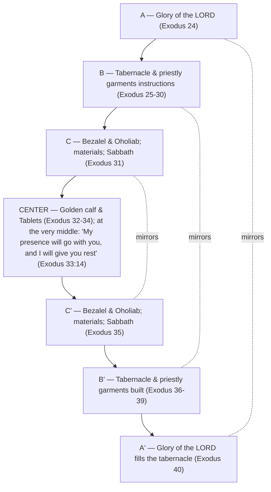

# Falling on Joyful Faces

BEMA 23 · Session 1
Source transcript: `transcripts/1-falling-on-joyful-faces-23.md`

## Key Lessons

- **The Tabernacle is a retelling of Genesis 1-3 — a mobile reminder of Creation you carry through the desert.** Marty: *"This Tabernacle story is the Genesis Creation story... It is just so wild how these two stories are connected."* This is the arc itself — **trust the story; God does not change what he wants or what matters.** God's original intent in Creation (rest, presence, order, life) is re-embodied in the Tabernacle; the same God wants the same thing, re-staged for a people on the move.

- **At the center of the whole Exodus 24-40 chiasm sits rest and presence: "My presence will go with you, and I will give you rest."** Marty builds to it: *"give me the center of this chiasm, Brent. Exodus 33:14."* The structural heart of the entire Tabernacle section is not architecture but *God's presence and rest* — the thing God has wanted since the seventh day.

- **God's people are meant to respond to his presence with joy, not fear.** At the Tabernacle's grand opening fire consumes the sacrifice and the people "shouted for joy and fell face down" — not in terror. Marty: *"They had gotten to know this God in the desert well enough that they didn't fall down on their face in fear. They fall down on their face with joy."* The same at the Temple (2 Chronicles 7): "He is good; his love endures forever."

- **We — the church — are the new temple, and should be a place where people fall on *joyful* faces.** Via Ray Vander Laan: the new temple opened at Pentecost (tongues of fire on living sacrifices). Marty, convicted: *"I would ask whether or not his new address is known for being a place where when people encounter the presence of God... they fall face down and cry for joy... I do not believe we are known for that. We are known for instilling... fear, not joy."*

- **The "boring" details are the point — repetition and structure carry meaning, not just information.** The instructions are given twice (with the golden calf in the middle), seven "The LORD said to Moses" sayings echo Creation's seven sayings, and "Moses finished the work / blessed them" mirrors Genesis 2. God delights in the details like a couple decorating a home: *"I just love this part."*

## East/West Lens

- **Words as word-pictures over abstract definitions** — A single Hebrew word carries a whole range of images. Brent: *"these Hebrew words... one word has a whole range of meanings and pictures... ruach being wind and breath and spirit. And moad being... this whole range of ideas."* The "Tent of Meeting" is the tent of *moed* — the same word at the center of the Genesis 1 chiasm.

- **Numbers as quality/symbol over quantity** — Seven is read as meaning, not count. Marty: *"Seven, that feels like a very interesting number. Can we think of anything else that was made, built, or created with seven sayings?"* — Creation. The symbolic seven ties the Tabernacle to Genesis 1.

- **Error & sin / God's description — relationship over abstraction** — God is known by lived relationship (presence and rest), and the people's fearless joy shows they *yada* God's goodness. Marty: *"They saw the love and the goodness and the grace."* The payoff is relational knowledge, not propositional.

- **Truth over time — dynamic/unfolding understanding** — The same truth is "twisted in the light" to be seen from a new angle, and Marty narrates discovering the chiasm himself over years ("twist the gem, as the Jews might say"). Our understanding deepens while the text holds still.

## Recurring Through-lines

- **Trust the story (the arc itself).** Named in the review ("an invitation to trust and to just say no to fear... lean into trust and trust in God's story") and consummated here: the Tabernacle re-tells Creation, so God's constant desire for rest, presence, and life is literally built into a portable structure. The closing charge — be a people of joy, not fear — flows straight from the arc. Recurs across the whole corpus.

- **Say no to fear / choose trust.** A recurring BEMA framing (fear vs. trust) that reappears pointedly in the contrast between falling on one's face in *fear* vs. in *joy*. Linked to the arc; noted as cross-episode recurrence.

- *(Note: the "sin as failing to master the animal instinct" / master-the-beast motif, anchored in `1-master-the-beast-3.md`, is not engaged this episode. The golden calf sits at the chiasm's structural pivot but is treated as the lapse between the two instruction-sets, not through the beast/instinct lens, so the motif is not claimed.)*

## Narrative Tensions

| Surface problem | Tag | Cited quote (speaker) | Verse citation + link | Resolution / status |
|---|---|---|---|---|
| Exodus 24-40 is a long, tedious block of Tabernacle construction detail — why is it even here, and in such depth (50+ chapters across Torah)? | `logic-gap` | Marty: *"this is a long, boring section... the cubits of the table of showbread... what are we?"* | Exodus 24-40 — https://www.biblegateway.com/passage/?search=Exodus%2024-40&version=NIV | **Resolved (Hebraic lens):** the section is a deliberate retelling of Genesis 1-3 — a mobile Creation. The "boring" detail is structural signal, climaxing in a chiasm centered on God's rest. |
| Why are the Tabernacle instructions given *twice* — once as command, once as fulfillment? | `logic-gap` | Marty: *"You would think... the author of Exodus would have simply said, and Moses did it exactly like God said... But no."* | Exodus 25-31 — https://www.biblegateway.com/passage/?search=Exodus%2025-31&version=NIV ; Exodus 35-40 — https://www.biblegateway.com/passage/?search=Exodus%2035-40&version=NIV | **Resolved (Hebraic lens):** the doubling forms the two arms of a chiasm; the golden calf (Ex 32-34) sits deliberately at the center, with Exodus 33:14 ("rest") at the very middle. |
| Exodus 30:34 breaks the pattern of the seven short "The LORD said to Moses" sayings by running on into content. | `logic-gap` | Marty: *"whoever was doing the verse numbers was not paying attention... they screwed that one up."* | Exodus 30:34 — https://www.biblegateway.com/passage/?search=Exodus%2030%3A34&version=NIV | **Resolved:** a later (non-inspired) versification artifact, not part of the text's own structure. The seven *sayings* still stand and echo Creation's seven. |
| The seventh "The LORD said to Moses" is oddly about Sabbath, interrupting construction instructions. | `logic-gap` | Marty: *"the seventh one happened to be about Sabbath? Well, that feels weird to me."* | Exodus 31:12-13 — https://www.biblegateway.com/passage/?search=Exodus%2031%3A12-13&version=NIV | **Resolved (Hebraic lens):** the seventh saying = Sabbath = the seventh day of Creation (Genesis 2:2-3). The placement is intentional, binding Tabernacle to Creation and to rest. |
| At the grand opening, fire bursts out and consumes the sacrifice — the people "fall face down," which reads as terror. | `translation-disagreement` | Marty: *"Of course they fell on their face, but that's not what it said... 'they shouted for joy and fell face down.' ... They shouted for joy?"* | Leviticus 9:23-24 — https://www.biblegateway.com/passage/?search=Leviticus%209%3A23-24&version=NIV ; 2 Chronicles 7:1-3 — https://www.biblegateway.com/passage/?search=2%20Chronicles%207%3A1-3&version=NIV | **Resolved (Hebraic lens):** the text specifies *joy*, not fear. Having come to know God's goodness, the people respond with worship ("his love endures forever"), reframing the "wrathful fire" assumption. |

## Chiasms & Structure

This episode's entire payoff is a chiasm — the hosts explicitly say "we show you the chiasm." Marty discovered it by memorizing the structure ("skeleton") of Exodus 24-40 and noticing the elements return in reverse order around a center. (Fohrman confirms a similar chiasm.) The center is Exodus 33:14 — God's presence and rest.

A second structural claim overlays this: the Tabernacle **recapitulates Genesis 1-3**. Seven "The LORD said to Moses" sayings ↔ seven Creation sayings; "Moses finished the work... blessed them" (Ex 39:43; 40:33) ↔ God finished and blessed the seventh day (Gen 2:2-3); the *keruvim* guarding the Tree of Life ↔ *keruvim* on the Holy of Holies curtain over the Ark (the Law = "Tree of Life"); and the "Tent of Meeting" = tent of *moed*, the word at the center of the Genesis 1 chiasm. The Tabernacle is a portable Creation whose structural heart is rest.

## Terminology

- **moed / moad** (מוֹעֵד) — appointed time, season, meeting, festival. Marty: *"It is a tent of moad... the tent of the center of the Genesis 1 chiasm."* "Tent of Meeting" = tent of *moed*, linking Tabernacle to Creation.
- **keruvim** (כְּרֻבִים) — cherubim. Brent/Marty: they guard the Tree of Life in Genesis and are woven on the Holy of Holies curtain over the Ark — a Tabernacle-to-Creation link.
- **ruach** (רוּחַ) — wind / breath / spirit; cited by Brent as an example of one Hebrew word carrying a whole range of pictures (as *moed* does).
- **Chumash / Tanakh** (חֻמָּשׁ / תַּנַ"ךְ) — the Torah / Hebrew Bible; a modern JPS edition is titled *Tree of Life*. Marty: *"The Tree of Life is one of the more modern references to a copy of Torah."*

## Discussion Questions

1. The structural heart of 50+ chapters of Tabernacle detail turns out to be "I will give you rest" (Ex 33:14). What does it mean that *rest and presence* — not architecture or law — sit at the center? Where is your life organized around activity when its true center is meant to be rest?
2. The people fall on their faces in *joy*, not fear, because they'd come to know God's goodness. Is your picture of encountering God's presence closer to joyful awe or to dread — and what has shaped that?
3. Marty says the church, as the new temple, should be a place where people fall on joyful faces, but "we are known for instilling fear, not joy." Where have you seen that, and what would a joy-first witness actually look like in your community?
4. The Tabernacle is a portable reminder of Creation — God's intent re-staged. What practices in your life function as "mobile reminders" of who God is and what he wants, and which ones are missing?
5. The hosts treat the "boring" repeated details as meaningful structure, not filler. Where might you be skimming parts of Scripture (or life) as tedious that are actually carrying the point?

## Sources

- Transcript: `1-falling-on-joyful-faces-23.md`
- Exodus 24-40 — https://www.biblegateway.com/passage/?search=Exodus%2024-40&version=NIV
- Exodus 25-31 — https://www.biblegateway.com/passage/?search=Exodus%2025-31&version=NIV
- Exodus 30:34 — https://www.biblegateway.com/passage/?search=Exodus%2030%3A34&version=NIV
- Exodus 31:12-13 — https://www.biblegateway.com/passage/?search=Exodus%2031%3A12-13&version=NIV
- Exodus 33:14 — https://www.biblegateway.com/passage/?search=Exodus%2033%3A14&version=NIV
- Exodus 35-40 — https://www.biblegateway.com/passage/?search=Exodus%2035-40&version=NIV
- Exodus 39:42-43 — https://www.biblegateway.com/passage/?search=Exodus%2039%3A42-43&version=NIV
- Exodus 40:33 — https://www.biblegateway.com/passage/?search=Exodus%2040%3A33&version=NIV
- Genesis 2:2-3 — https://www.biblegateway.com/passage/?search=Genesis%202%3A2-3&version=NIV
- Leviticus 9:23-24 — https://www.biblegateway.com/passage/?search=Leviticus%209%3A23-24&version=NIV
- 2 Chronicles 7:1-3 — https://www.biblegateway.com/passage/?search=2%20Chronicles%207%3A1-3&version=NIV
- Acts 2 (Pentecost — the new temple) — https://www.biblegateway.com/passage/?search=Acts%202&version=NIV
- Ray Vander Laan, *That the World May Know*, Vol. 10 — "Build Me a Sanctuary" and "Making Space for God"
- Rabbi David Fohrman — the Exodus 24-40 Tabernacle chiasm
- JPS *Tanakh* / *Tree of Life* edition
