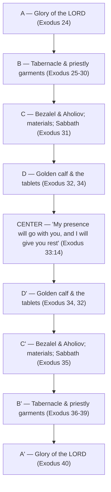

# Falling on Joyful Faces

BEMA 23 · Session 1
Source transcript: `~/workspace/bema/transcripts/1-23-falling-on-joyful-faces.md`
Book: Exodus (Exodus 24–40 covered; with Genesis 2, Leviticus 9, 2 Chronicles 7, Acts 2)

> A "twist the gem" episode: the hosts refuse to skim the long, "boring" Tabernacle section (Exodus 24–40) and instead show it is a deliberate **retelling of the Genesis Creation story** — seven sayings, a seventh-day Sabbath, finished-and-blessed work, cherubim guarding the Tree of Life. The whole structure is a chiasm whose center is "my presence will go with you, and I will give you rest." The payoff: at the Tabernacle's grand opening, fire falls and the people fall on their faces — not in fear, but in **joy**. The convicting question for the "new temple" (us): are we known for that?

## Key Lessons

- **The Tabernacle is a mobile retelling of Genesis 1–3.** Marty, three times for emphasis: *"This Tabernacle story is the Genesis Creation story."* The "Tent of Meeting" is the tent of *moed* — the center of the Genesis 1 chiasm — so *"This Tabernacle is like a mobile Genesis 1-3 that you carry around all throughout the desert. That's what it's designed to remind you of."*
- **Seven sayings echo the seven sayings of Creation.** Marty has Brent read seven identical "The Lord said to Moses" verses (Exod 25:1; 30:11,17,22,34; 31:1,12). Brent: *"that was seven, Marty."* Marty: *"Can we think of anything else that was made, built, or created with seven sayings?"* Brent: *"God said, 'Let there be whatever.'"* The seventh saying is about **Sabbath** (Exod 31:12-13), mirroring the seventh day.
- **The Tabernacle's completion is worded like Creation's completion.** "So Moses finished the work" (Exod 40:33) and "Moses blessed them" (Exod 39:43) echo Genesis 2:2-3 ("God finished the work... blessed the seventh day"). Marty: *"That sounds eerily similar, almost, in some places, word for word for what we read right out of Genesis."*
- **The Law is the "Tree of Life," guarded by cherubim — just as in Eden.** The Ark holds the Law, which a modern JPS *Tanakh* titles *Tree of Life*; cherubim guard Eden's Tree of Life and are woven on the Holy of Holies curtain. Marty: *"we've got the same. This... Tabernacle is a retelling."*
- **The whole section is a chiasm centered on rest.** Marty's "skeleton practice" surfaced the symmetry (glory→Tabernacle→Bezalel→Sabbath... and back); its center is Exodus 33:14. Brent: *"'My presence will go with you, and I will give you rest.'"* Rest is the point of the whole structure.
- **The grand opening ends in joy, not fear — and that is the convicting question for the new temple.** At the Tabernacle's opening fire consumes the sacrifice and the people *"shouted for joy and fell face down"* (Lev 9:24); the same happens at the Temple (2 Chron 7). Marty, via Ray Vander Laan: Pentecost opened a third temple — *us* — so *"people would fall on their face, not with fear, but out of joy."* Marty's conviction: *"I do not believe we are known for that. We are known for instilling... fear, not joy."*

## East/West Lens

- **Words (word-picture / repetition carries meaning)** — The repeated instructions, repeated "The Lord said to Moses," and the triple "This Tabernacle story is the Genesis Creation story" are Hebraic emphasis-by-repetition, not Western redundancy to be edited out.
- **Numbers / symbol** — *Seven* sayings deliberately evoke the seven sayings of Creation; the seventh is Sabbath. Marty: *"Seven, that feels like a very interesting number."*
- **One word, a range of pictures** — Brent: *"one word has a whole range of meanings and pictures... We talked about ruach being wind and breath and spirit. And moad being... this whole range of ideas."* *Moed* (season/meeting/festival) ties Tent, chiasm-center, and festival together.
- **Truth over time (unfolding, not static)** — The same creation-rest pattern unfolds forward: Tabernacle 1.0 → Temple (Tabernacle 2.0) → the Pentecost temple. Marty: *"there are two creations, there are two buildings of things."*
- **Community vs individual** — The response at every grand opening is corporate: *all* the people fall face down together and worship (Lev 9; 2 Chron 7); the "new temple" is likewise a people, a *"mobile invitation to enter God's rest."*
- **God's description (concrete relationship vs abstract attributes)** — God is known not as an abstract list of attributes but by what the people have *experienced* in the desert; they have *"gotten to know this God... well enough that they didn't fall down on their face in fear."*

## Recurring Through-lines

- **Trust the story / say no to fear.** The climax reverses the expected fear-response: fire falls and the people shout for *joy*, because they have come to know God's goodness. Marty: *"That's not fear. That's joy."* This is the Session-1 arc (fear vs trust) landing on the Tabernacle. Recurs across the corpus; condensed at the Session 1 capstone (episode 32).
- **Sabbath / rest (callback to the Creation chiasm and the manna test).** The seventh saying is Sabbath; the chiasm's center is "I will give you rest"; the Tabernacle is a *"call to be a place of rest."* Same rest first met in Genesis 1 and the manna of Exodus 16. Flag for cross-reference; do not re-explain.
- **The Genesis 1 chiasm and *moed* (callback to the BEMA Genesis 1 episode).** Brent names it directly: *"It should remind everyone of our favorite episode on Genesis 1"* — the Tent of *moed* is the center of that chiasm.
- **God desires relationship / presence over mechanics.** Across Session 1 the "boring" machinery (law, cubits, curtains) keeps resolving into relationship; here all 50 chapters of Tabernacle detail resolve into "my presence will go with you." The partnership arc of Session 1.
- **The wedding / Sinai covenant (callback to ep. 22).** Marty opens by reviewing the Sinai "wedding" and "kingdom of priests," placing this Tabernacle episode inside that just-consummated covenant.

## Episode Flow (coverage backbone)

1. **Review & framing** — Session recap (preface Gen 1–11; family Gen 12–50; rescue; the Sinai wedding) and the plan to "twist the gem" on Exodus 24–40, the section readers dread (cubits, rings, curtains) — and the oddity that the instructions are given *twice*, with the golden calf sitting between the two sets.
2. **The seven sayings** — Brent reads seven "The Lord said to Moses" verses; seven = the seven sayings of Creation.
3. **The seventh saying is Sabbath** — Exodus 31:12-13 (the seventh) is about Sabbath, mirroring the seventh day of Creation (Gen 2:2-3).
4. **Finished and blessed work** — Exodus 40:33 ("Moses finished the work") and 39:42-43 ("Moses blessed them") echo Genesis 2 word-for-word.
5. **Cherubim and the Tree of Life** — the Ark holds the Law (the "Tree of Life"); cherubim guard Eden's Tree and the Holy of Holies curtain.
6. **Tent of *moed*** — the Tent of Meeting = tent of *moed* = center of the Genesis 1 chiasm; a mobile Genesis 1–3.
7. **The skeleton practice & the chiasm** — Marty's subtitle-memorization discipline surfaced the Exodus 24–40 chiasm (later validated by Fohrman), centered on Exodus 33:14 ("I will give you rest").
8. **Grand opening 1.0 (Tabernacle)** — Leviticus 9:23-24: fire consumes the sacrifice; the people shout for *joy* and fall face down.
9. **Grand opening 2.0 (Temple)** — 2 Chronicles 7:1-3: identical pattern — fire, glory, faces to the ground, "his love endures forever."
10. **Grand opening 3.0 (Pentecost / us)** — Ray Vander Laan's challenge: the new spirit-filled temple is us; are we known for people falling on *joyful* faces, or for instilling fear?
11. **Pastoral close** — Brent: a huge sweep of Scripture covered as framework; a deep dive is promised in Session 6; "just keep going."

**Coverage verification:** Every verse printed in the transcript header is addressed above — Exod 31:12-13 (seventh saying/Sabbath, items 2–3), Exod 33:14 (chiasm center, item 7), Exod 39:42-43 & 40:33 (finished/blessed, item 4), Gen 2:2-3 (Creation parallel, items 3–4), Lev 9:23-24 (grand opening 1.0, item 8), 2 Chron 7:1-3 (grand opening 2.0, item 9), plus Exod 25:1; 30:11,17,22,34; 31:1 (the seven sayings, item 2) and the Pentecost/Acts 2 application (item 10).

## Narrative Tensions

Each entry: surface problem, classification tag, cited quote, normalized verse citation + link, and resolution or open flag.

| Surface problem | Tag | Cited quote (speaker) | Verse citation + link | Resolution / status |
|---|---|---|---|---|
| Why does Exodus repeat all the Tabernacle instructions *twice* instead of just saying "and Moses did it exactly"? | `unstated-cultural-assumption` | Marty: *"the instructions are given twice... You would think that... the author of Exodus would have simply said, and Moses did it exactly."* | [Exodus 25:1](https://www.biblegateway.com/passage/?search=Exodus%2025%3A1&version=NIV) | **Resolved (Hebraic lens):** The repetition is deliberate emphasis; the golden calf sits between the two sets, and the whole frames a Creation-echoing chiasm. |
| Why would Marty make Brent read seven verses that are all the identical sentence "The Lord said to Moses"? | `logic-gap` | Marty: *"Why would Marty have Brent read those verses?... did they happen to notice how many references there were?"* | [Exodus 31:1](https://www.biblegateway.com/passage/?search=Exodus%2031%3A1&version=NIV) | **Resolved:** The *count* is the point — seven sayings echo the seven sayings of Creation. |
| Is "seven sayings = Creation" just a coincidence, or a real connection? | `logic-gap` | Brent (voicing the skeptic): *"there's seven. That's a neat coincidence... I think that's a stretch. But wait, there's more."* | [Genesis 2:2-3](https://www.biblegateway.com/passage/?search=Genesis%202%3A2-3&version=NIV) | **Resolved (cumulative case):** The seventh saying is Sabbath, the completion language matches, and cherubim/Tree of Life align — the pattern is too dense to be coincidence. |
| Can an ordinary reader legitimately "find" a chiasm no teacher pointed out? | `logic-gap` | Marty: *"Can I find a chiasm without somebody showing it to me?... I didn't trust myself."* | [Exodus 33:14](https://www.biblegateway.com/passage/?search=Exodus%2033%3A14&version=NIV) | **Resolved:** Later validated — *"Fohrman did end up talking about this chiasm."* The center is Exodus 33:14 ("I will give you rest"). |
| Why would people fall on their faces at the grand opening — isn't that obviously *fear*? | `unstated-cultural-assumption` | Marty: *"Of course they fell on their face, but that's not what it said."* | [Leviticus 9:23-24](https://www.biblegateway.com/passage/?search=Leviticus%209%3A23-24&version=NIV) | **Resolved (close reading):** The text says they *"shouted for joy"* — they knew God's goodness; the response is joy, not fear. |
| If the first two temples opened with joyful faces, what should the *new* temple (us) be known for? | `unstated-cultural-assumption` | Marty: *"I do not believe we are known for that. We are known for instilling... fear, not joy in people."* | [2 Chronicles 7:1-3](https://www.biblegateway.com/passage/?search=2%20Chronicles%207%3A1-3&version=NIV) | **Open — convicting application:** Left as a challenge: be a "mobile invitation to enter God's rest" where people fall on *joyful* faces. |

## The Exodus 24–40 Chiasm

The episode's structural spine is a chiasm Marty first noticed through his "skeleton practice" (memorizing subtitles) and later saw validated in Fohrman. Its center is the promise of rest.

Prose: the arms mirror in reverse (glory→glory, Tabernacle/garments→Tabernacle/garments, Bezalel+Sabbath→Bezalel+Sabbath, calf/tablets→calf/tablets), driving the reader inward to Exodus 33:14 — rest in God's presence as the heart of the whole Tabernacle section. (The seven-sayings/Creation echo and the Fohrman attribution are drawn directly from the transcript; Fohrman "talked about this chiasm slightly differently than I had drawn it out.")

## Terminology

- **moed / moad** (מוֹעֵד) — appointed time, season, meeting, festival. The "Tent of Meeting" is the tent of *moed* — the same word at the center of the Genesis 1 chiasm, tying the Tabernacle back to Creation. Marty: *"It is a tent of moad."*
- **keruvim** (כְּרֻבִים) — cherubim; they guard the way to the Tree of Life in Genesis and are woven on the curtain of the Holy of Holies. Brent: *"The keruvim. The cherubim."*
- **ruach** (רוּחַ) — wind / breath / spirit; cited by Brent as the example of a single Hebrew word carrying a whole range of pictures (as *moed* does).
- **Tree of Life** — a modern title (on a JPS *Tanakh*) for the Torah/Chumash; the Law in the Ark is the "Tree of Life," echoing Eden. Marty: *"The Tree of Life is one of the more modern references to a copy of Torah."*
- **Chumash / Tanakh** (חֻמָּשׁ / תַּנַ"ךְ) — names for the Torah / Hebrew Bible.
- **Tent of Meeting** — the common English rendering of the tent of *moed*; "not a bad translation at all," but it hides the *moed*/Creation link in English.

## Illustrations & Analogies (from the episode)

- **Remodeling the new house / IKEA fixtures.** Marty likens God's delight in the Tabernacle's exhaustive detail to Brent and Maggie endlessly re-decorating their Idaho house, or a family debating fixtures in IKEA. Marty: *"I just picture God going, I just love this part. Don't you just love picking out the... polished silver?"* — reframing the "boring" detail as loving care.
- **The "skeleton practice."** Marty's spiritual discipline of memorizing all the NIV subtitles ("the skeleton that it hangs on") so he could see Scripture's structure — the practice that let him notice the Exodus 24–40 chiasm. Marty: *"I wanted to see how... I'm going to have a more working familiarity with the text."*
- **Ray Vander Laan's finger in the chest, in the desert.** Marty recalls RVL turning and pointing at him: the Pentecost temple is *you*; what should happen when people meet it? *"people would fall on their face, not with fear, but out of joy."*

## References & Recommendations (named in the episode)

- Ray Vander Laan (RVL), *That the World May Know* (Focus on the Family), **Vol. 10** — faith lessons **"Build Me a Sanctuary"** and **"Making Space for God."** Marty: *"you'll see how much of those lessons I learned in this episode."*
- Rabbi David Fohrman — treated the Exodus 24–40 Tabernacle chiasm (slightly differently than Marty had drawn it), later validating Marty's observation.
- JPS *Tanakh* / *Tree of Life* edition — the modern title echoing Genesis.
- Blue Letter Bible / Bible Hub — recommended tools for the suggested *moed* word study on "Tent of Meeting."
- The grand openings of the Tabernacle (Lev 9), the Temple (2 Chron 7), and the new temple at Pentecost (Acts 2).

## Discussion Questions

1. Marty reads the Tabernacle's exhaustive detail as God's *delight* ("don't you just love picking out the polished silver?"), not tedium. Where have you treated a "boring" part of Scripture as something to endure rather than a place where God is lovingly present?
2. The Tabernacle is built as a mobile Genesis 1–3 — seven sayings, a seventh-day Sabbath, finished-and-blessed work, cherubim and the Tree of Life. Which of these echoes most surprises you, and what does it suggest about why the "boring" section is there?
3. The chiasm's center is Exodus 33:14: "My presence will go with you, and I will give you rest." If *rest in God's presence* is the heart of all 50 chapters of Tabernacle instruction, what competes with that rest in your own life?
4. At every grand opening the people fall on their faces for *joy*, not fear, because they had come to know God's goodness in the desert. Where has your experience of God shaped whether you approach him with fear or with joy?
5. Ray Vander Laan says *we* are the new temple opened at Pentecost. Marty admits the church is "known for instilling fear, not joy." Honestly: are the people and communities you're part of places where others fall on *joyful* faces? What would need to change?
6. Marty "didn't trust himself" to name a chiasm no one had taught him. When have you noticed a real pattern in a text (or your life) but talked yourself out of trusting it? What validated it later?

## Sources

- Transcript: `1-23-falling-on-joyful-faces.md`
- [Exodus 25:1 (NIV)](https://www.biblegateway.com/passage/?search=Exodus%2025%3A1&version=NIV)
- [Exodus 30:11 (NIV)](https://www.biblegateway.com/passage/?search=Exodus%2030%3A11&version=NIV)
- [Exodus 30:17 (NIV)](https://www.biblegateway.com/passage/?search=Exodus%2030%3A17&version=NIV)
- [Exodus 30:22 (NIV)](https://www.biblegateway.com/passage/?search=Exodus%2030%3A22&version=NIV)
- [Exodus 30:34 (NIV)](https://www.biblegateway.com/passage/?search=Exodus%2030%3A34&version=NIV)
- [Exodus 31:1 (NIV)](https://www.biblegateway.com/passage/?search=Exodus%2031%3A1&version=NIV)
- [Exodus 31:12-13 (NIV)](https://www.biblegateway.com/passage/?search=Exodus%2031%3A12-13&version=NIV)
- [Exodus 33:14 (NIV)](https://www.biblegateway.com/passage/?search=Exodus%2033%3A14&version=NIV)
- [Exodus 39:42-43 (NIV)](https://www.biblegateway.com/passage/?search=Exodus%2039%3A42-43&version=NIV)
- [Exodus 40:33 (NIV)](https://www.biblegateway.com/passage/?search=Exodus%2040%3A33&version=NIV)
- [Genesis 2:2-3 (NIV)](https://www.biblegateway.com/passage/?search=Genesis%202%3A2-3&version=NIV)
- [Leviticus 9:23-24 (NIV)](https://www.biblegateway.com/passage/?search=Leviticus%209%3A23-24&version=NIV)
- [2 Chronicles 7:1-3 (NIV)](https://www.biblegateway.com/passage/?search=2%20Chronicles%207%3A1-3&version=NIV)
- [Acts 2 (NIV)](https://www.biblegateway.com/passage/?search=Acts%202&version=NIV)
- Referenced resources named in the episode (not web-fetched): Ray Vander Laan, *That the World May Know* Vol. 10 ("Build Me a Sanctuary," "Making Space for God"); Rabbi David Fohrman (the Exodus 24–40 Tabernacle chiasm); JPS *Tanakh* / *Tree of Life* edition; Blue Letter Bible; Bible Hub.
