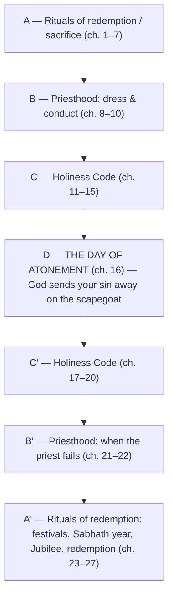

# A Kingdom of What?

BEMA 25 · Session 1
Source transcript: `~/workspace/bema/transcripts/1-25-a-kingdom-of-what.md`
Book: Leviticus — a **10,000-foot (or, per Brent, "100-kilometer on Blue Origin") overview** of the whole book in a single episode, not a verse-by-verse study
Hosts: Marty Solomon & Brent Billings

> After the Tabernacle has been built, Israel is left standing there asking, "And now what?" Marty's framing: **Leviticus is the owner's manual in the glove box of the Tabernacle** — the instruction book on how to be the thing God called them to back at Sinai: *"a kingdom of priests and a holy nation"* (Exodus 19:6). The episode walks the book as five sections that form a chiasm centered on the Day of Atonement, and unpacks the fourfold role of a priest. The payoff for the Session 1 partnership arc: the Law is not a burden — it is the gospel, equipping a whole-nation priesthood to put a God of love on display to the world.

## Key Lessons

- **Leviticus answers the question Exodus 19 raised: "a kingdom of priests" — a *whole* kingdom of them.** Marty lingers on the strangeness of the phrase: *"a kingdom has priests. It's not a kingdom of priests. You want us to be an entire kingdom of priests?... the whole kingdom is priests?"* And they have no reference point — *"imagine getting a manual for a car, but you've never even seen a car before."* Leviticus is God's answer: *"I have sent you the book of Leviticus for this very purpose."*
- **The book begins with atonement on purpose — grace first, so everything after is not performative.** Marty: *"if I don't start with atonement... then everything else that I do is going to be performative. It's going to be production based."* The energy is meant to match Sabbath and the blood path: *"We experience grace first, and the things that we do after that, not performative... atonement is where the story begins."* And it is not a bloodbath — *"one goat for the whole nation in the morning and the evening. This is not a God that's demanding all of this sacrifice, all this violence, all this blood."*
- **The fourfold role of the priest.** Taught to Marty by one of his teachers: (1) **put God on display** — *"your covenantal role, your mission, is to be a walking billboard for God"*; (2) **help people navigate their atonement** — *"The priest uses rules to minister to the worshiper... from a guilty conscience to a clean conscience"*; (3) **intercede on behalf of others** — the priest *"stands in the gap"* and goes *"both directions"*; (4) **distribute resources to those in need** — *"this distributive justice... making sure that people have in God's household."*
- **The purity/holiness laws are about distinctness, not inherent wrong — and not primarily about health.** Marty: *"Kosher law is about you becoming a distinct people, a peculiar people, a people that put God on display."* The health reading overreaches: *"That line of reasoning won't roll the whole way out to the Levitical code."* God repeatedly says *"All the nations do this. I want you to be different."*
- **God commands the party — "you will party or you will die."** Marty was taught to beware the party; Leviticus 23–24 commands festivals (*moadim*). *"God was the one who ordained the party... the party that reminds myself to trust the story."* And a right party changes you — it sends you out to care for the oppressed (Sabbath year, Jubilee, redemption).
- **The Law *is* the gospel.** The whole chiasm centers on the Day of Atonement — *"Your sins are thrown out the window as far as the east is from the west."* Marty: *"We always act like the Law was this really oppressive, burdensome thing... The Law was the gospel... God loves to take your sin and forgive it."*
- **This is us, too (1 Peter 2).** *"all of us as Christian followers of Jesus, Jew or Gentile, are called to be a priesthood in the same way"* — so the self-examination: do we put God on display, help people navigate atonement, intercede, and distribute?

## East/West Lens

- **Community vs individual** — The call is to a *whole kingdom* of priests and a *holy nation*; even the individual purity laws exist "because I'm a priest for the rest of the world." Belovedness and mission are corporate, not private.
- **Faith as relational experience vs intellectual creeds** — Atonement is enacted and embodied (sacrifice, a shared fellowship meal) rather than argued: *"you sit down with... the other party that you've offended and a priest and you eat."* Knowing you are right with God is a relational restoration, not a doctrinal checkbox.
- **God's description (concrete relationship / marriage)** — The Tabernacle is read as honeymoon suite; "treasured possession" is *"marital language."* God is described through relationship and intimacy (the "table of faces"), not abstraction.
- **Numbers / symbol over literal** — The tassel: *"seven of them white, one of them blue"* — blue is "the color of priesthood"; the one blue thread in a white tassel is a symbolic reminder to look different. Symbol teaches the covenant role.
- **Truth over time (unfolding, dynamic)** — Marty repeatedly defers questions ("we'll get to that later... in the book of Deuteronomy"); meaning accrues across the journey, and even Brent notes Leviticus only opens up "when I have this framework" after multiple readings.

## Recurring Through-lines

- **Trust the story (the arc itself).** Atonement-first carries "the same energy as Sabbath. Trust the story. Trust that you're loved," and the God-ordained party exists so that "you have to remind yourself that the story is good." Leviticus reinforces the Session 1 partnership arc: God's covenant partner is equipped, loved, and sent. (Condensed at the Session 1 capstone, episode 32.)
- **A God of love / grace revealed across the journey (callback to the blood path, the bow, "a thousand to three").** Marty gathers the arc explicitly: *"a God who is a thousand to three, a God who will walk the blood path, a God who will put his bow up in the clouds... a God that's full of grace and love."* The priesthood exists to broadcast exactly this God.
- **Sabbath / rest (callback to eps. 1, 20, 22, 24).** Returns as the reference energy for atonement ("the same energy as Sabbath") and expands into the Sabbath year and Jubilee (Leviticus 25) — rest extended to land, debts, and people.
- **Creation / Genesis 1 chiasm (callback).** The *moadim* — the center word of the Genesis 1 chiasm (*moed*/"appointed times, sacred times") — reappears as the biblical festivals; the Tabernacle was "a mobile Genesis 1."
- **Mastering the impulse / grace over performance ("master the beast," ep. 3).** The atonement-first logic directly counters performative, "production based" religion — the same pull to be driven rather than beloved that the arc keeps naming.

## Narrative Tensions

This is an overview episode, not a narrative passage, so the "tensions" are surface problems a modern reader brings to Leviticus — each one the hosts explicitly surface and resolve.

| Surface problem | Tag | Cited quote (speaker) | Reference | Resolution / status |
|---|---|---|---|---|
| Leviticus looks "bloody," "barbaric," like endless slaughter for every sin. | `unstated-cultural-assumption` | Marty: *"one goat for the whole nation in the morning and the evening. This is not a God that's demanding all of this sacrifice, all this violence, all this blood."* | Leviticus 1–7 | **Resolved:** Sacrifice was normal in the ancient Near East; God requires *less*, and gives a way "to make sure that you know you're right before Him." |
| Why build a huge, impractical tent in the desert — and then what do you do with it? | `logic-gap` | Marty: *"of all the things you could do in the desert, survival ranks up there at the top of the list. But then build a really big tent..."* / Brent: *"Not so practical for a nomadic people."* | Exodus → Leviticus | **Resolved:** Exodus says how to build it; Leviticus is the "owner's manual in the glove box" that says what it's for. |
| Isn't "kingdom of priests" just a kingdom that *has* priests? | `translation-disagreement` | Marty: *"a kingdom has priests. It's not a kingdom of priests... you want a whole kingdom of priesthood."* | [Exodus 19:5–6](https://www.biblegateway.com/passage/?search=Exodus%2019:5-6&version=NIV) | **Resolved:** The phrase means the entire nation is called to the priestly vocation toward the world. |
| Aren't the kosher/purity laws really about ancient health? | `unstated-cultural-assumption` | Marty: *"it is a mistake to say that's the reason behind kashrut... That line of reasoning won't roll the whole way out to the Levitical code."* | Leviticus 11–20 | **Resolved:** The purpose is distinctness — "a peculiar people... that put God on display"; health is at most an incidental benefit. |
| Leviticus 27's price tags on people (men vs women, slaves, young/old) feel "icky." | `unstated-cultural-assumption` | Brent: *"to us, thousands of years later, yeah, this is crazy... But when you realize what all of the other nations around them were doing... this is revolutionary."* | Leviticus 27 | **Resolved (contextual):** It is a mechanism to *redeem people back* into the household; against a world where "women aren't people," recognizing every category as human is revolutionary. |
| Why does the Day of Atonement get a huge dedicated chapter when it's "listed" among the festivals and seems not to "belong" in the Holiness Code? | `logic-gap` | Marty: *"It's so awkward because it doesn't belong in the Holiness Code... It's because it's the center of the chiasm... the whole point of the entire book."* | Leviticus 16 | **Resolved:** Its placement/weight is structural — it sits at the chiasm's center because forgiveness is the book's whole point. |

## Chiasms & Structure

Marty teases the structure with the "priest-wich" (two priesthood sections as the bread, the Holiness Code in the middle) and then names the full book-length chiasm, centered on the Day of Atonement. The front half is "how I approach God"; the back half is "how we help other people get close to God" (a reading he credits to his friend Paul).

**The five teaching sections (coverage backbone / Episode Flow):**

| # | Section (Marty's labels) | Chapters (loose) | Core point + citation |
|---|---|---|---|
| 1 | **Atonement / sacrifices** | 1–7 | Grace first; not a bloodbath. *"atonement is where the story begins."* |
| 2 | **Priesthood ("the priest-wich," front) + when the priest fails (back)** | 8–10 / 21–22 | How a priest dresses, conducts himself, and what happens *"when the priest makes a mistake."* |
| 3 | **Holiness Code — living as a priest** | 11–20 | Kosher, cloth, farming, relationships — distinctness: *"I want you to be different."* |
| 4 | **How to party (the *moadim*)** | 23–24 | *"God was the one who ordained the party."* |
| 5 | **Caring for the oppressed** | 25–27 | Sabbath year, Jubilee, redemption: *"how you cancel debts and forgive all the people that owe you."* |

**Coverage verification:** every section the hosts walk (1–7, 8–10, 11–20, 21–22, 23–24, 25–27), the chiasm, the Day of Atonement center (ch. 16), the fourfold priestly role, the tassel/blue-thread image, the "owner's manual" frame, and the closing 1 Peter 2 self-reflection are all represented above and below.

## Terminology

- **kadosh** (קָדוֹשׁ) — holy; "to be set apart, to be different." Marty: priests are set apart from Israel, Israel from the nations — *"not because other ways are wrong,"* but to put God on display.
- **moed / moadim** (מוֹעֵד / מוֹעֲדִים) — appointed time(s), season(s), festival(s); the center word of the Genesis 1 chiasm. *"It's literally the word for parties, the festivals, the moadim"* — the God-ordained celebrations of Leviticus 23–24.
- **kashrut / kosher** — the dietary and purity laws (Leviticus 11–20). Marty: their purpose is distinctness — *"you becoming a distinct people, a peculiar people"* — not merely ancient health.
- **tallit** — the prayer garment with tassels on its four corners; Marty wears one "as a Jewish follower of Jesus." Each tassel carries a blue thread (Numbers 15), *"because that's what God said to do"* — blue being "the color of priesthood."

## Illustrations & Images

- **The owner's manual in the glove box** (Marty) — *"Leviticus is the owner's manual in the glove box of the tabernacle."* He confesses he both loves and hates it because he hates "B-I-B-L-E... Basic Instructions Before Leaving Earth," but it captures the "and now what?" moment after the tent is built. Brent extends it: *"Imagine being given a car and having never seen a car before"* — the ancient reader has no reference for "priest" either.
- **The "priest-wich"** (Marty) — a Jimmy John's-style sandwich: two priesthood sections (ch. 8–10, 21–22) as the "bread" with the Holiness Code in the middle — a mnemonic that smells like "a chiasm sandwich."
- **The blue thread in the white tassel** (Marty) — *"if the rest of the nations are like the white threads, I'm supposed to be a blue thread in a white tassel"* — the lived image of putting God on display.
- **The priest standing in the gap** (Marty) — the arrow diagram: the priest *"sits in between God and Israel... and the priest goes both directions."* Moses on Sinai ("Blot my name out of the book of life, but don't hurt your people") is "doing the job of a priest."
- **The high-priest garment of 100% linen** (Marty) — looks heavy and impractical for the desert, but *"it breathes so well... God knew what he was doing"* — concretizing "set apart / different."
- **Check your clothing tags** (Brent) — *"Take 10 items out of your drawer right now and look at the tags and see how many of them are 100%"* — a modern felt-sense of the no-mixed-fibers law.
- **The fellowship offering as a shared meal** (Marty/Brent) — part burned to God, part eaten with the offended party and a priest; and the Levites' portion is literally "their grocery store" — details neither host was taught growing up.

## References & Resources (named in the episode, not web-fetched)

- **Rabbi Jonathan Sacks**, *Covenant and Conversation: Leviticus — The Book of Holiness* (also free on Sefaria) — Marty's recommended Leviticus resource.
- **Rabbi David Fohrman** — teaching series on the *moadim* / biblical festivals.
- **Numbers 15** — the command to put tassels with a blue thread on the corners of one's garment.
- **1 Peter 2:9–10** — "a chosen people, a royal priesthood, a holy nation... once you had not received mercy, but now you have received mercy." Brent notes it appears twice and wonders if Peter is "making a chiasm here."
- **"Paul," a friend of the hosts** — credited with the reading that the chiasm's front half is "how I approach God" and the back half "how we help other people get close to God."

## Callbacks

- **Exodus 19:5–6 at Sinai** — the whole episode is the answer to the "kingdom of priests / treasured possession" promise; Brent memorized it on the 2016 trip.
- **"Under the Chuppah" / the Tabernacle as honeymoon suite** (ep. 22) — the "table of faces," "treasured possession" as marital language, intimacy and communion.
- **The Tabernacle as a mobile Genesis 1 / "Creating a Space"** (eps. 23–24) — "a retelling of the Creation story... packing up the story and taking it with you."
- **The blood path, the bow in the clouds, "a thousand to three"** (eps. 4, 10, 20) — gathered as the portrait of the God the priesthood exists to display.
- **Sabbath / "trust the story"** (eps. 1, 20) — the energy atonement is meant to carry, extended into the Sabbath year and Jubilee.
- **The Genesis 1 chiasm's center word, *moed*** — recalled directly to explain the *moadim*.
- **"Falling on Joyful Faces"** (ep. 23) — invoked as the picture of people who have "navigated their atonement": they fall on their face and shout "The Lord is good. His love endures forever."

## Discussion Questions

1. Marty says if you don't "start with atonement," everything else becomes "performative... production based." Where in your spiritual life do your practices feel attached to earning God's acceptance rather than flowing from it?
2. The call is to a *whole kingdom* of priests. Taking the fourfold role (put God on display, help people navigate atonement, intercede, distribute resources), which comes most naturally to you — and which do you most avoid?
3. "Something should set us apart... when people look at my life, they would be like, 'Man, that's different.'" What, concretely, makes your life visibly different from "the nations" — in how you consume, relate, or spend — and is anything actually distinct?
4. Marty was taught to "beware the party"; Leviticus commands it ("you will party or you will die"). Do you find it harder to practice self-denial or genuine, God-honoring celebration — and what does that reveal?
5. The priest "stands in the gap" and fights "for any loophole you can possibly think of to get them in." Where are you more inclined to make clear who's "out" than to intercede for them?
6. Brent reread "once you had not received mercy, but now you have received mercy" as about *taking mercy in*, not just being offered it. Where have you been offered God's mercy but not yet "been willing to hold onto" it?

## Sources

- Transcript: `1-25-a-kingdom-of-what.md`
- [Exodus 19:5–6 (NIV)](https://www.biblegateway.com/passage/?search=Exodus%2019:5-6&version=NIV)
- [Leviticus 1–7 (NIV)](https://www.biblegateway.com/passage/?search=Leviticus%201-7&version=NIV)
- [Leviticus 8–10 (NIV)](https://www.biblegateway.com/passage/?search=Leviticus%208-10&version=NIV)
- [Leviticus 11–20 (NIV)](https://www.biblegateway.com/passage/?search=Leviticus%2011-20&version=NIV)
- [Leviticus 16 — the Day of Atonement (NIV)](https://www.biblegateway.com/passage/?search=Leviticus%2016&version=NIV)
- [Leviticus 21–22 (NIV)](https://www.biblegateway.com/passage/?search=Leviticus%2021-22&version=NIV)
- [Leviticus 23–24 — the festivals (NIV)](https://www.biblegateway.com/passage/?search=Leviticus%2023-24&version=NIV)
- [Leviticus 25–27 — Sabbath year, Jubilee, redemption (NIV)](https://www.biblegateway.com/passage/?search=Leviticus%2025-27&version=NIV)
- [Numbers 15 — tassels with a blue thread (NIV)](https://www.biblegateway.com/passage/?search=Numbers%2015&version=NIV)
- [1 Peter 2:9–10 (NIV)](https://www.biblegateway.com/passage/?search=1%20Peter%202:9-10&version=NIV)
- Referenced resources named in the episode (not web-fetched): Rabbi Jonathan Sacks, *Covenant and Conversation: Leviticus — The Book of Holiness* (also on Sefaria); Rabbi David Fohrman (teaching on the *moadim*).
