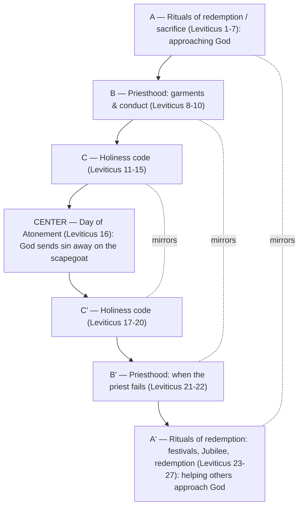

# A Kingdom of What?

BEMA 25 · Session 1
Source transcript: `transcripts/1-a-kingdom-of-what-25.md`

## Key Lessons

- **God calls Israel to be a *kingdom of priests* — not a kingdom that *has* priests, but a whole people who are priests to the world.** Marty: *"You want us to be an entire kingdom of priests? Like the whole kingdom is priests?"* This is the arc itself — **trust the story; God does not change what he wants or what matters.** From Abraham ("bless all nations") onward God has wanted a people who mediate his character to everyone else; Leviticus is the "owner's manual" for exactly that calling.

- **Leviticus starts with *atonement* — grace first — so everything after is never performative.** Marty: *"before we talk about what you're going to wear, or what you can eat... let's make sure that it's not connected to whether or not you and I are okay... We experience grace first."* The same energy as Sabbath and the blood path: you are loved first, then you act.

- **The Law is the gospel — the whole book is a chiasm centered on the Day of Atonement, where God sends your sin away.** Marty: *"The Law was the gospel... a chiasm that reinforces the same gospel truth... God loves to take your sin and forgive it."* The structural heart of Leviticus is sin thrown "as far as the east is from the west."

- **A priest has a fourfold role: put God on display, help people navigate atonement, intercede for others, and distribute resources to those in need.** This is the job description for Israel — and, per 1 Peter 2, for the church. Marty applies it convictingly: Christians often "double down on how clearly we think others don't belong," which is "an anti-priest move."

- **The purpose of the "set-apart" laws (kosher, clothing, farming) is distinctness that puts God on display — not that other ways are inherently wrong.** Marty: *"Kosher law is about you becoming a distinct people... God says, 'All the nations around you do this. That is why I'm asking you to be different.'"* Being *kadosh* (holy = set apart) is missional, not moralistic — and God's festivals ("you will party or I will cut you off") are commanded celebration of that grace.

## East/West Lens

- **Community vs individual** — The calling is corporate: an entire *kingdom* of priests, a people set apart as a body to serve the nations. Marty: *"my job is to stand between God and the nations, God and the world."* Identity is defined by the community's mission, not the individual.

- **Words as word-pictures over abstract definitions** — *kadosh* ("set apart"), *moadim* (festivals/"parties"), the tallit's blue thread (the color of priesthood) all teach through concrete image. Marty: *"in every tassel, you have one thread, the color of priesthood... I'm supposed to be a blue thread in a white tassel."*

- **Error & sin / God's description — relationship over abstraction** — Sacrifice is relational repair, not mechanical penalty: fellowship offerings include sitting down to *eat* with the offended party and a priest. Marty: *"This isn't just a bunch of killing, slaughtering, blood... there is a process... to find that freedom."*

- **Truth over time — dynamic/unfolding understanding** — The "owner's manual for a car you've never seen" captures reading an Eastern text from a Western vantage; and Brent's live re-reading of 1 Peter 2 ("*received* mercy" = *took it in*) models understanding deepening while the text holds still.

## Recurring Through-lines

- **Trust the story (the arc itself).** Named directly: Leviticus' atonement-first structure *"should carry the same energy as grace, as a God who walks the blood path... Trust the story. Trust that you're loved."* The whole book is shown to reinforce the constant truth — God forgives sin and wants a people who display that to the world. Recurs across the whole corpus.

- **The God of grace: a thousand-to-three God, the bow in the clouds, the blood path.** An explicitly recurring BEMA catalog of grace-images, invoked again to answer "what makes our God different." Linked to the arc; noted as cross-episode recurrence.

- **The *moed* / Genesis 1 chiasm center.** The festival word *moadim* recurs from the Genesis 1 chiasm (Episode on Genesis 1) and the Tabernacle episode (BEMA 23); here it names Leviticus' commanded parties. Noted as a cross-episode structural through-line.

- *(Note: the "sin as failing to master the animal instinct" / master-the-beast motif, anchored in `1-master-the-beast-3.md`, is not engaged this episode. Sin is handled through the atonement/Day-of-Atonement lens, not the beast/instinct lens, so the motif is not claimed.)*

## Narrative Tensions

| Surface problem | Tag | Cited quote (speaker) | Verse citation + link | Resolution / status |
|---|---|---|---|---|
| Why build an enormous, portable tent in the desert when survival should be the priority? | `logic-gap` | Brent: *"Not so practical for a nomadic people."* | Exodus 25-40 — https://www.biblegateway.com/passage/?search=Exodus%2025-40&version=NIV | **Resolved (Hebraic lens):** the Tabernacle is the people's center of worship/identity; Leviticus is its "owner's manual" teaching them what the priesthood (and the kingdom-of-priests) is for. |
| "A kingdom of priests" is strange — kingdoms *have* priests; they aren't made *of* priests. | `translation-disagreement` | Marty: *"a kingdom has priests. It's not a kingdom of priests... you want a whole kingdom of priesthood."* | Exodus 19:5-6 — https://www.biblegateway.com/passage/?search=Exodus%2019%3A5-6&version=NIV | **Resolved (Hebraic lens):** the phrase is intentional — the *entire* people are to be priests mediating God to the nations; Leviticus unpacks that vocation. |
| The sacrificial system looks like endless, barbaric slaughter — Jews "everywhere slaughtering animals" for every sin. | `unstated-cultural-assumption` | Marty: *"a sin offering in the morning and a sin offering in the evening. One goat for the whole nation... This is not a God that's demanding all of this... blood."* | Leviticus 1-7 — https://www.biblegateway.com/passage/?search=Leviticus%201-7&version=NIV | **Resolved (Hebraic lens):** sacrifice was culturally normal and far less constant than imagined; it's a *provided way* to a clean conscience, and some offerings are shared meals of reconciliation. |
| The kosher/clothing/farming laws seem arbitrary (why no pork, no mixed fabric, no mixed seed?). | `unstated-cultural-assumption` | Marty: *"Is there anything inherently wrong with pork? Not necessarily."* | Leviticus 11-20 — https://www.biblegateway.com/passage/?search=Leviticus%2011-20&version=NIV | **Resolved (Hebraic lens):** the point is *distinctness* (*kadosh*) to put God on display — "all the nations do this; I want you to be different" — not health or inherent wrongness. |
| Leviticus 16 (Day of Atonement) is a huge, drawn-out deep-dive stuck awkwardly inside the holiness/festival material where it "doesn't belong." | `logic-gap` | Marty: *"this is so awkward because it doesn't belong in the Holiness Code... It's because it's the center of the chiasm."* | Leviticus 16 — https://www.biblegateway.com/passage/?search=Leviticus%2016&version=NIV | **Resolved (Hebraic lens):** its outsized placement marks it as the *center of the book's chiasm* — the whole point: God sends sin away on the scapegoat. |
| Leviticus 27 puts a price tag on people (men costing more than women) — it feels icky and dehumanizing. | `unstated-cultural-assumption` | Marty: *"it feels really icky when we read it. What we don't understand is... God's giving you a way to get people back."* | Leviticus 27 — https://www.biblegateway.com/passage/?search=Leviticus%2027&version=NIV | **Resolved (Hebraic lens):** against a world where women were classed with livestock, treating *all* as redeemable human beings in community is revolutionary; it's a mechanism of restoration, not valuation. |
| God *commands* partying ("you will party or I will cut you off") — jarring to a faith wary of parties. | `unstated-cultural-assumption` | Marty: *"I was never told about the God that said, 'You will party or I will kill you.'"* | Leviticus 23-24 — https://www.biblegateway.com/passage/?search=Leviticus%2023-24&version=NIV | **Resolved (Hebraic lens):** the *moadim* are God-ordained celebrations of grace (not self-indulgence); refusing to celebrate erodes trust in the story. |

## Chiasms & Structure

The hosts explicitly present Leviticus as a chiasm (shown on the episode's slide), centered on the Day of Atonement. Note: Marty first gives a looser five-section outline (atonement; the "priest-wich" of priesthood sections; a holiness code in the middle; festivals; care for the oppressed), then presents the formal chiasm from the slide, which brackets the chapter ranges slightly differently. The formal chiasm as he describes it:

Prose: Their friend Paul's observation layers meaning onto the two arms — the front half (A→C) is about *how I approach God*; the back half (C'→A') is about *how we help others approach God* — mapping onto "love God / love neighbor." The center is the Day of Atonement: an outsized Leviticus 16 that "doesn't fit" the surrounding holiness material precisely because it is the book's structural and theological heart — God forgiving and removing sin.

The hosts also describe the overlapping **"priest-wich"**: two priesthood sections (Lev 8-10 and 21-22) forming the "bread" around the middle, a mirrored sandwich the hosts named before formally identifying the full chiasm.

## Terminology

- **kadosh** (קָדוֹשׁ) — holy; set apart, distinct. Marty: *"that word for set apart is the word kadosh... to be holy, to be set apart, to be different."* God sets priests apart from Israel, and Israel from the nations.
- **moed / moadim** (מוֹעֵד / מוֹעֲדִים) — appointed time(s), season(s), festival(s). Marty: *"It's literally the word for parties, the festivals, the moadim."* The word at the center of the Genesis 1 chiasm.
- **kashrut / kosher** (כַּשְׁרוּת / כָּשֵׁר) — the dietary/purity laws (Lev 11-20). Marty: *"Kosher law is about you becoming a distinct people, a peculiar people."*
- **tallit** (טַלִּית) — the prayer garment with four tasseled corners, each tassel carrying a blue thread (Numbers 15) — blue being the color of priesthood. Marty: *"a reminder of your call to be a kingdom of priests."*

## Discussion Questions

1. God calls a *whole people* to be priests, with a fourfold role (display God, help people navigate atonement, intercede, distribute resources). Which of the four comes least naturally to you or your community — and what would growing in it look like?
2. Leviticus begins with atonement so that nothing afterward is performative — grace first. Where in your spiritual life do you still act as if God's acceptance depends on your performance?
3. Marty calls condemning outsiders "an anti-priest move," since a priest fights for "any loophole to get them in." Where are you tempted to make clear who's *out* rather than interceding to bring people in?
4. The set-apart laws aim at *distinctness* that puts God on display — not that other ways are wrong. What about your life would make someone ask, "Why are you different?" and point them to God? Is anything?
5. God *commands* celebration (the *moadim*). What keeps you from genuine, grace-remembering celebration — and how might regular "God parties" strengthen your trust in the story?

## Sources

- Transcript: `1-a-kingdom-of-what-25.md`
- Exodus 19:5-6 — https://www.biblegateway.com/passage/?search=Exodus%2019%3A5-6&version=NIV
- Exodus 25-40 — https://www.biblegateway.com/passage/?search=Exodus%2025-40&version=NIV
- Leviticus 1-7 — https://www.biblegateway.com/passage/?search=Leviticus%201-7&version=NIV
- Leviticus 8-10 — https://www.biblegateway.com/passage/?search=Leviticus%208-10&version=NIV
- Leviticus 11-20 — https://www.biblegateway.com/passage/?search=Leviticus%2011-20&version=NIV
- Leviticus 16 — https://www.biblegateway.com/passage/?search=Leviticus%2016&version=NIV
- Leviticus 21-22 — https://www.biblegateway.com/passage/?search=Leviticus%2021-22&version=NIV
- Leviticus 23-24 — https://www.biblegateway.com/passage/?search=Leviticus%2023-24&version=NIV
- Leviticus 25-27 — https://www.biblegateway.com/passage/?search=Leviticus%2025-27&version=NIV
- Numbers 15 (tassels with a blue thread) — https://www.biblegateway.com/passage/?search=Numbers%2015&version=NIV
- 1 Peter 2:9-10 — https://www.biblegateway.com/passage/?search=1%20Peter%202%3A9-10&version=NIV
- Rabbi Jonathan Sacks, *Covenant and Conversation: Leviticus — The Book of Holiness* (also free on Sefaria)
- Rabbi David Fohrman (teaching on the *moadim*)
