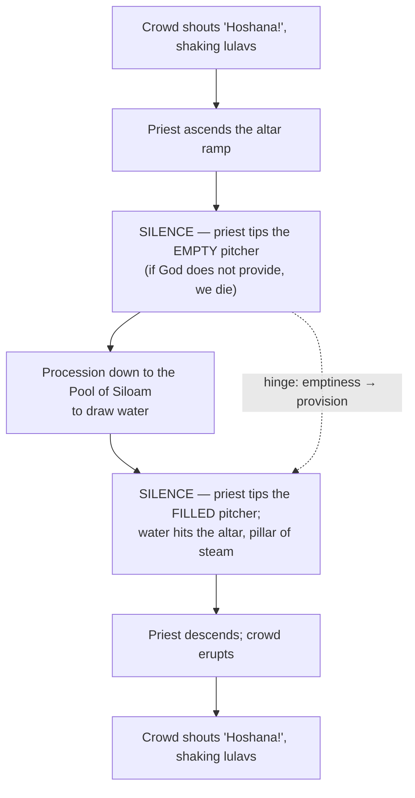

# Images of the Desert - Wadi and En Gedi

BEMA 29 · Session 1
Source transcript: `transcripts/1-29-images-of-the-desert-wadi-and-en-gedi.md`

## Key Lessons

The arc runs straight through this episode: **trust the story — God does not change what he wants or what matters.** From the wadi's blocked sight lines to the living water of En Gedi to the floods, every image returns to the same constant: God is the faithful source and leader, and he has always invited his people both to depend on him and to become sources of his provision for others.

- **The wadi teaches trust: worry about the next step, not the next ten.** You cannot see around the bend, so you learn to follow the shepherd's voice. Marty: "the desert teaches you to trust... It teaches you to just worry about the next step, because you don't know what the next ten steps look like... It teaches you to trust in the intentions of the shepherd." George DeJong's mantra captures it: "Let's see what the Lord provides around the next bend." This is the same trust God has asked for from creation onward.

- **God is our *maim chaim* (living water), and he invites us to be living water for others — the constant partnership.** Marty traces it from Psalm 63 and Jeremiah 2 (God as the spring) to Isaiah 32 and 58 (God's people as streams in the desert): "God is our source of living water, and we're called to be a source of that on His behalf as well." The John 7 payoff: the living water flows "from within us — not Jesus, but us... which fits everything we've learned in the Hebrew scriptures."

- **Settling for "dank" cistern water instead of God's living water is the sin Jeremiah names.** Marty: "God's like, here I am, a spring of *maim chaim*... and they're choosing 'dank.'... broken cisterns that don't even hold water." Trusting the story means refusing stored, stagnant self-reliance in favor of God's fresh provision.

- **Wisdom is about *location*, not building material — build above the wadi, not in it.** Marty overturns the usual reading of Matthew 7: "The driving part of this image... is not about building material... It's about location... which part of the wadi is he building his house in?... At the bottom of the wadi, which is pretty foolish." Hearing *and doing* Jesus' words is building on the bedrock, out of the flood's reach.

- **The least safe place can be a room full of God's people — and that should not be.** Marty's En Gedi confession: for years every "living water" person in his life was someone who "wouldn't say with a loud voice they followed Jesus... the least safe place to be is in a room full of God's people. And that's worth wrestling with because that shouldn't be." The call to be living water for others is the unchanging mission, and it indicts us when we fail it.

## East/West Lens

- **Words** (abstract definitions vs. word-pictures/images). The whole episode decodes concrete Hebrew images — *midbar*, *maim chaim*, *En Gedi*, *tenufa*. Elle on the wave offering: "one of the ways that you can translate that instead of 'wave'... is it's also the word for 'brandish,' and we see it in military contexts" — the image carries the meaning, not an abstract definition.

- **Truth / knowing (experiential vs. rational; how/what vs. who/why).** The desert is a lived crucible, not information. Marty: "You can understand that cerebrally, like intellectually. It's another thing to realize you have no idea what's next... This is where you get really used to following the voice." He adds: "the desert is a crucible."

- **Community vs. individual (Hebraic starts with the community).** Being living water and shade is framed as a communal mission — a "partnership with God to be living water for others." Elle reframes the measure of a life: "How much time are we investing in being people who have everything right... Versus how much time have we been cultivating being shade, like God is shade, and water, like God is water."

- **Truth over time (dynamic/unfolding; our understanding grows).** Elle on the rabbinic debates over what counts as living water: "There's a huge stack of arguments in rabbinic literature... some people would say... 'Of course!,' and other people would say, 'Absolutely not!'... So the idea is still there, even if different communities work it out differently." The underlying truth holds while understanding is worked out over time.

## Recurring Through-lines

- **Trust the story (the arc itself).** Explicit and central: "the desert is this natural place that teaches you to trust... trust in the intentions of the shepherd." The living-water teaching ultimately rests on trusting God as the source rather than hoarding cistern water.

- **People of the ears, not people of the eyes (recurs from the Shepherd episode, BEMA 26).** Named directly and tied back: "The desert teaches us how to be people of the ears... not people of the eyes. Because we have to listen for the voice. Elle was giving me a hard time about that in the last episode." The wadi's blocked sight lines are the physical enactment of that earlier lesson.

- **God is the source, and we are invited to mirror him for others (shade in the rotem-bush episode, now water).** Marty connects the images explicitly: "Just like the shade that we looked at with the rotem bush, God is the shade at our right hand. And yet, God also invited His people to be that shade for others. Same thing's happening here with the water." A consistent desert motif of divine source → human mirror.

- **Human strength surrendered in the desert (seeded in the Shepherd episode via "goat = strength").** Resurfaces in the wave offering: Elle asks whether we come to God "brandishing our military power, our physical strength, our ability to apply force even to violence? Or... are we bringing our shade with us?" The desert keeps asking what our strength is actually for.

## Narrative Tensions

| Surface problem | Tag | Cited quote (speaker) | Verse citation + link | Resolution / status |
|---|---|---|---|---|
| John 7 is almost universally read as living water flowing *from Jesus*, but Marty's teacher insists it flows from the believer — and he cites a genuine translation dispute. | `translation-disagreement` | Marty: "And he said, 'No, you're wrong. Look again.'... there's some debate about how you would do the Greek syntax here — but come to Jesus, and streams of living water will flow from within us — not Jesus, but us." | [John 7:37-39](https://www.biblegateway.com/passage/?search=John%207%3A37-39&version=NIV) | **Resolved (Hebraic lens).** Reading the believer as the outflow "fits everything we've learned in the Hebrew scriptures" (Isa 32, Isa 58): God is the source, and his people become streams for others, empowered by the Spirit (v. 39). The Greek punctuation remains genuinely debated — the Hebraic frame tips the reading. |
| Jesus' "wise/foolish builder" is taught as a lesson about building *material* (rock vs. sand), yet contractors say sand is a fine, normal building material. | `unstated-cultural-assumption` | Marty: "The driving part of this image... is not about building material, which is how it's always been taught to me. It's about location... sand is a part of every single one of our building projects... It's not the building material that's the issue." | [Matthew 7:24-27](https://www.biblegateway.com/passage/?search=Matthew%207%3A24-27&version=NIV) | **Resolved (desert geography).** Desert sand sits at the *bottom of the wadi* — exactly where flash floods tear through. The point is *where* you build (in the flood path vs. on the bedrock above), not what you build with. |
| Why does the Sukkot crowd shout "Hoshana!" — is it just customary noise with no particular meaning? | `unstated-cultural-assumption` | Elle (ironic): "I'm sure it's just random, Marty. We just say stuff at church. It doesn't matter what it means." Marty: "It's in the Text." | [Psalm 118:22-27](https://www.biblegateway.com/passage/?search=Psalm%20118%3A22-27&version=NIV) | **Resolved (liturgical context).** "Hoshana" ("Lord, save us / grant us success") is drawn straight from Psalm 118, the Sukkot song sung "with boughs in hand" in procession to the altar — a scripted plea for God's rain/salvation, not random noise. |
| A desert — the driest place imaginable — is said to have its number-one *killer* be water (floods). | `logic-gap` | Elle: "Floods, flash floods... They start up in the mountains. They rush down. People die all the time." Marty: "it's just not the image you think of when you think of the biblical desert, like wadi floods, desert floods, what?" | [Psalm 40:1-2](https://www.biblegateway.com/passage/?search=Psalm%2040%3A1-2&version=NIV) | **Resolved (desert geography).** Rain falling on the distant Judean hills funnels into narrow wadis and arrives as a sudden flash flood ("if you hear the sound of a train, you have 40 seconds to two minutes to get out"). This illuminates David's cry in Psalm 40 — stuck in the mud/mire of a wadi, lifted onto the rock. |
| Rain water is "living water," yet rabbinic sources disagree sharply over whether rain caught in a bucket still counts. | `translation-disagreement` | Elle: "some people would say... 'Of course!,' and other people would say, 'Absolutely not!' But then they'd say, 'Ditch water is fine.'... lots of different opinions." | [Jeremiah 2:13](https://www.biblegateway.com/passage/?search=Jeremiah%202%3A13&version=NIV) | **Open — dance with it.** The communities genuinely differ on the ruling. The essential image holds (living water comes from God, flowing, not stagnant), but the exact boundary is left unsettled — honor the debate rather than force a verdict. |

## Chiasms & Structure

The Sukkot water ceremony is built as a mirrored (center-weighted) sequence, with the empty-then-filled pitcher as the hinge. Marty narrates it step by step; the structure pivots on the silence at the top of the altar ramp.

The outer frame (shouting + lulavs) mirrors itself; the inner frame (ascending/descending the ramp) mirrors itself; and the two silent pitcher-tippings — empty, then full — form the paired center. Jesus, by the teacher's reconstruction, shouts "If anyone is thirsty, let him come to me" precisely into one of the silent centers, placing himself at the structural pivot of the plea for living water.

## Terminology

- **wadi** (also *vadi*; Arabic / modern Hebrew) — a deep desert canyon carved by rains; bends block sight lines so "you can't see two hundred yards in front of you," teaching step-by-step trust. Marty: "these deep desert canyons carved out by the rains."
- **maim chaim** (מַיִם חַיִּים) — "living water": fresh, flowing water from God (spring or rain). Marty: "If you've taken water and you've moved it from one place to another, it's no longer living water." Elle: it "has a flowing element to it... provided by God and... not stagnant."
- **En Gedi / Ein Gedi** (עֵין גֶּדִי) — "spring of the deer/kid," a desert oasis. Marty: "*Gedi* is a particular kind of a deer. An *en* is spring." Also RVL's assignment: name the people who have been "En Gedi to you" — a source of living water in your desert.
- **cistern water** — caught and stored water; the opposite of living water. Elle's gloss: "dank," with "lots of stuff growing in them, lots of bugs." Jeremiah's "broken cisterns... cannot hold water."
- **lulav** (לוּלָב) — the Sukkot bundle: palm frond, myrtle, river willow, and *etrog* (citrus). Shaken together it "sounds like rain" (Elle).
- **Sukkot** (סֻכּוֹת) — Festival of Tabernacles, host to the water ceremony on "the last and greatest day."
- **Hoshana** (הוֹשַׁע נָא) — "Lord, save us! / grant us success!" (English "Hosanna"), from Psalm 118.
- **tenufa** (תְּנוּפָה) — the "wave"/"heave" offering; the same root means to *brandish*. Elle: "what are we brandishing?... our ability to apply force even to violence? Or... are we bringing our shade with us?"

## Discussion Questions

1. The wadi forces you to "worry about the next step, because you don't know what the next ten steps look like." Where in your life are you demanding a full itinerary from God, and what would it look like to trade that for "let's see what the Lord provides around the next bend"?
2. Jeremiah pictures people abandoning a spring of living water to dig "broken cisterns" of "dank" stored water. What stagnant, self-managed substitute are you drinking from right now instead of God's fresh provision — and why does it feel safer?
3. Isaiah and John both say God's people are meant to be *streams of living water* for others, not just recipients. Who has been "En Gedi" — a source of living water in a desert — for you? Have you told them? And would anyone name *you* as their En Gedi?
4. Marty's hardest confession is that "the least safe place to be is in a room full of God's people." Is that true of your experience? What makes a community a place of living water rather than judgment, and what is one concrete thing you could change about how you show up?
5. Jesus' builder parable is about *location* — building above the flood or in its path. In practical terms, what does it look like to build your life on the "bedrock" of hearing *and doing* Jesus' words, rather than on the convenient low ground of the wadi?

## Sources

- Transcript: `1-29-images-of-the-desert-wadi-and-en-gedi.md`
- [Psalm 63:1-2 (NIV)](https://www.biblegateway.com/passage/?search=Psalm%2063%3A1-2&version=NIV)
- [Jeremiah 2:13 (NIV)](https://www.biblegateway.com/passage/?search=Jeremiah%202%3A13&version=NIV)
- [Isaiah 32:1-2 (NIV)](https://www.biblegateway.com/passage/?search=Isaiah%2032%3A1-2&version=NIV)
- [Isaiah 58:9-12 (NIV)](https://www.biblegateway.com/passage/?search=Isaiah%2058%3A9-12&version=NIV)
- [Psalm 118:22-27 (NIV)](https://www.biblegateway.com/passage/?search=Psalm%20118%3A22-27&version=NIV)
- [John 7:37-39 (NIV)](https://www.biblegateway.com/passage/?search=John%207%3A37-39&version=NIV)
- [Matthew 7:24-27 (NIV)](https://www.biblegateway.com/passage/?search=Matthew%207%3A24-27&version=NIV)
- [Psalm 40:1-2 (NIV)](https://www.biblegateway.com/passage/?search=Psalm%2040%3A1-2&version=NIV)
