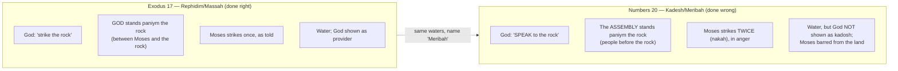

# Lead with Your Voice

BEMA 30 · Session 1
Source transcript: `~/workspace/bema/transcripts/1-30-lead-with-your-voice.md`
Book: Numbers (Numbers 20:1–13; with Exodus 17:5–7 and 1 Corinthians 10:1–4)

> The end of the desert/Numbers section. Moses strikes the rock at Kadesh/Meribah and is denied entry to the Promised Land. The hosts set this story deliberately beside the *first* rock-striking (Exodus 17) to argue the real failure: Moses reverted to the **stick** (Empire's coercive power) when God asked for the **voice** (Shalom's invitational power) — failing to show that God is *different* (*kadosh*). Session 1's arc is **partnership**: God spends 40 desert years teaching His covenant partner to lead God's way, not Pharaoh's.

## Key Lessons

- **Lead with your voice, not your stick.** God tells Moses to *speak* to the rock, but Moses strikes it in anger. Marty: *"I need you to use your voice right now, not your stick this time, Moses. Don't use your stick. That's what Empire would do. That's what Pharaoh would do, Moses."* The Kingdom of Shalom leads by invitation and character, not by coercion, title, or authority.
- **Moses's real offense: he failed to show God as *kadosh* (different).** God's charge is that Moses "did not demonstrate me and show me to be *kadosh*." Marty: *"you made me look like all the other gods that are out there. You had this moment to use your voice and not your stick."* All of Session 1 has insisted God is different — a God of mercy, forgiveness, shalom — and Moses, in his anger, made God look like Pharaoh.
- **Even God's heart isn't enough without God's methods.** Moses was raised in Empire with "the heart of God for justice" but "the Empire's tools of violence." God spent 40 desert years retraining his methods. Marty (as God): *"You have my heart, but will you use my methods? Will you trust me in how we get the job done?"* Wanting the right thing isn't the same as doing the right thing God's way.
- **The leader, not the complainers, may be the one in the wrong.** Grief (Miriam's unmourned death), anger, and self-preservation get the best of Moses. Marty: *"I'm not even sure the people are even in the wrong at all... But Moses has let himself get into a very bad place."* The one who reverts to the stick here is the leader.

## East/West Lens

- **Words carry the meaning (word-picture / wordplay).** The whole lesson rides on Hebrew words the English flattens: **nakah** ("strike to kill"), **paniym** (who stands "before" the rock), **marah** (bitter/rebellious), **kadosh** (holy/different). Marty: *"It's the same strike-to-kill, nakah."*
- **Truth discovered over time (dynamic / block logic).** The "hagah projects" model Eastern discovery-learning — answers "not going to be found in logic... the answer to the question lay in the text somewhere." The Exodus 17 ↔ Numbers 20 parallel is dug out, not stated. Marty: *"they knew that the answer... was not going to be found in logic... They had to go find it in the text."*
- **Community over individual.** Leadership is reckoned by the community: a shepherd invites a people to *want* to follow, versus Pharaoh who makes people obey. Marty: *"the kind of leader... that could invite people, and they would want to follow... not the story of a leader that has the right, or the authority, or the title, or the power, to flex and make people do what they want."*
- **God known by His character (God is different).** The payoff is God's *character* on display: *kadosh*, set apart, known by mercy and voice, not by the stick. Brent: *"God is different because He's this God of Shalom, this God of restoration, this God of peace."*

## Recurring Through-lines

- **Trust the story.** God's charge names it directly: Moses "did not trust me enough" to show God as holy. Trusting the story means trusting God's *methods* (voice, invitation, shalom) even in grief and anger. Marty (as God): *"Are you going to trust My methods, not yours, Moses?"* (Flag for cross-reference; do not re-explain the arc here.)
- **Master the beast (un-mastered instinct = sin).** A textbook case: Moses's un-mastered anger/grief erupts into violence (*nakah*), reverting to Empire's stick. Mastering the beast would have looked like using the voice. Marty: *"his anger gets the best of him. He reverts back to using that method of Empire."* (Anchored in episode 3.)
- **Empire vs. Shalom / stick vs. voice.** The two-kingdoms frame returns sharply in the review and the climax: the stick is Pharaoh's power; the voice is God's. Marty: *"the Kingdom of Shalom... It's the power of voice... a kingdom built on trust."* The Balaam-and-the-donkey story immediately after (Numbers 22) reinforces it — a prophet beating his donkey with a stick while God gives the donkey a *voice*.
- **The staff / the recurring sign.** "The staff, the staff, the staff, the staff" has run through the whole story (Nile, serpent, Exodus 17). Here it is given rightly but used wrongly. Brent: *"he's supposed to have the staff, but then he uses it in the wrong way."*

## Episode Flow (coverage backbone)

A sequential walkthrough of every teaching beat, in order. Used to verify full coverage.

1. **Framing — "Denied."** Brent: today wraps up "our time in the desert and the book of Numbers with the story of Moses striking the rock and subsequently having his entrance to the Promised Land denied."
2. **Full-arc review.** Marty retraces the macro-story: the Preface (Genesis 1–11: God is love, creation is good, we must trust and don't, God's putting it back together); the Introduction (Genesis 12–50: the family of God); the two kingdoms — **Empire/stick** (fear, force, self-preservation) vs. **Shalom/voice** (invitation, self-sacrifice, trust); the rescue from Egypt; the Sinai wedding and tabernacle; Leviticus (the "priestwich"); and the 40-year desert honeymoon with its images (shepherd, acacia, ar'ar, wadis, living water).
3. **The *hagah* project.** Marty recalls the "biblical brain-teasers" whose answers "lay in the text somewhere," and names the one driving this episode: *"Why doesn't Moses get to enter the Promised Land?"*
4. **The easy answers rejected.** Hit it twice? Took credit ("must *we* bring water")? Marty: the "took credit" reading (his Bible-college teaching) collapses because God literally told Moses in v.8 "*you* will bring water out of the rock."
5. **Humble servant, drastic sentence.** Brent: Moses "is the most humble man on the face of the earth" (Numbers 12:3); the punishment seems out of all proportion — "there's got to be far more than that."
6. **Honest sourcing.** Marty points listeners to Rabbi David Fohrman / Aleph Beta and flags Josh Bossé's Session 6 teaching as his favorite; credits his own teacher Ray for seed insights; and softens the "bridge too far" edges of his original telling.
7. **Moses's backstory.** Raised in Pharaoh's household (Empire), he has "the heart of God for justice" but "the Empire's tools of violence" (killing the Egyptian). 40 years shepherding in the desert, then the Exodus "crash course final exam," retrain his *methods*.
8. **Exodus 17 foreshadow.** God tells Moses to take the staff, go to Horeb, and strike the rock — where God will "stand before you... I'll take the blow."
9. **Numbers 10–19 context.** A drumbeat of rebellion (Miriam/Aaron; the spies; Korah, Dathan, Abiram), then Numbers 19's water of cleansing for the dead — immediately before Numbers 20 opens with a death.
10. **Miriam dies; the complaint; no mourning.** Marty's correction: Israel complains about water *only twice* — Exodus 17 and here. The midrash of Miriam's traveling well/rock on a cart explains the silence between; and strikingly, "there's no mention of mourning for Miriam."
11. **1 Corinthians 10:1–4.** Paul plays off that very midrash: the rock "accompanied them" / "went with them," "and that rock was Christ."
12. **Is there a test?** Marty tests the Shema grid (heart/*vav*, soul/*nephesh*, might/*meod*). Brent reads it as a **soul** test for Moses ("if these people aren't going to mourn for my sister..."); the people, if tested, fail a **heart** test — Moses calls them *marah* ("you rebels"), the word tying back to the bitter well of Marah.
13. **Kadesh vs. Meribah.** The place is Kadesh (vv.1, 14) but called Meribah (v.13) — the thematic name linking it to Massah/Meribah of Exodus 17 (Rephidim). The two strikings are tied by name.
14. **The parallel panels read aloud.** Exodus 17:5–6 and Numbers 20:9–11 are read side by side. Differences surface: **no elders** in Numbers, and who stands *paniym* the rock changes — **God** in Exodus, the **assembly** in Numbers.
15. **The stick-figure callback.** Marty recalls the Exodus 17 drawing: God positioned *between* Moses and the rock — "I'm striking God on behalf of the people... You're going to strike me."
16. **nakah — strike to kill.** Same word as Moses killing the Egyptian and God striking Egypt's gods. Marty floats, then explicitly disowns insisting on, the "did Moses kill two people?" reading ("a bridge too far... Don't hang onto that, but I still wonder").
17. **The climax — voice, not stick.** Via Fohrman: "I need you to use your voice right now, not your stick this time." Moses's anger misdirects the strike. God's verdict: "because you did not... show me as holy (*kadosh*) before the people" — you made me look like the other gods.
18. **Balaam confirms the lesson.** The very next famous story is a donkey given a voice while a prophet wields a stick — "the way of Shalom is not a way of Pharaoh's stick."
19. **Marty's confession.** As a 24–25-year-old pastor he "led like Pharaoh," leading by authority and vision-casting rather than humility and invitation — "I wanted to crawl under the chairs."
20. **Brent lands it; close.** Brent: the staff is still here, "but then he uses it in the wrong way" — a convicting episode. Next week: Deuteronomy. Check the Aleph Beta/Fohrman link in the show notes.

**Coverage verification:** Every teaching beat above is carried into the sections below. The three cited passages (Numbers 20:1–13; Exodus 17:5–7; 1 Corinthians 10:1–4) and the supporting references (Numbers 12:3; Numbers 22 Balaam; Numbers 10–19 rebellions; Numbers 19 water of cleansing) appear under References/Callbacks with verse links. Every named Hebrew term (*hagah, nakah, paniym, marah, kadosh*; Kadesh/Meribah/Massah) appears under Terminology. Every named person/resource (Fohrman/Aleph Beta; Josh Bossé/Session 6; Ray; the traveling-well midrash; the Shema three-tests grid) appears under References, Illustrations, or Callbacks. The stated tensions (disproportionate sentence; "took credit" vs. v.8; "always complain about water"; Kadesh vs. Meribah; speak vs. strike; "struck twice"/killed) appear under Narrative Tensions. **No chiasm is taught in this episode** — the literary structure is a two-panel parallel between Exodus 17 and Numbers 20 — so the Chiasm section is omitted and the structure is captured in its own table below.

## Narrative Tensions

Each entry: surface problem, classification tag, cited quote, normalized verse citation + link, and resolution or open flag.

| Surface problem | Tag | Cited quote (speaker) | Verse citation + link | Resolution / status |
|---|---|---|---|---|
| Why is Moses — humblest man on earth, repeatedly forgiven — so drastically punished for one mistake? | `logic-gap` | Marty: *"this is Moses... he doesn't get to enter into the promised land? There's got to be far more than that, right?"* | [Numbers 20:12](https://www.biblegateway.com/passage/?search=Numbers%2020%3A12&version=NIV) | **Resolved (Hebraic lens):** the offense isn't "hitting twice" or "taking credit" but reverting to Empire's stick and failing to show God as *kadosh*. |
| The Bible-college answer — "Moses took credit ('must *we* bring water?')" — but God literally said *you* will bring water. | `contradiction` | Marty: *"God's very words tell Moses 'You're going'... it feels weird that Moses says essentially what God says, and God's like, 'you can't enter the Promised Land now.'"* | [Numbers 20:8](https://www.biblegateway.com/passage/?search=Numbers%2020%3A8&version=NIV) | **Resolved (interpretive):** the "took credit" reading doesn't hold; the real issue is method (stick vs. voice), not phrasing. |
| Do the Israelites "always complain about water"? | `unstated-cultural-assumption` | Marty: *"They only complain about water twice... Exodus 17, when Moses struck the rock the first time, and now when Miriam dies."* | [Numbers 20:2-5](https://www.biblegateway.com/passage/?search=Numbers%2020%3A2-5&version=NIV) | **Resolved:** only twice — and (per midrash) Miriam's traveling well explains the silence between; her death ends it. |
| The place is "Kadesh," yet verse 13 calls it "Meribah" — which is it? | `translation-disagreement` | Brent: *"in verse one it says Kadesh... Except verse thirteen says Meribah."* | [Numbers 20:13](https://www.biblegateway.com/passage/?search=Numbers%2020%3A13&version=NIV) | **Resolved (Hebraic lens):** Kadesh is the location; "Meribah" (quarreling) names it by *theme*, tying it to Massah/Meribah of Exodus 17 — the two rock-strikings linked. |
| Why does God tell Moses to *speak* to the rock this time (he struck it before)? | `logic-gap` | Marty (as God): *"I need you to use your voice right now, not your stick this time, Moses."* | [Exodus 17:5-7](https://www.biblegateway.com/passage/?search=Exodus%2017%3A5-7&version=NIV) | **Resolved (via Fohrman):** the desert's lesson has moved from "stand and watch God take the blow" (strike) to leading with the voice — Shalom's power, not Empire's. |
| Why "struck the rock *twice*"? Did Moses literally kill people? | `logic-gap` | Marty: *"I wonder even if Moses literally killed... Don't hang onto that, but I still wonder about it."* | [Numbers 20:11](https://www.biblegateway.com/passage/?search=Numbers%2020%3A11&version=NIV) | **Open — dance with it:** Marty explicitly calls the "killed two people" idea "a bridge too far" for many and does not insist on it; the point stands either way (anger/stick, not voice). |
| No mourning is recorded for Miriam, though Aaron and Moses will be mourned. | `unstated-cultural-assumption` | Marty: *"there's no mention of the people mourning for Miriam... I wonder if there's an anger that's beginning to brew inside of Moses."* | [Numbers 20:1](https://www.biblegateway.com/passage/?search=Numbers%2020%3A1&version=NIV) | **Open flag:** offered as a possible seed of Moses's grief-fueled anger; the text is silent, so it is held, not asserted. |

## The Two Rock-Strikings (structure)

No chiasm is taught here, but the episode's spine is a deliberate **parallel panel** between Exodus 17 (strike done *right*) and Numbers 20 (strike done *wrong*), tied together by the shared name "Meribah." Same elements, one decisive difference.

Prose: Because the *same phrase* (*paniym*) that put **God** before the rock in Exodus now puts the **people** before it in Numbers, the parallel reframes the second striking as misdirected anger — the stick aimed where the voice should have led. Marty: *"these two stories clearly go together by the author... There's something that we learned in Exodus 17 that is supposed to inform what Moses is supposed to be seeing and learning here."*

## Terminology

- **hagah** (הָגָה) — to meditate / growl (the lion over its prey, Psalm 1); the spirit behind the "hagah projects," text-based brain-teasers whose answers "lay in the text somewhere," not in logic. Marty: *"we want to hagah the text. We want to growl."*
- **nakah** (נָכָה) — to strike/smite in order to kill; the same word for Moses killing the Egyptian, God striking Egypt's gods, and the command to strike the rock at Horeb. Here Moses *nakah*-s the rock twice. Marty: *"It's the same strike-to-kill, nakah."*
- **paniym** (פָּנִים) — "faces" / "before, in front of." God stands *paniym* the rock in Exodus 17; the assembly is gathered *paniym* the rock in Numbers 20 — the same phrase, a deliberate parallel. Marty: *"it's the exact same phrase of God standing before the rock."*
- **marah** (מָרָה) — bitter / rebellious; Moses's "Listen, you rebels" (*marah*) ties the scene to the bitter well of **Marah** (the heart test). Marty: *"the word for rebel was the same word for bitter. It was marah."*
- **Kadesh / Meribah / Massah** — the place is **Kadesh**, but called **Meribah** ("quarreling"), linking it by name to **Massah** and **Meribah** in Exodus 17 (at Rephidim) — the first striking of the rock. Marty: *"the two strikings of the rock are tied together by name."*
- **kadosh** (קָדוֹשׁ) — holy, set apart, *different*. God's charge: "because you did not demonstrate me and show me to be *kadosh*" — Moses failed to show God is different from Pharaoh's gods. Marty: *"I'm holy, I'm different, I'm kadosh."*

## Illustrations & Stories

- **God's cosmic "DENIED" rubber stamp (Brent & Marty).** The opening gag — "the idea of God with a cosmic red rubber stamp" — framing Moses's denied entry.
- **The *hagah* projects (Marty).** "Big biblical brain teasers" given to students without answers, because the answer "was not going to be found in logic... they had to go find it in the text" — the discovery method behind this whole episode.
- **Pharaoh's daughter's Stretch-Armstrong hand (Marty, midrash).** Because "handmaiden" shares the Hebrew word for "hand," the midrash says her hand miraculously stretched across the water to grab the basket — an act of justice that "did the work of a miracle."
- **Miriam's traveling well on a cart (Marty, midrash).** The rock from Exodus 17 placed on a cart (a "well"); Miriam spoke to it and it gave water — explaining why Israel never complained about water while she lived. "That is the dumbest midrash I have ever heard" — until Paul plays off it in 1 Corinthians 10.
- **The Exodus 17 stick-figure drawing (Marty).** The earlier episode's sketch — "my little stick figure, Moses with a beard... a big, little red blob that represented where God was standing" — God positioned *between* Moses and the rock: "I'll take the blow."
- **The talking donkey (Balaam, Numbers 22).** The very next famous story: a prophet beats his donkey with a stick, and God gives the *donkey* a voice — Shalom's way is "not a way of Pharaoh's stick."
- **Marty crawling under the sanctuary chairs (Marty).** His confession as a young pastor who "led like Pharaoh" — leading by authority and vision-casting rather than humility and invitation — "I just wanted to crawl under the chairs."

## References

- **Numbers 20:1–13 — Moses strikes the rock at Kadesh/Meribah.** The central text. [Numbers 20:1-13 (NIV)](https://www.biblegateway.com/passage/?search=Numbers%2020%3A1-13&version=NIV)
- **Exodus 17:5–7 — the first striking at Rephidim (Massah/Meribah).** The parallel panel the whole lesson leans on. [Exodus 17:5-7 (NIV)](https://www.biblegateway.com/passage/?search=Exodus%2017%3A5-7&version=NIV)
- **1 Corinthians 10:1–4 — "that rock was Christ."** Paul playing off the traveling-well midrash. [1 Corinthians 10:1-4 (NIV)](https://www.biblegateway.com/passage/?search=1%20Corinthians%2010%3A1-4&version=NIV)
- **Numbers 12:3 — "the most humble man on the face of the earth."** Brent's point that the sentence seems disproportionate. [Numbers 12:3 (NIV)](https://www.biblegateway.com/passage/?search=Numbers%2012%3A3&version=NIV)
- **Numbers 22 — Balaam and the donkey.** The next story: voice over stick. [Numbers 22 (NIV)](https://www.biblegateway.com/passage/?search=Numbers%2022&version=NIV)
- **Numbers 10–19 — the rebellion chapters.** Context: Miriam/Aaron, the spies (13–14), Korah/Dathan/Abiram (16), and the water of cleansing for the dead (19) right before chapter 20. [Numbers 16 (NIV)](https://www.biblegateway.com/passage/?search=Numbers%2016&version=NIV) · [Numbers 19 (NIV)](https://www.biblegateway.com/passage/?search=Numbers%2019&version=NIV)
- **Rabbi David Fohrman / Aleph Beta.** Named teaching on why Moses was told to *speak* to the rock; Marty: *"Rabbi David Fohrman over Aleph Beta, just has some dynamite teaching on this."* (To be linked in the show notes; not web-fetched here.)
- **Josh Bossé — BEMA Session 6 teaching.** Flagged as Marty's favorite teaching on this story — a forward pointer, deliberately not linked ("people have got to go earn that one").
- **Ray ("Ray"/RVL) — Marty's teacher.** Credited with seeding "some of these little tidbits... in the text" that led to Marty's reading.
- **The Shema three-tests grid (heart/*vav*, soul/*nephesh*, might/*meod*).** The interpretive tool used to classify the possible test(s) in the story, carried over from earlier Session 1 episodes.

## Callbacks & Cross-References

- **Episode 3 — "Master the Beast."** Moses's un-mastered anger/grief erupting into violence is the sin-as-unmastered-instinct pattern. (Flag for cross-reference; do not re-explain there.)
- **Episodes 18 / 25 — the two kingdoms (Empire vs. Shalom, stick vs. voice).** The review re-states the frame; this episode is its sharpest single application. (Cross-reference.)
- **Episode 20 — "With All Your Heart" (the test of the heart; the bitter well of Marah).** *marah* ("you rebels") ties the people's possible test back to the heart/Marah episode. (Cross-reference.)
- **Episode 21 — "With All Your Soul/Very" (the Shema three tests).** The heart/soul/might grid used to weigh what is being tested here. (Cross-reference.)
- **Images-of-the-desert arc (eps. 26–29).** The 40 desert years — shepherd, acacia, ar'ar, wadis, living water — are named as *how* God retrained Moses's methods. (Cross-reference.)
- **Exodus 17 (prior Session 1 teaching) — the first striking and the stick-figure drawing.** Explicitly recalled as the panel that interprets Numbers 20. (Cross-reference.)
- **Session 6 — Josh Bossé on this story (forward pointer).** "About... 200 episodes in front of you, but you'll get there."
- **Deuteronomy (forward pointer).** Brent: "We'll be back next week to dig into Deuteronomy."

## Discussion Questions

1. "Lead with your voice, not your stick." Where do you have a "stick" — authority, position, the right to tell people what to do — and when are you tempted to use it instead of your voice?
2. Moses had God's *heart* but reached for Empire's *tools*. Where in your life do you want the right thing but default to coercive or forceful methods to get it?
3. God's complaint is that Moses failed to show God as *kadosh* — different. When your character is on display under pressure, does it make God look merciful and inviting, or just like every other power?
4. Marty suggests Moses was undone by unmourned grief and anger. How have grief or anger led you to misdirect a "strike" at the wrong target?
5. The Israelites "only complain about water twice," and may not even be wrong here. Where have you been quick to label others "rebels" when the real problem was in your own heart?
6. The very next story is a donkey given a voice while a prophet wields a stick. What would it look like this week to lead someone by invitation rather than by force?

## Sources

- Transcript: `1-30-lead-with-your-voice.md`
- [Numbers 20:1-13 (NIV)](https://www.biblegateway.com/passage/?search=Numbers%2020%3A1-13&version=NIV)
- [Numbers 20:1 (NIV)](https://www.biblegateway.com/passage/?search=Numbers%2020%3A1&version=NIV)
- [Numbers 20:2-5 (NIV)](https://www.biblegateway.com/passage/?search=Numbers%2020%3A2-5&version=NIV)
- [Numbers 20:8 (NIV)](https://www.biblegateway.com/passage/?search=Numbers%2020%3A8&version=NIV)
- [Numbers 20:11 (NIV)](https://www.biblegateway.com/passage/?search=Numbers%2020%3A11&version=NIV)
- [Numbers 20:12 (NIV)](https://www.biblegateway.com/passage/?search=Numbers%2020%3A12&version=NIV)
- [Numbers 20:13 (NIV)](https://www.biblegateway.com/passage/?search=Numbers%2020%3A13&version=NIV)
- [Exodus 17:5-7 (NIV)](https://www.biblegateway.com/passage/?search=Exodus%2017%3A5-7&version=NIV)
- [1 Corinthians 10:1-4 (NIV)](https://www.biblegateway.com/passage/?search=1%20Corinthians%2010%3A1-4&version=NIV)
- [Numbers 12:3 (NIV)](https://www.biblegateway.com/passage/?search=Numbers%2012%3A3&version=NIV)
- [Numbers 16 (Korah's rebellion, NIV)](https://www.biblegateway.com/passage/?search=Numbers%2016&version=NIV)
- [Numbers 19 (water of cleansing, NIV)](https://www.biblegateway.com/passage/?search=Numbers%2019&version=NIV)
- [Numbers 22 (Balaam and the donkey, NIV)](https://www.biblegateway.com/passage/?search=Numbers%2022&version=NIV)
- Referenced resources named in the episode (not web-fetched): Rabbi David Fohrman / Aleph Beta (why Moses was to *speak* to the rock); Josh Bossé's teaching (BEMA Session 6); the traveling-well/rock midrash (tied to Miriam), echoed by Paul ("that rock was Christ"); the Pharaoh's-daughter midrash; Ray (Marty's teacher, field-teaching that seeded this reading).
