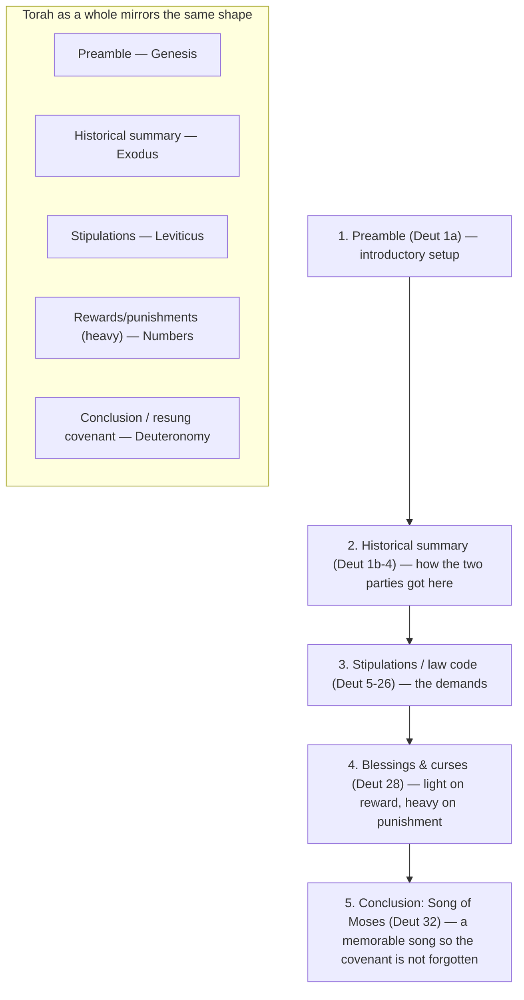

# Remember Where You Came From

BEMA 31 · Session 1
Source transcript: `transcripts/1-31-remember-where-you-came-from.md`

## Key Lessons

- **The whole thrust of Deuteronomy is one command: remember where you came from — "remember that you were slaves in Egypt."** The word *zakar* ("remember") appears 14 times and *shakach* ("do not forget") 9 times. Marty: *"if you ever forget where you came from, you will stop being the kind of people that I wanted you to be."* This is the arc itself — **trust the story; God does not change what he wants or what matters.** God's constant priority (care for the vulnerable, covenant faithfulness) is anchored in memory.

- **Remembering is what makes you *see* the foreigner, orphan, and widow (the "AOW").** Marty: *"When I remember who I was I see who they are now... When I remember, I see them. And when I see them, I remember. It's this circular thing."* Because Israel was once foreigner/orphan/widow in Egypt, memory produces compassion — God's enduring concern made practical.

- **God's law builds the vulnerable *into the center* of the community, not the margins — including at the parties.** Gleaning laws, the third-year tithe, levirate marriage ("the Family of the Unsandled"), and festival inclusion all protect the AOW. Marty: *"Woe to a culture that would find people groups that are unproductive and sweep them away to the margins."* Where you find the weak reveals shalom vs. empire.

- **"These are not just idle words... they are your life" — obedience isn't an arbitrary reward but the way life actually works.** Reed: *"if you live in this way, this is the way that brings about the kind of life that God intends, just as its natural... outworking."* The constant invitation — live God's way and find life (Deut 32:46-47).

- **Moses' "failure" is reframed by his epitaph: he knew God *face to face*.** Reed and Marty read the death of Moses not as disqualification but intimacy — a rabbinic Midrash pictures God ushering Moses into death with a kiss. Marty: *"I'm just not sure Moses cared that he didn't get to make it into the Promised Land."* Success is walking with God, not reaching a patch of earth.

## East/West Lens

- **Community vs individual** — Remembering is corporate and intergenerational: *"ask your elders... ask my parents, and I ask my grandparents."* Reed's campus-ministry "Remember that time when...?" practice keeps a community's story alive across turnover. The AOW are included *inside* the circle, not pushed out.

- **God's description — nature of the relationship over abstract attributes** — "Face to face" is taught through a marital embrace, not a definition. Marty: *"That is this idea of the Hebrew phrase face to face. This intimate relationship that Moses had with God."* God is known relationally.

- **Error & sin as behavior/way-of-life over wrong belief** — The law is framed as the path that produces life, and forgetting is a failure of practice, not of doctrine. Reed: *"it doesn't just lead to life, like as a reward... but if you live in this way, this is the way that brings about the kind of life that God intends."*

- **Words as word-pictures over abstract definitions** — Memory and law ride on vivid images: the removed sandal and spit ("the Family of the Unsandled"), the leftover gleanings, the Song of Moses sung so it "will not be forgotten." Reed urges "remember" as an *active* discipline (Buechner's "Listen to Your Life"), not a passive mental event.

## Recurring Through-lines

- **Trust the story (the arc itself).** Named in the review ("the goodness of Creation — invitation to trust") and embodied in the whole episode: Israel's identity, obedience, and compassion all hang on *remembering the story*. God's priorities are constant; forgetting is what unmakes the people. Recurs across the whole corpus.

- **Empire vs Shalom.** An explicitly recurring BEMA contrast — "God takes His people out of empire, and then He has to get empire out of His people." Reinforced by "circle the wagons" (from the desert-images episodes): you know shalom from empire by *where the weak are found*. Noted as cross-episode recurrence.

- **Care for the AOW / the vulnerable at the center.** A recurring Session 1 thread (manna sharing, the marginalized in the middle, Isaac's generosity) that culminates here in Deuteronomy's gleaning/tithe/widow laws. Linked to the arc; noted as cross-episode recurrence.

- *(Note: the "sin as failing to master the animal instinct" / master-the-beast motif, anchored in `1-3-master-the-beast.md`, is not engaged this episode. Sin here is forgetting the story and neglecting the vulnerable, not base animal instinct, so the motif is not claimed.)*

## Narrative Tensions

| Surface problem | Tag | Cited quote (speaker) | Verse citation + link | Resolution / status |
|---|---|---|---|---|
| Moses is barred from the Promised Land over striking the rock — he seems to get a harsh, "bad rap" ending. | `logic-gap` | Reed: *"I do think that Moses gets an unfair, bad rap, because people focus on, 'Oh, well, he disobeyed and he didn't make it in.'"* | Deuteronomy 34:10-12 — https://www.biblegateway.com/passage/?search=Deuteronomy%2034%3A10-12&version=NIV | **Resolved (Hebraic lens):** his epitaph — "knew the LORD face to face" (an intimate, marital-embrace image) — reframes success as intimacy with God; a Midrash pictures death "by the mouth of the LORD" as a kiss. |
| God commands Israel to "blot out the name of Amalek" — reads as a disturbing call to vengeance. | `unstated-cultural-assumption` | Marty: *"Amalek attacked the weak, and the sick, and the slow... I hate violence anyway. But that they would double down on a really sick version of violence."* | Deuteronomy 25:17-19 — https://www.biblegateway.com/passage/?search=Deuteronomy%2025%3A17-19&version=NIV | **Resolved (Hebraic lens):** the judgment targets predation on the defenseless (raiders attacking the back of the camp); it is justice for the vulnerable, not arbitrary wrath. |
| Why leave your own hard-earned harvest (grain, olives, grapes) for strangers who did none of the work? | `unstated-cultural-assumption` | Marty: *"it's not their olive trees. They didn't do all the work... What is this?"* Reed: *"take care of people that really are actually going to... slow you down... a potential threat."* | Deuteronomy 24:17-22 — https://www.biblegateway.com/passage/?search=Deuteronomy%2024%3A17-22&version=NIV | **Resolved (Hebraic lens):** against the tribalism of surrounding cultures, God's radical inclusion of the AOW is the point — "remember that you were slaves in Egypt; therefore I command you to do this." |
| Levirate marriage, the removed sandal, and spitting in the face ("the Family of the Unsandled") seem strange and harsh. | `unstated-cultural-assumption` | Marty: *"The Family of the Unsandled. That's got to be a rough moniker to carry around."* | Deuteronomy 25:5-10 — https://www.biblegateway.com/passage/?search=Deuteronomy%2025%3A5-10&version=NIV | **Resolved (Hebraic lens):** the custom protects the widow and preserves a dead brother's name — the whole community acts to keep the vulnerable from being swept to the margins. |
| The Song of Moses is a downer at the emotional climax of Torah — "you're going to fail," not a triumphant finale. | `contradiction` | Marty: *"you're thinking it's the end... let the music swell... And the song of Moses is like, 'You're going to fail.'"* | Deuteronomy 32 — https://www.biblegateway.com/passage/?search=Deuteronomy%2032&version=NIV | **Resolved (via Fohrman):** the song also shows the way *back* — failure, then a hard but sustainable return. It fits the covenant form (a memorable concluding song), not a sentimental send-off. |
| Deuteronomy 28's punishments are overwhelmingly long and severe compared to its short list of rewards — God seems vindictive. | `unstated-cultural-assumption` | Marty: *"Light on reward and heavy on punishment."* Reed: *"it's like, 'Yep, that sounds — I'll just, I'll obey.'"* | Deuteronomy 28 — https://www.biblegateway.com/passage/?search=Deuteronomy%2028&version=NIV | **Resolved (genre lens):** this is the standard suzerain-vassal covenant form (reward-light, punishment-heavy); scholars note Deuteronomy's version is comparatively *humane* — "if you don't do this, life won't go well," not "I'll make you suffer." |
| "When Moses finished reciting all these words" — which words? The song, Deuteronomy, or all of Torah? | `translation-disagreement` | Brent: *"Is it just talking about the song... Deuteronomy as a whole... Torah as a whole? ... there's a pretty good argument that this is about Torah."* | Deuteronomy 32:46-47 — https://www.biblegateway.com/passage/?search=Deuteronomy%2032%3A46-47&version=NIV | **Open — dance with it.** Brent names the ambiguity and leans toward "Torah," but the hosts leave the referent open; either way the point stands: "they are your life." |

## Chiasms & Structure

No chiasm is present. The structural model the hosts present is the **five-part suzerain-vassal covenant form**, which Deuteronomy follows — and which Torah as a whole mirrors. (Sources: Sandra Richter, John Walton, Ray Vander Laan.) Rendered as a sequence/mapping, not a mirrored chiasm:

Prose: Deuteronomy reads as a covenant document — preamble, historical recap, law, blessings/curses, and a concluding song built for memory (because there was no printing press). Reed adds that the striking feature is *theological*: where a normal suzerain-vassal treaty swears loyalty to a human king, Deuteronomy directs loyalty to God, and pointedly refuses to install Moses as a demigod stand-in. The hosts further note the five books of Torah mirror the same five-part shape.

## Terminology

- **zakar** (זָכַר) — to remember; 14 times in Deuteronomy. Marty: *"Remember that you were slaves in Egypt... that is why I command you to do this."* Active and communal — "ask your elders."
- **shakach** (שָׁכַח) — to forget; "do not forget" 9 times, including the note that God himself will *not* forget his covenant. Reed: *"this one is actually about God not forgetting."*
- **the foreigner, orphan, and widow** ("AOW"; גֵּר / יָתוֹם / אַלְמָנָה) — the groups Israel must remember *because* they were once these in Egypt. Marty: *"When we remember that we were these people, we notice them."*
- **face to face** (פָּנִים אֶל פָּנִים) — the intimacy of Moses' relationship with God, taught via a marital embrace image; paired with the Midrash of death "by the mouth of the LORD" as a kiss.
- **suzerain-vassal covenant** — the ancient treaty form Deuteronomy follows (preamble, historical summary, stipulations, blessings/curses, concluding song). Reward-light, punishment-heavy; loyalty redirected from a human king to God.

## Discussion Questions

1. Deuteronomy repeats "remember" and "do not forget" dozens of times. What is the story *you* most need to keep remembering — and what happens to how you treat others when you forget it?
2. Marty describes a circle: remembering who you were lets you *see* the foreigner, orphan, and widow, and seeing them makes you remember. Who are the "AOW" currently at the margins of your vision, and what would bringing them to the center cost you?
3. The gleaning laws hand your hard-earned harvest to people who did none of the work. Where does that cut against your instincts about fairness and ownership — and what might God be after in it?
4. Reed reframes Moses' death not as failure but intimacy ("face to face"). How do you define success in your own walk with God — reaching a destination, or the quality of relationship along the way?
5. Reed urges making *remembering* an active spiritual discipline (Buechner's "Listen to Your Life"). What practice could you adopt to actively remember your story and listen for where God has been in it?

## Sources

- Transcript: `1-31-remember-where-you-came-from.md`
- Deuteronomy 34:10-12 — https://www.biblegateway.com/passage/?search=Deuteronomy%2034%3A10-12&version=NIV
- Deuteronomy 8:2-3 — https://www.biblegateway.com/passage/?search=Deuteronomy%208%3A2-3&version=NIV
- Deuteronomy 10:18 — https://www.biblegateway.com/passage/?search=Deuteronomy%2010%3A18&version=NIV
- Deuteronomy 14:28-29 — https://www.biblegateway.com/passage/?search=Deuteronomy%2014%3A28-29&version=NIV
- Deuteronomy 24:17-22 — https://www.biblegateway.com/passage/?search=Deuteronomy%2024%3A17-22&version=NIV
- Deuteronomy 25:5-10 — https://www.biblegateway.com/passage/?search=Deuteronomy%2025%3A5-10&version=NIV
- Deuteronomy 25:17-19 (Amalek) — https://www.biblegateway.com/passage/?search=Deuteronomy%2025%3A17-19&version=NIV
- Deuteronomy 26:12-13 — https://www.biblegateway.com/passage/?search=Deuteronomy%2026%3A12-13&version=NIV
- Deuteronomy 27:19 — https://www.biblegateway.com/passage/?search=Deuteronomy%2027%3A19&version=NIV
- Deuteronomy 28 — https://www.biblegateway.com/passage/?search=Deuteronomy%2028&version=NIV
- Deuteronomy 32 — https://www.biblegateway.com/passage/?search=Deuteronomy%2032&version=NIV
- Deuteronomy 32:46-47 — https://www.biblegateway.com/passage/?search=Deuteronomy%2032%3A46-47&version=NIV
- Sandra Richter, *The Epic of Eden* (covenant structure)
- John Walton; Ray Vander Laan (RVL) — suzerain-vassal covenants
- Rabbi David Fohrman — the Song of Moses (Deuteronomy 32)
- Frederick Buechner, *Listen to Your Life*
