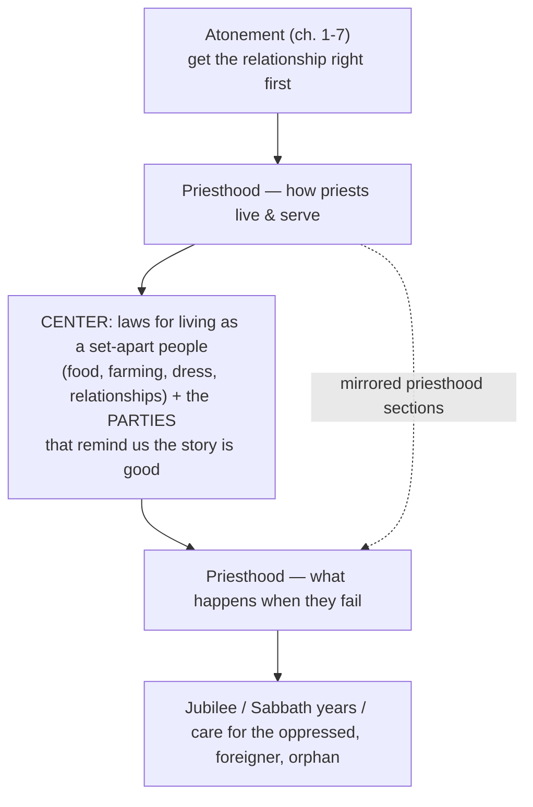
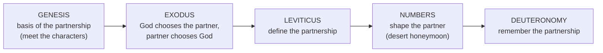

# Session 1 Capstone

BEMA 32 · Session 1
Source transcript: `transcripts/1-session-1-capstone-32.md`

> This is the capstone/review episode for Session 1. It does not work a single passage; it traces the narrative arc of the whole Torah and condenses it to one word — **partnership**. It is the anchor for the narrative-arc model used across these guides.

## Key Lessons

The entire capstone is the arc made explicit: **trust the story — God does not change what he wants or what matters.** From the preface's insistence on goodness to Deuteronomy's call to remember, the thing God wants is constant — a people in trusting partnership with him. Marty names the point of the review itself: "Do we understand how the narrative arc works?... Could we tell somebody else what Torah is and what Torah is about?"

- **Torah condensed is one word: partnership.** Marty: "if I were going to condense Torah in a shorter review... I would say Torah is the story of partnership... the partnership we have with God." Each book is a stage of that one unchanging relationship — the clearest statement in the corpus that God's priorities don't move.

- **Trusting the story is the thread that holds the family together — even in failure.** Of Genesis 12-50: "a family that is far from perfect, but keeps leaning back into this goodness — keeps trusting the story even in their moments of greatest failure. They don't let those moments define them." Forgiveness is named as "the ultimate example of trusting the story."

- **Identity (forgiven, beloved, accepted) comes first, or the whole story breaks.** On why Leviticus opens with atonement: "if your relationship isn't right with God, nothing else is going to work. If your identity isn't in the fact that you are forgiven, beloved, accepted, valued by God, all the fear and insecurity is going to mess the story up."

- **You must be able to tell the story — the 10,000-foot view, not just the pieces.** Brent's framing: "Be ready to tell the story of what the Bible is doing." The review exists so the big picture (not isolated facts) stays intact — the "trust the story" posture requires knowing the story.

- **Remembering your own rescue produces compassion for the outsider (A-O-W).** Deuteronomy's logic: "If you remember where you came from, you are going to notice those who are in similar places... Remember to pull them in... it's going to remind you of your story." God's concern for the foreigner, orphan, and widow is the same concern he showed Israel — unchanged.

## East/West Lens

- **Truth over time (dynamic/unfolding — the story is one continuous whole, our grasp grows).** The capstone insists on one unbroken narrative. Brent: "it is one continuous story from what we've been talking about all the way through to Jesus and beyond. It is one big story. And so if we take a whole chunk out of that story, we miss some important context." Truth doesn't move; our understanding is built session by session.

- **Community vs. individual (Hebraic starts with the community).** Partnership and the A-O-W cycle are corporate: "it's this cycle where we remember who we are and we find solidarity together." Belonging is defined by pulling the marginalized *in*, not by individual standing.

- **Words (word-pictures over abstractions).** The arc is carried by concrete images rather than doctrines — Tabernacle as "honeymoon suite," Leviticus as "the owner's manual in the glove box," Sinai as a wedding. Marty: the Tabernacle is "like a mobile Genesis 1... a literary device."

## Recurring Through-lines

- **Trust the story (the arc itself).** The capstone *is* this through-line stated plainly: Genesis 1-11 "is all about goodness and trusting the story — trusting that God knows what he's up to and what he's doing." Every later book is a further movement of that same trust.

- **God is the source, and he invites his people to mirror him / carry the mission (shade and water in the desert episodes; here, priesthood).** The "kingdom of priests" call is the corporate form: "I've got to know what it means to be a priest... God wants his people to be different, just like the priests are different from you, God wants you to be different from the world." This is the same source → mirror pattern the desert images taught (BEMA 26-29), now named as the mission.

- **Celebration guards memory of the good story.** The Leviticus "parties" section recurs as a safeguard against legalism: "if I don't throw a party, I'm going to forget that the story is good... that the love of God is the most defining thing about our relationship, not my performance." Ties directly to the arc — God's love, not human performance, is the constant.

## Narrative Tensions

| Surface problem | Tag | Cited quote (speaker) | Verse citation + link | Resolution / status |
|---|---|---|---|---|
| Genesis ends with Joseph; Exodus opens with Israel enslaved — a large, abrupt leap in time the hosts joke about. | `time-jump` | Brent (meme voice): "'four hundred years later.'... There's a long gap. And exactly how long that gap is is up to debate." | [Exodus 1](https://www.biblegateway.com/passage/?search=Exodus%201&version=NIV) | **Open — dance with it.** The hosts flag the gap and note its exact length "is up to debate" without resolving it. The narrative purpose is clear (setup → rescue), but the chronology itself stays unsettled. |
| "A kingdom of priests" is self-contradictory in ordinary usage — a kingdom *has* a few priests; it isn't made *of* them. | `logic-gap` | Marty: "it's weird to have a kingdom of priests... God said, 'Yeah, yeah, you'll have priests, but I'm also asking all of you to be priests.'" | [Exodus 19](https://www.biblegateway.com/passage/?search=Exodus%2019&version=NIV) | **Resolved (Hebraic lens / mission).** The oddity is the point: God calls the *whole* people to the set-apart, mediating role priests play — Leviticus then functions as the owner's manual teaching them how. |
| Why does Leviticus bury dietary/farming/clothing/sexuality laws *in the middle* of two priesthood sections (the "priestwich")? | `unstated-cultural-assumption` | Marty: "in the middle of Leviticus, all these chapters in between these sections on priesthood... is all of these laws about how we're going to live as a Jewish people... all of that ends up being a call to priesthood." | [Leviticus 11-25](https://www.biblegateway.com/passage/?search=Leviticus%2011-25&version=NIV) | **Resolved (structure).** The sandwich structure makes the everyday laws *themselves* an act of priesthood: "God wants you to be different from the world," so ordinary life is set-apart living, framed by the priesthood sections around it. |
| Why does God make his people wander the desert for forty years instead of going straight to the Promised Land? | `logic-gap` | Marty: "there's a honeymoon... a long period of time just hanging out with God in the desert... We need to go put this relationship to the test." | [Numbers](https://www.biblegateway.com/passage/?search=Numbers&version=NIV) | **Resolved (arc/partnership).** The desert is the "shaping" stage of the partnership — "It's one thing to choose, and it's one thing to know. It's another thing to become." The delay is formation, not punishment. |

## Chiasms & Structure

Two clearly described structures in this episode.

**1. The Leviticus "priestwich" (center-weighted / sandwich).** Marty describes two priesthood sections wrapping a center of everyday-life laws, opened by atonement and closed by Jubilee/justice.

The two priesthood panels mirror each other around the central block of ordinary-life laws; the whole thing is framed by atonement at the front and Jubilee/justice at the back.

**2. The Torah arc as the "partnership" model.** The capstone's headline structure — each book a stage of one relationship.

## Terminology

- **partnership** — Marty's one-word condensation of Torah: "Torah is about 'partnership' — the partnership we have with God." Genesis = basis, Exodus = the choosing, Leviticus = definition, Numbers = shaping, Deuteronomy = remembering.
- **A-I-J-J** — whiteboard shorthand for the family of God in the Introduction (Gen 12-50): **A**vram, **Y**itzhak, **Y**a'akov, **Y**osef — Abraham, Isaac, Jacob, Joseph.
- **A-O-W** — the **A**lien (foreigner), **O**rphan, and **W**idow; the marginalized Deuteronomy calls Israel to remember and "pull them in."
- **Tanakh** (תַּנַ"ךְ) — the Hebrew Bible. Session 1 = Torah; Session 2 = "the rest of Tanakh," Joshua through Malachi.
- **priestwich** — the hosts' nickname for Leviticus's sandwich structure: two priesthood sections wrapping the central block of everyday-life laws.
- **Tale of Two Kingdoms** — the Session 1 frame: the Kingdom of Empire vs. the Kingdom of Shalom. Marty: "There's God's Kingdom and then there's the world's kingdom."

## Discussion Questions

1. If you had thirty seconds in a church lobby to say what the whole Torah is about, could you? Try it: what single word or sentence would you use — and does "partnership" fit your own reading of Genesis through Deuteronomy?
2. Leviticus starts with atonement because "if your identity isn't in the fact that you are forgiven, beloved, accepted... all the fear and insecurity is going to mess the story up." Where is your sense of identity actually anchored right now, and how does that show up in your fears?
3. Marty says parties exist in Leviticus so God's people "don't forget that the story is good." What are the "parties" in your life that keep you from getting "lost in all the rules" — and are you actually keeping them?
4. Deuteronomy ties remembering your own rescue to noticing the foreigner, orphan, and widow. Who are the "A-O-W" people in your context, and how would remembering your own story change the way you treat them?
5. The hosts urge listeners not to skip the prophets (Session 2) on the way to Jesus. Where are you tempted to shortcut the "boring middle" of a story — in Scripture or in life — and what context might you lose by doing so?

## Sources

- Transcript: `1-session-1-capstone-32.md`
- [Genesis (NIV)](https://www.biblegateway.com/passage/?search=Genesis&version=NIV)
- [Exodus 1 (NIV)](https://www.biblegateway.com/passage/?search=Exodus%201&version=NIV)
- [Exodus 19 (NIV)](https://www.biblegateway.com/passage/?search=Exodus%2019&version=NIV)
- [Leviticus 11-25 (NIV)](https://www.biblegateway.com/passage/?search=Leviticus%2011-25&version=NIV)
- [Numbers (NIV)](https://www.biblegateway.com/passage/?search=Numbers&version=NIV)
- [Deuteronomy (NIV)](https://www.biblegateway.com/passage/?search=Deuteronomy&version=NIV)
