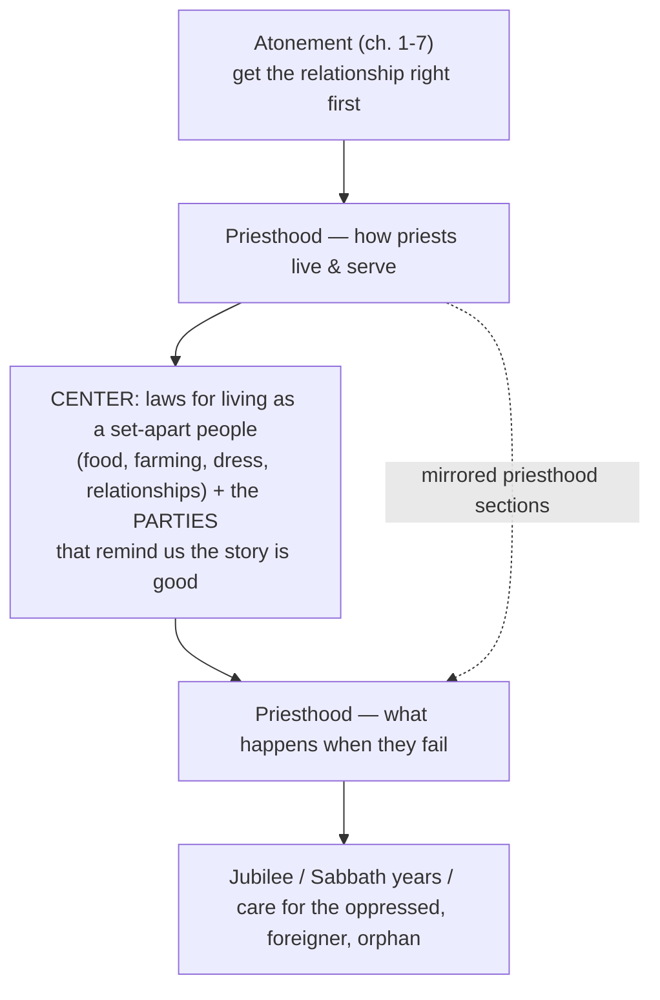
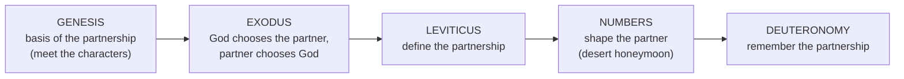

# Session 1 Capstone

BEMA 32 · Session 1
Source transcript: `~/workspace/bema/transcripts/1-32-session-1-capstone.md`
Book: Torah (Genesis–Deuteronomy) — a capstone/review episode; no single passage is worked
Hosts: Marty Solomon (host) · Brent Billings (co-host)

> This is the Session 1 capstone. It does not exposit a single passage; it traces the narrative arc of the whole Torah and then condenses that arc to one word — **partnership**. The hosts first give the "longer review" (the Tale of Two Kingdoms, Genesis as preface + introduction, then the Exodus→Deuteronomy narrative), then compress it: Genesis is the *basis* of the partnership, Exodus is where God *chooses* the partner and the partner chooses God, Leviticus *defines* the partnership, Numbers *shapes* the partner, and Deuteronomy calls the partner to *remember*. Because this is the narrative-arc anchor for the whole corpus, the Episode Flow below doubles as the arc: each Torah unit is listed with the role it plays in the one unchanging relationship.

## Episode Flow (coverage backbone)

This episode is a review, so the flow *is* the Session-1 story thread. Each movement names a Torah unit and its role in the partnership arc.

1. **Why capstones exist — tell the story.** Marty frames the review as the "one chance" to get the 10,000-foot view: *"Do we understand how the narrative arc works? Do we understand how Torah flows?... Could we tell somebody else what Torah is and what Torah is about?"* Brent ties it to debrief: *"Be ready to tell the story of what the Bible is doing."*
2. **The frame: a Tale of Two Kingdoms.** Marty names the Session-1 narrative frame — Empire vs. Shalom. *"There's a Kingdom of Empire and there's a Kingdom of Shalom... There's God's Kingdom and then there's the world's kingdom."*
3. **Genesis 1–11 — the preface (role in arc: the world/the trust).** The high-level setup before the characters: creation is fundamentally good and we are invited to trust it. Marty: *"creation — the essence of creation — is goodness... there's an invitation in the preface to trust this."*
4. **Genesis 12–50 — the introduction (role: the basis of the partnership).** Meet A-I-J-J, the family of God; trusting the story "with flesh on," ending in forgiveness. Marty: *"all of Genesis is a setup... about the goodness of creation and a family that is far from perfect, but keeps leaning back into this goodness."*
5. **The gap into Exodus (time-jump).** Brent's "meme voice": *"'four hundred years later.'... There's a long gap. And exactly how long that gap is is up to debate."*
6. **Exodus — rescue and wedding (role: God chooses the partner / the partner chooses God).** Passover/rescue, then Sinai as a marriage. Brent: *"There's a marriage."* Marty: *"It's a wedding, and He marries His people."*
7. **Exodus ends — the Tabernacle (role: the honeymoon suite / the priests' workplace).** Brent: *"The Tabernacle. Many, many details on the Tabernacle."* Marty: a "mobile Genesis 1," the "honeymoon suite," and practically "a physical place where the priests work."
8. **The kingdom-of-priests problem.** Why the Tabernacle matters: God called the *whole* people priests. Marty: *"you'll have priests, but I'm also asking all of you to be priests."*
9. **Leviticus — the owner's manual (role: define the partnership).** The glove-box manual for the Tabernacle: opens with atonement, then the "priestwich," a center of everyday-life laws, parties, and ends in Jubilee/justice. Marty: *"the owner's manual in the glove box of the Tabernacle."*
10. **Numbers — the desert honeymoon (role: shape the partner).** A long season getting to know the husband. Marty: *"there's a honeymoon... a long period of time just hanging out with God in the desert... put this relationship to the test."* Brent recaps the desert images (shepherds, rotem, acacia, wadi/En Gedi).
11. **Deuteronomy — remember (role: own and possess the partnership).** The call to "remember, remember, remember," which produces compassion for the A-O-W. Marty: *"Remember to pull them in... it's going to remind you of your story."*
12. **The condensation — one word: partnership.** Brent asks how to shrink it to a thirty-second lobby version; Marty answers with the capsule. *"Torah is the story of partnership."*
13. **What's next — Session 2 (the rest of Tanakh).** Marty: Session 2 is "the prophets and the writings... from Joshua all the way to... Malachi," watching the partner *live out* the mission; Brent urges listeners not to skip it.
14. **Close — website, BEMA/Impact, and the invitation to give.** Housekeeping, the ministry behind the podcast, and the donation invitation (average gift "$22" a month).

**Coverage verification:** All fourteen movements are represented below under Key Lessons, East/West Lens, Recurring Through-lines, Narrative Tensions, Chiasms & Structure, Terminology, Illustrations, References, and Callbacks. Every point is backed by a transcript citation.

## Key Lessons

- **Torah condensed is one word: partnership.** Marty: *"if I were going to condense Torah in a shorter review — an even smaller capsule — I would say Torah is the story of partnership... the partnership we have with God."* Each book is a stage of that one relationship — the clearest statement in Session 1 that God's priorities never move.
- **The arc has five roles, one relationship.** Marty lays out the whole capsule: *"Genesis is the basis of that partnership... Exodus is where God chooses that partner, and that partner chooses God... Leviticus is where you define the partnership... the book of Numbers is God shaping his partner... And then Deuteronomy is where God asks his partner to remember."*
- **Trusting the story is the thread that holds the family together — even in failure.** Of Genesis 12–50: *"a family that is far from perfect, but keeps leaning back into this goodness — keeps trusting the story even in their moments of greatest failure. They don't let those moments define them."* Forgiveness is named "the ultimate example of trusting the story."
- **Identity (forgiven, beloved, accepted) comes first, or the whole story breaks.** On why Leviticus opens with atonement: *"if your relationship isn't right with God, nothing else is going to work. If your identity isn't in the fact that you are forgiven, beloved, accepted, valued by God, all the fear and insecurity is going to mess the story up."*
- **Celebration keeps the people from forgetting the story is good.** The Leviticus "parties" exist as a safeguard against legalism: *"if I don't throw a party, I'm going to forget that the story is good... the love of God is the most defining thing about our relationship, not my performance, not my failure."*
- **Choosing, knowing, and becoming are not the same — formation takes time.** On Numbers: *"It's one thing to choose, and it's one thing to know. It's another thing to become."* The desert is the shaping stage, not a punishment.
- **Remembering your own rescue produces compassion for the outsider (A-O-W).** Deuteronomy's logic: *"If you remember where you came from, you are going to notice those who are in similar places... Remember to pull them in... And when you're reminded of your story, you're going to see them and notice them and have compassion."*
- **You must be able to tell the story — the big picture, not just the pieces.** Marty: the capstone exists so *"we understand the big picture, not just the pieces that lay on the table."* Brent: *"Be ready to tell the story of what the Bible is doing."*
- **Don't skip the "boring middle."** On Session 2: Brent — *"Jesus references the prophets so much... get the storyline because it is one continuous story... if we take a whole chunk out of that story, we miss some important context."*

## East/West Lens

- **One continuous, unfolding story (truth over time).** The capstone insists on a single unbroken narrative our grasp of which grows session by session. Brent: *"it is one continuous story from what we've been talking about all the way through to Jesus and beyond. It is one big story."*
- **Community over individual (the partnership is corporate).** Both the "kingdom of priests" call and the A-O-W cycle are plural and communal: *"it's this cycle where we remember who we are and we find solidarity together."* Belonging is defined by pulling the marginalized *in*.
- **Word-pictures over abstractions.** The arc is carried by concrete images rather than doctrines — Sinai as a *wedding*, the Tabernacle as a *honeymoon suite* and a "mobile Genesis 1," Leviticus as "the owner's manual in the glove box," Deuteronomy as a "determine the relationship" talk. Marty: the Tabernacle is *"like a mobile Genesis 1... if you wanted to look at it as a literary device."*
- **Set-apart ordinary life (holiness is embodied, not merely cultic).** The center of Leviticus makes food, farming, dress, and relationships themselves an act of priesthood: *"God wants his people to be different, just like the priests are different from you, God wants you to be different from the world."*
- **Formation happens in place / in the desert (crucible, not classroom).** Numbers is "a long period of time just hanging out with God in the desert"; Brent recalls learning from the land itself — the shepherd, the rotem, the acacia's seasons, wadi floods, En Gedi.

## Recurring Through-lines

*(Motifs genuinely present in this episode, each backed by a citation. No registry consulted.)*

- **Trust the story (the overarching Session-1 arc, stated plainly).** The capstone *is* this through-line made explicit: Genesis 1–11 *"is all about goodness and trusting the story — trusting that God knows what he's up to and what he's doing."* Every later book is a further movement of that same trust.
- **Partnership — God choosing a people to be with him (the Session-1 spine).** The headline motif, named as the one-word capsule for all of Torah: *"Torah is about 'partnership' — the partnership we have with God."*
- **A kingdom of priests / mirror the God you serve.** The corporate-vocation thread: *"you'll have priests, but I'm also asking all of you to be priests... God wants you to be different from the world."* The people are to carry God's character to the world.
- **God hears the cry / rescue.** The Exodus heartbeat recurs in the review: *"He rescues them from that oppression because He's heard their cry."* Rescue is the moment the partnership becomes real.
- **Remember so you notice the marginalized (A-O-W).** Deuteronomy's call ties memory to mercy: *"Remember that you were slaves in Egypt... Remember to pull them in,"* so the foreigner, orphan, and widow are drawn in rather than pushed out.
- **Celebration guards memory of the good story.** The "parties" of Leviticus recur as the antidote to performance-anxiety religion: *"I need to be reminded that the story is good."*

## Narrative Tensions

Each entry: surface problem, classification tag, cited quote, normalized verse citation + link, and resolution or open flag.

| Surface problem | Tag | Cited quote (speaker) | Verse citation + link | Resolution / status |
|---|---|---|---|---|
| Genesis ends with Joseph; Exodus opens with Israel enslaved — a large, abrupt leap in time the hosts joke about. | `time-jump` | Brent (meme voice): *"'four hundred years later.'... There's a long gap. And exactly how long that gap is is up to debate."* | [Exodus 1](https://www.biblegateway.com/passage/?search=Exodus%201&version=NIV) | **Open — dance with it.** The hosts flag the gap and note its exact length "is up to debate" without resolving it; the narrative purpose (setup → rescue) is clear, the chronology is not. |
| "A kingdom of priests" is self-contradictory in ordinary usage — a kingdom *has* a few priests; it isn't made *of* them. | `logic-gap` | Marty: *"it's weird to have a kingdom of priests... God said, 'Yeah, yeah, you'll have priests, but I'm also asking all of you to be priests.'"* | [Exodus 19](https://www.biblegateway.com/passage/?search=Exodus%2019&version=NIV) | **Resolved (Hebraic lens / mission).** The oddity is the point: God calls the whole people to the set-apart, mediating role priests play — Leviticus is then the owner's manual that teaches them how. |
| Why does Leviticus bury dietary/farming/clothing/sexuality laws *in the middle* of two priesthood sections (the "priestwich")? | `unstated-cultural-assumption` | Marty: *"in the middle of Leviticus, all these chapters in between these sections on priesthood... is all of these laws about how we're going to live as a Jewish people... all of that ends up being a call to priesthood."* | [Leviticus 11-25](https://www.biblegateway.com/passage/?search=Leviticus%2011-25&version=NIV) | **Resolved (structure).** The sandwich makes everyday life *itself* an act of priesthood: ordinary living is set-apart living, framed by the priesthood sections around it. |
| Why wander the desert forty years instead of going straight to the Promised Land? | `logic-gap` | Marty: *"there's a honeymoon... a long period of time just hanging out with God in the desert... We need to go put this relationship to the test."* | [Numbers 14](https://www.biblegateway.com/passage/?search=Numbers%2014&version=NIV) | **Resolved (arc/partnership).** The desert is the "shaping" stage — *"It's one thing to choose... It's another thing to become."* Formation, not punishment. |
| Why does Deuteronomy keep hammering "remember" instead of giving new commands? | `unstated-cultural-assumption` | Marty: *"'Remember, remember, remember' — that call of Deuteronomy... If you remember where you came from, you are going to notice those who are in similar places."* | [Deuteronomy 8](https://www.biblegateway.com/passage/?search=Deuteronomy%208&version=NIV) | **Resolved (formation of memory).** Memory is the mechanism of compassion: remembering your own rescue is what lets you see and pull in the A-O-W. |
| Isn't it fine to skip the prophets (Session 2) and get straight to Jesus? | `logic-gap` | Brent: *"I understand the temptation... However, Jesus references the prophets so much... if we take a whole chunk out of that story, we miss some important context."* | [Luke 24:27](https://www.biblegateway.com/passage/?search=Luke%2024%3A27&version=NIV) | **Resolved (one continuous story).** The story is unbroken; skipping the middle strips the context Jesus himself assumes. |

## Chiasms & Structure

Two clearly described structures in this episode.

**1. The Leviticus "priestwich" (center-weighted / sandwich).** Marty describes two priesthood sections wrapping a center of everyday-life laws, opened by atonement and closed by Jubilee/justice.

The two priesthood panels mirror each other around the central block of ordinary-life laws; the whole is framed by atonement at the front and Jubilee/justice at the back.

**2. The Torah arc as the "partnership" model.** The capstone's headline structure — each book a stage of one relationship.

## Terminology

- **partnership** — Marty's one-word condensation of Torah: *"Torah is about 'partnership' — the partnership we have with God."* Genesis = basis, Exodus = the choosing, Leviticus = definition, Numbers = shaping, Deuteronomy = remembering.
- **Tale of Two Kingdoms** — the Session 1 frame: the Kingdom of Empire vs. the Kingdom of Shalom. Marty: *"There's God's Kingdom and then there's the world's kingdom."*
- **preface / introduction** — the hosts' names for the two halves of Genesis: the preface is 1–11 (the world, goodness, trust) and the introduction is 12–50 (the family of God). Marty: *"Genesis 1-11 is the preface... Chapters 12-50, is what we call the Introduction."*
- **A-I-J-J** — whiteboard shorthand for the family of God in the Introduction (Gen 12–50): **A**vram, **Y**itzhak, **Y**a'akov, **Y**osef — Abraham, Isaac, Jacob, Joseph.
- **priestwich** — the hosts' nickname for Leviticus's sandwich structure: two priesthood sections wrapping a central block of everyday-life laws.
- **A-O-W** — the **A**lien (foreigner), **O**rphan, and **W**idow; the marginalized Deuteronomy calls Israel to remember and "pull them in."
- **Tanakh** (תַּנַ"ךְ) — the Hebrew Bible. Session 1 = Torah; Session 2 = "the rest of Tanakh," Joshua through Malachi.

## Illustrations & Stories (from the hosts)

- **The whiteboard review.** Marty recalls the college-class ritual that the capstone replaces: *"When we used to do this as a college class, we would start every class with a literal review on a whiteboard."* The capstones are the podcast's substitute for that running review.
- **"Be ready to tell the story of the trip."** Brent's analogy from Marty's study tours: *"We come back from a trip and it's like, 'Be ready to tell the story of what you did.' And this is the same kind of thing."*
- **The SpongeBob / "four hundred years later" bit.** Brent's "meme voice" for the Genesis-to-Exodus gap, which Marty hopes to drop in as an audio clip: *"[SpongeBob audio clip: 'Many unbearable hours later.']"*
- **The glove-box owner's manual.** The picture for Leviticus: *"like the owner's manual in the glove box of the Tabernacle. You've just built this Tabernacle, you don't really know what to do with it."*
- **The "determine the relationship" talk.** Marty's image for Leviticus defining the partnership: *"those days in high school or college where you used to have that 'determine the relationship' conversation... 'Are we friends? Are we dating?'"*
- **Brent's desert recap.** Brent retells the Numbers desert images from lived experience: *"we've walked around the corner and found a rotem bush... we find the acacia... we've seen a couple of wadi floods, and we've stumbled on a couple of En Gedis."*
- **The thirty-seconds-in-the-lobby test.** Brent's framing for why they condense Torah to one word: *"some people you have maybe thirty seconds as you're greeting them in the lobby at church... So what can we do to condense this a little bit more?"*
- **The dollar-a-month donor.** Brent's story about the smallest givers as the close's emotional center: *"we have one or two donors who give like a dollar a month... the fact that you don't have that much to give, but you want to tell us that you find it important... that is a huge blessing to us."*

## References & Resources (named in the episode)

- **The capstone presentation / slides** — Marty refers to "a presentation in your show notes" with "a few slides" that follow the five-books review.
- **BEMA Discipleship website (bemadiscipleship.com)** — Brent's tour of the hosts page, news page, BEMA Messenger email, groups, and the About/history page.
- **The BEMA Messenger** — the monthly email Brent invites listeners to sign up for.
- **Impact Campus Ministries** — the ministry behind BEMA; Marty names the growing team (Ambur on social media, Shakoa on graphics, Brian on strategy/donors) supported by listener giving.
- **Episodes "-1 and 0"** — the reboot's explainer episodes Marty points back to for how the reboot/sessions work.
- **Session 2 preview** — "the prophets and the writings... Joshua all the way to... Malachi," including a planned zoom-in on **Ruth** and the Wisdom literature.

## Callbacks (explicit links the hosts make)

- **Tale of Two Kingdoms** (the Session-1 frame from the Exodus arc, e.g. `1-18-a-tale-of-two-kingdoms.md`). Marty: *"We call this narrative a 'Tale of Two Kingdoms.' There's a Kingdom of Empire and there's a Kingdom of Shalom."*
- **The preface** (ties to `1-07-the-preface.md`). Marty: *"Genesis 1-11 is the preface... all about goodness and trusting the story."*
- **Sinai as a wedding / under the chuppah** (ties to `1-22-under-the-chuppah.md`). Marty: *"we talked about a chuppah and the Ten Commandments."*
- **The kingdom of priests** (ties to `1-25-a-kingdom-of-what.md`). Marty: *"God called you at the very beginning... a kingdom of priests."*
- **The desert images — shepherd, rotem, acacia, wadi, En Gedi** (ties to `1-26` through `1-29`). Brent: *"we get to see what shepherds do... found a rotem bush... we find the acacia... we've seen a couple of wadi floods, and we've stumbled on a couple of En Gedis."*
- **Remember where you came from** (ties to `1-31-remember-where-you-came-from.md`). Marty: *"'Remember. Remember where you came from. Remember that you were slaves in Egypt.'"*
- **Forgiveness as trusting the story** (ties to the Joseph arc, `1-15`/`1-16`). Marty: *"Genesis ends with this amazing story of humility, confession, repentance, and forgiveness... forgiveness being the ultimate example of trusting the story."*

## Discussion Questions

1. If you had thirty seconds in a church lobby to say what the whole Torah is about, could you? Try it: what single word or sentence would you use — and does "partnership" fit your own reading of Genesis through Deuteronomy?
2. The arc moves from *choosing* (Exodus) to *defining* (Leviticus) to *becoming* (Numbers). Marty says "it's one thing to choose... it's another thing to become." Where in your own relationship with God are you still at "choosing" or "knowing," and what would "becoming" require?
3. Leviticus starts with atonement because "if your identity isn't in the fact that you are forgiven, beloved, accepted... all the fear and insecurity is going to mess the story up." Where is your sense of identity actually anchored right now, and how does that show up in your fears?
4. Marty says the parties in Leviticus exist so God's people "don't forget that the story is good." What are the "parties" in your life that keep you from getting "lost in all the rules" — and are you actually keeping them?
5. Deuteronomy ties remembering your own rescue to noticing the foreigner, orphan, and widow. Who are the "A-O-W" people in your context, and how would remembering your own story change the way you treat them?
6. The hosts urge listeners not to skip the prophets on the way to Jesus because "it is one continuous story." Where are you tempted to shortcut the "boring middle" of a story — in Scripture or in life — and what context might you lose by doing so?

## Sources

- Transcript: `~/workspace/bema/transcripts/1-32-session-1-capstone.md`
- [Genesis (NIV)](https://www.biblegateway.com/passage/?search=Genesis&version=NIV)
- [Exodus 1 (NIV)](https://www.biblegateway.com/passage/?search=Exodus%201&version=NIV)
- [Exodus 19 (NIV)](https://www.biblegateway.com/passage/?search=Exodus%2019&version=NIV)
- [Leviticus 11-25 (NIV)](https://www.biblegateway.com/passage/?search=Leviticus%2011-25&version=NIV)
- [Numbers 14 (NIV)](https://www.biblegateway.com/passage/?search=Numbers%2014&version=NIV)
- [Deuteronomy 8 (NIV)](https://www.biblegateway.com/passage/?search=Deuteronomy%208&version=NIV)
- [Luke 24:27 (NIV)](https://www.biblegateway.com/passage/?search=Luke%2024%3A27&version=NIV)
