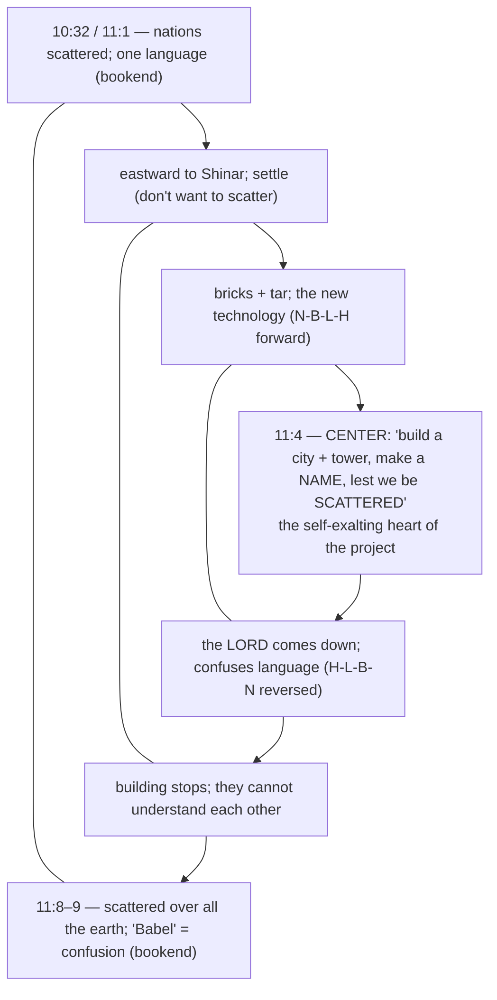

# A Tale of a Tower

BEMA 6 · Session 1
Source transcript: `~/workspace/bema/transcripts/1-6-a-tale-of-a-tower.md`
Book: Genesis (Genesis 11:1–9; with 10:32 and 10:8–10)
Guest: Josh Bossé (BEMA teaching team; Impact campus ministry; "Midrash Josh")

> The Tower of Babel read as the climax of a chain of "know when to say enough" stories. Evil has been organizing itself upward — from an individual (Cain), to a family, to a people, and now to a **civilization** with a warrior-king (Nimrod) at its head. The hosts argue the scattering is not a curse but a strategic, redemptive nudge: God refuses to let humanity accomplish great things until it learns to listen to one another.

## Key Lessons

- **The scattering of Babel is not punishment — it's a strategic, redemptive move.** Via Fohrman, Marty: *"the scattering of humankind is not framed in the Hebrew story as a punishment. It's framed as a strategic move on God's part."* And: *"There's no 'curse' in the story of Babel. There's just a 'situation.'"* God doesn't remove humanity's ability to do amazing things; he sets conditions so those things can only be built by caring for the good of others. God's priority — shalom, partnership — is unchanged.
- **Technology is amoral; the question is what you do with it.** The Hebrew discourse break ("and they said") after the bricks are made signals God's *silence* — he has nothing to say about the brick. Marty: *"The brick and the technology isn't the problem... Technology is... amoral. It's what we do with it... Are we gonna use this to build God's world, God's way?"* God only "comes down" once he sees the brick turned toward a self-exalting tower.
- **Learning another's language requires self-emptying — that's the redemptive project.** Marty: *"the only way I can learn a language is to completely empty myself, start from scratch, and learn from somebody else."* The confused languages aren't a dead end but an invitation: *"if you ever want to learn how to listen, how to learn from each other, how to love your enemy..."* The lesson lands squarely on tribalism and polarization ("us and them").
- **This is a "trust the story" refusal — Nimrod is its opposite.** Marty: *"Nimrod's the opposite of trusting the story... he's trying to get them back to that good creation, partner with me, tree of life kind of imagery."* God is pulling humanity back "west" — toward Eden's shalom — against their eastward drift.

## East/West Lens

- **Words (abstract definition vs word-picture/idiom)** — East/West *as direction* carries image, not just geography. Josh: *"east is often a symbol of the past and west is the future... the eastern movement symbolically, maybe as kind of a regression."* Also the "and they said" discourse principle encodes meaning in form, not statement.
- **Numbers / symbol & the "whole earth"** — **eretz** can mean a local *land*, not the planet, reframing the "whole earth, one language" scope. Marty/Josh: *"the word eretz... to talk about the whole land... It could be a local area."*
- **Truth over time (static vs dynamic/discovery)** — Midrash and Fohrman's consonant-pattern work are discovery-driven: *"Josh isn't just... making up arbitrary things... these are things that the Jews have also noticed about the way the Text works."* Meaning is dug up, not merely stated.
- **Community vs individual** — The whole lesson is communal: humanity "progresses as a whole" only by learning others' languages. Marty confesses his low teamwork scores — *"I haven't learned the lesson of Babel."*
- **Truth (how/what vs who/why)** — The hosts refuse to litigate the tower's engineering and instead ask *why* God intervenes (to redirect, not to threaten). Marty: *"this isn't that God is necessarily threatened by their advances."*

## Recurring Through-lines

- **Trust the story (the arc itself).** Explicitly the next beat in the "know when to say enough" chain (creation→stop creating; flood→stop destroying). Marty's opening review: *"God keeps saying, look at this good creation, know when to say enough, but they don't."* God's desire to bring humanity back to Eden's shalom is constant. Recurs across the session; condensed at the Session 1 capstone (episode 32).
- **Sin as failing to master the animal instinct ("master the beast").** Strongly present: Nimrod the **gibor** ("mighty man"/warrior) who "hunts people" is evil *organized and civilized* — the un-mastered impulse scaled up to empire. Josh: *"evil is getting organized and that's scary."* Same failure-to-master dynamic anchored in `1-3-master-the-beast.md`. Flag for cross-reference; do not re-explain there.

## Narrative Tensions

Each entry: surface problem, classification tag, cited quote, normalized verse citation + link, and resolution or open flag.

| Surface problem | Tag | Cited quote (speaker) | Verse citation + link | Resolution / status |
|---|---|---|---|---|
| Chapter 10 says the nations each had **their own languages**, then 11:1 says the "whole world had one language." | `contradiction` | Brent: *"how do they have the same language?... now the whole earth had one language. What?"* | [Genesis 10:31–11:1](https://www.biblegateway.com/passage/?search=Genesis%2010%3A31-11%3A1&version=NIV) | **Resolved (Hebraic lens):** The tower story is *inserted* into the genealogy; **eretz** may mean a local *land* (Nimrod's conquered territory), not the planet — one language within one empire. |
| The people fear "being scattered," but nobody ever threatened to scatter them. Where does the worry come from? | `logic-gap` | Brent: *"it's not like he threatens to scatter them before... where does that worry even come from? That's weird."* | [Genesis 11:4](https://www.biblegateway.com/passage/?search=Genesis%2011%3A4&version=NIV) | **Resolved (interpretive):** The fear is self-generated control/legacy-anxiety (make a name, don't disperse) — the opposite of trusting the story; it exposes the heart behind the tower. |
| Why does God seem *threatened*, as if the project might actually succeed against him? | `unstated-cultural-assumption` | Marty: *"is God threatened by their advances?... 'if I don't do something, they're going to be able to do anything.'"* | [Genesis 11:6](https://www.biblegateway.com/passage/?search=Genesis%2011%3A6&version=NIV) | **Resolved (Hebraic lens):** Not threat but redirection — organized evil (Nimrod = "rebel") settling furthest from Eden; God acts "to get you back west," not out of fear. |
| Why would God *not want* humans to accomplish what they set their minds to? ("I can do all things...") | `unstated-cultural-assumption` | Marty: *"why doesn't God want them to accomplish anything? That felt weird."* | [Genesis 11:6](https://www.biblegateway.com/passage/?search=Genesis%2011%3A6&version=NIV) | **Resolved (interpretive):** He doesn't forbid accomplishment; he conditions it on self-emptying love — different languages mean they can only build great things *together*, for others' good. |
| Is the scattering a punishment/curse? | `translation-disagreement` | Marty (via Fohrman): *"the scattering... is not framed in the Hebrew story as a punishment... Babel means confusion, disorientation. It's not a curse."* | [Genesis 11:8–9](https://www.biblegateway.com/passage/?search=Genesis%2011%3A8-9&version=NIV) | **Resolved (Hebraic lens):** "Babel" = confusion/disorientation, framed as a strategic situation, not a curse — a redemptive constraint. |
| Why interrupt Shem's genealogy with a tale about Nimrod and a tower at all? | `logic-gap` | Josh: *"it interrupts it right as it gets to Shem... record scratch hold up. Let's talk about this tower."* | [Genesis 10:8–10](https://www.biblegateway.com/passage/?search=Genesis%2010%3A8-10&version=NIV) | **Resolved (interpretive):** The insertion links Nimrod (Babel = his city) to the tower — organized evil breaking into the chosen line's story. (Supported by Jewish tradition, acknowledged as "wonky.") |

## Chiasms & Structure

The hosts explicitly identify a chiasm, following Rabbi David Fohrman. The story plays four Hebrew consonants — **nun, bet, lamed, he/chet (N-B-L-H)** — in order through the first half, then reverses them (**H-L-B-N**) in the second half, with **Genesis 11:4** ("let us build... a tower... make a name... lest we be scattered") as the center. The bookends run from 10:32 to 11:8–9.

Prose: the inverted structure points like an arrow to 11:4 — the *name-making, anti-scattering* ambition is the true subject. Marty notes you can sense the chiasm thematically in English even without parsing the Hebrew consonants; the full N-B-L-H / H-L-B-N mirror requires the Hebrew.

### Parallel panel: Babel ↔ Cain and Abel

Following the episode's running pattern (each story parallels an earlier one), Babel mirrors Cain & Abel — and, as always, the "treasure" is in the divergences.

| Element | Cain & Abel | Babel |
|---|---|---|
| Offerings/ascent toward heaven | two sacrifices rising to God | a tower "reaching to the heavens" |
| God intervenes | warns Cain ("sin at the door"), urging him to stay | comes down to confuse/redirect |
| Community posture | told to stay united as family (he refuses) | a "perverse community" sticking together at all costs |
| Wandering vs settling | cursed to **wander**, then builds a **city** | refuses to wander, tries to **settle** |
| Names/legacy | names his city after his son | "make a **name** for ourselves" |

## Terminology

- **eretz** (ארץ) — "land / earth"; "the whole *eretz* had one language" may be a local region, not the planet. Josh: *"the word eretz that's used there... to talk about the whole land. It could be a local area."*
- **gibor** (גבור) — "mighty man / warrior," with martial force; used of Nimrod, "a *gibor* hunter — a warrior who hunts." Josh: *"this he is the first guy who was a warrior."*
- **Nimrod** (נמרוד) — per Gesenius (via Blue Letter Bible) the name means **"rebel"**; Jewish tradition ties him to leading the tower project. Josh: *"the name Nimrod means rebel."*
- **Babel** (בבל) — the tower's name, identical to the Hebrew for "Babylon" among Nimrod's cities; means **"confusion / disorientation."** Marty (via Fohrman): *"the Hebrew word for Babel means confusion, disorientation. It's not a curse."*
- **N-B-L-H** (nun, bet, lamed, he/chet) — Fohrman's consonant pattern that runs forward then reverses (H-L-B-N) across the two halves, marking the chiasm.
- **"and they said"** — Hebrew discourse principle: repeating the speech formula after a speaker just spoke signals a *break* in which nothing happened — here, God's telling silence after the bricks are made. Marty: *"it means that there was a break and nothing happened."*

## Discussion Questions

1. If the scattering is a "strategic move," not a punishment, how does that change the way you've understood Babel? What is God actually protecting humanity *from* — and *for*?
2. Marty says technology is amoral: God had "nothing to say" about the brick, only about the tower. Name a modern technology (the hosts use the internet). What would it look like to use it "to build God's world, God's way"?
3. "The only way I can learn a language is to completely empty myself." Where is self-emptying the price of listening to someone unlike you? Where do you resist paying it?
4. The lesson lands on tribalism — "as long as there is heavy lines about us and them, just enjoy being scattered." Where are the "us and them" lines in your own context, and what's the first step across one?
5. Nimrod means "rebel" and may have built the tower to be beyond even God's reach after the flood. How is a tower against the flood a *failure to trust the story*? Where do you build towers of control against fear?
6. Marty admits he's scored low on teamwork for years and still struggles with the "lesson of Babel." What recurring lesson do you keep having to relearn — and why is it so hard to change?

## Sources

- Transcript: `1-6-a-tale-of-a-tower.md`
- [Genesis 10:8–10 (NIV)](https://www.biblegateway.com/passage/?search=Genesis%2010%3A8-10&version=NIV)
- [Genesis 10:31–11:1 (NIV)](https://www.biblegateway.com/passage/?search=Genesis%2010%3A31-11%3A1&version=NIV)
- [Genesis 11:1–9 (full, NIV)](https://www.biblegateway.com/passage/?search=Genesis%2011%3A1-9&version=NIV)
- [Genesis 11:4 (NIV)](https://www.biblegateway.com/passage/?search=Genesis%2011%3A4&version=NIV)
- [Genesis 11:6 (NIV)](https://www.biblegateway.com/passage/?search=Genesis%2011%3A6&version=NIV)
- [Genesis 11:8–9 (NIV)](https://www.biblegateway.com/passage/?search=Genesis%2011%3A8-9&version=NIV)
- Referenced resources named in the episode (not web-fetched): Rabbi David Fohrman (N-B-L-H chiasm; non-punitive scattering); Hofberger Institute / Aleph Beta; Gesenius lexicon via Blue Letter Bible; Jewish Midrash/tradition on Nimrod.
