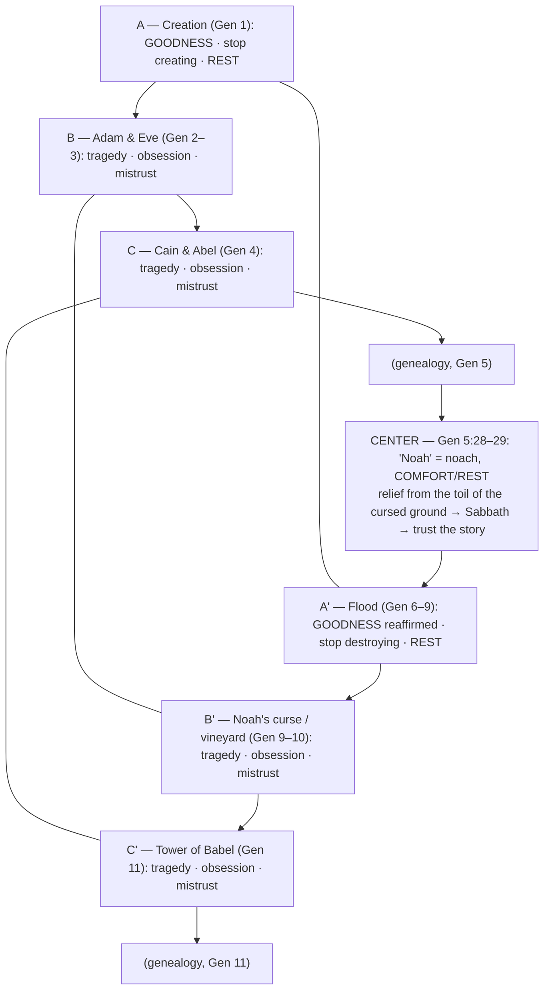

# The Preface

BEMA 7 · Session 1
Source transcript: `~/workspace/bema/transcripts/1-the-preface-7.md`
Book: Genesis (review/synthesis of Genesis 1–11; center text Genesis 5:28–29)

> A review episode with no new story. The hosts step back and read all of Genesis 1–11 as God's **preface** — the backstory before the "introduction" (Genesis 12–50) and the main narrative (Exodus–Revelation). The payoff: the eight preface stories are themselves arranged as a **chiasm of chiasms**, whose center (Noah = *noach*, "comfort/rest") makes the same point every individual chiasm made — *trust the story*.

## Key Lessons

- **Genesis 1–11 is a "preface" meant to reframe *us*, not just its first audience.** Marty: *"the beginning of God's story, the preface, is an invitation to reframe our understanding of the world... it's asking us to rethink."* Like Tolkien's opening backstory before you reach the Shire, the preface resets our assumptions about who God is, who humanity is, and how they relate — so the rest of the story can land. God's priorities are the fixed point; our framing is what must move.
- **The whole preface says one thing: trust that creation is good.** Marty: *"the preface of God's story really is an invitation to... Trust the Story... trust that creation is good, trust that there's enough, trust that God loves creation, trust that God has the best interest in mind for creation."* This is the arc stated plainly, and the structural center (Noah/rest) confirms it.
- **The Old Testament God was never a different, angrier God.** Marty: *"I grew up in a Christian world that told me the Old Testament God... was an angry God... But thank goodness Jesus came. But God has always been loving. From the opening pages."* The flood ends with a God *saving* the world; God sat and *pleaded* with Cain. This is the arc's backbone — **God does not change what he wants or what matters.**
- **Discovery over information — don't let the teacher rob you of the find.** The lesson's origin story (student Paris Shewey spotting the chiasm of chiasms before Marty did) models the Eastern value of discovery. Brent: *"we want to make these discoveries... we don't want to rob you of that chance to make your own discoveries."* Two or three preface chiasms are deliberately left unsolved for the group.

## East/West Lens

- **Numbers (quantity vs quality/symbol)** — Eight stories, structured as parallel panels; the flood chiasm is "easy to see... because it's the numbers." Structure carries meaning, not just sequence.
- **Truth over time (static vs dynamic/discovery)** — The entire pedagogy is discovery: *"we want to give you tools. We don't want to give you all the answers... This idea of discovery."* The chiasm of chiasms was itself *discovered*, not simply taught.
- **Truth (how/what vs who/why)** — The preface's questions are who/why: *"Who is God? Is God full of wrath?... what we understand about humanity."* It reframes identity and relationship, not mechanics.
- **God's description (abstract attributes vs concrete relationship)** — The God of the preface is known by how he *relates* (pleading with Cain, saving through the flood), not by abstract wrath/benevolence labels. Marty: *"a God that sat with Cain and pled with him."*

## Recurring Through-lines

- **Trust the story (the arc itself) — this episode is its structural proof.** The macro-chiasm's center lands on **Noah/noach = "comfort/rest,"** which Marty ties straight back to Sabbath and the very first lesson: *"Sounds like Sabbath, sounds like rest, sounds like trusting the story... this massive chiasm is actually making the exact same point that our initial chiasm was making."* God's constant desire — a good, restful creation — is literally at the center of the preface. (This is a mini-capstone for the first arc of Session 1; the full Session 1 capstone is episode 32.)
- **Sin as failing to master the animal instinct ("master the beast").** Present as the recurring "tragedy / obsession / mistrust" pattern that marks every *odd-positioned* story (Adam & Eve, Cain & Abel, Noah's curse, Babel): the human failure to stop, to trust, to master the destructive impulse. Marty's own summary: *"a story of obsession... a story of mistrust."* Same failure-to-master dynamic anchored in `1-master-the-beast-3.md`. Flag for cross-reference; do not re-explain there.

## Narrative Tensions

A review episode, so the "tensions" are the resolved pattern the hosts now name across the preface rather than fresh in-text puzzles. The one framing tension it tackles head-on:

| Surface problem | Tag | Cited quote (speaker) | Verse citation + link | Resolution / status |
|---|---|---|---|---|
| Is the God of Genesis an angry, wrathful "Old Testament God" who only becomes loving once Jesus arrives? | `unstated-cultural-assumption` | Marty: *"I grew up in a Christian world that told me the Old Testament God... was an angry God, a God full of wrath. But thank goodness that Jesus came... But God has always been loving. From the opening pages."* | [Genesis 1–11](https://www.biblegateway.com/passage/?search=Genesis%201-11&version=NIV) | **Resolved (whole-preface lens):** The flood *saves* the world, God *pleads* with Cain; the preface's God is consistently loving and self-limiting — the arc's claim that God does not change. |
| Why is the macro-structure a non-inverted parallelism (ABCD-ABCD) — can it even have a "center"? | `logic-gap` | Marty: *"it's not an inverted parallelism. It's a parallelism... you could actually argue that there's really no center because the center exists on the other side as well."* | [Genesis 5:28-29](https://www.biblegateway.com/passage/?search=Genesis%205%3A28-29&version=NIV) | **Resolved (interpretive):** Even as a parallelism, the midpoint (Noah/comfort/rest) carries the theme; the "center" works thematically whether or not it's a formal inverted apex. |

## Chiasms & Structure

The episode's centerpiece. Each of the eight preface stories is itself a chiasm (problems → chiasm → theme), and the eight together form a **chiasm of chiasms** — a non-inverted parallelism (ABCD / ABCD). The *even* panels (creation, flood) sound the theme of **goodness / stop / rest**; the *odd* panels (Adam & Eve, Cain & Abel, Noah's curse, Babel) sound **tragedy / obsession / mistrust**. At the midpoint sits Genesis 5:28–29 — the naming of **Noah** (*noach*, "comfort/rest") — restating the whole preface's point.

Prose: The pairing is thematic (A↔A' both "goodness/rest," B↔B' and C↔C' both "tragedy/mistrust"). Marty concedes a pure parallelism may lack a formal apex, yet the midpoint text names Noah = *rest*, so the structure's heart echoes the creation chiasm's heart (*moadim*/Sabbath). As Marty jokes, "it's almost like the writers of Scripture had help" — the design exceeds what the hosts attribute to a lone author.

## Terminology

- **Noah / noach** (נח) — "comfort / rest." Genesis 5:28–29 explains Noah will bring comfort/rest from the toil of the cursed ground. Marty: *"Noah means in the Hebrew 'comfort,' noach, 'comfort'... Sounds like Sabbath, sounds like rest, sounds like trusting the story."* Sits at the center of the chiasm of chiasms.
- **preface / introduction / narrative** — the hosts' map of the biblical story: **preface** = Genesis 1–11 (backstory/origins), **introduction** = Genesis 12–50 (Abraham, the setup), **narrative** = Exodus–Revelation (the main story of deliverance). Marty: *"the preface of God's story, Genesis 1-11. High level backstory, stories of origin."*
- **chiasm of chiasms** — the macro-structure in which all eight preface chiasms together form one larger (parallel) chiasm. Marty: *"Oh my goodness. There is a chiasm of chiasms. It all relates to one another."*

## Discussion Questions

1. The hosts call Genesis 1–11 a "preface" that reframes *us*. What assumption about God, humanity, or yourself has this preface most challenged for you so far?
2. Marty says he was taught the "Old Testament God" was angry until Jesus made God loving. Where have you absorbed that split — and how does reading the flood as a *saving* story unsettle it?
3. The center of the whole preface turns out to be *rest* (Noah = comfort). Why might God place rest — not conquest, not achievement — at the structural heart of the backstory to everything?
4. The even stories are "goodness/rest" and the odd stories are "tragedy/obsession/mistrust." Where do you see that same two-beat rhythm — trust vs. grasping — playing out in your own week?
5. Paris Shewey discovered the chiasm of chiasms before his teacher did. The hosts deliberately leave two or three chiasms unsolved. Pick one of the preface stories and try to find its chiasm as a group — what did you discover that the podcast didn't hand you?
6. "I wish I'd known this earlier... but the best thing you can do is get started." What's one old reading of these chapters you're ready to let go of now?

## Sources

- Transcript: `1-the-preface-7.md`
- [Genesis 1–11 (NIV)](https://www.biblegateway.com/passage/?search=Genesis%201-11&version=NIV)
- [Genesis 5:28-29 (NIV)](https://www.biblegateway.com/passage/?search=Genesis%205%3A28-29&version=NIV)
- Referenced resources named in the episode (not web-fetched): J.R.R. Tolkien, *The Lord of the Rings* / *The Hobbit* (preface/introduction analogy); Paris Shewey (first recognized the chiasm of chiasms).
