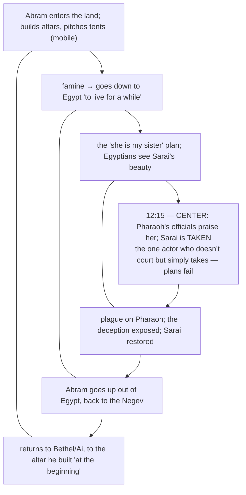

# Letting Go

BEMA 9 · Session 1
Source transcript: `~/workspace/bema/transcripts/1-letting-go-9.md`
Book: Genesis (Genesis 12:1–20; 13:1–18; 14:21–24)

> The call of Abram and his first adventures in Canaan. God's opening word — *lech-lecha*, "Go!" — asks Abram to let go of everything: his father's house, his father's gods, his control over outcomes. Abram proves he's no caped superhero (the Egypt deception goes sideways), but the lesson he learns — *you can't control circumstances; do the right thing and trust God with the rest* — is one he immediately doubles down on with Lot.

## Key Lessons

- **The call is to *let go* — of household, gods, and control.** *Lech-lecha* asks Abram to leave his **beit av** (not just a house but his whole way of life, faith, and belonging). Marty: *"to leave your father's household, this is a big deal... he's going to leave his father's gods, and he's going to follow this calling."* Letting go is the posture of trusting the story: God's priorities are fixed, so Abram can release his own.
- **God's blessing is missional, not merely transactional — "blessed to be a blessing."** Marty: *"God wants to put the world back together... I want to bless everyone else, and I want to work through you to be that blessing... all peoples on earth will be blessed through you."* The covenant exists for *all* nations — God's unchanging interest in everyone (first stated back in episode 0).
- **Abram is "just like you and me" — he fails, learns, and refuses to let the failure define him.** The Egypt deception (the "she's my sister" scheme) backfires when Pharaoh *takes* rather than courts. Marty: *"Avram makes a mistake, learns a lesson and does not let the mistake define him... he goes right back into trusting the story."* This echoes God's word to Cain: do the next right thing and the story can still be redemptive.
- **Trusting the story means releasing your "best plan."** Abram brought Lot as his logical plan for descendants; after Egypt he's learned he can't control outcomes, so he lets Lot pick first and later gives Lot back to the king of Sodom. Marty: *"God's promise is God's problem. I'm going to let God figure out God's promises, and I'm going to let Lot go."*

## East/West Lens

- **Words (abstract definition vs word-picture/idiom)** — Vertical/horizontal Hebrew kinship makes "she is my sister" a deceptive half-truth and "Lot his brother" (really nephew) a deliberate literary link. Marty: *"a deceptive half-truth, or we might even say a deceptive full truth."*
- **Community vs individual** — The whole call is reckoned against the **beit av**: leaving it is costly and countercultural. Brent: *"that's the goal... this just seems like backwards from everything that we know."*
- **Truth over time (static vs dynamic/discovery)** — Midrash (Abram smashing Terah's idols) and Fohrman's chiasm teach by discovery; the hosts leave the Egypt chiasm "for all our listeners to kind of toy with."
- **Truth (how/what vs who/why)** — The hosts refuse to flatten Abram into villain or hero, asking *why* he acts (stewardship, fear, a plan) rather than issuing a verdict. Marty: *"he's not just trying to save his own skin... he has a plan."*
- **God's description (abstract attributes vs concrete relationship)** — God responds to Abram's demonstrated *character*: *"now that you've shown me your character... now I want you to lift your eyes."* Relationship, not abstract decree.

## Recurring Through-lines

- **Trust the story (the arc itself) — the episode's explicit refrain.** Named repeatedly: Abram "trusts the story" in Genesis 13 and "doubles down on trusting the story" in Genesis 14. The lesson of the Egypt chiasm is stated as "do what's right, trust the story, trust God to take care of the rest." God's constant priorities are the fixed point Abram keeps returning to. Recurs across the session; condensed at the Session 1 capstone (episode 32).
- **Sin as failing to master the animal instinct ("master the beast").** Present as the *contrast* that defines Abram: faced with a brotherly quarrel in a field — the exact setup of Cain and Abel — Abram *masters* the impulse Cain didn't. Marty: *"Have we heard a story... about two brothers arguing in a field?... Ended up with one brother killing the other."* Abram instead yields and lets Lot choose. Positive mirror of the failure anchored in `1-master-the-beast-3.md`. Flag for cross-reference; do not re-explain there.
- **"Towers" / settling vs. mobility (Babel callback).** Abram builds altars and pitches tents — "towers" to God's name, kept mobile — the inverse of Babel's permanent tower to their own name. Marty: *"Both stories are about towers, but they're two different kinds of towers."* Links back to episode 6.

## Narrative Tensions

Each entry: surface problem, classification tag, cited quote, normalized verse citation + link, and resolution or open flag.

| Surface problem | Tag | Cited quote (speaker) | Verse citation + link | Resolution / status |
|---|---|---|---|---|
| Why does Abram take Lot along at all — isn't that Haran's/the father's responsibility? | `logic-gap` | Brent: *"it does seem weird that Avram would take that on because wouldn't it fall to the father?"* | [Genesis 12:4-5](https://www.biblegateway.com/passage/?search=Genesis%2012%3A4-5&version=NIV) | **Resolved (interpretive, via Fohrman):** With barren Sarai, Lot is Abram's logical plan for the promised nation — an act of faith in God's promise. |
| God tells Abram to *settle* a land — right after Babel's lesson that God doesn't want people to settle. | `contradiction` | Marty: *"don't promise Avram land... what do you think Avram's going to do?... set up shop... exactly what we just saw in the tower story that God didn't want."* | [Genesis 12:6-8](https://www.biblegateway.com/passage/?search=Genesis%2012%3A6-8&version=NIV) | **Resolved (Hebraic lens):** Abram stays *mobile* — altars + tents, "towers" to God's name — rather than building a permanent tower to his own; the opposite of Babel. |
| Abram pimps out his wife to save himself — pure selfishness? | `unstated-cultural-assumption` | Marty: *"we just throw Avram right under the bus... There's more to it when you look at the words."* | [Genesis 12:11-13](https://www.biblegateway.com/passage/?search=Genesis%2012%3A11-13&version=NIV) | **Resolved (ANE context):** "Treated well" = *materially blessed*; Abram has a shrewd dowry (*mohar*) scheme — deceptive, not merely cowardly. Not excused, but reframed. |
| Why doesn't Pharaoh kill Abram or reclaim the gifts after the deception is exposed? | `logic-gap` | Brent: *"crazy that he doesn't make him give all the stuff back and crazy that he doesn't kill him."* | [Genesis 12:17-20](https://www.biblegateway.com/passage/?search=Genesis%2012%3A17-20&version=NIV) | **Open — dance with it:** The hosts marvel at it ("pretty wild," "by the grace of God") but offer no firm resolution. |
| Abram calls Lot his "brother" when Lot is his nephew; the odd Canaanite/Perizzite note repeats. | `translation-disagreement` | Marty: *"he calls Lot his brother. Is Lot his brother?"* | [Genesis 13:7-8](https://www.biblegateway.com/passage/?search=Genesis%2013%3A7-8&version=NIV) | **Resolved (Hebraic lens):** Horizontal kin terms are broad; the "sister (not sister)" / "brother (not brother)" + Canaanite/Perizzite repeats deliberately link the Egypt and Lot stories. |

## Chiasms & Structure

The hosts explicitly identify a chiasm (via Rabbi David Fohrman) in Genesis 12:10–13:4: Abram walks *into* the land/Egypt (A→B→C) and then back *out* the same way in reverse (C→B→A), with Pharaoh taking Sarai (12:15) as the center. The lesson of the center: **you can't control circumstances the way you think you can.**

Prose: Abram "walks literally directly backwards out of the land, the same exact way he walked into the land" (CBA mirroring ABC), returning to his original altar. The inverted structure points to 12:15 — Pharaoh *takes* where everyone else would have had to *court* — teaching that Abram's foolproof plan was never in his control. That lesson is what he applies to the Lot situation next.

## Terminology

- **lech-lecha** (לך לך) — "Go! / Go forth"; God's opening call (Gen 12:1). Marty: *"Lech-lecha—go!... a huge call on Avram's life."*
- **beit av** (בית אב) — "house of the father"; the whole household — business, faith, belonging, cultural narrative — Abram must leave. Marty: *"his father's household is what he belongs to."*
- **mishpachah** (משפחה) — "family," as distinct from *beit av* ("household").
- **mohar** (מהר) — the bride price/dowry a suitor brings to the patriarch; the engine of Abram's "she is my sister" scheme. Marty: *"You come bringing gifts... to woo the patriarch."*
- **"sister" / "brother" as horizontal kin** — broad kinship terms; "she is my sister" is a deceptive half-truth, "Lot his brother" (nephew) links the two stories deliberately. Marty: *"The first story was about a sister who wasn't really his sister. This story is about a brother who really wasn't a brother."*
- **altars + tents (vs. a tower)** — Abram's mobile worship; "towers" to God's name, not his own, in contrast to Babel. Marty: *"he's building a tower to God's name and making himself mobile."*

## Discussion Questions

1. *Lech-lecha* asked Abram to leave his *beit av* — his security, identity, and inherited beliefs. What's the "father's house" you'd have to let go of to follow where you sense God leading?
2. God blesses Abram "to be a blessing" to all peoples. How does that reframe blessing you've received as something aimed *through* you rather than merely *at* you?
3. Abram's Egypt plan was shrewd and still blew up. When has a "foolproof plan" taught you that you control less than you thought — and what did you do next?
4. The hosts refuse to make Abram either villain or hero in Egypt. How do you hold someone's real failure and real growth together without flattening them into one or the other?
5. Faced with a quarrel in a field (the Cain and Abel setup), Abram yields his patriarchal right and lets Lot choose first. Where could yielding your "right to choose first" break a cycle you're caught in?
6. In Genesis 14 Abram *gives Lot back* to the king of Sodom — releasing his own best plan twice. What's something you've "gotten back" that you may still need to hand to God?

## Sources

- Transcript: `1-letting-go-9.md`
- [Genesis 12:1-20 (NIV)](https://www.biblegateway.com/passage/?search=Genesis%2012%3A1-20&version=NIV)
- [Genesis 12:4-5 (NIV)](https://www.biblegateway.com/passage/?search=Genesis%2012%3A4-5&version=NIV)
- [Genesis 12:6-8 (NIV)](https://www.biblegateway.com/passage/?search=Genesis%2012%3A6-8&version=NIV)
- [Genesis 12:11-13 (NIV)](https://www.biblegateway.com/passage/?search=Genesis%2012%3A11-13&version=NIV)
- [Genesis 12:17-20 (NIV)](https://www.biblegateway.com/passage/?search=Genesis%2012%3A17-20&version=NIV)
- [Genesis 13:1-18 (NIV)](https://www.biblegateway.com/passage/?search=Genesis%2013%3A1-18&version=NIV)
- [Genesis 14:21-24 (NIV)](https://www.biblegateway.com/passage/?search=Genesis%2014%3A21-24&version=NIV)
- Referenced resources named in the episode (not web-fetched): Rabbi David Fohrman / Aleph Beta (Egypt chiasm; story-linking; why Abram brings Lot); Midrash of Abram smashing Terah's idols; *National Geographic* (Nile Delta soil).
