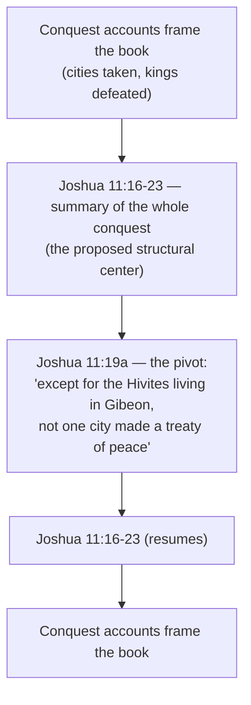

# The Hardest Story in the Bible (for me)

BEMA 34 · Session 2
Source transcript: `~/workspace/bema/transcripts/2-34-the-hardest-story-in-the-bible-for-me.md`
Book: Joshua (Joshua 1:1-18; Joshua 4:1-3; Joshua 11:16-23) — the conquest narrative wrestled with directly
Co-host: Brent Billings · Host: Marty Solomon · Guest: Elle Grover Fricks (co-host / archaeology)

> **Session 2 overarching arc: the partner's unfaithfulness and God's refusal to quit.** Session 1 built the vision of *partnership* — God seeking a people to be the message, to restore shalom. Session 2 moves into the land, the monarchy, and the prophets, where the partner (Israel) repeatedly fails and God refuses to abandon the covenant. This episode sits at the hinge: Israel has crossed the Jordan to *become* the partnership-people in a land of their own. Marty names the conquest as his "least favorite story... the hardest story in the Bible for me," and refuses to let the handful of "outlier" slaughter-stories ("a thousand to three") overturn the larger narrative of "a God of grace and endless pursuit." The episode advances the one story by asking what *kind* of partner-people Israel is meant to be: not muscular conquerors but people who linger in God's presence (Joshua in the tent), who honor covenant even when deceived (the Gibeonites), who build **standing stones** to tell the next generation the story, and who speak *chazak ve'ematz* to one another. The failure-thread is already seeded — Israel "overdid" God's job by acting in their own timing (Exodus 23), with consequences that run into Judges — exactly the unfaithfulness Session 2 will trace.

## Key Lessons

- **The brutal conquest stories are outliers, not the lens — "a thousand to three."** Marty refuses to rebuild his theology around the handful of hard stories (Sodom, the flood, the Egyptian firstborn, the conquest): *"these are the outliers. I'm not gonna reframe how I read the whole story because of the outlier stories."* They are to be wrestled with, not explained away or slept easily over. This keeps the Session 2 failure-arc tethered to the Session 1 vision of a God of grace and endless pursuit.
- **Genre is a gift, not an escape hatch.** Conquest narrative was a known ancient Near Eastern genre (stelae, embellished and hyperbolic). Reading Joshua against it is a *gift*: Elle: *"it's a gift because it enables us to hold it up to the text... The heroes of His story are people who love worship and love the presence of God."* Joshua is introduced not as a muscular warrior but as the one who lingered in the tent for love of God's presence.
- **Pay attention to what *God* says versus what *Joshua* says God says.** The Bible has no problem saying "and the LORD said," yet in Joshua there is "an awful lot of Joshua saying what God has said." Marty: *"I just want to notice that because I think that might be worth marinating on."* The partner's voice and God's voice are not automatically identical.
- **The words matter: *cherem* is consecration, not ordinary "destruction."** Elle: anytime you hit "destroy" in English, *"take a little journey. Search out your concordance."* *Cherem/harem* carries the idea of *setting apart, consecration, devotion* — "super different than the idea of violence." Likewise "exterminate" over-reads a word whose pictorial sense is *to make desolate* (which driving-out would also accomplish).
- **Stay in the story before you leap to theology.** Elle: *"if we just stay in the story and dig in a little bit, get some of that dirt under our fingernails... what can we find God might have actually been commanding his people to do?"* Presuppositions should be written down and *investigated*, not assumed.
- **Joshua is like the kings of his day — and pointedly unlike them.** He impales defeated kings (like Assyria) yet takes the bodies down by nightfall per Deuteronomy; the conquest is in many ways "the softest" among ancient conquest accounts; the stories that *rise to the surface* are stories of redemption (Rahab, the honored Gibeonite treaty), not slaughter.
- **The standing stones are a discipleship practice: keep things that make your children ask "what happened here?"** Unlike a *stele* (which carries writing), a *matsevah* has none — it requires a living witness. Marty: *"the stone doesn't do anything if there's nobody there to tell the story."* The lesson: build stones of witness so the story of God's faithfulness gets handed on.
- **Unity among God's people — *chazak ve'ematz* spoken in every direction — can empower miracles.** The rabbis note "be strong and courageous" passes God → Joshua → the people → Joshua. Marty: *"when you have this kind of unity... it can empower miracles. Not the violent physical conquest of our enemies. But... redeeming the world and restoring Shalom to the chaos."*
- **Don't get stuck here — but don't ignore it either; wrestle it in community.** Brent's closing frame: *"this is an easy episode either to get bogged down in or to not do anything with at all... this is exactly the kind of story that we want to wrestle with."* The tension itself is where the partnership-people are formed.

## East/West Lens

- **Word-study / concrete Hebraic meaning over abstract English gloss (*cherem*, "exterminate," *ematz*).** The whole episode turns on refusing the flattened English word and recovering the concrete sense: *cherem* = devote/consecrate; "exterminate" = make desolate; *ematz* = "quick feet." Elle: *"the word means quick feet"* — a bodily, action-image rather than an interior emotional state.
- **Genre-awareness rooted in the ancient Near Eastern world (conquest narrative, stelae).** Reading the Text in its own setting (neo-Assyrian royal epics with flaming serpents and muscular titles; the Sennacherib Stele; Pharaoh vs. the Hittites) rather than through a modern literalist frame. Marty: *"That's a very common genre for the people of the biblical day."*
- **Heroes defined by *presence* and worship, not domination (an Eastern value).** Elle: Joshua is introduced "in the back of the tent all day, all night, because he loves the presence of God" — "the heroes of His story are people who love worship and love the presence of God." Honor attaches to nearness-to-God, not conquest prowess.
- **Covenant faithfulness as a binding reality (the suzerain-vassal treaty / Gibeonites).** The Gibeonite episode is read through the ancient covenant category: Israel keeps its word even after deception, where an ancient suzerain would normally punish — "because they're a covenant people with God." Covenant trumps the normal rules of empire.
- **Communal, generational storytelling as the mode of transmission (standing stones).** Faith is handed down by a witness telling the story to the next generation — "Dad, what happened here?" — an Eastern, oral, family-rooted pedagogy rather than a written monument that stands alone. Elle extends it to tracing "what God has been up to in my family line and my ancestors."
- **Resisting primitivism — the ancients were not stupid barbarians, and we are not non-violent moderns.** Elle warns against the Western conceit that "those ancient peoples are so stupid and so barbaric." Marty: *"we're definitely the same violent humanity today."* The lens refuses both chronological snobbery and modern self-congratulation.
- **Inspiration without literalism; wrestling over tidy resolution.** Marty holds a "straightforward reading" and belief in inspiration while explicitly denying that inspiration means literalism, and refuses to "tie everything up with a perfect little bow." An Eastern comfort with lived tension over Western demand for propositional closure.

## Recurring Through-lines

- **Trust the story (Session 1 anchor motif).** Marty refuses to "reread the entire story of the Bible because of these handful" of outliers; the macro narrative of "a God of grace and endless pursuit" governs how the hard story is read. Explicit extension of the Genesis "trust the story" spine into the conquest. *"these are the outliers. I'm not gonna reframe how I read the whole story."* (Marty)
- **A thousand to three.** The Session 1 principle (named "we talked in Session 1 about a thousand to three... we referenced it earlier in the episode") that a handful of brutal stories do not overturn the overwhelming witness to God's patience and grace — tied here to God's patience with "very brutal Empires" (e.g., Jonah, flagged ahead). *"When I look at what we could be dealing with... a thousand to three."* (Marty)
- **Shalom — order restored, the outsider brought in.** The miracle unity empowers is "redeeming the world and restoring Shalom to the chaos," and the surfacing stories are redemption-stories (Rahab the outsider "finding a place of belonging"). Directly continues the Session 1 shalom through-line. *"restoring Shalom to the chaos."* (Marty)
- **Partnership / God works through a human partner (Session 1 arc) — now stress-tested.** The episode watches the partner act "in their timing instead of God's timing" and "overdo" God's job (Elle), seeding the Session 2 unfaithfulness-arc while God's covenant commitment holds. *"they were trying to do everything in their timing instead of God's timing."* (Elle)
- **Standing stones / telling the story to the next generation.** A motif the episode foregrounds explicitly (Josh 4; Jacob's stone at Bethel; Tel Gezer; Elle's grandfather's patch; tattoos as *matsevot*) — the practice of keeping witnesses so the story is handed on. *"Do we have standing stones in our own lives for our own families?"* (Marty)
- **Inspiration ≠ literalism / wrestling with the Text.** The recurring BEMA posture of taking the Text seriously without flattening it into literalism, and valuing the "wrestling match" over tidy answers. *"I believe in the inspiration of scripture... And by that I don't mean literalism."* (Marty)

## Episode Flow (coverage backbone)

A sequential walkthrough of every teaching beat, in order. Used to verify full coverage.

1. **Cold open — the hardest story.** Brent introduces Elle to tackle "nagging questions about the book of Joshua and its stories of mass slaughter and genocide"; Marty confirms it is "still my least favorite story," kept in the reboot rather than yanked.
2. **Setting expectations.** Jericho is "built for Sunday school"; other Joshua stories "pretty much feel like just stories of genocide." These are the exception to a larger narrative of grace and endless pursuit; Marty won't "upend my entire theology" over the "handful" of outliers ("a thousand to three"; his second book has a chapter on it). No tidy bow promised.
3. **Archaeology of the conquest — the honest starting point.** No datable archaeological evidence for the conquest in the expected period; the minimalist/maximalist debate flagged as a later Session 2 topic. Caution against History/Discovery Channel "entertainment" vs. peer-reviewed scholarship (Finding Bigfoot, Ghost Adventures gag).
4. **Elle's counterpoint (Episode 240 / Hebrew University).** Non-Canaanite peoples with a distinct pottery style moved into the land; **destruction layers** exist in cities even if dates don't perfectly line up. Elle leans "a little bit less skeptical." Brent gives the "hall pass" to Episode 240; Elle's Discovery Channel writing credit gag.
5. **Bringing two realities together — the conquest-narrative genre.** Ancient kings erected **stelae** telling embellished, hyperbolic conquest stories (Sennacherib "shut up Hezekiah like a bird in a cage"; Hittite and Pharaoh accounts). "History is written by the victors" (Brent) — "the victorious nerds" (Elle). Is Joshua using the genre "almost tongue in cheek" to make a poetic point? Marty still prefers wrestling the text as written (inspiration, not literalism), not explaining it away.
6. **Resources named.** Greg Boyd (*[Crucifixion] of the Warrior God*, a sermon, Christocentric/crucicentric); Rob Bell, *What Is the Bible?* (a personal top-five book, strong on conquest).
7. **What God says vs. what Joshua says God says.** The Bible readily says "the LORD said" (Exodus/Numbers have Moses relay God's exact words), yet in Joshua there's "an awful lot of Joshua saying what God has said." Worth "marinating on."
8. **What the words actually mean (*cherem*, "exterminate").** Elle's "thousand-foot view": the neo-Assyrian king-epic genre (muscular titles, flaming serpents) throws Joshua's introduction — the man who lingers in the tent for love of God's presence — into relief. *Cherem/harem* = consecration/devotion, not ordinary "destroy"; "exterminate" over-reads *make desolate*. Stay in the story before leaping to theology.
9. **Evolving human consciousness — without primitivism.** The world of Joshua is genuinely different from ours (ethics, ideologies), *and* we must not treat the ancients as stupid barbarians; nor pretend our own era is non-violent. "We're definitely the same violent humanity today."
10. **Observations.** God is often quiet while Joshua plans and strategizes. Joshua acts like kings of his day (impaling defeated kings) yet differs (takes bodies down by nightfall per Deuteronomy). The conquest is in many ways "the softest" among ancient conquests. The Gibeonites deceive their way into a suzerain-vassal covenant, and Israel *honors* it anyway because they are a covenant people.
11. **Redemption stories rise to the surface — and the chiasm theory.** The memorable Joshua stories are redemption, not conquest. A theory holds the whole book is a **chiasm** centered on **Joshua 11**, with **11:19a** ("except for the Hivites living in Gibeon, not one city made a treaty of peace") at the very center. Marty isn't sold but finds it a provocative "buried treasure." Brent reads Joshua 11:16-23 and then 19a.
12. **Brent's question + Elle leans in (Exodus 23).** Did Israel attempt treaties and get refused? Elle reframes via Exodus 23: God forbade covenants (lest Canaanite gods become "a noose") and promised to drive the peoples out *gradually* (lest the land go unstewarded). So 11:19a may mark Israel *succeeding* at not covenanting — yet "overdoing" God's job by acting in their own timing (unlike David waiting on God), with fallout into Judges. "Exterminate" is likely a translator's cultural over-reading of "make desolate."
13. **Michener's *The Source* + imagination.** Historical fiction where God says "take the city," not "go to war"; the character knocks and offers terms of peace. It doesn't resolve the problem but fuels a sanctified imagination. Also *The Gifts of the Jews* by Thomas Cahill (graphic but illuminating).
14. **The Canaanite cultural backdrop — honestly qualified.** Fertility cults / "temple prostitute" claims are partly **reception history** (Elle); hard Levantine evidence is thin, though the anxiety-about-birth dynamic and asherah poles (later, Iron Age) are real. Child sacrifice to the Baals (the bronze bull-furnace, "the smile of Baal") is prevalent in the ancient world though evidence centers on contested **Carthage**.
15. **The two unbearable sides.** Marty won't take a side: "how can God not do something?" vs. "how could God do this?" He is glad he doesn't have to "roll these dice" — God is "unbelievably patient with very brutal Empires" (Jonah ahead); "a thousand to three" again. Elle: lean into the provocation (perhaps the Spirit's); "do your own research"; God is faithful to show up and good fruit comes.
16. **First closing passage — Joshua 4 and the standing stones.** Brent reads Joshua 4:1-3. The twelve Jordan stones are *matsevot* / **stones of witness** — unlike *stelae*, they bear no writing and require a living witness ("Dad, what happened here?"). Jacob's anointed stone at Bethel (Genesis 28). Tel Gezer's twelve (non-Israelite) standing stones on BEMA study tours. Application: keep standing stones for your family (Marty's football belt, bookshelf objects; the "pope on a rope" and "Best Dad in the World" frame gags; Elle's millennials' tattoos, her grandfather's "Come follow me" patch, tracing God in the family line).
17. **Second closing passage — Joshua 1 and *chazak ve'ematz*.** Brent reads all of Joshua 1. The rabbis note "be strong and courageous" passes among all three parties (God → Joshua → people → Joshua). Marty's lesson: this kind of **unity** can empower miracles — not violent conquest but "redeeming the world and restoring Shalom to the chaos."
18. **Elle's tag — *ematz* = "quick feet."** Not merely emotional bravery; "feet that are quick to do the word that God has given us to carry out," even when we don't feel like the protagonist.
19. **Brent's benediction.** Don't get bogged down, don't ignore it — wrestle it in a discussion group. "Brent, are you telling the people to *chazak ve'ematz*?" "Yeah, I guess so." "Bam!"

**Coverage verification:** All three read passages (Joshua 1:1-18; Joshua 4:1-3; Joshua 11:16-23) are carried into the sections below. Every Hebrew/idiom term named in the transcript (*cherem/harem*, "exterminate"/make-desolate, *matsevot*, *chazak ve'ematz*, *ematz*, "a thousand to three," suzerain-vassal covenant) appears under Terminology. Every named reference (Greg Boyd / *The Crucifixion of the Warrior God* + sermon; Rob Bell, *What Is the Bible?*; James Michener, *The Source*; Thomas Cahill, *The Gifts of the Jews*; Elle's Episodes 240 and the Season 10 Joshua/Judges series; the Sennacherib Stele; Exodus 23; Tel Gezer; Carthage) appears under References or Callbacks. The explicitly-taught **chiasm theory** (Joshua centered on 11:19a) is rendered under Chiasms. Stated tensions (lack of conquest evidence; God-said vs. Joshua-said; *cherem*; "exterminate"; the chiasm center "they didn't defeat them"; fertility-cult reception history; "how can God not / how could God") appear under Narrative Tensions. Strays with no better home (Finding Bigfoot/Discovery gags, "pope on a rope," the inauguration-free lightness) are parked in Other Talking Points.

## Chiasms

The episode explicitly presents (while Marty remains undecided about) a theory that the **entire book of Joshua is a chiasm centered on Joshua 11**, with the midpoint of that central passage falling on **Joshua 11:19a**. Marty: *"there's a theory that the entire book of Joshua as a chiasm, the center of that chiasm being Joshua 11."* And of 19a: *"the center verse of the entire thing is that. Oh, well, they actually didn't defeat these people. What do you do with that little buried treasure in the middle?"* Rendered as presented:

Note (per the transcript): the "buried treasure" at the center is not a conquest but an *exception* — the one city that *did* make peace (Gibeon). Read with Exodus 23 (Elle), the center may be flagging that Israel largely *succeeded* at not making covenants with the peoples, even as it "overdid" God's job by acting in its own timing. Marty is explicit he is "not sure I've necessarily decided that I'm totally on board with this theory."

## Narrative Tensions

Each entry: surface problem, classification tag, cited quote, normalized verse citation + link, and resolution or open flag.

| Surface problem | Tag | Cited quote (speaker) | Verse citation + link | Resolution / status |
|---|---|---|---|---|
| We're told there's "evidence for everything," yet there's no datable archaeological evidence for the conquest when the Bible says there should be. | `unstated-cultural-assumption` | Marty: *"we don't have archaeological evidence for the conquest during the period when the Bible tells us we should have archaeological evidence."* | [Joshua 11:16-23](https://www.biblegateway.com/passage/?search=Joshua%2011%3A16-23&version=NIV) | **Open — dance with it (partially eased):** Elle notes real **destruction layers** and incoming non-Canaanite pottery even if dates don't line up perfectly (Episode 240); she leans "a little bit less skeptical." The minimalist/maximalist debate is flagged for later Session 2. The gap is held, not closed. |
| The Bible readily says "the LORD said," yet Joshua is full of *Joshua* saying what God said — are they the same? | `logic-gap` | Marty: *"there's an awful lot of Joshua saying what God has said in Joshua. I just want to notice that because I think that might be worth marinating on."* | [Joshua 1:1-9](https://www.biblegateway.com/passage/?search=Joshua%201%3A1-9&version=NIV) | **Open — dance with it:** Raised deliberately as something to "marinate on." The Text distinguishes divine speech from a leader's relay (cf. Exodus/Numbers), inviting careful attention to *which* voice commands a given action. |
| English says God commands "destroy / exterminate" whole peoples — did God order genocide? | `translation-disagreement` | Elle: *"there's a word that means 'destroy'... but there's a lot of words that get translated that way... harem... it's the idea of setting something aside. It has to do with consecration and devotion."* | [Joshua 11:16-23](https://www.biblegateway.com/passage/?search=Joshua%2011%3A16-23&version=NIV) | **Resolved (word-study):** *Cherem/harem* carries consecration/devotion, "super different than the idea of violence"; "exterminate" over-reads a word whose pictorial sense is *to make desolate* — which God's promised *driving-out* (Exodus 23) would also accomplish. "Probably filtered through the cultural lens of the translators" (Elle). |
| If Joshua is a chiasm, its very center says they *didn't* defeat a city — it made peace. What do you do with that? | `logic-gap` | Marty: *"the center verse of the entire thing is that. Oh, well, they actually didn't defeat these people. What do you do with that little buried treasure in the middle?"* | [Joshua 11:19](https://www.biblegateway.com/passage/?search=Joshua%2011%3A19&version=NIV) | **Open / reframed:** Via Exodus 23 (Elle), the center may mark Israel *succeeding* at not covenanting with the peoples, while "overdoing" God's job by acting in its own timing (unlike David waiting on God) — with fallout into Judges. Marty isn't sold the book is a chiasm at all. |
| Did Israel actually try to make peace with these peoples, or did the peoples refuse? | `logic-gap` | Brent: *"does that mean they actually attempted to make treaties with all of these different people and the people said no? Or did they come to the Israelites and make their own... Why was it only one and who did what?"* | [Joshua 11:19](https://www.biblegateway.com/passage/?search=Joshua%2011%3A19&version=NIV) | **Open — dance with it:** Michener's *The Source* fuels the imagination (God says "take the city," not "go to war"; the hero offers terms of peace), but Marty is clear this "doesn't justify anything or help me sleep at night, but it's a great question." |
| Why does God tell Israel *not* to make covenants and *not* to drive everyone out at once — isn't the point total conquest? | `unstated-cultural-assumption` | Elle: *"the reason that God said that they shouldn't make a covenant is because he was concerned about the gods of the Canaanites becoming 'a noose'... do not try to kick everybody out at the same time... you will not be able to steward the land well."* | [Exodus 23:27-33](https://www.biblegateway.com/passage/?search=Exodus%2023%3A27-33&version=NIV) | **Resolved (text):** God's own instructions aim at *gradual* driving-out for the sake of stewarding the land and guarding against idolatry — reframing the conquest commands away from "slaughter everyone" toward consecration and patient displacement. |
| How reliable are the lurid "temple-prostitute / fertility cult" and child-sacrifice backdrops often used to justify the conquest? | `unstated-cultural-assumption` | Elle: *"that idea also fits within what's called reception history... wouldn't it be exciting and interesting if these foreign far-off peoples had these lascivious rights... when we look at what we actually have, we don't necessarily see those specifically."* | [Deuteronomy 12:29-31](https://www.biblegateway.com/passage/?search=Deuteronomy%2012%3A29-31&version=NIV) | **Resolved (honesty-both-ways):** Some backdrop is **reception history** with layered biases; hard Levantine evidence for temple prostitution is thin; child-sacrifice evidence centers on contested **Carthage**. Marty: if we're honest about archaeology against the conquest, we must be "just as honest about the things we wrestle in our own." |
| How can God *not* act against such evil — and if he acts, how could God do *this*? | `theodicy` | Marty: *"on one hand, we say, how can God not do something?... And then if God shows up to do something, I'm now left with: how could God do this?"* | [Jonah 4:1-2](https://www.biblegateway.com/passage/?search=Jonah%204%3A1-2&version=NIV) | **Open — dance with it:** Marty refuses to "take a side," is glad he doesn't have to "roll these dice," and points to God's demonstrated patience with "very brutal Empires" (Jonah ahead) and "a thousand to three." The tension is held as formative, not dissolved. |
| Weren't the ancients just barbaric and violent in a way we've evolved past? | `unstated-cultural-assumption` | Elle: *"are we really that evolved or do we just live in neighborhoods and parts of the planet that we see it less with our eyes unless we're on the internet?"* | [Joshua 11:20](https://www.biblegateway.com/passage/?search=Joshua%2011%3A20&version=NIV) | **Resolved (anti-primitivism):** Their world was genuinely different, *and* "we're definitely the same violent humanity today" (Marty). Difference is in framing/perception, not in some moral evolution that exempts the modern reader. |

## Terminology

- **cherem / harem** (Hebrew חֵרֶם) — often translated "destroy" in the conquest commands, but *not* the ordinary word for destruction/violence; its root sense is *to set apart, consecrate, devote* (to God). Elle: *"harem... it's the idea of setting something aside. It has to do with consecration and devotion. So super different than the idea of violence."*
- **"exterminate" / to make desolate** — the Hebrew pictorial sense is *to make desolate*, not necessarily "exterminate"; since Exodus 23 has God *drive out* the peoples (leaving cities desolate), "exterminate" likely reflects translators' cultural lens. Elle: *"is the actual translation exterminate? I would say that's a little extra."*
- **conquest-narrative genre / stelae** — a common ancient Near Eastern genre recording *embellished, hyperbolic* royal conquests on carved/plastered stones (**stelae**). Marty: *"these stories are usually embellished and hyperbolic... the Sennacherib Stele, where he talks about his war against Hezekiah and how he has Hezekiah shut up as a bird in a cage."* Reading Joshua against the genre is "a gift" (Elle).
- **matsevot** (Hebrew, "standing stones" / stones of witness) — unlike a *stele*, these bear **no writing**; they prompt "what happened here?" but require a living witness to tell the story (the 12 Jordan stones, Josh 4; Jacob's anointed stone at Bethel, Gen 28; Tel Gezer). Marty: *"the stone doesn't do anything if there's nobody there to tell the story."*
- **chazak ve'ematz (meod)** (Hebrew חֲזַק וֶאֱמָץ, "be strong and courageous (very)") — the refrain of Joshua 1, which the rabbis note is spoken among all three parties: God → Joshua, Joshua → the people, the people → Joshua. Marty: *"be strong and courageous... given to all three parties."*
- **ematz / emotz** (Hebrew, "courageous / brave") — Elle notes the word's sense is "quick feet" more than an emotional state. Elle: *"the word means quick feet... feet that are quick to do the word that God has given us to carry out."*
- **a thousand to three** — the Session 1 principle that the handful of brutal "outlier" stories (Sodom, the flood, the Egyptian firstborn, the conquest) do not overturn the overwhelming narrative of a God of grace and endless pursuit. Marty: *"We talked in Season 1 about a thousand to three."*
- **suzerain-vassal covenant (the Gibeonites)** — the ancient treaty form in which a lesser party binds itself to a greater; the Gibeonites deceive Israel into one, and Israel *honors* it even after discovering the deception, "because they're a covenant people with God." Marty: *"you deceive the suzerain then you pay the price... And yet this suzerain... they're gonna honor their word."*
- **destruction layers** — archaeological strata showing a city was taken; present in the land even where exact dates don't line up with the biblical conquest. Elle: *"we do have what are called destruction layers in different cities. And we know someone took down the city."*
- **reception history** — later interpreters' accumulated (and bias-laden) readings projected back onto the text, e.g. lurid "temple-prostitute" portraits of Canaanite religion. Elle: *"that idea also fits within what's called reception history... with some other biases layered in."*
- **primitivism** — the error of assuming ancient peoples were simply stupid/barbaric with no ethics. Marty (crediting Elle): *"the dangers of what she's called primitivism where we just think those ancient peoples are so stupid and so barbaric."*

## Illustrations & Stories

- **Finding Bigfoot / Ghost Adventures vs. real scholarship (Marty).** Discovery/History Channel conquest "evidence" is *entertainment*, not peer-reviewed scholarship — like a Finding Bigfoot marathon. *"I like a good show on the Discovery Channel, but... they're made for entertainment. They're not made for scholarship."* (Elle's deadpan: she wrote a Discovery Channel show.)
- **The Sennacherib Stele — "Hezekiah shut up like a bird in a cage" (Marty).** A real conquest-stele whose boast contradicts the biblical account (Sennacherib actually "went scrambling home with his tail between his legs") — a concrete case of the embellished conquest genre.
- **The neo-Assyrian king-epic with flaming serpents (Elle).** An Alexander-the-Great-esque conquest tale full of muscular titles and a desert of flaming serpents — the genre backdrop that makes Joshua's *tent-lingering* introduction stand out.
- **Joshua lingering in the tent for love of God's presence (Elle).** Against the warrior genre, Joshua is first shown "sitting in the back of the tent all day, all night, because he loves the presence of God" — revealing what God prizes in his heroes.
- **Taking the kings' bodies down by nightfall (Marty).** Joshua impales defeated kings like the kings of his day, yet removes the bodies by nightfall per Deuteronomy — "doing something that the kings do," but pointedly different. (Game of Thrones heads-on-poles as the pop analogy; Elle's "Ice Zombies and Dragons" gag.)
- **The Gibeonites' moldy bread and torn clothes (Marty).** The deceptive setup to secure a covenant — and Israel's choice to honor the treaty anyway — one of the "softer" notes amid conquest.
- **Michener's *The Source* — "take the city," not "go to war" (Marty).** God tells the character to *take* the city; he knocks at the gate and offers terms of peace. It fuels imagination without resolving the problem.
- **"The smile of Baal" — the bronze bull-furnace (Marty).** The hardest chapter in *The Source*: a child placed on the red-hot outstretched arms of a Baal idol, the grimace called "the smile of Baal." Shared not for sensation but to show the brutal world the conquest stories sit inside.
- **The football belt in the desk drawer (Marty).** A grubby high-school belt taped with game scores — "who I thought I was going to be versus who God invited me to become" (Dartmouth/law-school dreams vs. Boise Bible College). A living **standing stone**.
- **The bookshelf of stones, a broken watch, an African drum, tattered canvas (Marty).** Objects that make a visitor ask "why are these on your bookshelves?" — each one a story of "God showing up in my life." (The "pope on a rope" soap and "Best Dad in the World" frame gags land as counter-examples.)
- **Tattoos as *matsevot*; a grandfather's "Come follow me" patch (Elle).** Millennials "coated in the stories of who they are"; Elle's practice of tracing God's faithfulness through the family line, keeping her grandfather's sword-and-"Come follow me" patch so her kids will ask "What's that?"
- **Tel Gezer's twelve standing stones (Marty).** On BEMA study tours: twelve genuine *matsevot* with no writing, at the wrong tel-layer to be Israelite — "there's nobody there to tell us the story of why those stones are there."

## References

- **Greg Boyd — *The Crucifixion of the Warrior God* (and a linked sermon)** — a Christocentric/crucicentric reading of the conquest. Marty: *"Greg Boyd loves to take a very Christocentric Crucescentric view. Death of the Warrior God is one of the resources... he had a sermon we linked years ago."*
- **Rob Bell — *What Is the Bible?*** — Marty names it a personal top-five book with a strong treatment of how to read conquest. Marty: *"I actually thought Rob Bell's What is the Bible was a phenomenal book... one of my top five books."*
- **James Michener — *The Source*** — historical fiction Marty leans on to imagine the era (the "take the city" vignette; the child-sacrifice "smile of Baal" chapter). Graphic but illuminating.
- **Thomas Cahill — *The Gifts of the Jews*** — another vivid (graphic) entry into the ancient world. Marty: *"It starts its story in similar places. Its opening is very, very graphic."*
- **Elle Grover Fricks — Hebrew University archaeology courses; Episode 240 (Season 6) and a Season 10 Joshua/Judges series** — Episode 240 covers conquest archaeology (destruction layers, incoming non-Canaanite pottery); the Season 10 series covers Joshua/Judges and words like *harem* in depth. Brent: *"That is Episode 240."*
- **Exodus 23** — God forbids covenants with the peoples (lest their gods become "a noose") and promises to drive them out *gradually* (lest the land go unstewarded) — Elle's key reframe of Joshua 11:19. [Exodus 23:27-33 (NIV)](https://www.biblegateway.com/passage/?search=Exodus%2023%3A27-33&version=NIV)
- **The Sennacherib Stele; Pharaoh vs. the Hittites conquest accounts** — real examples of the embellished conquest-narrative genre. Marty: *"There are Hittite versions of conquest narratives. There's Pharaoh when Pharaoh went to war against the Hittites."*
- **Tel Gezer (BEMA study tours)** — the site of twelve non-Israelite standing stones used to illustrate *matsevot*. Marty: *"We go to Tel Gezer and we get to see these stones."*
- **Carthage** — the (somewhat contested) site around which the archaeological evidence for infant sacrifice centers. Marty: *"Elle was telling me that largely centers around a site at Carthage. Somewhat contested."*
- **Wikipedia article on *stele*** — linked in the original episode as a plain-language primer on what a stele is. Marty: *"Brent, in the original episode, you linked a Wikipedia article on stele."*

## Callbacks & Cross-References

- **Joshua 1:1-18 — "be strong and courageous" / crossing into the land.** The closing read passage and the source of *chazak ve'ematz*; God's commission of Joshua as Moses' successor ("As I was with Moses, so I will be with you"). [Joshua 1:1-9 (NIV)](https://www.biblegateway.com/passage/?search=Joshua%201%3A1-9&version=NIV)
- **Joshua 4:1-3 — the twelve Jordan stones (standing stones).** The first closing passage; the stones of witness that anchor the discipleship application. [Joshua 4:1-3 (NIV)](https://www.biblegateway.com/passage/?search=Joshua%204%3A1-3&version=NIV)
- **Joshua 11:16-23 — the conquest summary and proposed chiastic center (11:19a).** Brent reads it twice (whole, then 19a). [Joshua 11:16-23 (NIV)](https://www.biblegateway.com/passage/?search=Joshua%2011%3A16-23&version=NIV)
- **Genesis 28 — Jacob's stone at Bethel.** The paradigm *matsevah*: Jacob anoints the stone (no writing) and later returns to tell the story. Marty: *"he takes the stone he was resting on... he erects that stone and he pours oil on it... It's a stone of witness."* [Genesis 28:16-22 (NIV)](https://www.biblegateway.com/passage/?search=Genesis%2028%3A16-22&version=NIV)
- **Exodus 23 — gradual driving-out and no covenants.** Elle's reframe of 11:19 (Israel *succeeding* at not covenanting, "overdoing" God's job by acting in its own timing). [Exodus 23:27-33 (NIV)](https://www.biblegateway.com/passage/?search=Exodus%2023%3A27-33&version=NIV)
- **Deuteronomy — take down a hanged body by nightfall.** The law Joshua obeys even while impaling kings like the kings of his day. Marty: *"Deuteronomy... told folks you have to take down a dead body. You're not allowed to leave a dead body out hanging."* [Deuteronomy 21:22-23 (NIV)](https://www.biblegateway.com/passage/?search=Deuteronomy%2021%3A22-23&version=NIV)
- **A thousand to three (Session 1 / Marty's second book).** The governing principle recalled from Season 1 and developed in a chapter of Marty's second book. (Callback across Session 1.)
- **Rahab — redemption of an outsider.** Named as the kind of story that "rises to the surface" of Joshua: an outsider who says yes to God and finds belonging. Marty: *"What about the story of Rahab? This is a story of redemption of an outsider finding a place."* [Joshua 2 (NIV)](https://www.biblegateway.com/passage/?search=Joshua%202&version=NIV)
- **Forward pointer — Jonah and God's patience with brutal empires.** Marty: *"I think of books like Jonah we'll look at later. God's unbelievably patient with very brutal Empires."* (Points ahead in Session 2.) [Jonah 4:1-2 (NIV)](https://www.biblegateway.com/passage/?search=Jonah%204%3A1-2&version=NIV)
- **Forward pointer — minimalist/maximalist scholarship, later in Session 2.** Marty: *"later on in Session 2, we're going to talk about minimalistic and maximalistic scholarship."* (Points ahead within Session 2.)
- **Forward pointer — Judges.** Elle: Israel "overdid it and they're gonna have some issues from that, which certainly we see into the rest of the story and Judges." (Points ahead to the unfaithfulness arc.) [Judges 2:1-3 (NIV)](https://www.biblegateway.com/passage/?search=Judges%202%3A1-3&version=NIV)

## Other Talking Points

Strays with no better home above, parked here per the coverage rule:

- **The "hall pass" running gag.** Brent grants a hall pass to jump to Episode 240 but warns against getting lost in Session 6; Marty: "if I find you in Episode 241, that hall pass is gonna get you straight to detention."
- **"History is written by the victors" → "the victorious nerds" (Brent/Elle).** The genre point delivered as a bit: history written by "the nerds working for the victors."
- **Elle's Discovery Channel writing credit.** A deadpan protest at Marty's "shade" against the Discovery Channel — she wrote a show for it.
- **"Pope on a rope" and the "Best Dad in the World" frame.** Bookshelf-tour gags (plus the mis-identified "idol" statuette) that double as light counter-examples to true standing stones.
- **"Chazak va'amatz / Bam!" sign-off.** Brent is pressed to bless the listeners with the Hebrew refrain; Marty's "Bam!" closes the episode.

## Discussion Questions

1. Marty keeps the conquest in view rather than yanking it, insisting the brutal stories are "outliers" ("a thousand to three") rather than the lens. Which hard biblical story most tempts *you* to rebuild your whole picture of God around it — and what would it look like to wrestle it without either explaining it away or sleeping easily?
2. Elle says genre is "a gift, not a... this isn't really true" dodge. How does knowing the conquest-narrative genre change what you notice about Joshua being introduced as the man who *lingers in the tent* rather than a muscular warrior? What does that reveal about the kind of "hero" God actually prizes?
3. The episode urges "take a little journey" with a concordance when you hit a loaded English word like "destroy" (*cherem* = consecrate/devote; "exterminate" = make desolate). Pick a verse that has always troubled you and name one assumption in it worth investigating before you leap to theology.
4. Marty wants us to notice the gap between *what God says* and *what Joshua says God says*. Where in your own life or faith community have you seen God's name attached to an agenda that may not actually be God's? How do you discern the difference?
5. Standing stones (*matsevot*) require a living witness — "the stone doesn't do anything if there's nobody there to tell the story." What are the standing stones in your life, and who are you telling the story to? If you don't have any, what could you start keeping?
6. The rabbis hear *chazak ve'ematz* passed God → Joshua → people → Joshua, and Marty says this kind of unity "can empower miracles... redeeming the world and restoring Shalom to the chaos." Who speaks "be strong and courageous" over you — and over whom could you speak it this week? What might *ematz* as "quick feet" ask of you concretely?
7. Marty refuses to take a side between "how can God not do something?" and "how could God do this?" Does holding that tension unresolved feel faithful or evasive to you — and why? What does God's patience with "very brutal Empires" (Jonah ahead) add to the question?

## Sources

- Transcript: `2-34-the-hardest-story-in-the-bible-for-me.md`
- [Joshua 1:1-9 ("be strong and courageous"; the commission, NIV)](https://www.biblegateway.com/passage/?search=Joshua%201%3A1-9&version=NIV)
- [Joshua 4:1-3 (the twelve Jordan stones / standing stones, NIV)](https://www.biblegateway.com/passage/?search=Joshua%204%3A1-3&version=NIV)
- [Joshua 11:16-23 (conquest summary; proposed chiastic center, NIV)](https://www.biblegateway.com/passage/?search=Joshua%2011%3A16-23&version=NIV)
- [Joshua 11:19 (only Gibeon made peace — the "buried treasure", NIV)](https://www.biblegateway.com/passage/?search=Joshua%2011%3A19&version=NIV)
- [Joshua 11:20 (the LORD hardened their hearts, NIV)](https://www.biblegateway.com/passage/?search=Joshua%2011%3A20&version=NIV)
- [Joshua 2 (Rahab — redemption of an outsider, NIV)](https://www.biblegateway.com/passage/?search=Joshua%202&version=NIV)
- [Exodus 23:27-33 (drive out gradually; make no covenants, NIV)](https://www.biblegateway.com/passage/?search=Exodus%2023%3A27-33&version=NIV)
- [Genesis 28:16-22 (Jacob's stone at Bethel, NIV)](https://www.biblegateway.com/passage/?search=Genesis%2028%3A16-22&version=NIV)
- [Deuteronomy 21:22-23 (take down a hanged body by nightfall, NIV)](https://www.biblegateway.com/passage/?search=Deuteronomy%2021%3A22-23&version=NIV)
- [Deuteronomy 12:29-31 (warning against Canaanite practices / child sacrifice, NIV)](https://www.biblegateway.com/passage/?search=Deuteronomy%2012%3A29-31&version=NIV)
- [Jonah 4:1-2 (God's patience with a brutal empire, NIV)](https://www.biblegateway.com/passage/?search=Jonah%204%3A1-2&version=NIV)
- [Judges 2:1-3 (fallout of incomplete obedience, NIV)](https://www.biblegateway.com/passage/?search=Judges%202%3A1-3&version=NIV)
- Referenced resources named in the episode (not web-fetched): Greg Boyd, *The Crucifixion of the Warrior God* + a linked sermon; Rob Bell, *What Is the Bible?*; James Michener, *The Source*; Thomas Cahill, *The Gifts of the Jews*; Elle Grover Fricks' Episode 240 (Season 6, conquest archaeology) and Season 10 Joshua/Judges series; Hebrew University archaeology courses; the Sennacherib Stele; Pharaoh vs. the Hittites conquest accounts; Tel Gezer standing stones (BEMA study tours); Carthage (contested infant-sacrifice evidence); Wikipedia article on *stele*.
