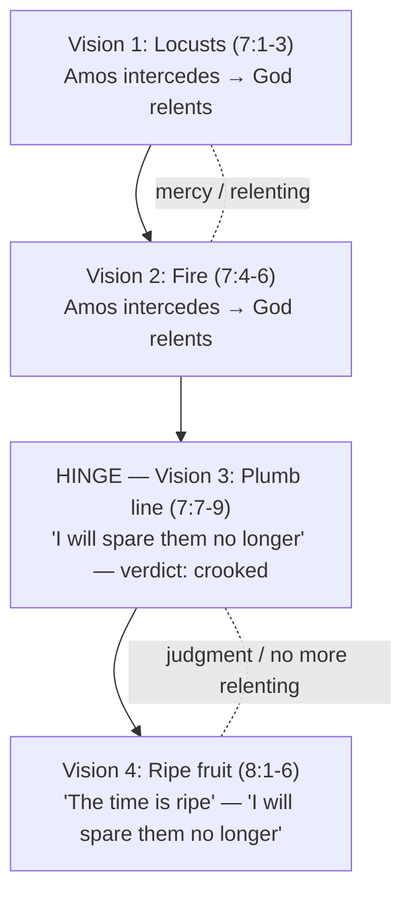

# Amos - Plumb Line

BEMA 48 · Session 2
Source transcript: `~/workspace/bema/transcripts/2-48-amos-plumb-line.md`
Book: Amos 1:1-2:16; 4:1; 5:4-15; 5:21-27; 6:1-7; 7:1-9; 8:1-6. The transcript prints the NET; Brent reads aloud from the NIV.
Host: Marty Solomon · Co-host: Brent Billings · (A **reboot** of the 2017 original episode — Marty revisits the OG take, including the "angry emails" it drew.)
Core move throughout: the **first of the pre-Assyrian prophets** arrives when "everything's going great" and warns that "this empire you've built is not the kingdom of Shalom" — and the thing he is cranked up about is overwhelmingly **Source B** (justice), stated right on the surface.

> **Session 2 overarching arc: the prophets — the partner's (Israel's) unfaithfulness and God's refusal to quit.** Session 1 built the *partnership*: God choosing and shaping a people, marrying them at Sinai, "you create the space and I'll fill it." Session 2 lives in the long collapse of that partnership. This episode opens the prophetic era proper: Amos is "the first of our pre-Assyrian prophetic period," speaking "into a time of the history of God's people where everything's going great... and God's trying to warn you." This guide advances the one story by showing *how God refuses to quit even while discipline is announced*: Amos is not God walking away but God **sending a mouthpiece** — the first of four warning voices — because the people "lost the plot of the story." Where Session 1 asked whether the partner would say *yes* to the covenant, this episode shows the partner saying *yes* to religion and *no* to justice — plump cows of Bashan, lavish festivals, exploited poor — and a God who, having "built a wall true to plumb," hangs the plumb line not to abandon the wall but to tell the truth about it. The warning itself is the mercy; the relenting from locusts and fire (7:1-6) shows a God still arguing *for* his people even as the verdict lands.

## Episode Flow (coverage backbone)

A sequential walkthrough of every teaching beat, in order. Used to verify full coverage.

1. **Opening frame — Amos the first mouthpiece.** Brent: today we "explore the book of Amos on a quest to find the heart of God, as expressed in the first of his many mouthpieces." Marty sets the diagram carried over from the last episode.
2. **The pre-Assyrian setting.** Four voices across the next four episodes speak when "everything's going great... no army breaking down your door" — God warns that the "wonderful little empire" is "not the kingdom of Shalom." Amos is the first warning.
3. **Why we read the prophets at all / "guerrilla theater."** The prophets get skipped in church ("why would I want to read the prophets? It's just all this God's wrath"), yet they are "beautiful pieces of literature" — poetry and poignancy — not "doctrinally useful" proof-texts. They are *guerrilla* (not *gorilla*) theater: subversive, with teeth (cf. Ezekiel baking over dung). *The Prophets* by Heschel recommended again.
4. **One story, two sources (the test case).** Marty names the running game: he was taught the prophets denounce "idolatry and immorality" (**Source A**, Western "wrong belief" sin from episode zero), but he "saw a bunch of Source B messaging" — "I want justice... righteousness... take care of the poor." He invites listeners to check his cherry-picking.
5. **Amos 1:1 — who, when, where.** Written to the **northern kingdom of Israel** (not Judah), in the pre-Assyrian period (Uzziah king of Judah, Jeroboam king of Israel), "before everything's gone haywire." Map and time in the show notes.
6. **Oracles against the nations — "for three sins... even for four."** Damascus (1:3), Gaza (1:6), Tyre (1:9), Edom (1:11), Ammon (1:13), Moab (2:1). The "three then four" is a Jewish figure of speech that "rounds it off." Israel cheers — "Get 'em, Amos" — and notably the Gentile nations are indicted for *justice* crimes, not idolatry.
7. **The turn to Judah (2:4).** "Starting to get close to home." Judah gets the one clear **Source A** note — "rejected the law of the Lord," "led astray by false gods."
8. **The turn to Israel (2:6-16).** "Now it's us." Brent reads; Marty asks "what source are we clearly hearing?" — "It's B." Selling the innocent for silver, the needy for sandals, trampling the poor, sleeping on garments "taken in pledge" (collateral taken from the poor).
9. **Cows of Bashan (4:1).** Not merely "calling women cows": the Bashan (Golan Heights) cattle were famously plump/well-fed — a prophetic image of luxury "and at what expense it comes from."
10. **Seek me and live (5:4-6).** "Quit making it about your strategies, your agendas, your imperial plans... Seek me and live."
11. **Justice to bitterness; the Creator; the straw tax (5:7-11).** God who "made the Pleiades and Orion" indicts those who "turn justice into bitterness" and "levy a straw tax on the poor." Marty's modern-West application: cheap T-shirts (Bangladesh/Indonesia), the iPhone supply chain — "Do we *care*? I don't think we care."
12. **Corporate/systemic reading (5:11-15).** "The biblical world doesn't just see it about you... individually. It sees it about us corporately." What systems am I "complicit in"? "Seek good, not evil, that you may live."
13. **"I hate your festivals... let justice roll" (5:21-24).** No matter how devout the worship, "if we... exploit the poor and the needy... God could not care less about the purity of our worship. It is a stench to him." 5:25-27: exile beyond Damascus.
14. **The reboot and the "angry emails."** Marty recalls the OG episode drew emails — "I don't know why you hate America." His reply: "I don't hate America. I just want us to love God... care about the poor."
15. **Sakkuth/Kaiwan vs. Molek/Rephan (5:26) — and A↔B.** Brent flags the NIV concept-rendering vs. the names (Sakkuth/Kaiwan), and the Septuagint's Molek/Rephan — "updated... for the audience of that time." "If we were rewriting Amos today, what would we put in?" Marty: there *is* a relationship between Source A and Source B — Reed Dent "pushed back... why are you making me pick?" — idolatry *produces* injustice.
16. **Amos 6:1-7 — complacent in Zion.** Beds of ivory, lounging couches, choice lambs, harps "like David," wine by the bowlful — "but you do not grieve over the ruin of Joseph." Marty: "I'm not gonna add a whole bunch more commentary. We get it."
17. **The image: the plumb line (7:1-9).** Each prophet gets a review-image. God relents from **locusts** and **fire** (Amos intercedes: "How can Jacob survive? He is so small!"), then shows a **wall built true to plumb** and a plumb line — the pre-modern "level" using gravity. The verdict: crooked. Judgment on Israel and "the house of Jeroboam."
18. **Second image: ripe fruit (8:1-6).** "A basket of ripe fruit" — "The time is *ripe* for my people Israel." Another Source-B denouncement: trampling the needy, rigged scales, "buying the poor with silver and the needy for a pair of sandals."
19. **Closing synthesis.** When we "lose the plot of the story" we "become the anti-narrative" (cf. end of Judges). Amos is "a hard prophet to start with, but... the perfect prophet to start with" — clear, beautiful, a good image.

## Key Lessons

- **Amos is overwhelmingly Source B: the prophetic word is a warning about *justice*, stated on the surface, not an exegetical reach.** Marty: *"The thing that Amos is cranked up about... is bringing a word of warning and condemnation for the way that God's people are engaging in injustice. I don't have to get there through exegesis. It's stated in the language, right on the surface."* This advances the Session-2 arc by naming *what* the unfaithfulness actually is — not primarily a creedal error but a betrayal of the covenant's heart for the vulnerable.
- **The prophet lulls, then turns — the indictment of Israel's enemies is a trap that lands on Israel itself.** Marty: *"Amos is almost trying to lull them into a dirty little trip... You can just hear Israel going: Yeah, yeah, Amos, you tell 'em... Now it's us."* God's people are judged by the *same* standard they cheered against the nations.
- **God warns *before* the army arrives — the warning is the mercy.** Marty: *"No army is knocking on the door yet, but Amos is here to say they're coming. They're coming because you've lost the plot of the story."* In the arc, this is God's refusal to quit: discipline is announced precisely so the partner can turn.
- **Worship God despises when it coexists with injustice — "let justice roll on like a river."** Marty: *"no matter how truly devout our religious fervor is... if we... exploit the poor and the needy and don't care about how justice is realized, God could not care less about the purity of our worship. It is a stench to him."*
- **The biblical reading is corporate/systemic, not merely individual.** Marty: *"the biblical world doesn't just see it about you personally, you individually. It sees it about us corporately. What are the systems that I'm a part of, some of which I'm complicit in...?"*
- **Source A and Source B are "both-and," not either-or — idolatry *produces* injustice.** Marty (recalling Reed Dent): *"there's a relationship between our idolatry and the stories we buy into and the way that we treat other people."* The game of "make me pick" is dirty on purpose; the point is the connection.
- **When God's people "lose the plot of the story," they become its anti-narrative.** Marty ties Amos to the end of Judges — "cutting a concubine into twelve pieces" — *"When we lose the plot of the story, we become the anti-narrative of what God's... We're not remembering where we came from. We're not remembering the foreigner and the orphan and the widow."*
- **The prophets are literature with teeth — read them for *how*, not just *what*.** Marty: *"There's poetry and poignancy in the way that they deliver their message... these prophets had a message that had some teeth to it."* Amos is "the perfect prophet to start with" because "the poetry is so beautiful, and it's so poignant."

## East/West Lens

*(Only categories the episode actually engages, each with a citation.)*

- **Error & sin: wrong *behavior* (Hebraic) vs. wrong *belief* (Western).** The whole Source A/B game is this contrast. Marty: *"when we said sin, what we meant was the Western concept of sin that we talked about all the way back in episode zero... the Western world, when we think of sin, we think of incorrect thinking and wrong belief."* Amos relentlessly indicts *conduct* toward the poor, not primarily mistaken doctrine.
- **Words: word-pictures/images (Eastern) vs. definitions/abstractions (Western).** Each prophet carries an *image*; Amos is remembered by the **plumb line** and a basket of **ripe fruit**. Marty: *"every prophet often has an image... the image that we can associate with Amos is the image of a plumb line."* The teaching is delivered as concrete picture, not propositional definition.
- **Faith/Truth as relational-experiential (Eastern) vs. intellectual proof-texting (Western).** Marty on why the prophets are neglected: *"you don't typically find a bunch of proof texts coming from Hosea, or... Lamentations"* — the prophets resist being mined for a "what we believe" page, because their truth is a provocation to a *relationship*, not a doctrinal datum.
- **Community over individual (Hebraic) vs. individual-first (Western).** Marty insists the indictment is read *corporately*: *"try to remember that the biblical world doesn't just see it about you personally... It sees it about us corporately."* Sin is systemic complicity, not only private failing.
- **Numbers as quality/figure (Eastern) vs. quantity (Western).** The "for three sins... even for four" is not a tally but a Hebrew *figure of speech*. Marty: *"That's a Jewish literary... figure of speech... It takes an idea and it kind of completes it. It rounds it off. Three even for four. Six even seven."*

## Recurring Through-lines

*(Motifs genuinely surfaced by this episode — explicit callbacks the hosts name, plus genuinely-implied threads. No motif forced. Registry not consulted per task overrides.)*

- **God's refusal to quit the failing partner (Session 2 arc) — (explicit).** The warning *is* the refusal to quit: Amos is sent "because you've lost the plot of the story," and God even relents from locusts and fire (7:3, 7:6) before hanging the plumb line. This episode advances the arc by opening the prophetic era and defining the unfaithfulness as *injustice*, not merely idolatry.
- **One story, two sources (Source A / Source B) — (explicit).** Named directly and tested verse-by-verse: *"we want to always kind of be thinking about that one story, two sources."* The episode moves the thread forward by showing A and B are *related* (idolatry → injustice), setting up the "both-and" to be developed in later prophets.
- **The kingdom of Shalom vs. empire — (explicit).** Marty: the "wonderful little empire... is not the kingdom of Shalom." Amos targets the complacent elite of Zion/Samaria (6:1-7). Advances the recurring suspicion of imperial, self-secure power first seen in Session 1 (Babel, Egypt) now turned inward on God's *own* people.
- **Remembering where you came from / the foreigner, orphan, widow — (explicit).** Marty: *"We're not remembering where we came from. We're not remembering the foreigner and the orphan and the widow."* The covenant memory of Exodus (2:10 — "I brought you up out of Egypt") becomes the standard by which Israel is judged.
- **Right-handed vs. left-handed power (coercive empire) — (implied).** The elite "feel secure on Mount Samaria," lounging on ivory beds and strumming "like David" while ignoring "the ruin of Joseph" — comfort secured by crushing the poor, the same critique of coercive, self-serving power the series keeps leveling.
- **Losing the plot → becoming the anti-narrative (Judges echo) — (explicit).** Marty explicitly recalls the concubine of Judges 19 as the picture of a people who have "become the anti-narrative"; Amos warns Israel is on that trajectory again.

## Narrative Tensions

*(Each: the surface problem, a classification tag, a cited quote, a verse link, and either a Hebraic resolution or "Open — dance with it.")*

- **Why does God spend six oracles condemning Gentile *nations* for justice crimes but never for idolatry — then flip the standard onto Israel?** · tag: `unstated-cultural-assumption` · Marty: *"all of these would be Gentile nations. So they're all engaging in idolatry... None of it's about the god they worship or their idolatry. It's all about justice issues."* · [Amos 1:3-2:3 (NIV)](https://www.biblegateway.com/passage/?search=Amos%201%3A3-2%3A3&version=NIV) · **Hebraic resolution:** The rhetorical trap works because the audience *assumes* Gentile sin is idolatry; by indicting the nations on *justice* instead, Amos exposes that God's universal moral concern is how the vulnerable are treated — so Israel cannot plead special exemption. The "lull then turn" is the point, not an inconsistency.
- **"For three sins... even for four" — three or four? The count seems contradictory.** · tag: `translation-disagreement` · Marty: *"There's three, but then there's four... It takes an idea and it kind of completes it. It rounds it off."* · [Amos 1:3 (NIV)](https://www.biblegateway.com/passage/?search=Amos%201%3A3&version=NIV) · **Hebraic resolution:** It is a numerical *figure of speech* (like "six, even seven"), not an arithmetic claim — the second number intensifies and completes the first. Reading it as a literal tally is a Western-quantity misread of an Eastern-quality idiom.
- **Is Amos calling the women of Samaria literal "cows"?** · tag: `unstated-cultural-assumption` · Marty: *"it feels like Amos is calling the women cows... And yet there's a prophetic image there... the cows of Bashan were some of the most beautiful, most well-fed, most plump cows."* · [Amos 4:1 (NIV)](https://www.biblegateway.com/passage/?search=Amos%204%3A1&version=NIV) · **Hebraic resolution:** The Bashan (Golan Heights) cattle were a stock image of pampered abundance; the insult is about *luxury bought at the expense of the poor*, not an animal name-call. The word-picture carries the critique.
- **The same oracle names star-gods as "Sakkuth/Kaiwan" (Hebrew) but "Molek/Rephan" in the Septuagint — which is it?** · tag: `translation-disagreement` · Brent: *"when they do the Greek translation... the Septuagint, they have 'lifted up the shrine of Molek and the star of your god Rephan'... presumably they're changing things because that is a more relevant picture for the audience of that time."* · [Amos 5:26 (NIV)](https://www.biblegateway.com/passage/?search=Amos%205%3A26&version=NIV) · **Hebraic resolution:** The translators updated the specific idols to ones legible to a later audience — the point ("you worship star-gods you made yourselves") is preserved while the referent is contextualized. Brent's prompt — "what would we put in if rewriting Amos today?" — is the live application.
- **Does God relent (7:3, 7:6) or not relent (the "I will spare them no longer" of the plumb line and ripe fruit)?** · tag: `logic-gap` · Brent reads: *"So the Lord relented. 'This will not happen,' the Lord said,"* then later *"I am setting a plumb line among my people Israel; I will spare them no longer."* · [Amos 7:1-9 (NIV)](https://www.biblegateway.com/passage/?search=Amos%207%3A1-9&version=NIV) · **Hebraic resolution:** The two relentings (locusts, fire) show a God genuinely *arguing with* his prophet and open to intercession — God's refusal to quit — while the plumb-line verdict is the honest measurement that the wall is crooked. Mercy and truth-telling coexist: God spares the *total* devastation but will not pretend the wall is straight.
- **How can a modern American reader be implicated by an 8th-century-BC oracle to northern Israel?** · tag: `unstated-cultural-assumption` · Marty: *"it feels like he's talking about the world that I live in. Like the Western American world... we're pretty okay in our world of levying a straw tax on the poor."* · [Amos 5:11 (NIV)](https://www.biblegateway.com/passage/?search=Amos%205%3A11&version=NIV) · **Open — dance with it.** Marty refuses to resolve the application neatly ("I'm not here because I have all the answers"); the question "do we care?" is left for the listener's discussion group and conscience.

## Chiasms & Structure

Amos 7-8 presents a clear **escalating sequence of four vision-reports** that mirror and intensify. The first pair is deflected by intercession; the second pair is not — the hinge is the plumb line, where God stops relenting.

Marty names the shape loosely: *"Amos has these images. He first sees kind of like locusts... God says: Don't worry... He shows them fire... And God's like: Listen, it's not gonna be that either. And then... he showed me a wall built true to plumb."* The pivot from "the Lord relented" (7:3, 7:6) to "I will spare them no longer" (7:8; echoed 8:2) marks the structural turn from averted judgment to announced judgment.

## Passages Walked Through

*(Every scripture the hosts actually discuss, with the one-line point they draw from it.)*

- [Amos 1:1 (NIV)](https://www.biblegateway.com/passage/?search=Amos%201%3A1&version=NIV) — Sets the audience (northern Israel), time (Uzziah/Jeroboam, pre-Assyrian), and tone: "He doesn't start with a bunch of good news."
- [Amos 1:3-2:3 (NIV)](https://www.biblegateway.com/passage/?search=Amos%201%3A3-2%3A3&version=NIV) — Oracles against Damascus, Gaza, Tyre, Edom, Ammon, Moab: "three then four," indicting *justice* atrocities, lulling Israel into cheering.
- [Amos 2:4-5 (NIV)](https://www.biblegateway.com/passage/?search=Amos%202%3A4-5&version=NIV) — The turn to Judah: the one clear **Source A** note ("rejected the law... led astray by false gods").
- [Amos 2:6-16 (NIV)](https://www.biblegateway.com/passage/?search=Amos%202%3A6-16&version=NIV) — The turn to Israel: "It's B" — selling the innocent for silver, sleeping on "garments taken in pledge," crushing you "as a cart crushes."
- [Amos 4:1 (NIV)](https://www.biblegateway.com/passage/?search=Amos%204%3A1&version=NIV) — "Cows of Bashan": a prophetic image of pampered luxury that oppresses the poor, not a mere insult.
- [Amos 5:4-6 (NIV)](https://www.biblegateway.com/passage/?search=Amos%205%3A4-6&version=NIV) — "Seek me and live": stop the imperial strategies and conquest; turn to the Lord.
- [Amos 5:7-11 (NIV)](https://www.biblegateway.com/passage/?search=Amos%205%3A7-11&version=NIV) — The Creator (Pleiades/Orion) indicts those who "turn justice into bitterness" and "levy a straw tax on the poor"; Marty's cheap-shirt/iPhone application.
- [Amos 5:11-15 (NIV)](https://www.biblegateway.com/passage/?search=Amos%205%3A11-15&version=NIV) — Read corporately: "what are the systems... I'm complicit in?" "Seek good, not evil, that you may live."
- [Amos 5:21-24 (NIV)](https://www.biblegateway.com/passage/?search=Amos%205%3A21-24&version=NIV) — God despises festivals/assemblies/harp-music while the poor are exploited: "let justice roll on like a river."
- [Amos 5:25-27 (NIV)](https://www.biblegateway.com/passage/?search=Amos%205%3A25-27&version=NIV) — Star-gods (Sakkuth/Kaiwan; LXX Molek/Rephan) and "exile beyond Damascus"; the A↔B relationship.
- [Amos 6:1-7 (NIV)](https://www.biblegateway.com/passage/?search=Amos%206%3A1-7&version=NIV) — Complacent elite on ivory beds who "do not grieve over the ruin of Joseph" will be "first to go into exile."
- [Amos 7:1-9 (NIV)](https://www.biblegateway.com/passage/?search=Amos%207%3A1-9&version=NIV) — Locusts and fire relented; the **plumb line** verdict: the wall is crooked, "I will spare them no longer."
- [Amos 8:1-6 (NIV)](https://www.biblegateway.com/passage/?search=Amos%208%3A1-6&version=NIV) — The **basket of ripe fruit**: "the time is ripe for my people"; rigged scales, "the needy for a pair of sandals."
- [Judges 19 (NIV)](https://www.biblegateway.com/passage/?search=Judges%2019&version=NIV) — Invoked as the "anti-narrative": the concubine cut into twelve pieces, Israel become Sodom and Gomorrah.
- [Exodus 20 (NIV)](https://www.biblegateway.com/passage/?search=Exodus%2020&version=NIV) — "Episode zero" / Sinai reference point for the Western-vs-Hebraic definition of sin as wrong belief vs. wrong behavior.

## Illustrations & Stories

- **"Guerrilla theater" (not gorilla).** What it illustrates: the prophets as subversive, camouflaged, with-teeth art, not doctrinal data. Marty: *"By guerrilla theater, I don't mean G-O-R-I-L-L-A... it's guerrilla theater. It's a subversive movement."* (with the Ezekiel-baking-over-dung aside).
- **The plumb line / pre-modern level.** What it illustrates: God measuring whether the wall (Israel) he built "true to plumb" is still straight. Brent: *"It's like a string with a weight on the bottom... Gravity makes it perfectly straight up and down."* Marty: "It's like the pre-modern level."
- **The cows of Bashan tour-guide story.** What it illustrates: luxury at the expense of the poor. Marty: *"when we take our bus on our tour, we go up on what's called the Golan Heights... the cows of Bashan were some of the most beautiful, most well-fed, most plump cows."*
- **"Where is your shirt made?" (the Israel-trip bus lesson).** What it illustrates: the modern "straw tax on the poor" — exploited global labor for a cheaper T-shirt. Marty: *"where is your shirt made? Is it made in Bangladesh? In Indonesia?... we will exploit global commerce so that we can get a cheaper t-shirt... Do we care? I don't think we care."* (iPhone supply chain named too.)
- **The "angry emails" confession.** What it illustrates: the cost and controversy of preaching Source B to a Western audience. Marty: *"I got a handful of angry emails being like: Hey, I don't know why you hate America. And I don't hate America, guys... I just want us to care about the poor."*
- **"Ripe fruit."** What it illustrates: Israel "ripe" for judgment. Marty: *"The time is ripe for my people. They're ripe for judgment because I care about all the people that they exploit."*

## Terminology

- **Guerrilla theater** — the prophets as subversive, camouflaged, provocative performance-literature ("with teeth"), distinguished explicitly from *gorilla*. Marty: *"the subterfuge, the subversive, camouflaged; it's guerrilla theater."*
- **Source A / Source B** — the running interpretive pair: Source A = idolatry/false worship (the Western "wrong belief" sin); Source B = justice/righteousness/care for the poor. Marty: *"I was told that they spoke of idolatry and immorality... I felt like what I saw was a bunch of source B messaging, which was God saying: I want justice. I want righteousness. I want you to take care of the poor."*
- **Pre-Assyrian prophets** — the first group of warning voices (Amos first), speaking before the Assyrian army arrives, when Israel feels secure. Marty: *"Amos is the first of our pre-Assyrian prophetic period of history... each of which are speaking into a time... where everything's going great."* (Trailing notes list the four: Amos & Hosea to Israel; Micah & 1 Isaiah to Judah.)
- **"For three sins... even for four"** — a Hebrew numerical figure of speech (cf. "six, even seven") that completes/rounds off an idea rather than counting. Marty: *"Jewish thought loves to say three then four... It takes an idea and it kind of completes it."*
- **Cows of Bashan** — image of the plump, pampered Bashan (Golan) cattle; stands for over-fed luxury bought by oppressing the poor. Marty: *"It came to symbolize - you have too much luxury."*
- **True to plumb** — a builder's term for a wall that is straight up and down, tested by a plumb line (gravity-weighted string). Brent: *"you can very clearly tell when you hang one next to a wall if the wall is built straight."*
- **Garments "taken in pledge"** — collateral seized from the poor on a loan; here, the only possession a poor person has (their garments), slept on by the greedy. Brent: *"They're borrowing from someone and promising to give it back."* Marty: "That's how bad your greed is."
- **Sakkuth / Kaiwan (Hebrew) vs. Molek / Rephan (Septuagint)** — the star-gods of Amos 5:26; the LXX updates the names for a later audience. Brent: *"the Hebrew... Sakkuth, Kaiwan... later on, when they do the Greek translation... Molek and the star of your god Rephan."*

## References & Resources

- **Abraham Joshua Heschel, *The Prophets*** — recommended again (~900 pp.; "not comprehensive but... a really useful, helpful resource"). Marty: *"We already recommended in the last episode, The Prophets by Abraham Joshua Heschel."*
- **The Septuagint** — the Greek translation of the Old Testament, cited for its Molek/Rephan rendering of Amos 5:26. Brent: *"when they do the Greek translation of the Old Testament, the Septuagint..."*
- **Reed Dent** — named as the friend (pre-co-host) who pushed back on the Source-A/B "make me pick" game. Marty: *"Reed Dent was one of them... Why are you making me pick? Like you know that source A leads to source B."*
- **The Golan Heights / Bashan cattle** — used by Marty's Israel tour guide to unpack "cows of Bashan." (See Illustrations.)
- **Ezekiel (the baking-over-dung episode)** — cited as an example of prophetic "guerrilla theater." Marty: *"God tells him to bake his food over burning human feces. And Ezekiel's like: Can I please do animal feces?"*

## Callbacks & Foreshadowing

- **Backward — "episode zero" (the East/West lens).** Marty: *"the Western concept of sin that we talked about all the way back in episode zero... incorrect thinking and wrong belief."* Anchors the Source A/B contrast to the introductory lesson.
- **Backward — "one story, two sources" (the prior episode).** Marty: *"We already mentioned this in the last episode. As we go through the prophets, we want to always kind of be thinking about that one story, two sources."*
- **Backward — the book of Judges / the concubine.** Marty: *"we can think about the book of Judges... cutting a concubine into twelve pieces... When we lose the plot of the story, we become the anti-narrative."*
- **Forward — the next three pre-Assyrian prophets.** Marty: *"we're going to look at four voices in the next four episodes"* — Amos is only the first warning.
- **Forward — the A↔B relationship to be developed.** Marty: *"there's a relationship between your source A and your source B... just give me a couple episodes. We'll bring that around."*
- **Forward — why the Septuagint changes things.** Brent: *"we'll talk about that another time, why the Septuagint might change things."*
- **Forward — each prophet's review-image.** Marty: *"every prophet often has an image... who are they written to, what time period, and what was the image."* Amos = plumb line (and ripe fruit).

## Discussion Questions

1. Amos spends six oracles letting Israel cheer the condemnation of their neighbors before turning the same standard on them. Where do you most easily cheer judgment on "them" — and what would it feel like for Amos to say "now it's us"?
2. "It's B." The thing Amos is cranked up about is justice, stated on the surface. Reading your own tradition's "what we believe" page, how much of it is Source A (right belief) versus Source B (right treatment of the poor) — and what does that ratio reveal?
3. Marty insists the biblical world reads sin "corporately, not just individually," and names cheap T-shirts and the iPhone supply chain as a modern "straw tax on the poor." Name one system you are "complicit in... some of which I don't really have a choice." What would it look like to *care*, even without clean answers?
4. God says the festivals, assemblies, and harp-music are "a stench" while the poor are crushed (5:21-24). Where might our most heartfelt worship be undercut by injustice we tolerate — and what would it mean to "let justice roll on like a river"?
5. In Amos 7, God relents from locusts and fire but will "spare them no longer" at the plumb line. How do you hold together a God who argues with his prophet *and* tells the hard truth about the crooked wall? Is the warning itself a mercy?
6. Reed Dent refused to "pick" between Source A and Source B, insisting idolatry *produces* injustice. What idols ("the stories we buy into") in your own life quietly shape how you treat other people?
7. Session 1 established the *partnership*; Amos opens the age of the partner's unfaithfulness. What does it tell you about God that his first move toward a failing partner is to *send a mouthpiece* with a warning rather than walk away?

## Sources

- Transcript: `2-48-amos-plumb-line.md`
- [Amos 1:1 (NIV)](https://www.biblegateway.com/passage/?search=Amos%201%3A1&version=NIV)
- [Amos 1:3 (NIV)](https://www.biblegateway.com/passage/?search=Amos%201%3A3&version=NIV)
- [Amos 1:3-2:3 (NIV)](https://www.biblegateway.com/passage/?search=Amos%201%3A3-2%3A3&version=NIV)
- [Amos 2:4-5 (NIV)](https://www.biblegateway.com/passage/?search=Amos%202%3A4-5&version=NIV)
- [Amos 2:6-16 (NIV)](https://www.biblegateway.com/passage/?search=Amos%202%3A6-16&version=NIV)
- [Amos 4:1 (NIV)](https://www.biblegateway.com/passage/?search=Amos%204%3A1&version=NIV)
- [Amos 5:4-6 (NIV)](https://www.biblegateway.com/passage/?search=Amos%205%3A4-6&version=NIV)
- [Amos 5:7-11 (NIV)](https://www.biblegateway.com/passage/?search=Amos%205%3A7-11&version=NIV)
- [Amos 5:11-15 (NIV)](https://www.biblegateway.com/passage/?search=Amos%205%3A11-15&version=NIV)
- [Amos 5:21-24 (NIV)](https://www.biblegateway.com/passage/?search=Amos%205%3A21-24&version=NIV)
- [Amos 5:25-27 (NIV)](https://www.biblegateway.com/passage/?search=Amos%205%3A25-27&version=NIV)
- [Amos 5:26 (NIV)](https://www.biblegateway.com/passage/?search=Amos%205%3A26&version=NIV)
- [Amos 6:1-7 (NIV)](https://www.biblegateway.com/passage/?search=Amos%206%3A1-7&version=NIV)
- [Amos 7:1-9 (NIV)](https://www.biblegateway.com/passage/?search=Amos%207%3A1-9&version=NIV)
- [Amos 8:1-6 (NIV)](https://www.biblegateway.com/passage/?search=Amos%208%3A1-6&version=NIV)
- [Judges 19 (NIV)](https://www.biblegateway.com/passage/?search=Judges%2019&version=NIV)
- [Exodus 20 (NIV)](https://www.biblegateway.com/passage/?search=Exodus%2020&version=NIV)
- Referenced resources named in the episode (not web-fetched): Abraham Joshua Heschel, *The Prophets*; the Septuagint (Amos 5:26 Molek/Rephan); Reed Dent (Source A/B pushback); the Golan Heights/Bashan cattle tour illustration; Ezekiel (guerrilla-theater example).
