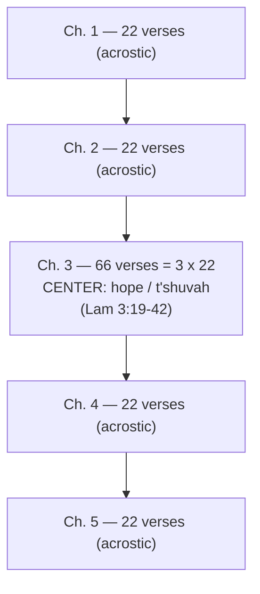

# BEMA 57 — Lamentations: Lament and Hope — Study Guide

**Session 2 (The Prophets) · Book: Lamentations**
Hosts: Marty Solomon and Brent Billings

> Where this sits in the one story: Session 1 built the vision of *partnership* — God binding himself to a people to carry his image into the world. Session 2 walks through the prophets, where that partnership fractures: the partner (Israel/Judah) is unfaithful and God refuses to quit. Lamentations is the ruins themselves given a voice. Jerusalem has fallen, the covenant curses have landed, and the book does something startling: in the dead-center of the grief it insists that the God who disciplined his partner "does not cast off forever." The partnership looks dead; the book plants hope inside the lament.

---

## Episode Flow

The episode is organized as a review, a close reading of three movements in Lamentations, a pastoral teaching on lament, and an academic unpacking of the book's structure.

1. **Framing the book** — Lamentations among the Babylonian prophets; the Jeremiah authorship tradition; a dark, un-preached book.
2. **Review of the prophetic images so far** — pre-Assyrian, Assyrian, and Babylonian prophets and their images.
3. **The two voices** — narrator and the woman (Judah), paralleled to Song of Songs; reading Lamentations 1:1-3.
4. **The woman's protest** — Lamentations 2:20-22, the horror of siege, cannibalism.
5. **The throwback to Deuteronomy 28** — the curses foretold are now fulfilled; "Is this right?"
6. **Space for the lament** — the Bible's room for grief and rage; imprecatory Psalms; honest art; the Ecclesiastes connection.
7. **ACA — Alphabet, Chiastic, Acrostic** — the Hebrew structure and the mirrored verse counts (22, 22, 66, 22, 22).
8. **The center (Lamentations 3:19-42)** — hope in the middle; why God acts; t'shuvah; descent back into darkness.
9. **What the book does to you** — grief that becomes redemptive; closing.

### Coverage verification

Every segment above is covered in the sections below. Strays and smaller asides are parked under **Other Talking Points** so the backbone stays clean. No transcript segment is left unaddressed.

### Other Talking Points

- **"Let's make this a short one. Famous last words."** The hosts joke about keeping the episode brief after a long previous episode; Brent later notes it ran "only 22 minutes" — a tidy echo of the 22-letter acrostic.
- **"Numbers are fun, aren't they, Brent?"** A light aside as Marty walks through the verse-count math (22 / 66) that reveals the chiasm.
- **Discussion groups.** The closing turns to BEMA discussion groups ("we hope you find a discussion group... you've got some plans for discussion groups") — logistics rather than content.
- **Marty's near-rewrite of the lesson.** He admits he almost redid the whole lesson for fear of "regurgitating and passing stuff off as my own that borders on plagiarism," which is why he leans on Rob Bell's RobCast series.

---

## Key Lessons

**1. The partnership is in ruins — and the book lets the ruins speak.**
The episode opens on a destroyed Jerusalem. Marty frames the narrator as "an observer who's just looking out over. Jerusalem has been destroyed, God's people are in ruins, and the narrator speaks." Relative to Session 1's partnership vision, this is the wreckage of that partnership — the bride who "was queen among the provinces has now become a slave." The one story has not ended, but its lowest point is being voiced out loud.

**2. The Bible makes space for lament.**
Marty's central pastoral claim: "the Bible makes space for this kind of emotion... There is space for the lament. For those who have never heard that before and need to hear it again, I'll say it yet one more time: there is space for the lament. It's okay." The partner is allowed to grieve, rage, and protest — and this is not irreverence but covenant honesty.

**3. Rage belongs — directed at the right place.**
"They are raging at the appropriate place. They're not raging irreverently... but they are raging at Adonai. Letting him have the emotion because he can deal with it. He can accept it." The God who refuses to quit the partnership is big enough to hold the partner's fury.

**4. The suffering is covenant warning come true — but hope sits at the center.**
The devastation is "a poetic throwback to what God said in Deuteronomy." Yet the structural center insists: "For no one is cast off by the Lord forever. Though he brings grief, he will show compassion." This is the Session 2 engine in miniature: unfaithfulness has consequences, and still God does not quit.

**5. Lament, fully entered, becomes redemptive.**
"This same book that was giving you space for your grief, the same book is speaking back to you about moving on from your grief, turning your grief into something redemptive and productive." The movement is grief → hope → t'shuvah (return) — the partner finding the road back.

---

## East/West Lens

Only the categories the episode actually engages are tagged, each with a citation.

**Block logic / holistic structure (Eastern).** The meaning is carried by the *shape* of the whole book, not a linear argument. Marty: "Lamentations is absolutely direct. If you're reading this at all you immediately pick up on the nature of this chiasm... Lamentations is an alphabet, chiastic, acrostic." The center is the point — a Hebraic way of embedding the thesis in the middle rather than the conclusion.

**Honest emotion over tidy resolution (Eastern).** Against a Western impulse to "get your act together and put a smile on your face first," Marty insists: "The Bible is not a book that demands you to get your act together and put a smile on your face first. There is space for the lament." Grief is processed, not suppressed.

**Comfort with unresolved tension / "a time for this" (Eastern).** Brent: "It's an Ecclesiastes thing. There's a time for this... You're not going to live here forever. There's an appropriate time and place for these emotions." The tradition holds grief and hope together without collapsing one into the other.

---

## Narrative Tensions

**Tension 1 — Is this suffering actually *right*?**
*Classification: moral/theodicy tension.*
The woman protests: "Look, oh, Lord, and consider whom have you ever treated like this? Should women eat their offspring, the children they have cared for? Should priest and prophet be killed in the sanctuary of the Lord?" (Lamentations 2:20). Marty voices the force of it: "Is this—is this right? Honestly, you're going to sit by and let this kind of stuff happen?"
*Hebraic resolution:* The book does not scold the protest — it canonizes it. The resolution is not an answer that explains the horror away but a center that reframes God's posture: "he does not willingly bring affliction or grief to anyone" and "no one is cast off by the Lord forever." The tension is held, then answered with God's unwillingness and God's refusal to quit — not with a theodicy.

**Tension 2 — How can hope sit in the middle of unrelieved darkness?**
*Classification: structural/tonal tension.*
Marty: "It's a weird thing to have in the middle of this book... For two Chapters, I've been reading about how horrible this is, but now all of a sudden as we get closer to the middle, we're getting reflective?"
*Hebraic resolution:* The chiasm *is* the answer. The darkness ascends to a hinge of hope and then descends again, so hope is literally embedded in the lament rather than tacked on at the end: "In Lamentations, quite literally, there's hope right in the middle of the lament."

**Tension 3 — Is all grief the result of sin?**
*Classification: interpretive/application tension.*
The center moves to self-examination — "Why should any living man complain when punished for his sins?... Let us examine our own ways" — which could be mis-read as "your grief is your fault."
*Hebraic resolution:* Marty draws the line explicitly: "I'm not suggesting that everybody's grief is the result of their sin. It's not the point of my podcast at all. It is the point of the author of Lamentations as he or she looks at all the destruction. In this particular instance, in this piece of historical context, the author is saying, 'I think there's something here we need to think about.'" The claim is historically specific to this devastation, not a universal rule.

**Tension 4 — Was Lamentations written by Jeremiah?**
*Classification: authorship/historical tension.*
Marty: "Tradition says that Jeremiah wrote Lamentations. Weeping prophet—it would make sense. I'm not sure there's much credence to the tradition, but tradition credits him with authorship. I don't think academia does."
*Open — dance with it.* The hosts hold the tradition and the academic skepticism side by side without resolving it, and it does not affect the reading.

---

## Chiasm

The episode's central structural insight is that the whole book is a chiasm, revealed by its verse counts.

Marty: "22, 22 66, 22, 22... You got like an A, A, B, A, A thing going on here... 66 happens to be three times 22." Brent names both the mirror ("Seems mirrored") and the move it demands — when you spot a chiasm, you look for "the center." The center is the hope passage in chapter 3.

---

## Terminology

- **Lament** — sanctioned grief/protest brought honestly before God. "There is space for the lament." The episode's image for the book itself: *Lament and Hope*.
- **ACA — Alphabet, Chiastic, Acrostic** — Marty's shorthand for Lamentations' structure: "We call it ACA—'Alphabet, Chiastic, Acrostic.' We like ACA because it's chiastic in and of itself."
- **Alphabet acrostic** — each stanza begins with successive letters of the Hebrew alphabet. "Every stanza, verse one, starts with, we would say the letter A and Hebrew it's aleph... There are 22 letters in the Hebrew alphabet."
- **Chiasm / center** — a mirrored A-B-A structure whose meaning sits in the middle. "The moment we identify it as such, we need to look for... The center."
- **T'shuvah** — return/repentance. Marty on 3:40: "Let us examine our own ways and test them and let us return to the Lord. Little t'shuva out there." (Carried over from the prophet Zephaniah's image.)
- **Diyn** — retributive justice, the pronouncement of incoming judgment (named in the prophet review as Nahum's image). Marty: "Diyn, retributive justice, the pronouncement of incoming judgment."
- **Adonai** — the Lord; the one at whom the lament is appropriately directed. "They are raging at Adonai. Letting him have the emotion."
- **Imprecatory Psalms** — psalms of raging honestly before God, cited as a parallel sanctioned space.

---

## Illustrations

- **Two voices like Song of Songs.** Marty likens Lamentations' narrator/woman structure to the beloved and groom: "similar to Song of Songs where you had the beloved and the groom, and they went back and forth to each other. This one isn't nearly as pretty, and it's poetry."
- **Honest art as a release valve.** Marty's extended illustration about music: "You pop in that CD and there's something inside of you... your whole soul just breathes a sigh of relief like, 'Oh, yes.'" Honest, even "secular," art can give grief and rage a legitimate outlet where relentlessly upbeat "Christian music" cannot ("I cannot listen to one more prayer song").
- **"Assistant to the regional manager."** Brent's running gag about a prophet *to* a prophet ("Prophet to the prophet. Assistant to the regional manager") during the review — a light illustration of how the prophetic lineup stacks up.

---

## References

- **Deuteronomy 28** — the covenant blessings and curses (including siege horrors) that Lamentations recalls as now fulfilled. "Deuteronomy 28 had these... it's really a throwback, a poetic throwback to what God said in Deuteronomy."
- **Song of Songs** — the two-voice poetic parallel (beloved/groom).
- **Ecclesiastes 3** — "a time and a season for everything," Brent's connection to lament.
- **The imprecatory Psalms** — the Bible's other sanctioned space for honest rage.
- **Rob Bell, *The RobCast*, Episodes 92-96 ("learning to lament")** — Marty's strong recommendation: "a phenomenal study through the book of Lamentations. I really recommend listening to it." (Linked in the show notes.)
- **Peter Enns** — a posted discussion of the dark material in Deuteronomy 28.
- **Blue Letter Bible** — to verify the Hebrew alphabet acrostic yourself.

---

## Callbacks and Foreshadowing

**Callbacks:**
- **The full prophet review.** The episode explicitly re-lists the prophetic images: Amos = plumb line / ripe fruit, Hosea = the prostitute, Micah = judge, 1 Isaiah = vineyard, Jonah = potential, Nahum = diyn, Zephaniah = t'shuvah, 2 Isaiah = woe, Jeremiah = weeping — "Here we are all caught up." Lamentations now joins the list as *lament and hope (ACA)*.
- **Jeremiah the weeping prophet.** The authorship tradition ties directly back to Jeremiah's image: "Weeping prophet—it would make sense."
- **Creating space for grief.** Marty references prior BEMA conversations: "we've had conversations about creating space for grief. We've had conversations about the Psalms, and imprecatory Psalms. We've talked about this a little bit before."
- **Deuteronomy / Session 1 Torah.** The throwback to Deuteronomy 28 reaches back to the covenant terms laid down in the Torah walk.

**Foreshadowing:**
- The center's logic — God "does not cast off forever" and rises against injustice — foreshadows the Session 2 trajectory of a God who will not quit on his unfaithful partner and whose redemption is "coming."

---

## Discussion Questions

1. Marty insists "there is space for the lament." Where in your own life or community has grief been rushed, silenced, or required to "put a smile on your face first"? What would it look like to let the ruins speak?
2. The hope of Lamentations sits structurally *in the middle* of the darkness, not at the end. How does hope embedded in the middle of grief differ from hope that only arrives after grief is over? Why might the author have built it that way?
3. The woman rages "at Adonai." What is the difference between raging *at* God and raging *away from* God? What makes lament reverent rather than irreverent in this book?
4. Marty is careful to say not all grief is the result of sin, even though this author connects *this* devastation to covenant unfaithfulness. How do you hold self-examination ("let us examine our ways") without sliding into "all my suffering is my fault"?
5. Relative to Session 1's partnership, Lamentations is the partnership in ruins. How does the center's claim — "no one is cast off by the Lord forever" — reframe what the exile means for the one story?

---

## Recurring Through-lines

Motifs genuinely surfaced by this episode (each with a cited anchor):

- **God's refusal to quit the partner (hesed / unfailing love).** Explicit and central: "Because of the Lord's great love we are not consumed, for his compassions never fail. They are new every morning; great is your faithfulness... no one is cast off by the Lord forever." This is the Session 2 engine made visible.
- **Space for grief / lament before God.** Explicit: "There is space for the lament. It's okay." A sanctioned, canonized emotional honesty.
- **God rises against injustice.** Explicit: "To crush underfoot all prisoners... to deny people their rights... to deprive them of justice — would not the Lord see such things?" Marty: "He rises up against injustice."
- **T'shuvah — the return.** Explicit: "Let us examine our ways and test them, and let us return to the Lord... Little t'shuva out there."
- **Chiasm points to the center.** Explicit (methodological through-line): "The moment we identify it as such, we need to look for... The center."
- **Covenant consequences from the Torah come true.** Explicit (implied link to the Deuteronomy covenant): "a poetic throwback to what God said in Deuteronomy."

---

## Sources

- Transcript: *BEMA 57 — Lamentations: Lament and Hope* (Session 2), hosts Marty Solomon and Brent Billings.
- Biblical passages cited in the episode (NIV links):
  - [Lamentations 1](https://www.biblegateway.com/passage/?search=Lamentations+1&version=NIV)
  - [Lamentations 2:20-22](https://www.biblegateway.com/passage/?search=Lamentations+2%3A20-22&version=NIV)
  - [Lamentations 3:19-42](https://www.biblegateway.com/passage/?search=Lamentations+3%3A19-42&version=NIV)
  - [Deuteronomy 28](https://www.biblegateway.com/passage/?search=Deuteronomy+28&version=NIV)
  - [Song of Songs](https://www.biblegateway.com/passage/?search=Song+of+Songs&version=NIV)
  - [Ecclesiastes 3](https://www.biblegateway.com/passage/?search=Ecclesiastes+3&version=NIV)
- External recommendation named in the episode: Rob Bell, *The RobCast*, Episodes 92-96 ("learning to lament").
