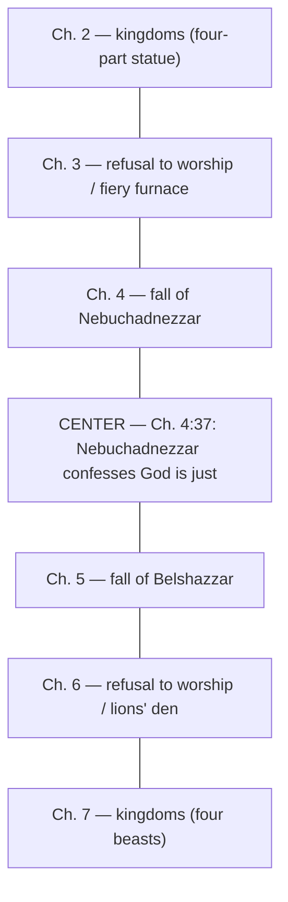
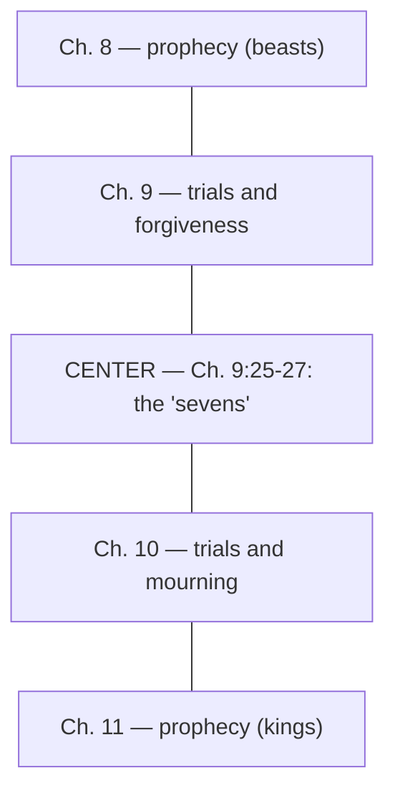
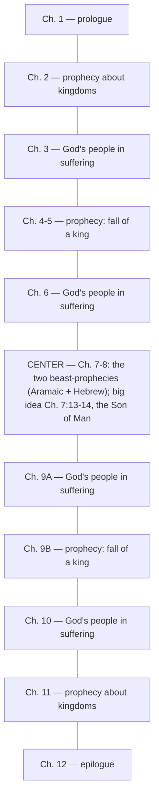

# BEMA 62 — Daniel: Son of Man — Study Guide

**Session:** 2 (The Prophets)
**Episode:** 62 · "Daniel — Son of Man"
**Hosts:** Marty Solomon & Brent Billings
**Primary text:** The book of Daniel — [Daniel 1-12](https://www.biblegateway.com/passage/?search=Daniel+1-12&version=NIV); center text [Daniel 7:13-14](https://www.biblegateway.com/passage/?search=Daniel+7%3A13-14&version=NIV)

---

## Where This Sits in the One Story

Session 1 built the picture of **partnership**: God rescues a people and invites them to become a kingdom of priests who reflect his character to the nations. Session 2 turns to the **Prophets**, and the arc of this stage is the covenant partner's (Israel's) **unfaithfulness and God's refusal to quit** — a refusal that persists even after the partner has been carried off into exile.

Daniel advances that arc from inside the catastrophe the earlier prophets warned about: the people are now *in Babylon*, their identity under assault. The book's own structure dramatizes the loss — it opens in Hebrew, slides into Aramaic (the "secular" common tongue) for the exile, then climbs back into Hebrew as hope returns. Marty frames the exile's central ache as the justice question: "that's what you are wrestling with as you speak Aramaic in Babylon... as God's way is just, and this evil king... these words are uttered." Where Session 1's partnership looked like a people living faithfully in their own land, Daniel asks what partnership looks like when the land is gone and the empire demands you bow to its gods. God's refusal to quit here takes the shape of a promise aimed past the ruin: "there is coming a day," Daniel insists, "where somebody is going to come. One like the son of man is going to come." The one story does not end in Babylon; it bends toward a coming figure who will "make everything right in the world." The partner's job in the meantime is to **persevere** — to "stand strong in the face of suffering, to resist the pull and tug of empire."

---

## Episode Flow (Coverage Backbone)

1. **Framing Daniel** — "the book of Daniel and its persistent and sometimes hidden message of perseverance"; a slide presentation is promised; Daniel is "our second of the exilic period."
2. **Where Daniel belongs** — content places it in Babylonian exile, but Marty argues it was *written* far later (as late as the 2nd century BC); Jewish tradition puts it in the *Ketuvim* (Writings), not the *Nevi'im* (Prophets); flagged for a return "at the end of Session 2."
3. **Why people love Daniel** — unlike the prophets, "most people actually want to read Daniel" because "it's very story-based"; the popular end-times / "crystal ball" fixation.
4. **The two names** — Hananiah, Mishael, and Azariah renamed Shadrach, Meshach, and Abednego; Babylonian god-names given "to humiliate them"; Marty's "soapbox rant."
5. **Famous stories** — the fiery furnace, the lion's den, the Daniel fast, praying in the window, the statues and apocalyptic visions.
6. **Two languages** — the only biblical book received in two languages: Hebrew (ch. 1) → Aramaic (ch. 2-7, the "secular" common tongue, "sometimes called Chaldean") → back to Hebrew; the language choice tells the story of lost identity and returning hope.
7. **The legendary double chiasm** — each half is a chiasm, and the halves together form a greater one; Brent notes "they're pretty much everywhere in Daniel"; the "double rainbow guy" joke.
8. **Chiasm A (Aramaic half) and its center** — ch. 2↔7, 3↔6, 4↔5; center is **Daniel 4:37**, the prideful Nebuchadnezzar's own lips confessing God's justice.
9. **Chiasm B (Hebrew half) and its center** — ch. 8↔11, 9↔10; center is **Daniel 9:25-27**, the "sevens."
10. **The sevens and the rule for reading prophecy** — the enormous end-times mileage of the 70/7/62 sevens; Marty's principle that prophecy must have meant *something* to its original audience, which itself argues for a later composition.
11. **Chiasm C (the whole book) and the big idea** — ch. 1↔12, outward pairs mirroring kingdoms / suffering / the fall of a king, with ch. 7 and 8 at the dead center; the center of the whole thing is **Daniel 7:13-14**, "one like a son of man."
12. **Son of Man as the message** — perseverance under suffering because "one will come like a son of man... and will make everything right"; the swirl toward the resurrection of the dead; Jesus repeatedly drawing on Daniel (Session 3).
13. **Closing notes** — Daniel's promise of protection, presence, and "a future and hope"; the pride of self-exalting kings is what brings them down; God's people "plod forward" until they "might see one like a son of man coming in the clouds of heaven."

**Coverage verification:** All major transcript segments are represented above. Strays that do not fit a flow segment are parked in **Other Talking Points** below.

---

## Key Lessons

Each lesson is framed against the Session 2 arc — the covenant partner's unfaithfulness and God's refusal to quit, now worked out *inside* exile.

1. **Even inside Babylon, God has not quit — he promises a coming one who will set the world right.** The arc's refusal-to-quit reaches its exilic form here: not a return to the old land yet, but a forward-leaning hope that justice is coming.
   - *Marty:* "there is coming a day," Daniel insists, "where somebody is going to come. One like the son of man is going to come... he is going to give account, he's going to render judgment. He's going to make everything right."

2. **The partner's calling in exile is perseverance — to stand strong and refuse to bow.** When partnership can no longer look like life in the land, it looks like faithful endurance under empire.
   - *Marty:* "God's people are left to stand strong in the face of suffering, to resist the pull and tug of empire to stand and subvert a kingdom that attempts to make you bow to gods that are not your own."

3. **Pride is what topples kingdoms; the kingdom that lasts belongs to the humble one who comes.** The empires that look invincible will "fail and fall," one giving way to the next — undone by self-exaltation.
   - *Marty:* "Pride is ultimately the thing that brings him down... As strong as these kingdoms and empires appear to be today, they will fail and they will fall. One by one, these kingdoms will give way to the next."

4. **Faithfulness is never wasted, even when it seems overlooked.** To a people asking "just where is the justice of God?", Daniel answers that their righteousness will be vindicated.
   - *Marty:* "all of your righteousness, all of your faithfulness, all of your good deeds... it's not going to go overlooked. It's not going to be empty because one will come like a son of man."

5. **God's goodness is confessed even by the mouth of the empire's prideful king.** The center of Chiasm A puts the exile's own justice-question onto Nebuchadnezzar's lips, affirming that God is just precisely where that is hardest to believe.
   - *Marty:* "the author has these words coming out of the prideful, horrifically, evil king, Nebuchadnezzar... 'Everything he does is right, and all his ways are just,' which is what you are wrestling with as you speak Aramaic in Babylon."

---

## East/West Lens

Only categories genuinely engaged by this episode are tagged; each is cited.

- **Image/story thinking over systematic abstraction (East).** Daniel teaches through concrete images and symbols — statues, beasts, sevens, a son of man in the clouds — rather than propositions; the whole book is apocalyptic image-work, and Marty hands the listener a single picture to carry.
  - *Marty:* "Daniel really becomes about the Son of Man ends up being our word for Daniel son of man. For our review, that's what will give us the image for the book of Daniel."

- **Literary artistry / structure as meaning (East).** Meaning is carried by *form* — the language shift and the nested chiasms communicate loss and hope before any content is parsed.
  - *Marty:* "the simple language change alone gives the reader the subtle impression that we've lost our identity... but the book comes down the hillside of hope... in the language of Hebrew. You almost sense the message of restoration and hope without any of the content."

- **Reading with the original audience, not over their heads (East/Hebraic hermeneutic).** Prophecy is not a placeless crystal ball; it must have landed meaningfully on the people who first heard it.
  - *Marty:* "when we read prophecy, we don't want to read it in a way where the original audience has to just scratch their head and go, 'I have no idea what that means.' There must be some meaning for them."

- **Hope embodied as perseverance and resurrection, not escape (East).** The hope that spins out of Daniel is bodily and communal — the dead raised, the world put right — not a flight from history.
  - *Marty:* "From this is going to spin out some of the Jewish ideas that revolve around the resurrection of the dead... that there is coming a day where somebody's going to stand before the Ancient of Days and is going to make a case and is going to put the world right."

---

## Narrative Tensions

Each tension states the problem, tags its type, cites the transcript, links the passage, and gives a Hebraic resolution (or marks it open).

1. **Is Daniel an exilic prophet or a much later book wearing exile as a costume?**
   - *Type:* Authorship / dating problem (historical-critical).
   - *Problem:* The content is unmistakably Babylonian exile, yet Marty places the writing as late as the 2nd century BC, and Jewish tradition files it among the Writings, not the Prophets.
   - *Cited:* *Marty:* "I would not place Daniel there at all. I don't think Daniel was written for that. I think it uses that historical setting to make a totally different point... I'm even going to say 2nd century BC."
   - *Passage:* [Daniel 1](https://www.biblegateway.com/passage/?search=Daniel+1&version=NIV)
   - *Hebraic resolution:* The point of the book is not to date-stamp a career but to speak to *any* people under empire. Using the exile as a stage lets Daniel address both Babylonian suffering and later Greco-Roman suffering with one message of perseverance. The dating is held as a reasoned scholarly position, flagged for fuller treatment "at the end of Session 2" — **Open; a thread to pick up later.**

2. **Does the "sevens" passage predict Jesus, or did it mean something to its first audience?**
   - *Type:* Interpretive clash (prophecy and fulfillment).
   - *Problem:* Daniel 9:26 — "the anointed one will be put to death and will have nothing" — has been used to pinpoint Jesus, but the destruction-of-the-temple content makes little sense for an exile whose temple is already gone.
   - *Cited:* *Marty:* "I don't want to take away from the Jesus connection at all... but this is not what the original writer nor what the original audience would've seen when they read it... that passage doesn't make much sense if Daniel is an exilic prophet."
   - *Passage:* [Daniel 9:25-27](https://www.biblegateway.com/passage/?search=Daniel+9%3A25-27&version=NIV)
   - *Hebraic resolution:* Hold both hands open: the later-than-exile dating gives the passage a primary meaning for *its* audience, while allowing that readers "on this side of Jesus" rightly see allusions to him. The disparity is a clue to the book's composition, not a verse to be weaponized for timelines.

3. **Where is the justice of God when an evil empire crushes the faithful?**
   - *Type:* Theodicy (the problem of suffering / unanswered justice).
   - *Problem:* A righteous, faithful people sits in exile under a prideful, "horrifically evil" king and asks why God's justice is nowhere in sight.
   - *Cited:* *Marty:* "Daniel insists that there's coming a day when everything will be made right to a group of people in exile... wondering 'Just where is the justice of God?'"
   - *Passage:* [Daniel 7:13-14](https://www.biblegateway.com/passage/?search=Daniel+7%3A13-14&version=NIV)
   - *Hebraic resolution:* The book answers not with an explanation of present suffering but with a promise and a posture: a son of man will come to the Ancient of Days, render judgment, and make everything right — so the faithful *persevere*. Justice is deferred, not denied; the call is to "hang in there... make it through," trusting that faithfulness is never empty.

---

## Chiasms

Daniel is presented as "the legendary double chiasm" — each half a chiasm, and the two halves together forming a greater one, "kind of like in the preface in Genesis, we had eight chiasms that ended up forming a much larger a chiasm."

**Chiasm A — the Aramaic half (chapters 2-7).** Center: [Daniel 4:37](https://www.biblegateway.com/passage/?search=Daniel+4%3A37&version=NIV).

**Chiasm B — the Hebrew half (chapters 8-11).** Center: [Daniel 9:25-27](https://www.biblegateway.com/passage/?search=Daniel+9%3A25-27&version=NIV).

**Chiasm C — the whole book (chapters 1-12).** Center: [Daniel 7:13-14](https://www.biblegateway.com/passage/?search=Daniel+7%3A13-14&version=NIV), "one like a son of man."

- *Marty:* "the book of Daniel ends up being the legendary 'double chiasm'... you have a chiasm in the first half of the book, and you have a chiasm in the second half of the book, but then put them together and you're going to make another chiasm all together."
- *Marty (on the overall center):* "the center of the whole thing, the big idea ends up being 7:13-14."
- *Brent:* "We've got a chiasm." / *Brent:* "Yes, I think they're pretty much everywhere in Daniel."

---

## Terminology

- **Son of Man** — the governing image for Daniel; "one like a son of man coming with the clouds of heaven," who approaches the Ancient of Days and receives everlasting, indestructible dominion; the center of the whole double chiasm and the title Jesus repeatedly takes up.
  - *Brent (reading Daniel 7):* "there before me was one like a son of man coming with the clouds of heaven. He approached the ancient of days and was led into his presence."
  - *Marty:* "Daniel really becomes about the Son of Man ends up being our word for Daniel son of man."
- **Ancient of Days** — the figure before whom the son of man comes to render judgment and "put the world right."
  - *Marty:* "somebody's going to stand before the Ancient of Days and is going to make a case and is going to put the world right."
- **Nevi'im / Ketuvim** — the Prophets and the Writings; Jewish tradition places Daniel in the *Ketuvim*, not among the *Nevi'im*.
  - *Marty:* "Jewish literature will not have him as a book in the Nevi'im; it has it in the Ketuvim, one of the last books of the Hebrew scriptures to be written."
- **Aramaic (Chaldean)** — the common, "secular" Semitic language of the region; Daniel 2-7 is written in it; "not to be confused with Arabic."
  - *Marty:* "Aramaic was the Semitic language, the common language... You can think of it as a secular language."
- **Hananiah, Mishael, and Azariah** — the three friends' real Hebrew names, which the Babylonians replaced with the god-praising names **Shadrach, Meshach, and Abednego** to humiliate them.
  - *Marty:* "the Babylonians gave them new names to humiliate them like they were bullied into having these names... The names praise Babylonian gods."
- **Double chiasm** — Daniel's signature structure: a chiasm in each half, the two forming a greater chiasm.
  - *Marty:* "that's going to happen, possibly in there, but you have a double chiasm."
- **The "sevens"** — the 70 / 7 / 62 sevens of Daniel 9; apocalyptic time-language that "has gotten a ton of mileage in our end-times discussions."
  - *Marty:* "there's 62 sevens and 7 sevens and 77 sevens. What in the world is going on here with all these sevens?"
- **Apocalyptic / eschatology** — the genre and the end-times framework through which Daniel is popularly (and, Marty argues, over-eagerly) read.
  - *Marty:* "we are so wound up about Daniel when it comes to apocalyptic theology, eschatology, and teaching on the end times."

---

## Illustrations & Images

- **The language that tells the story (Hebrew → Aramaic → Hebrew).** The book "comes down the hillside of hope" when it returns to Hebrew; the shift alone makes the reader feel lost identity, then restoration.
  - *Marty:* "the first half of the book in the secular language, the simple language change alone gives the reader the subtle impression that we've lost our identity. What happened to our Jewishness?... but the book comes down the hillside of hope... in the language of Hebrew."
- **Nebuchadnezzar as a character in a drama.** The author stages the evil king's confession like a play — the villain stepping forward to utter the truth about God's justice.
  - *Marty:* "almost like a drama, almost like a play — this evil king comes out and these words are uttered. Of course, your God is good and just."
- **Plodding forward "with faces set resolutely toward tomorrow."** The closing image of God's people enduring exile, scanning the horizon for the son of man.
  - *Marty:* "With faces set resolutely toward tomorrow, God's people set out to plod forward until the day they might see one like a son of man coming in the clouds of heaven."
- **The slide presentation.** The episode is built around visuals of Chiasm A, Chiasm B, and Chiasm C — Marty repeatedly directs the listener to "open your presentation now."
  - *Marty:* "If you go to that presentation, you may open it now... First slide there, you probably have a representation of chiasm A."

---

## References & Resources

- **[Ezekiel](https://www.biblegateway.com/passage/?search=Ezekiel&version=NIV)** (previous episode) — the other apocalyptic exilic book; its "wheels within a wheel" paralleled with Daniel's confusing "sevens."
  - *Marty:* "I think back to Ezekiel, last episode, makes a ton of sense. We just have a bunch of sevens... just like the wheel within a wheel and beings with eyes and wings."
- **[Genesis 1](https://www.biblegateway.com/passage/?search=Genesis+1&version=NIV) (the preface)** — the earlier example of eight chiasms forming one larger chiasm, cited as the model for Daniel's nested structure.
  - *Marty:* "kind of like in the preface in Genesis, we had eight chiasms that ended up forming a much larger a chiasm."
- **The Gospels — Jesus as "Son of Man"** — Jesus "keeps referencing the book of Daniel"; a fuller treatment is promised for Session 3.
  - *Marty:* "we see this show up in the new Testament, particularly in Jesus's own mouth over and over and over again. Jesus keeps referencing the book of Daniel... We'll pull this apart even more in Session 3."
- **Review image set (series spine):** Ezekiel = strength; Daniel = Son of Man (the newly added review image).
  - *Marty:* "that's what will give us the image for the book of Daniel."
- **Historicity of Belshazzar** — Babylon is "a very well documented empire," yet "there's no reference to Belshazzar anywhere," fueling scholarly discussion and the late-dating argument.
  - *Marty:* "We actually have a lot of extra-biblical evidence about Babylon... and there's no reference to Belshazzar anywhere. There's a lot of conversation about Belshazzar and Nebuchadnezzar."
- **"Double rainbow" YouTube video** — the viral "double rainbow guy," which Marty is "almost tempted to put... in the show notes" as a gag on the "double chiasm."
  - *Marty:* "I can't say double chiasm without thinking of the double rainbow guy from years ago... I'm almost tempted to put that YouTube in the show notes."

---

## Callbacks & Foreshadowing

**Callbacks (to Session 1 and earlier Session 2):**
- **Ezekiel, the prior exilic apocalyptic book.** Daniel's "sevens" are set beside Ezekiel's "wheel within a wheel"; the review image "Ezekiel = strength" precedes "Daniel = Son of Man."
  - *Marty:* "I think back to Ezekiel, last episode, makes a ton of sense... just like the wheel within a wheel and beings with eyes and wings."
- **The Genesis preface chiasm (Session 1).** The eight-chiasms-into-one structure from the opening of Genesis is recalled as the pattern for Daniel's nested chiasms.
  - *Marty:* "kind of like in the preface in Genesis, we had eight chiasms that ended up forming a much larger a chiasm."
- **The reading-prophecy principle (Session 2 method).** "We've talked about this before" — prophecy must have meant something to its original audience.
  - *Marty:* "We've talked about this before Brent, when we read prophecy, we don't want to read it in a way where the original audience has to just scratch their head."

**Foreshadowing (forward in the series):**
- **Jesus and the Son of Man in Session 3.** Daniel 7:13-14 is explicitly planted as the seedbed for Jesus' self-designation.
  - *Marty:* "We'll pull this apart even more in Session 3."
- **The dating of Daniel, "at the end of Session 2."** Marty defers the full case for a late composition.
  - *Marty:* "we're going to come back to that I think at the end of Session 2, and pull that apart because I would not place Daniel there at all."
- **The next book's chiasms.** Marty hints the next episode's book may also show the small-chiasm pattern Brent keeps finding.
  - *Marty:* "we might actually encounter this on our next episode about whatever book is coming next."

---

## Other Talking Points

- **Why Daniel is beloved while the prophets are skipped.** Brent observes "most people actually want to read Daniel" because "it's very story-based," unlike the other prophets.
  - *Brent:* "Most people don't want to read prophets... It's very story-based."
- **The end-times fixation.** The popular use of Daniel as a "crystal ball" predicting current events and Jesus.
  - *Marty:* "'It's about the end times; it's all about this crystal ball, future-reading telling us about Jesus.'"
- **The famous Daniel stories inventory.** The fiery furnace, the lion's den, the Daniel fast, praying in the window, the statues and visions — "some of the most well-known stories in all scripture."
  - *Brent:* "We know, some of the most well-known stories in all scripture, really."
- **Marty's soapbox on the Babylonian names.** His recurring lament that we default to Shadrach, Meshach, and Abednego rather than the Hebrew names.
  - *Marty:* "The Jewish heritage in me comes out and says why do we not know them by their Hebrew names?"
- **"Don't open the presentation yet!"** Brent's running gag policing when the listener may open the slides.
  - *Brent:* "Don't open the presentation yet! You'll give the whole thing away!"

---

## Discussion Questions

1. Daniel's message is "a persistent and sometimes hidden message of perseverance." Where in your own season of "exile" — a place you did not choose and cannot yet leave — is the call simply to *stand strong* rather than to escape?
2. The center of Chiasm A puts the confession "everything he does is right, and all his ways are just" into the mouth of the prideful, evil Nebuchadnezzar. Why might the author stage the justice-of-God claim through the villain, and where do you most struggle to say those words yourself?
3. Marty insists prophecy "must have meant something" to its original audience before it means anything to us. How does reading Daniel 9's "sevens" *with* its first hearers — rather than as a timeline for our own day — change what you take from it?
4. Daniel promises "protection and rescue... presence... a future and hope," yet to a people still suffering under empire. How do you hold God's deferred justice ("there is coming a day") together with the real suffering of the present without collapsing one into the other?
5. The book says the kingdoms that look invincible "will fail and they will fall," brought down by pride, while the lasting kingdom belongs to the humble son of man who comes in the clouds. What "empires" in your life look permanent, and what would it mean to refuse to bow to them?

---

## Sources

- **Transcript:** `~/workspace/bema/transcripts/2-62-daniel-son-of-man.md` — BEMA Podcast Episode 62, "Daniel — Son of Man," hosts Marty Solomon and Brent Billings.
- **Scripture:** [Daniel 4:37](https://www.biblegateway.com/passage/?search=Daniel+4%3A37&version=NIV) (center of Chiasm A), [Daniel 7:13-14](https://www.biblegateway.com/passage/?search=Daniel+7%3A13-14&version=NIV) (center of the whole book), [Daniel 9:25-27](https://www.biblegateway.com/passage/?search=Daniel+9%3A25-27&version=NIV) (center of Chiasm B), read in the episode from NET and NIV; also [Daniel 1](https://www.biblegateway.com/passage/?search=Daniel+1&version=NIV) and the whole book [Daniel 1-12](https://www.biblegateway.com/passage/?search=Daniel+1-12&version=NIV); [Ezekiel](https://www.biblegateway.com/passage/?search=Ezekiel&version=NIV) and [Genesis 1](https://www.biblegateway.com/passage/?search=Genesis+1&version=NIV) (NIV links).
- **Cited within the episode:** the two-language structure (Hebrew / Aramaic); the double chiasm (Chiasms A, B, and C) and the Genesis-preface chiasm parallel; the historicity debate over Belshazzar and the 2nd-century-BC dating argument; the Hebrew names Hananiah, Mishael, and Azariah; Jesus' use of "Son of Man" (Session 3 preview); the "double rainbow" YouTube gag.
