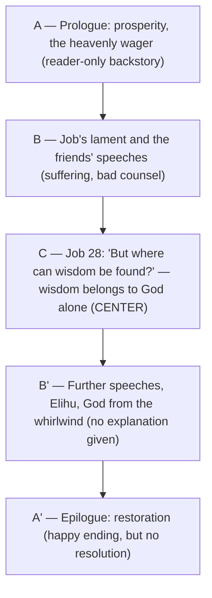

# BEMA 63: Job — Perspective — Study Guide

**Session 2 (The Prophets) · Book of Job**
Primary text: [Job 28:1–28](https://www.biblegateway.com/passage/?search=Job%2028%3A1-28&version=NIV)
Hosts: Marty Solomon (host), Brent Billings (co-host)

---

## Overview

This episode re-reads the famous story of Job and argues it is "so much more than we ever realized." The typical reading, the hosts note, takes the opening disaster, skips the forty-plus chapters of friends arguing, and jumps to God's whirlwind at the end — leaving Job filed away as a "weird book" about suffering that never actually answers our questions about suffering. Marty reframes Job through four observations: it is a **drama** (read it like a play); its friends begin by **sitting shiva**; its date and genre are genuinely contested (ancient tale, wisdom literature, and exilic retelling all at once); and it is a **chiasm of chiasms** whose structural center is chapter 28. That center turns out to be a poem: humans can mine silver, gold, and sapphires out of the hills, but no one can mine **wisdom** — only God knows where it dwells. The word for review is **perspective**.

The guide tracks how the episode advances the one story. Session 1 established the **partnership**: God takes a people and plants them at the crossroads of the earth to bless all nations. Session 2 (the Prophets) watches the partner — Israel — be chronically unfaithful, and watches God refuse to quit. BEMA 63 places Job as an **exilic prophet**: the book Israel reaches for while suffering in Babylon, the "go-to story" of a people under judgment. Its message to the unfaithful-yet-not-abandoned partner is not an explanation but a posture — in the middle of suffering you lack perspective, God sees what you cannot, and even here you are invited to **trust the story**.

---

## East / West Lens

Only the interpretive categories the hosts actually engage are tagged below; each is cited.

- **Genre read on its own terms (drama, not fantasy category)** — The hosts insist Job be read as a play, a familiar literary form, rather than slotted into a "weird fantasy category." Marty: *"Job is a drama... Read Job like you would a play."* Brent extends it to how old stories must be re-told for new audiences: *"If you don't update the story for your current audience... they're not going to get what you need them to get out of it."*
- **Both/and over either/or (dating and genre held together)** — Rather than forcing one answer, Marty holds three at once. *"my personal opinion is that all three of these options are true, likely, in my opinion."* And on inspiration regardless of date: *"Whether it got to me late or it got to me early, to me, it doesn't matter, because at some point, it got to me in the form of what I have in my scriptures, that inspired authoritative drama."*
- **Communal grief practice over Western problem-solving (sitting shiva)** — The Jewish practice of presence-without-explanation is held up against the instinct to console or explain. Marty: *"You don't say anything, you don't try to console them, you don't try to explain it. You just sit with them."*
- **Wisdom as God's possession, not a human acquisition** — Western confidence in human mastery (mining, resources, technology) is set against a wisdom that cannot be mined, bought, or weighed. Marty: *"true wisdom belongs to God, only He knows where to find it."*
- **Midrash as interpretive play** — The hosts narrate midrashic traditions (Job's wife as Dinah; Job as one of Pharaoh's magicians) not as proof-texts but as perspective-giving story. Marty: *"Doesn't mean it was true, it just means that's what the midrash teaches."*

---

## Episode Flow (Coverage Backbone)

1. **Framing: Job is "so much more than we ever realized."** Brent sets up the typical reading — opening suffering, then skip to the end. Brent: *"the typical look at the book of Job includes that very first opening portion, and then you skip straight to the end where God does His thing."*
2. **The "weird book" problem.** Marty narrates the whole arc — loss, the wife's "curse God and die," the friends, Elihu, God's non-answer — and names the reader's frustration: *"it's like, 'Well, that book about suffering is weird... It doesn't answer all my questions about suffering.'"*
3. **Observation 1 — Job is a drama.** *"Job is a drama... it's a play."* Not a denial of a true tale beneath it; the midrash even names a real Job.
4. **Midrashic tangents.** Job's wife as **Dinah** of Genesis (explaining her bitter "evil eye"); Job as one of three Egyptian magicians alongside **Jethro** and **Balaam**; the unsettling claim that Job is a **pagan**. Marty: *"where does it say that Job is Jewish? Nowhere."*
5. **Observation 2 — sitting shiva.** The friends begin rightly, present in silence: *"To sit shiva is something that you do with somebody that's in grief... You are not allowed to speak unless spoken to."* The rest of the book becomes "how to be a bad friend."
6. **Observation 3 — dating and genre.** Three positions laid out and held together: ancient tale (echoes of old Hebrew prose, Abraham's era); too-late content (**Pleiades and Orion**, beast-language, and especially **Satan** as a personified character — Hellenistic); and **wisdom literature** (why Marty skipped it earlier). *"I imagine the story of Job would very likely be a very ancient tale... Then I can see somebody like Solomon re-writing it as wisdom literature... Now we sit in Babylonian exile, and what story do we go to...? We go to Job."*
7. **Culture re-makes stories.** Robin Hood and Spider-Man as the familiar analogy for a tale endlessly retold and updated; Brent's *Myths and Legends* podcast on the strange origins of Aladdin and Beauty and the Beast.
8. **Observation 4 — a chiasm of chiasms.** Beyond Daniel's double chiasm: chiasms within chiasms down to each **pericope**. A Japanese Bible scholar's computer algorithm mapping parallelisms across scripture; explore Job's 1-1 and 3-1/3-2/3-3 breakdowns. *"It's not just a chiasm; it is a chiasm of chiasms."*
9. **The center: Job 28 read aloud.** Brent reads [Job 28](https://www.biblegateway.com/passage/?search=Job%2028&version=NIV). Marty narrates the two halves: humans mine astonishing things from the earth — *"humans have been able to do incredible things"* — "But where can wisdom be found?"
10. **Wisdom cannot be mined.** *"in all their searching for gold and lapis lazuli, they've never encountered wisdom in all of their mineshafts. Only God knows where wisdom comes from."*
11. **The Lamentations parallel.** Like Lamentations (lament with a nugget of hope at its chiastic center), Job is a whole book on suffering with wisdom/perspective buried at its center: *"in the center this chapter on — here's the thing, in all the midst of our suffering, what we really lack is true wisdom... is perspective."*
12. **No explanation at the end.** After 40+ chapters God shows up but gives no backstory: *"Job doesn't get an explanation from God because that's how life is. That's how suffering goes. We don't always get the answers."*
13. **The heavenly wager — reader-only knowledge.** Only the reader is let in on the "asinine," "ridiculous" setup: *"God is setting up a wager with Satan."* Marty wonders aloud whether any of our suffering rests on such hidden backstory — *"I'm not suggesting that that's actually a theological truth."*
14. **Perspective and trust.** The author invites us to consider the infinite, even foolish-seeming possibilities behind suffering, trusting that God sees what we cannot. *"God can mine wisdom from the hills of suffering as easily as man mines minerals from the mountains. Even in the midst of suffering, we are invited to trust the story."*
15. **Closing re-read of Job 28.** Marty reads the "Where then does wisdom come from?" passage one more time as a closer; the chiasm website is recommended for further digging.

**Coverage verification:** The single read passage (Job 28) is covered (segments 9–11, 15). All four stated observations are represented (drama 3–4; shiva 5; dating/genre 6–7; chiasm-of-chiasms 8). The chiasm center, the Lamentations parallel, the "no explanation" point, the heavenly-wager-as-reader-knowledge, and the perspective/trust conclusion are all represented. Strays (the midrash tangents, resource recommendations, the pericope-pronunciation bit) are parked in **Other Talking Points** or in **Terminology / References** below.

---

## Chiasm

The episode's structural claim is that the whole book of Job is a chiasm of chiasms with chapter 28 at its center — a book-length poem on suffering wrapped around a hidden center on wisdom. Marty: *"the center of the book of Job ends up being Chapter 28... This will be the center of the entire Book of Job."* The macro-shape he describes:

The point of the shape is the buried treasure at the center, mirroring Lamentations: *"a whole book on suffering and in the center this chapter"* on the one thing the sufferer actually lacks — wisdom, i.e., perspective. (Marty also points to sub-chiasms within every pericope that "seem to be in question-and-answer conversation with one another, all building toward the center.")

---

## Key Lessons

Framed against the Session 2 arc — the partner's unfaithfulness and God's refusal to quit.

1. **In suffering, what we lack is not an answer but perspective.** The center of the book names the real deficit. Marty: *"in all the midst of our suffering, what we really lack is true wisdom, what we really lack is perspective."* **Arc link:** to a partner-nation under judgment in exile, Job offers not a verdict on their failure but a reorientation — God sees ends of the earth they cannot, and has not stopped seeing them.

2. **True wisdom belongs to God alone and cannot be acquired on human terms.** It cannot be mined, bought with the gold of Ophir, or weighed in silver. Marty: *"true wisdom belongs to God, only He knows where to find it, and only he can unearth the amazing treasures of wisdom that come from his divine perspective."* **Arc link:** the unfaithful partner's instinct is to master, explain, and control; the Prophets keep insisting that the covenant rests on God's wisdom and faithfulness, not Israel's competence.

3. **Suffering often comes with no explanation — and that is deliberate.** The book withholds the answer the reader craves. Marty: *"Job doesn't get an explanation from God because that's how life is... We don't always get the answers."* **Arc link:** God refuses to quit, but refusing to quit is not the same as handing over the backstory; faithfulness is offered, explanation is not.

4. **God can mine wisdom from suffering as readily as humans mine ore from hills.** The central image reverses the chapter: the thing humans cannot extract, God brings up out of the depths. Marty: *"God can mine wisdom from the hills of suffering as easily as man mines minerals from the mountains."* **Arc link:** the exile itself — the lowest point of the partnership — becomes ground God is still working, not ground He has abandoned.

5. **Even in suffering, the invitation is to trust the story.** The whole drama resolves into a posture, not a proof. Marty: *"Even in the midst of suffering, we are invited to trust the story."* **Arc link:** this re-sounds Session 1's founding call to the partner (trust the story) now spoken into the partner's unfaithfulness and loss — the same invitation, offered on the far side of failure.

---

## Narrative Tensions

Each tension: the surfaced problem, a classification tag, the cited quote, a verse link, and a Hebraic resolution (or "Open — dance with it").

- **Why does the book of a famously "straightforward" story never answer its own question?** *(Logic / expectation tension.)* Brent: *"It doesn't answer all my questions about suffering."* Text: [Job 38:1–4](https://www.biblegateway.com/passage/?search=Job%2038%3A1-4&version=NIV). **Hebraic resolution:** the center supplies what the ending withholds — the lack is perspective, not information; the author deliberately gives wisdom-as-posture instead of an explanation.

- **Can Job be both one of the oldest stories in the Bible and an exilic composition?** *(Dating / source tension.)* Marty: *"many conservative Bible teachers would teach that Job is one of the oldest stories of the Bible... However, there are many elements to the story that seemed to be problematic... the blatant reference to Satan would be almost a millennium ahead of its time."* Text: [Job 1:6–12](https://www.biblegateway.com/passage/?search=Job%201%3A6-12&version=NIV). **Open — dance with it.** Marty explicitly holds all three options as likely true at once — ancient tale, Solomonic wisdom reshaping, exilic retelling — and receives it as inspired either way.

- **Is Job even an Israelite?** *(Cultural-assumption tension.)* Marty: *"people being like, 'But that would mean that Job is a pagan.' I was like, 'Yes, where does it say that Job is Jewish? Nowhere.'"* Text: [Job 1:1](https://www.biblegateway.com/passage/?search=Job%201%3A1&version=NIV). **Hebraic resolution:** Jewish tradition reads Job as a pagan (from Uz, not Israel); the discomfort exposes a Western assumption that the Bible's exemplars must be insiders — the crossroads story has always concerned the nations too.

- **Why would God make a wager with Satan over a human life?** *(Character-of-God tension.)* Marty: *"it's just a totally asinine setup to the story, God and Satan making a wager... Sometimes we've gotten so used to reading the Bible we forget how ridiculous some of this stuff is."* Text: [Job 2:1–6](https://www.biblegateway.com/passage/?search=Job%202%3A1-6&version=NIV). **Open — dance with it.** Marty deliberately refuses to make the wager a doctrine — *"I'm not suggesting that that's actually a theological truth, but it was the backstory"* — using it instead to open the possibility of unseen heavenly perspective behind suffering.

- **Does Job at least deserve an explanation after all he endured?** *(Justice / resolution tension.)* Marty: *"Doesn't Job at least deserve an explanation from God about why all this?"* Text: [Job 42:1–6](https://www.biblegateway.com/passage/?search=Job%2042%3A1-6&version=NIV). **Hebraic resolution:** the deliberate non-answer is the teaching — there is a happy ending but "no resolution"; the sufferer is given God's presence and perspective rather than a transcript of the backstory.

---

## Terminology

- **Perspective** — the one-word "image" for review in this episode; what the sufferer most lacks and what only God's vantage supplies. Marty: *"Job is, for me, about perspective... to know that God sees things that we could never begin to see and understand."*
- **Drama / play** — the genre of Job; read it with assigned parts. *"Job is a drama... Read Job like you would a play."*
- **Sitting shiva (שבעה)** — the Jewish grief practice of being silently present with a mourner, speaking only when spoken to. *"You are not allowed to speak unless spoken to, you are just there to be present for the suffering."*
- **Midrash** — Jewish interpretive tradition/story; here it names a real Job, his wife as Dinah, and Job among Pharaoh's magicians. *"that's what the midrash teaches."*
- **Chiasm of chiasms** — the structural claim: not merely a chiasm, nor a double chiasm like Daniel, but nested chiasms down to the pericope level. *"It's not just a chiasm; it is a chiasm of chiasms."*
- **Pericope** (per-ICK-o-pee) — a small extract/section of text; every pericope in Job carries some parallelism. *"It means a little section of text."*
- **Exilic prophet** — Marty's placement of Job: the book a suffering people reach for in Babylonian exile. *"I have placed Job as an exilic prophet."*
- **Wisdom** — in Job 28, the thing that cannot be mined, bought, or weighed; found with God alone; defined as "the fear of the LORD" and "to shun evil." *"But where can wisdom be found? Where does understanding dwell?"*

---

## Illustrations

- **Mining the hills vs. mining wisdom.** The governing image of Job 28: humans sink shafts into untouched rock, pull up silver, gold, lapis lazuli, and sapphires — yet wisdom is nowhere in the mineshaft. Marty: *"in all their searching for gold and lapis lazuli, they've never encountered wisdom in all of their mineshafts."*
- **Remaking movies (Robin Hood, Spider-Man).** Culture endlessly retells and updates stories; so, Marty suggests, the tale of Job was retold and reshaped across eras. *"I think Job is one of those stories that probably got remade and rewritten and reshaped and retold."*
- **Myths and Legends podcast (Aladdin, Beauty and the Beast).** Brent's example of how strange old story-origins get updated for modern audiences, or the point is lost. *"If you don't update the story for your current audience... they're not going to get what you need them to get out of it."*
- **The heavenly wager as hidden backstory.** The reader knows what Job never does; Marty wonders whether our own suffering could rest on comparable unseen "wagers" grounded in God's confidence — offered as perspective-stretching, not doctrine. *"Can you imagine how things would've changed if Job knew that his suffering was coming as a result of a heavenly wager that rested on God's beaming confidence in him?"*
- **Lamentations' hidden center.** The structural analogy: a lament built as an acrostic chiasm with a nugget of hope at its center, mirrored by Job's whole-book-of-suffering wrapped around chapter 28.

---

## References & Recommendations

- **Rob Bell's NOOMA — *Matthew*** — a short film on grief (connected to sitting shiva), made after Rob lost a close friend. *"There's a NOOMA by Rob Bell called Matthew... one of them is on grief."*
- **Rob Bell's NOOMA — *Whirlwind*** — a short film specifically on the book of Job. *"this one's called Whirlwind. It's about the book of Job specifically."*
- **The chiasm / parallelism website** — a Japanese Bible scholar's computer-algorithm analysis of parallelisms and inverted parallelisms across the whole Bible, linked in the show notes; explore Job's 1-1 and 3-1/3-2/3-3 breakdowns. *"there is a Japanese Bible scholar who used a computer-based algorithm to go through the scriptures and identify parallelisms, inverted parallelisms, chiasms."*
- **Genesis 34 (Dinah)** and the **Exodus Pharaoh/magicians** account — the midrashic tangents linking Job to Dinah and to the magicians Jethro and Balaam.
- **Lamentations** — the structural parallel: a book of suffering with hope/wisdom buried at the chiastic center.

---

## Callbacks & Foreshadowing

- **Callback — Daniel's double chiasm (previous episode).** The chiasm claim is built directly on the prior podcast: *"If we thought Daniel was a treasure trove with a double chiasm, last podcast, then Job is like being on steroids."* And: *"remember Daniel we said was a what kind of chiasm? ... A double chiasm."*
- **Callback — Lamentations' chiastic center.** *"Remember talking about Lamentations, the alphabetic chiastic acrostic where we had a whole lament, and in the center, a little bit of hope."*
- **Callback — sitting shiva from Session 1.** *"I think we've talked about it here in our podcast, maybe back in session one. The concept of sitting shiva."*
- **Callback — "trust the story" (the series' founding call).** The episode lands on the Session-1 motto now spoken into suffering: *"Even in the midst of suffering, we are invited to trust the story."*
- **Callback — Dinah and the Pharaoh's magicians (Genesis / Exodus).** The midrash threads Job back into earlier narrative the series has walked: *"Do you remember Dinah from Genesis?"* and the three magicians Jethro, Job, and Balaam.
- **Foreshadowing — the chiasm website as ongoing study.** *"Set aside some serious time when you dig into the website on chiasms. It's crazy... It just keeps going. You keep getting deeper and deeper."* An open invitation to continued structural reading beyond the episode.

---

## Recurring Through-lines

Motifs genuinely engaged in this episode (each with a cited quote):

- **Trust the story.** *(Explicit.)* The series' founding posture, re-sounded as the episode's conclusion into suffering: *"Even in the midst of suffering, we are invited to trust the story."*
- **Chiastic structure as meaning-bearing.** *(Explicit.)* Carried from Daniel and Lamentations into Job's chiasm-of-chiasms, with the center as the buried treasure: *"the center of the book of Job ends up being Chapter 28."*
- **Perspective / God sees what we cannot.** *(Explicit, foregrounded as the review image.)* *"God sees things that we could never begin to see and understand."*
- **Suffering and the problem of suffering.** *(Explicit.)* The through-line humanity has wrestled "since the dawn of time": *"We have been wrestling with the problem of suffering... all the way back to the days of Cain and Abel."*
- **Scripture as inspired regardless of its compositional history.** *(Explicit.)* The both/and posture toward dating: *"Whether it got to me late or it got to me early... it got to me in the form of what I have in my scriptures, that inspired authoritative drama."*
- **Midrash / Jewish tradition as interpretive lens.** *(Implied.)* Used throughout to stretch perspective (Dinah, the magicians, Job as pagan) without being asserted as fact: *"Doesn't mean it was true, it just means that's what the midrash teaches."*

---

## Other Talking Points

- **The pericope-pronunciation bit.** A running gag: Marty had long said "PEAR-i-cope," then uses Siri to settle on "per-ICK-o-pee." *"I've been saying this wrong for all my former students."*
- **Job's wife and the "evil eye."** The midrash-as-Dinah tangent is used to explain her cynical "curse God and die" / glass-half-empty outlook as rooted in her own trauma after Shechem.
- **Job as a pagan from Uz.** The claim that unsettled a BEMA discussion group — that the text never calls Job Jewish — is noted as a surprise reaction worth sitting with.
- **Bible-college familiarity.** Both hosts had academic assignments in Job (Marty multiple; Brent at North Idaho College) yet never saw chapter 28's centrality until reading it chiastically.

---

## Discussion Questions

1. Marty says the thing we most lack in suffering is not an answer but **perspective**. Where in your own suffering have you demanded an explanation when what you actually needed was a wider vantage?
2. Job's friends begin by **sitting shiva** — silent presence — and then ruin it by talking. When someone you love is grieving, what is harder for you: staying silent, or offering explanations? Why?
3. The book deliberately gives Job (and us) **no explanation** at the end. Does that frustrate you or free you? How does it change the way you hold your own unanswered questions?
4. Only the reader knows about the **heavenly wager**. If you knew your suffering rested on hidden backstory you could never see, how might that reshape how you endure it — and what are the dangers of over-reading that idea?
5. Marty holds Job as ancient tale, wisdom literature, *and* exilic retelling all at once, and calls it inspired either way. How comfortable are you holding **both/and** about a biblical book's origins? What's at stake for you in needing one answer?
6. Placed as an **exilic prophet**, Job is the story a failing, suffering people reach for. How does reading Job as a word to the unfaithful-yet-not-abandoned partner (Session 2) change it from a private story about one man's pain into part of the one larger story?

---

## Sources

- BEMA 63 transcript: *Job — Perspective* (Session 2), hosts Marty Solomon and Brent Billings. Primary text read on-air: Job 28 (read in full by Brent). Additional passages/structure referenced: Job 1–2 (prologue and heavenly wager); Job 38 and 42 (the whirlwind and restoration without explanation); the chiastic center at Job 28.
- Midrashic and cultural references cited by the hosts: midrash on Job (a real Job; wife as Dinah of Genesis 34; Job among Pharaoh's magicians with Jethro and Balaam; Job as a pagan); zodiac references (Pleiades, Orion); the Hellenistic-era personification of Satan.
- Recommended resources named on-air: Rob Bell's NOOMA films *Matthew* (grief) and *Whirlwind* (Job); the Japanese scholar's algorithmic chiasm/parallelism website (show-notes link); structural parallel with Lamentations.
- All quotations above are drawn directly from the episode transcript (speaker-attributed).
