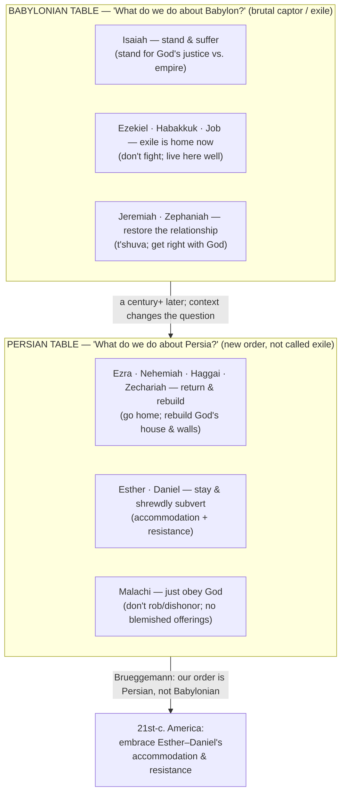

# The Prophetic Table

BEMA 71 · Session 2
Source transcript: `~/workspace/bema/transcripts/2-71-the-prophetic-table.md`
Book: N/A — a synthesis/wrap episode on the prophets; no single passage is worked. Drawn from Walter Brueggemann, *Out of Babylon*.
Hosts: Marty Solomon (host) · Brent Billings (co-host)

> This is the Session 2 wrap/synthesis episode (one episode shy of the formal capstone). It exposits no single passage; instead it condenses the whole Session 2 prophetic arc into one controlling image — **the prophetic table** — and one claim: the prophets are not a single monolithic voice but an *ongoing dialogue* of differing perspectives that readers must wrestle with. Marty seats the prophets at two imagined meals: a **Babylonian table** (Isaiah; Ezekiel/Habakkuk/Job; Jeremiah/Zephaniah) debating "What do we do about Babylon?", and a **Persian table** a century-plus later (Ezra/Nehemiah/Haggai/Zechariah; Esther/Daniel; Malachi) debating "What do we do about Persia?" Following Brueggemann, he argues 21st-century American believers sit under a Persian-style order and should embrace the **Esther–Daniel voice of "accommodation and resistance."** Because this is the Session 2 arc-anchor, the Episode Flow below doubles as the arc: it traces the whole Session 2 story of the partner's unfaithfulness and God's refusal to quit, now re-read as a *living dialogue* about faithful response in exile.

## Episode Flow (coverage backbone)

This episode is a synthesis, so the flow *is* the Session-2 prophetic thread, re-framed as a table-conversation.

1. **Opening thesis — the many voices of the prophets.** Brent frames the episode: *"the multifaceted dialogue and the many voices found within the prophets that represent the battling perspectives found in the world of God's people as they attempt to respond to the effects of exile."* Marty: this is an episode he *added* to the schedule because he wanted to teach it.
2. **The source — Brueggemann, *Out of Babylon*.** Marty credits the whole "prophetic table" idea to the book; Brent jokes about a bellhop bell for every Brueggemann mention.
3. **Set the Babylonian table.** Marty asks the listener to imagine an ancient table with a modest meal set during the Babylonian period; the prophets enter and bless the meal (*Baruch atah Adonai Eloheinu melech ha'olam ha-motzi lechem min ha-aretz*).
4. **The question posed — "What do we do about Babylon?"** Isaiah (Brent's pick) raises it: what are God's people in light of Babylon and the exile?
5. **Isaiah's voice — stand and suffer.** *"We need to stand for God's way and God's justice... stand in the face of empire... That means we're going to have to suffer"* — but suffering well comes out "on the winning side." Marty ties it to "third Isaiah" and the servant discourse (Brent corrects: "Third Isaiah, not Isaiah 3").
6. **Ezekiel, Habakkuk, Job — exile is home now.** *"We don't need to fight. We need to get used to it... We're going to be here for a while, so let's just learn how to be here well."*
7. **Jeremiah, Zephaniah — restore the relationship with God.** Zephaniah's **t'shuva** (repent/return); Jeremiah's broken-and-restored covenant. *"If you just focus on being right with God, you can forget about everything else."*
8. **Callback — Source A vs. Source B.** Marty links the many-voices point to the earlier Session 2 framework: Samuel–Kings (Source A, agenda-driven headlines) vs. Chronicles (Source B, the documentary looking back). Brent: *"Neither one was right... They were both accurate but they were just different perspectives."*
9. **A Jewish way of reading — "God said it, and now we all got to wrestle with it."** Brent names the Western default ("God said it, I believe it. That settles it"); Marty counters with the Peter Rollins parable of two rabbis who refuse to let God settle their argument. *"The power is in that ongoing wrestling match."*
10. **The hinge claim — open hands at the Text.** *"The study of the Bible is not about figuring out the right answer... The Bible is a story of God's people, figuring out how to walk the many different roads."*
11. **Clear the table — set the Persian table (a century-plus later).** Enter Ezra, Nehemiah, Haggai, Zechariah, Malachi, Esther, Daniel. New context: Persia isn't a brutal captor — *"We don't even call the Persian exile, exile. It's just the new Persian order."* The question shifts to "What do we do about Persia?"
12. **Ezra, Nehemiah, Haggai, Zechariah — return and rebuild.** The largest group: go home, rebuild God's house, the walls, Jerusalem. (Running gag: Nehemiah slamming the table, pastor-Ezra trying to calm him.)
13. **Esther and Daniel — stay and shrewdly subvert.** Not assimilation but *"honor the king with a shrewd subversion."* Daniel still prays and refuses to bow; Esther's shrewd wisdom. Marty notes Daniel ("God is my judge") was likely written much later about the Greco-Roman world, a parallel to Persia, so he seats him here.
14. **Malachi — just obey God.** Sharper than Jeremiah on obedience: *"I don't care if you stay, I don't care if you go, but... you better obey God."*
15. **Brueggemann's thesis for today.** We don't sit in Babylonian exile; we live under a Persian-style order / a *Pax Romana* of our own. The voice to embrace in our context is Esther–Daniel's **"accommodation and resistance"** — accommodate the world while shrewdly subverting its imperial narrative. (Written long before any contemporary "resistance" politics.)
16. **But no single voice is universally "right."** Context decides. Marty imagines persecuted believers in Egypt/Libya rightly embracing Ezra–Nehemiah's return-and-rebuild or Zechariah's apocalyptic hope, and others embracing Malachi's obedience.
17. **The takeaway + the partner question.** Scripture is a living, God-breathed dialogue; since Torah's one word is **partner**, the question is always: as partners in God's mission, *what does that mission demand of us here?* Marty: "Good way to end Session 2."

**Coverage verification:** All seventeen movements are represented below under Key Lessons, East/West Lens, Recurring Through-lines, Narrative Tensions, Chiasms & Structure, Terminology, Illustrations, References, and Callbacks. Every point is backed by a transcript citation. Stray/minor items (the bellhop-bell gag, the "Third Isaiah vs. Isaiah 3" correction) are parked in Other Talking Points.

## Key Lessons

- **The prophets are a dialogue, not a monologue.** The headline lesson, and a direct advance on the Session 1 partnership arc: the partner's response to exile is *contested*, not unanimous. Marty: *"the period of the prophets is not one singular voice all saying the same thing... there are differing perspectives on how to see the problem that sits on the table in front of you."*
- **Same question, many faithful answers — Babylonian table.** When asked "What do we do about Babylon?", the prophets answer differently: Isaiah's *stand-and-suffer*, the Ezekiel/Habakkuk/Job *exile-is-home*, and the Jeremiah/Zephaniah *restore-the-relationship*. Marty: *"When asked the same question, they would have all kinds of perspectives."*
- **Context changes the question — Persian table.** Persia is not Babylon: *"Persia interacts with them completely differently than Babylon did."* So the debate shifts from captivity to vocation — return-and-rebuild (Ezra/Nehemiah/Haggai/Zechariah), stay-and-subvert (Esther/Daniel), or just-obey (Malachi).
- **"God said it, and now we all got to wrestle with it."** The Hebraic reading replaces the Western "that settles it." Marty: *"The last thing a Jewish perspective would do is to say, 'God said it, that settles that.'"* The power is in the ongoing wrestling, not in closing the case.
- **Come to the Text with open hands every time.** *"The study of the Bible is not about figuring out the right answer... The Bible is a story of God's people, figuring out how to walk the many different roads that life and its different circumstances and contexts provide us with."*
- **For our context: accommodation and resistance.** Following Brueggemann, the voice for 21st-century American believers is Esther–Daniel: *"We have to live in a world, accommodate that world, but all the while shrewdly subverting it and resisting it."* "As shrewd as serpents and innocent as doves."
- **No single voice is universally right — context decides.** *"It's not about which voice is right because there are contexts where... you would need to embrace the voice of, say, Ezra and Nehemiah."* Persecuted believers may rightly embrace return-and-rebuild or apocalyptic hope; others, obedience.
- **The partner question governs it all.** Scripture read as dialogue still has a center of gravity — the Torah word **partner**. Marty: *"If we are a partner with God and His mission, what does the mission of God demand in our context?"* This is the Session-2 payoff of the Session-1 arc: the partner, now unfaithful and in exile, must still discern how to be a partner — and God refuses to quit the relationship by keeping the dialogue alive.

## East/West Lens

- **Wrestling/dialogue over settled proposition (truth held in tension).** The central East/West move of the episode. Marty: *"God said it, and now we all got to wrestle with it... to the Jewish mind, the power is in that ongoing wrestling match."* Brent names the Western foil: *"God said it, I believe it. That settles it. That's the traditional way of looking at it, but that's not how it is."*
- **Story over system (the Bible as a many-roads story, not a codified list).** Marty: *"we were taught how to read the Bible as a codified list of things that we're just supposed to do... but that understanding of the scriptures is not honest."* Instead the Bible is *"a story of God's people, figuring out how to walk the many different roads."*
- **Word-pictures over abstractions (the table as teaching device).** The whole lesson is carried by a concrete image — an ancient meal with the prophets seated and arguing — rather than a doctrinal outline. Marty: *"I want to ask you to employ an image, a metaphor... Imagine a table, a dining room table... Imagine an ancient table, and there's a meal set."*
- **Community/plurality over the lone individual (a table full of voices).** Faithful response is worked out *corporately and argumentatively*, around a shared table, not by a single authoritative voice. Marty: *"Around this table... would be all of these voices."*
- **Embodied, context-bound obedience over abstract rule-keeping.** What faithfulness *looks like* depends on where you sit — Egypt/Libya vs. Europe vs. America each call for a different prophetic voice. Marty: *"in our unique context, to embrace this accommodate and resistance."*

## Recurring Through-lines

*(Motifs genuinely present in this episode, each backed by a citation. No registry consulted.)*

- **The one continuing story / partnership (the Torah spine, named explicitly).** Marty closes on the Session-1 anchor word: *"we said the Torah was all about the word partner. If we are a partner with God and His mission, what does the mission of God demand in our context?"* The prophetic table is the partner discerning faithfulness in exile.
- **The Text as living, God-breathed dialogue (trust-the-story, matured).** *"It is this living, God-breathed—we say inspired—dialogue, where God's people are continually... wrestling with what are appropriate responses."* Trusting the story now means trusting that the dialogue itself is the point.
- **Empire vs. shalom (the Session-2 reframe of the Tale of Two Kingdoms).** The partner responds to *empire* — Babylon, Persia, "a Pax Romana of our own." The Esther–Daniel vocation is to *"bring shalom order to the imperial chaos."*
- **Shrewd subversion / resisting empire from within.** The recurring prophetic posture: *"Honor the king, but with a shrewd subversion that subverts the ways of empire."* Daniel prays anyway; Esther reads the context exactly.
- **t'shuva — return/repentance.** Carried in from the Zephaniah/Jeremiah voices: *"I think we need to t'shuva, guys, we need to repent."* The partner's path back to the covenant relationship.
- **Source A / Source B — two accurate perspectives in tension.** The dialogue motif is explicitly rooted in the earlier Samuel–Kings vs. Chronicles framework: *"Neither one was right. They were both accurate but they were just different perspectives."*

## Narrative Tensions

Each entry: surface problem, classification tag, cited quote, normalized verse citation + link, and resolution or open flag.

| Surface problem | Tag | Cited quote (speaker) | Verse citation + link | Resolution / status |
|---|---|---|---|---|
| The prophets give *contradictory* instructions for the same crisis (stand/fight vs. settle in vs. just repent) — so which one is the "biblical" answer? | `contradiction` | Marty: *"When asked the same question, they would have all kinds of perspectives."* | [Jeremiah 29](https://www.biblegateway.com/passage/?search=Jeremiah%2029&version=NIV) | **Resolved (Hebraic dialogue).** The disagreement is the point, not a defect: *"there are differing perspectives on how to see the problem."* Faithfulness is discerned by context, not by picking one winner. |
| The Western instinct says a clear word from God ends debate — yet the Jewish reading keeps arguing *after* God speaks. | `translation-disagreement` | Brent: *"God said it, I believe it. That settles it."* / Marty: *"God said it, and now we all got to wrestle with it."* | [Deuteronomy 30:11-14](https://www.biblegateway.com/passage/?search=Deuteronomy%2030%3A11-14&version=NIV) | **Open — dance with it.** The hosts commend the wrestling as a permanent posture (the two-rabbis parable), not a problem to be closed: *"the power is in that ongoing wrestling match."* |
| Daniel is placed in the *exilic* (Babylonian) period, yet Marty seats him at the *Persian* table and dates his composition much later. | `time-jump` | Marty: *"we put Daniel in... Exilic... but I also hinted at the fact I think Daniel was written a lot later... after the story of Hanukkah, and the Hasmonean revolt."* | [Daniel 1](https://www.biblegateway.com/passage/?search=Daniel%201&version=NIV) | **Resolved (composition vs. setting).** The book's *setting* is Babylon but its *message* addresses the Greco-Roman world, a close parallel to Persia — so it belongs thematically at the Persian table. |
| If staying in Persia isn't assimilation, why stay at all instead of going home to rebuild? | `unstated-cultural-assumption` | Marty: *"You don't stay in Persia just to enjoy Persia. You stay in Persia to engage Persia... to bring shalom order to the imperial chaos."* | [Esther 4](https://www.biblegateway.com/passage/?search=Esther%204&version=NIV) | **Resolved (vocation).** Staying is a mission posture — accommodation *plus* resistance — not comfort or conformity; Esther/Daniel honor the king while subverting empire. |
| How can *we* know which prophetic voice to live by, if none is simply "right"? | `logic-gap` | Marty: *"we have to figure out which is the voice that we need to embrace as 21st-century believers in our own American context."* | [Matthew 10:16](https://www.biblegateway.com/passage/?search=Matthew%2010%3A16&version=NIV) | **Resolved (context-reading).** Brueggemann's answer: read your own order honestly (ours is Persian, not Babylonian) and embrace the matching voice — for America, Esther–Daniel's accommodation-and-resistance. |

## Chiasms & Structure

No chiasm is presented or claimed in this episode. (The episode's structure is the two-table parallel, captured below rather than as a chiasm.)

**The two tables (parallel structure).** The episode is built on two imagined meals, each posing one context-shaped question answered by competing prophetic voices.

## Terminology

- **the prophetic table** — Marty's controlling image for the episode: the prophets seated at a meal, debating a shared question. *"This is what I wanted to call the prophetic table."*
- **accommodation and resistance** — Brueggemann's name for the Esther–Daniel voice and Marty's recommended posture for today: *"the voice... that we need to embrace in our context, is the Esther–Daniel voice of what he calls 'accommodation and resistance.'"* Live in the world, accommodate it, yet shrewdly subvert and resist its imperial narrative.
- **t'shuva** — repent/return; the Zephaniah/Jeremiah voice at the Babylonian table. Brent supplies the word; Marty: *"I think we need to t'shuva, guys, we need to repent."*
- **Source A / Source B** — the earlier Session-2 framework for two accurate-but-different perspectives: Samuel–Kings (Source A, agenda-driven headlines) vs. Chronicles (Source B, documentary looking back). *"Neither one was right... They were both accurate."*
- **the new Persian order** — Marty's term for the Persian context, deliberately *not* called "exile": *"We don't even call the Persian exile, exile. It's just the new Persian order."*
- **Pax Romana (of our own)** — Marty's analogy for the modern American imperial order that makes the Persian table (not the Babylonian) the one we must wrestle with: *"we sit under a Persian order, under a Pax Romana of our own."*
- **shrewd subversion** — the mode of resistance modeled by Esther and Daniel: *"Honor the king, but with a shrewd subversion that subverts the ways of empire."*
- **partner** — the one-word Torah summary Marty invokes as the governing question for reading the prophets: *"the Torah was all about the word partner... what does the mission of God demand in our context?"*
- **the meal blessing** — *Baruch atah Adonai Eloheinu melech ha'olam ha-motzi lechem min ha-aretz* — the ha-motzi blessing the seated prophets utter before eating.

## Illustrations & Stories (from the hosts)

- **The two imagined tables.** The spine of the episode: *"Imagine a table, a dining room table... an ancient table, and there's a meal set... This table is set during the Babylonian time period,"* later cleared and reset as a Persian table a century-plus later.
- **The prophets taking their seats.** Marty narrates the arrivals — Isaiah sits, Jeremiah and Zephaniah across from him, Ezekiel next to them, Habakkuk and Job across from Ezekiel — then they bless the meal and begin to eat.
- **The servant with the wine (Persian table).** The question is dropped by a servant filling glasses: *"'Hey, guys... What do you think about Persia?' He scuttles out of the room dropping a little bomb on the table."*
- **Nehemiah slamming the table / pastor-Ezra calming him.** The running gag: *"Nehemiah, he's really passionate... He's slamming the table... Ezra is trying to calm him down... 'Relax, Nehemiah.'"*
- **Peter Rollins's parable of the two rabbis.** Two rabbis argue daily; God descends to settle it, and both unite to tell God off: *"'Who do you think you are, settling our argument? You get yourself out of here and you go back to heaven and let us argue about this'... the power is in that ongoing wrestling match."*
- **The bellhop bell for "Brueggemann."** Brent's gag: *"I need to get one of those little bellhop bells to just smack that every time you mention Walter Brueggemann."*
- **Persecuted believers in Egypt and Libya.** Marty's contemporary test case for the return-and-rebuild / apocalyptic-hope voices: *"another Coptic Church is burned to the ground, is it even worth trying to rebuild?... Yes, it's worth rebuilding, rebuild that temple, rebuild that church."*

## References & Resources (named in the episode)

- **Walter Brueggemann, *Out of Babylon*** — the source for the entire "prophetic table" idea and the "accommodation and resistance" (Esther–Daniel) reading for the contemporary church.
- **Peter Rollins** — source of the parable of the two arguing rabbis (which Rollins traces toward the Talmud). Marty: *"I heard this from Peter Rollins. I don't want to take credit for it."*
- **Samuel–Kings (Source A) and Chronicles (Source B)** — the earlier Session-2 two-perspectives framework.
- **The Session-2 prophetic cast** — Isaiah (incl. "third Isaiah"/servant discourse), Jeremiah, Zephaniah, Ezekiel, Habakkuk, Job (Babylonian table); Ezra, Nehemiah, Haggai, Zechariah, Malachi, Esther, Daniel (Persian table).
- **Hanukkah / the Hasmonean revolt** — the likely later setting behind the composition of Daniel (a Greco-Roman parallel to Persia).
- **Session 3 (teased)** — Marty hints the Brueggemann recommendation may return: *"Session 3, we'll see."*

## Callbacks (explicit links the hosts make)

- **Source A / Source B** (the Samuel–Kings vs. Chronicles framework earlier in Session 2). Marty: *"earlier in Session 2, when we talked about source A and source B."* Brent: Source A is "the headlines, current perspective"; Chronicles is "a documentary's perspective... looking back."
- **Zephaniah / t'shuva** (ties to `2-54-zephaniah-t-shuvah.md`). Marty asks and Brent answers: *"T'shuva."*
- **"Third Isaiah" / the servant discourse** (ties to `2-64-3-isaiah-servant.md`). Marty: *"I think of that third voice of Isaiah and the servant discourse."*
- **Esther's shrewd wisdom** (the prior episode). Marty: *"We talked about the shrewd wisdom of Esther in our last podcast... She was not here to assimilate."*
- **Daniel placed in the exilic period** (ties to `2-62-daniel-son-of-man.md`). Marty: *"We had Daniel in that period of time, but I also hinted at the fact I think Daniel was written a lot later."*
- **Ezra the pastor / Nehemiah the prophet** (ties to `2-66-ezra-nehemiah-passionate-leadership.md`). Marty: *"We talked about Ezra being the pastor and Nehemiah being the Prophet."*
- **Zechariah's apocalyptic literature** (ties to `2-68-zechariah-apocalyptic-literature.md`). Marty: *"the narrative of Zechariah, the apocalyptic literature, that apocalyptic message to bring hope to their present day."*
- **The Torah word "partner"** (the Session-1 capstone, `1-32-session-1-capstone.md`). Marty: *"we said the Torah was all about the word partner."*

## Other Talking Points

- **"Third Isaiah, not Isaiah 3."** Brent's quick correction when Marty references the servant material — distinguishing the scholarly "third Isaiah" (the later section) from the chapter Isaiah 3.
- **The bellhop-bell running joke** about Brueggemann recommendations, and Marty's aside that this is *"probably the last time"* he'll have to cite the book — "Maybe. Maybe not."
- **The capstone still to come.** Marty flags that this is a wrap he *added*, with the formal Session-2 capstone yet to follow: *"we're going to have one more episode to close out—our capstone lesson—but this is one that I added."*

## Discussion Questions

1. The prophets gave *different* faithful answers to the same crisis — stand and suffer, settle in, or repent and restore. In a hard season of your own, which prophetic voice are you most drawn to, and which do you most resist? Why?
2. Marty contrasts "God said it, that settles it" with "God said it, and now we all got to wrestle with it." Where in your life have you treated Scripture as a case to close rather than a dialogue to enter — and what might change if you came "with open hands"?
3. Brueggemann argues American believers live under a Persian-style order, not Babylonian exile, so the right posture is "accommodation and resistance." Where do you currently *accommodate* your culture, and where do you *resist* it — and are those lines in the right places?
4. Esther and Daniel "honor the king with a shrewd subversion." What would "shrewd as serpents and innocent as doves" look like concretely in your workplace, community, or civic life this month?
5. Marty insists no single voice is universally right — context decides. Think of believers in a very different context than yours (persecution, affluence, decline). Which prophetic voice might *they* rightly embrace, and what does that teach you about humility in reading the Bible?
6. The whole episode funnels back to one word: **partner**. If "what does the mission of God demand in our context?" is the governing question, what is one concrete answer that question presses on you right now?

## Sources

- Transcript: `~/workspace/bema/transcripts/2-71-the-prophetic-table.md`
- Walter Brueggemann, *Out of Babylon* (named in the episode; no scripture reading)
- [Jeremiah 29 (NIV)](https://www.biblegateway.com/passage/?search=Jeremiah%2029&version=NIV)
- [Deuteronomy 30:11-14 (NIV)](https://www.biblegateway.com/passage/?search=Deuteronomy%2030%3A11-14&version=NIV)
- [Daniel 1 (NIV)](https://www.biblegateway.com/passage/?search=Daniel%201&version=NIV)
- [Esther 4 (NIV)](https://www.biblegateway.com/passage/?search=Esther%204&version=NIV)
- [Matthew 10:16 (NIV)](https://www.biblegateway.com/passage/?search=Matthew%2010%3A16&version=NIV)
