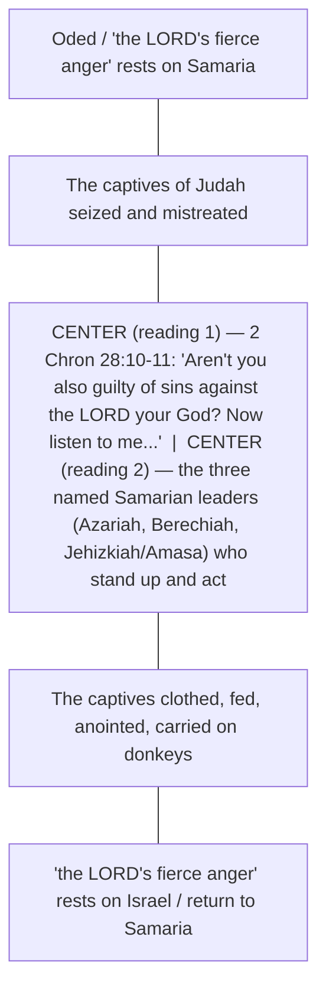

# BEMA 126 — Trapped by a Question — Study Guide

**Session:** 3 (The Gospels)
**Episode:** 126 · "Trapped by a Question"
**Hosts:** Marty Solomon & Brent Billings
**Primary text:** [Matthew 22:15-46](https://www.biblegateway.com/passage/?search=Matthew+22%3A15-46&version=NIV); parallels in [Luke 10:25-37](https://www.biblegateway.com/passage/?search=Luke+10%3A25-37&version=NIV)

---

## Where This Sits in the One Story

Session 1 built the picture of **partnership**: God rescues a people and invites them to become a kingdom of priests who reflect his character to the nations. Session 2 followed the covenant partner's **unfaithfulness and God's refusal to quit**, a refusal that persisted even into exile and leaned forward toward a coming one who would "make everything right." Session 3 is the Gospels, and the arc of this stage is **the king/Messiah embodying the story** — Jesus living out, in his own body and teaching, the whole long partnership Israel was called to.

This episode falls in Jesus's **final week** in Jerusalem. He has gone "on the offensive" against religious corruption, and now the religious leadership counterattacks with a volley of trapping questions. The episode advances the one story in a very particular way: it shows the Messiah not merely *announcing* the kingdom but *out-interpreting* every rival vision of it. Each question — tribute to Caesar, the resurrection, the greatest commandment, who is my neighbor, whose son is the Christ — is a question about **what the kingdom and its allegiance actually are**. Where Session 1 asked a people to reflect God and Session 2 lamented their failure, here the true partner stands in the Temple courts and gets it *right*, taking Hillel's yoke of love and pushing it even farther than Hillel dared. The Messiah embodies the greatest commandments he names. The week's sparring is also the plot machinery of the larger story: this is how Jesus "ultimately will get himself executed, as he confronts religious corruption." The king absorbs the hostility of the very system he came to redeem — a step on the road to the betrayal and cross that end Session 3.

---

## Episode Flow (Coverage Backbone)

1. **Setup — leaders go on the offensive.** After Jesus confronts religious corruption, the leaders take their turn; the shocking detail is that Pharisees and Sadducees (and Pharisees and Herodians) *cooperate* to trap him.
2. **The tribute debate framed.** One of the great Jewish debates concerned paying tribute to Caesar, fueled by the rival schools of Hillel and Shammai (obedience vs. love).
3. **It isn't about taxes — it's about idolatry.** Luke's word *kensos* = tribute, not ordinary taxes; the tribute coin was a receipt proving you'd worshiped Caesar; Herod built tribute temples (e.g., Omrit, near Caesarea Philippi) with incense altars to Caesar.
4. **Each group's position on the coin.** Herodians: buy it, it's fine; Sadducees: sure (and they're selling them); Essenes: irrelevant, they're at Qumran; Zealots: buy it and you deserve death; Pharisees: split between Shammai (idolatry — don't) and Hillel (buy it, you're giving back what God gave Rome, per Jeremiah/Nebuchadnezzar).
5. **"Show me the coin."** Jesus, standing on the Temple Mount where Roman money shouldn't be, exposes the questioners by making *them* produce the coin.
6. **Image and inscription.** The coin bears Caesar's image and an inscription of his divinity; the unspoken question: whose image and inscription is on *you*?
7. **"Render to Caesar."** Jesus takes the Hillel position and goes further — give Caesar his coin, but never give him your worship. Every group is challenged.
8. **The Sadducees and resurrection.** The seven-brothers riddle; Jesus corrects the "false parameters" of the question and turns their own Torah ("God of the living") back on them. Marty flags this as a passage he genuinely does not fully understand.
9. **The greatest commandment.** The question asks a teacher's *yoke* (which laws carry the most *kavod*/weight); Shammai = love God + Sabbath (obedience), Hillel = love God + love neighbor (love); Jesus sides with Hillel (Deuteronomy 6:5 + Leviticus 19:18).
10. **Luke's expansion — "who is my neighbor?"** Jesus flips the lawyer's test back ("How do you read it?"); the lawyer, embarrassed, seeks to justify himself.
11. **The Good Samaritan (p'shat).** The standard parable template is priest / Levite / Pharisee (priest corrupt, Levite stuck, Pharisee gets it right); Jesus swaps the expected Pharisee for a hated Samaritan, pushing love *past* even Hillel.
12. **The neighbor debate behind it.** Shammai: neighbor = fellow Jew only; Hillel: even the Roman, but not the Samaritan; Jesus makes the Samaritan the one *obeying* love.
13. **The Good Samaritan (remez) — 2 Chronicles 28.** The story already happened: Samaritans clothing, feeding, and donkey-carrying Judean captives back to Jericho; Greg Dronen's discovery of a chiasm there; the ambiguity about the chiasm's center.
14. **Whose son is the Christ?** Jesus goes back on the offensive with Psalm 110:1 ("The LORD said to my Lord"): the Messiah is more than merely David's descendant — a possible hint of divinity, left open.
15. **The mic drop.** "No one dared to ask him any more questions"; Jesus will spend the rest of the week confronting corruption until it gets him executed.

**Coverage verification:** All major transcript segments are represented above. Strays that do not fit a flow segment are parked in **Other Talking Points** below.

---

## Key Lessons

Each lesson is framed against the Session 3 arc — the king/Messiah embodying the story — and shows how this episode advances the one story.

1. **Give Caesar his coin, but never your worship.** The Messiah settles the allegiance question the whole story has been building toward: empire may collect its tribute, but the image of God on *you* belongs to God alone. This is partnership (Session 1) under occupation — reflecting God while refusing to bow to a rival kingdom.
   - *Marty:* "Jesus says, 'Give Caesar his stupid coin, but don't you ever give him your worship.'... It challenges us to wonder whether they can be another empire other than God's."

2. **The weightiest law is love — and the Messiah lives the yoke he names.** Asked for his interpretive lens, Jesus names Hillel's: love God, love neighbor. The king does not merely rank commandments; he embodies the love he calls weightiest, carrying the partnership Israel kept failing (Session 2).
   - *Marty:* "Hillel, however, said, 'Love God and...' Love your neighbor as yourself, making the weightiest call a call to love. Jesus agrees with one of them."

3. **Love goes farther than you are comfortable with — even to the one you hate most.** By making the Samaritan the hero, Jesus pushes love past Shammai *and* past Hillel. The embodied kingdom has no "not my neighbor" exemptions.
   - *Marty:* "Jesus is clearly stating that even Hillel doesn't go far enough with his love. Not only this, but the Samaritan isn't even the one receiving the love. He's the one being obedient to love."

4. **Only the one who *does* something is a neighbor — orthopraxy over orthodoxy.** Right theology that never acts is not neighbor-love; the Messiah measures the kingdom by what gets done.
   - *Marty:* "Only the one who does something is a neighbor. Not the one that has their theology right... but the one who applies it to orthopraxy."

5. **The Messiah is more than David's son.** By quoting Psalm 110, Jesus hints that the awaited king is not merely a descendant but something greater — a question of identity the story has been circling and that Session 3 is now embodying.
   - *Marty:* "He has to be more than just his son. Is that a claim to divinity? I'll let us all wrestle with that... 'We're talking about something.'"

6. **The king out-interprets every rival kingdom — and it will cost him his life.** Jesus's brilliance disarms every faction, but the same confrontation of corruption is the plot that drives toward the cross.
   - *Marty:* "He was going to spend the rest of his week, continuing to confront things, get himself into trouble, ultimately will get himself executed, as he confronts religious corruption."

---

## East/West Lens

Only categories genuinely engaged by this episode are tagged; each is cited.

- **Interpretation as *yoke* / hermeneutic rather than proof-text (East/Hebraic).** The "greatest commandment" question is not trivia; it asks what filter a teacher reads the whole Text through.
  - *Marty:* "The question, 'which is the greatest commandment,' is a very common one in Jesus's Jewish world. It's essentially asking the teacher what his interpretive lens is... What is his hermeneutic?"

- **Weight (*kavod*) over flat equivalence of laws (East).** Hebraic reading ranks commandments by weight so that, in a genuine conflict, choosing the weightier *fulfills* rather than abolishes Torah.
  - *Marty:* "'Great Commandments' were really a statement about what the Jews called, a statement about weight. Kavod was the idea, weight. Some laws carried more weight than others."

- **Teaching by parable and shared template, not proposition (East).** First-century rabbis used fixed character templates so hearers could locate the "confusion" exactly where the teacher wanted it.
  - *Marty:* "There was a common template and using this common template, allowed them to keep some of the variables constant for the hearers... it allowed them to put the confusion where they wanted it to be in the Jewish parable."

- **Remez — hinting at a whole Scripture by evoking an older story (East).** The Good Samaritan is not invented from scratch; it reactivates 2 Chronicles 28, "a story lifted right out of" the Text.
  - *Marty:* "He does it all by quoting an obscure remez and making his story a story lifted right out of 2 Chronicles 28... The story has already happened."

- **Orthopraxy as the measure of faith, not orthodoxy alone (East).** Being a neighbor is defined by action, not by holding the correct position.
  - *Marty:* "only if you do the right thing are you an actual person that's loving your neighbor. Only the one who does something is a neighbor."

- **Comfort with unresolved mystery (East).** Marty refuses to force a tidy answer on the resurrection passage or the "son of David" riddle, leaving the listener to "wrestle with that."
  - *Marty:* "There are so many things I don't understand about what Jesus is saying in this conversation... Is that a claim to divinity? I'll let us all wrestle with that."

---

## Narrative Tensions

Each tension states the problem, tags its type, cites the transcript, links the passage, and gives a Hebraic resolution (or marks it open).

1. **Why would Pharisees and Sadducees — sworn enemies — join forces against Jesus?**
   - *Type:* Historical / sociological puzzle.
   - *Problem:* The Pharisees (Hasidim) and the Sadducees are "diametrically opposed" and "hate each other," yet the text has them cooperating, along with the Herodians, to trap Jesus.
   - *Cited:* *Marty:* "This idea of the Pharisees and the Sadducees working together, that's a big deal... whether it's their hatred of Jesus that draws them together."
   - *Passage:* [Matthew 22:15-16](https://www.biblegateway.com/passage/?search=Matthew+22%3A15-16&version=NIV)
   - *Hebraic resolution:* The alliance itself is the point — only a shared threat could unite opposites. Marty offers plausible explanations (corrupt Pharisees, sympathizers, or sheer hatred of Jesus) and lets the strangeness stand as a measure of how dangerous Jesus had become to the whole establishment.

2. **The tribute question is a no-win trap — any answer alienates some faction.**
   - *Type:* Interpretive clash (rival yokes) staged as a political trap.
   - *Problem:* Herodians, Sadducees, Zealots, Shammai Pharisees, and Hillel Pharisees all hold incompatible positions on the tribute coin; "no matter what Jesus says, he's going to make one of the groups upset."
   - *Cited:* *Marty:* "No matter how He answers, He's going to make one of the groups angry. He's either going to look like a compromising idolater or He's going to lose favor with the people."
   - *Passage:* [Matthew 22:17-22](https://www.biblegateway.com/passage/?search=Matthew+22%3A17-22&version=NIV)
   - *Hebraic resolution:* Jesus reframes the question from *money* to *worship* ("whose image and inscription is on you?"). By taking Hillel's "render back" and adding that worship is never Caesar's, he answers in a way that "challenged every single group" at once — escaping the binary by naming a deeper allegiance.

3. **What does Jesus actually mean about marriage and the resurrection?**
   - *Type:* Open theological puzzle (eschatology).
   - *Problem:* The seven-brothers riddle and Jesus's reply ("they neither marry nor are given in marriage") raise questions Marty openly admits he cannot resolve.
   - *Cited:* *Marty:* "I just am still learning about this. This is one story I just don't know... There are so many things I don't understand about what Jesus is saying in this conversation."
   - *Passage:* [Matthew 22:23-33](https://www.biblegateway.com/passage/?search=Matthew+22%3A23-33&version=NIV)
   - *Hebraic resolution:* **Open — dance with it.** What *is* clear is Jesus's move: the Sadducees import "the wrong projections" onto the age to come, and Jesus answers a trap with a trap, citing their own Torah — "I am the God of Abraham... he is not the God of the dead but of the living." The specific picture of resurrected life is left unresolved by Marty on purpose.

4. **Is "the son of David" question a claim to divinity?**
   - *Type:* Christological ambiguity (left open by the host).
   - *Problem:* Jesus asks how David can call his own descendant "Lord" (Psalm 110:1); the implication seems to be that the Messiah is more than a mere descendant — but how much more?
   - *Cited:* *Marty:* "He has to be more than just his son. Is that a claim to divinity? I'll let us all wrestle with that."
   - *Passage:* [Matthew 22:41-46](https://www.biblegateway.com/passage/?search=Matthew+22%3A41-46&version=NIV)
   - *Hebraic resolution:* **Open — dance with it.** Marty deliberately leaves the divinity question for the listener. What is certain is that Jesus explodes the merely-genealogical expectation of Messiah; the "son of David" cannot be *only* David's son, and the riddle silences every questioner.

---

## Chiasms

This episode contains no chiasm in its own Gospel text, but Marty walks through a chiasm that his former student **Greg Dronen** found in **2 Chronicles 28** — the remez behind the Good Samaritan. Marty presents it as drawn out in the slide presentation, and explicitly flags that he is *unsure which of two readings is the true center*.

**2 Chronicles 28 — the Samaritans caring for Judean captives.** Center is debated between two candidates (both cited by Marty).

- *Marty (the discovery):* "Here's Greg with just a few tools and he answered the question I had been wrestling with for years. He found a chiasm in 2 Chronicles 28."
- *Marty (the two candidate centers):* "Is the center of the chiasm what I have in your slide, or is the center of the chiasm, potentially those three names... There are two quotes about the Lord's fierce anger with their three names smashed in the middle. Either way, two brilliant centers to the chiasm. I'm not sure which one is right."
- *Marty (center reading 1 — the "aren't you too" verse):* "Here would be your center verse right here... 'Aren't you also guilty of the sins against the Lord your God?'"
- *Marty (drash of reading 2 — the three names):* "If it's the three names, the drash becomes, you've got to stand up and do the right thing... only if you do the right thing are you an actual person that's loving your neighbor."

---

## Terminology

- **kensos (Greek)** — "tribute," not ordinary taxes; the word Luke uses in the parallel, which the KJV renders "tribute." The whole debate is about idolatry, not money.
  - *Marty:* "Luke uses it elsewhere, but the word he uses in this parallel story is the word, kensos... The King James translates it accurately as tribute."
- **tribute coin / tribute temple** — the coin every resident bought as a receipt of worship paid to Caesar; Herod built three tribute temples (e.g., Omrit) with incense altars.
  - *Marty:* "You buy the coin and then this tribute coin could be used as a receipt that proved you had paid tribute to Caesar and to Rome... Omrit is one of three tribute temples... built by Herod the Great."
- **render / "give back"** — the old KJV "render" (vs. the newer "give back") captures that the coin is simply *returned* to Caesar; Jesus takes the Hillel position.
  - *Marty:* "The old King James used to say, 'Render.'... That term 'render' meant to give back. That is the appropriate translation."
- **Hillel vs. Shammai** — the two dominant rabbinic yokes of the prior generation: Shammai = obedience, Hillel = love. The whole episode turns on which yoke Jesus takes (Hillel) and how far he pushes it.
  - *Marty:* "a conservative rabbi who held an interpretation of the law, driven by the priorities of obedience... [Shammai]... a rabbi who held to a much more progressive interpretation, revolving around love for one's neighbor... [Hillel]."
- **kavod** — "weight"; the "greatest commandment" question is about which laws carry the most weight, i.e., one's interpretive priority.
  - *Marty:* "Kavod was the idea, weight. Some laws carried more weight than others."
- **olam haba / the age to come** — the Pharisaic world to come in which the Son of Man sets everything right and the bodily resurrection occurs; the frame the Sadducees reject.
  - *Marty:* "there would be a bodily resurrection in olam haba, in the world to come, the age to come."
- **remez** — the hinting level of interpretation: evoking an entire older passage by a few signals. The Good Samaritan is remez to 2 Chronicles 28.
  - *Marty:* "What about remez? Did you know that Jesus wasn't the first one who came up with the story?... it's in your Text. 2 Chronicles 28."
- **p'shat** — the plain/surface level of a teaching; Marty tags the parable's template reading as p'shat before moving to remez.
  - *Marty:* "all of this is what level, Brent?... This is all p'shat."
- **drash** — the applied/interpreted meaning a teacher draws out; the two chiasm centers yield two possible drashes.
  - *Marty:* "I worked for years and years and years on a drash... If it's the three names, the drash becomes, you've got to stand up and do the right thing."
- **orthodoxy vs. orthopraxy** — right belief vs. right practice; a neighbor is defined by doing, not merely by correct theology.
  - *Marty:* "Not the one that has another orthodoxy but the one who applies it to orthopraxy."
- **Mashiach / son of David** — the awaited anointed ruler expected to descend from David; Jesus's Psalm 110 riddle insists he is more than a descendant.
  - *Marty:* "Everybody's looking for this Mashiach. This idea that there's going to come a ruler and a ruler has to be descended from... David."
- **Hasidim** — the devout movement from which the Pharisees came; cited to show how shocking the Pharisee–Herodian alliance was.
  - *Marty:* "The Hasidim. They couldn't believe the compromise of the Herodians."

---

## Illustrations & Images

- **"Show me a Playboy from your back pocket."** Marty's analogy for Jesus asking the questioners to produce the coin — the request exposes where *they* stand, not where Jesus stands.
  - *Marty:* "This is like somebody asking a teacher about pornography, and he says, 'Well, show me a Playboy,' and you pull a Playboy out of your back pocket... 'We definitely know where you stand on the issue.'"
- **Jesus winking as he takes the coin.** The image of Jesus reaching out and winking — "we know where you stand now. Thank you very much."
  - *Marty:* "I picture Jesus like reaching out winking at them. Not winking because it's okay, but 'we know where you stand now.'"
- **"Whose image is on *you*?"** The pivot from the coin's image/inscription to the unspoken question about the hearer's own allegiance.
  - *Marty:* "the implication here is an unspoken question... 'whose image and whose inscription is on you?'"
- **The poetry slam / mic drop.** Jesus's "render to Caesar... render to God" delivered "in a stunning moment fit for a poetry slam," and the final "Ultimate mic drop. Jesus out."
  - *Marty:* "In a stunning moment fit for a poetry slam, Jesus declares, 'Give to Caesar'... and He mic drops."
- **Rahab's dilemma (lie or protect the foreigner).** The worked example of how choosing the weightier law *fulfills* Torah; Rahab, a "pagan prostitute," chooses rightly and lands in Hebrews 11.
  - *Marty:* "Rehab chooses, intuitively... that protecting the foreigner carries more weight than abstaining from lies. She decides correctly... and ends up in the hall of faith of Hebrews Chapter 11."
- **Hiding Jews from the Nazis.** The modern parallel for the same weight-of-law dilemma — lie, or surrender the one hidden in the attic.
  - *Marty:* "if we think about World War II and people hiding Jews in their attic when the Nazis came by, same idea."
- **Rabbinical judo / sparring.** The whole exchange pictured as martial sparring — Jesus "keeps flipping the tables and trapping everybody else."
  - *Marty:* "This is like sparring, rabbinical judo going on here."
- **"You could have heard a pin drop."** The silence when the expected Pharisee becomes a Samaritan.
  - *Marty:* "Jesus changes the story, 'Along came a Samaritan.' You could have heard a pin drop."

---

## References & Resources

- **[Luke 10:25-37](https://www.biblegateway.com/passage/?search=Luke+10%3A25-37&version=NIV)** — the parallel the hosts jump to for the fuller treatment of the greatest-commandment question and the Good Samaritan.
  - *Marty:* "In Luke the questioner asked Jesus about the greatest commandment and received the same answer... I personally believe we are not dealing with parallel stories in this instance, but we are dealing with the same question."
- **[Deuteronomy 6:5](https://www.biblegateway.com/passage/?search=Deuteronomy+6%3A5&version=NIV)** and **[Leviticus 19:18](https://www.biblegateway.com/passage/?search=Leviticus+19%3A18&version=NIV)** — the two commands Jesus (and the lawyer) name: love God, love neighbor.
  - *Brent (reading):* "Love the Lord your God with all your heart... Love your neighbor as yourself."
- **[2 Chronicles 28:9-15](https://www.biblegateway.com/passage/?search=2+Chronicles+28%3A9-15&version=NIV)** — the prophet Oded; Samaritans clothing, feeding, and carrying Judean captives back to Jericho; the remez behind the Good Samaritan and the site of Greg's chiasm.
  - *Marty:* "The story has already been told... We already have a story in our Old Testament of... people from the north, taking care of people from Judah at the City of Jericho."
- **[Psalm 110:1](https://www.biblegateway.com/passage/?search=Psalm+110%3A1&version=NIV)** — "The LORD said to my Lord"; the basis of Jesus's "son of David" counter-riddle.
  - *Brent (reading):* "'The LORD said to my Lord, sit at my right hand until I put your enemies under your feet.'"
- **[Jeremiah](https://www.biblegateway.com/passage/?search=Jeremiah&version=NIV) (God giving the nations to Nebuchadnezzar)** — Hillel's scriptural basis for buying the tribute coin.
  - *Marty:* "Pointing to the book of Jeremiah and showing that God says He was using Nebuchadnezzar... 'The whole earth is mine and I give it to Nebuchadnezzar.'"
- **David Flusser (on the parables)** — the scholar Marty suspects wrote on the parable template; the hosts promise to put it in the show notes if they can find it.
  - *Marty:* "I think David Flusser wrote a book, Brent, about the parables... if you can find D. Flusser's work on parables, I believe he's going to write about this."
- **Reed Dent's CCF sermon on the Good Samaritan (Truman State)** — a sermon Marty praises as "one of the best sermons I've ever heard" and defers his own concluding thoughts to.
  - *Marty:* "My friend Reed Dent at Truman State, CCF, he preached a sermon we're going to link it in the show notes. One of the best sermons I've ever heard."
- **Greg Dronen** — Marty's former student who, with few tools, found the chiasm in 2 Chronicles 28.
  - *Marty:* "Shout-out to Greg Dronen... he writes me an email, and he's found a chiasm in 2 Chronicles 28."
- **Omrit / Caesarea Philippi** — the excavated tribute temple less than two miles from Caesarea Philippi, visited on BEMA trips; ties the tribute coin to the "Gates of Hell" location from earlier in Session 3.
  - *Marty:* "we have uncovered one of three tribute temples constructed by Herod the Great, less than two miles from Caesarea Philippi."

---

## Callbacks & Foreshadowing

**Callbacks (to earlier episodes and the wider story):**
- **The eight great debates of Jesus's day.** The tribute question and the "who is my neighbor" question are explicitly named as two of the great debates already covered.
  - *Marty:* "we've already talked about the great debates of Jesus's day... we talked about the eight great debates."
- **Hillel and Shammai, the two yokes.** The rival rabbinic schools, introduced earlier in Session 3, are the interpretive backbone of this whole episode.
  - *Marty:* "These two worldviews competed passionately over the interpretation of the Law and matters of great debate."
- **Caesarea Philippi / the Gates of Hell.** The tribute temple near Caesarea Philippi reconnects to the earlier "Gates of Hell" teaching and Jesus setting his course for Jerusalem.
  - *Brent:* "The Gates of Hell, sorry." / *Marty:* "The disciples have recently been at Caesarea Philippi, before Jesus set His course towards Jerusalem."
- **The yoke / hermeneutic.** The recurring Session 3 concept of a rabbi's "yoke" is invoked to explain the greatest-commandment question.
  - *Marty:* "Remember we talked about the yoke. What is His yoke? What is his hermeneutic?"
- **The Son of Man and the age to come.** The Pharisaic hope of the Son of Man setting everything right in *olam haba* reaches back to the Daniel material from Session 2.
  - *Marty:* "the world to come where the Son of Man would come to make everything... set everything right."

**Foreshadowing (forward in the series):**
- **Jesus's execution at the end of the week.** The episode plants the plot's trajectory: the confrontation of corruption leads to the cross.
  - *Marty:* "He was going to spend the rest of his week... ultimately will get himself executed, as he confronts religious corruption."
- **The divinity question left open.** The "son of David" riddle is deliberately held open for later wrestling.
  - *Marty:* "Is that a claim to divinity? I'll let us all wrestle with that."
- **The resurrection passage deferred.** Marty explicitly sets aside the Sadducee/resurrection question as something to be dug into further.
  - *Marty:* "We'll have to dig this apart some more later... I'm just ill-equipped for this little small passage here."

---

## Other Talking Points

- **Marty's view that Matthew was written in Hebrew.** His "own personal opinion" that Matthew's Greek is unreliable for word-study, which is why he prefers Luke here.
  - *Marty:* "I think Matthew was probably not written in Greek... I think Matthew wrote in Hebrew... I feel like is an indication that something fishy is up in Matthew's Greek."
- **The NIV's improving translation.** The hosts note the NIV footnote on the "imperial tax" and credit it for "getting better over time."
  - *Brent:* "The footnote in the NIV says, 'A special tax levied on subject peoples, not on Roman citizens.'" / *Marty:* "At least they're getting better in their translation over time."
- **The money changers on the Temple Mount.** Why Roman money shouldn't be there at all — the setup for Jesus's "show me the coin" exposure.
  - *Brent:* "Because you can't take Roman money into the temple."
- **The priest / Levite / Pharisee parable template.** The fixed cast (priest corrupt, Levite stuck, Pharisee gets it right) that Jesus subverts.
  - *Marty:* "One of the most common templates we have in written record is the template of a priest, a Levite, and a Pharisee."
- **The priest and Levite's "good reasons."** They refuse not from mere callousness but from a yoke of priestly purity — "stuck doing the wrong thing."
  - *Marty:* "They are trying to be obedient to their role as priests who need to stay clean, but they are using a particular yoke."
- **"That felt like a full episode right there."** Brent's aside after the tribute-coin section, underscoring how dense the material is.
  - *Brent:* "That felt like a full episode right there."

---

## Discussion Questions

1. Jesus tells the trap-setters to "give Caesar his coin, but never your worship," then asks (by implication) "whose image is on *you*?" What "empires" today collect your coin — and where is the line past which they must never collect your worship?
2. Jesus takes Hillel's yoke of love and pushes it *past* even Hillel, making the hated Samaritan the hero. Who is the "Samaritan" your own circle would find hardest to call neighbor, and what would it look like to let love go that far?
3. Marty insists "only the one who does something is a neighbor... orthopraxy" over orthodoxy. Where in your life is your theology correct but your practice absent — and what one act would turn belief into neighbor-love?
4. The Good Samaritan is a *remez* to 2 Chronicles 28 — "the story has already happened." How does discovering that Jesus is reactivating an older Scripture, rather than inventing a new moral tale, change the way you read the parable?
5. Jesus's Psalm 110 riddle leaves the "son of David / is this divinity?" question open on purpose. What is gained by sitting with that unresolved — "dancing with it" — rather than rushing to a tidy answer?
6. The same week in which Jesus out-interprets every faction is the week that gets him killed. What does it mean that the Messiah embodies the story not by winning arguments into safety, but by confronting corruption all the way to the cross?

---

## Sources

- **Transcript:** `~/workspace/bema/transcripts/3-126-trapped-by-a-question.md` — BEMA Podcast Episode 126, "Trapped by a Question," hosts Marty Solomon and Brent Billings.
- **Scripture (read/engaged in the episode, NET in transcript; NIV links here):** [Matthew 22:15-46](https://www.biblegateway.com/passage/?search=Matthew+22%3A15-46&version=NIV); [Luke 10:25-37](https://www.biblegateway.com/passage/?search=Luke+10%3A25-37&version=NIV); [Deuteronomy 6:5](https://www.biblegateway.com/passage/?search=Deuteronomy+6%3A5&version=NIV); [Leviticus 19:18](https://www.biblegateway.com/passage/?search=Leviticus+19%3A18&version=NIV); [2 Chronicles 28:9-15](https://www.biblegateway.com/passage/?search=2+Chronicles+28%3A9-15&version=NIV); [Psalm 110:1](https://www.biblegateway.com/passage/?search=Psalm+110%3A1&version=NIV); [Jeremiah](https://www.biblegateway.com/passage/?search=Jeremiah&version=NIV) (Hillel's Nebuchadnezzar citation).
- **Cited within the episode:** the Hillel/Shammai yokes; *kensos*/tribute and the tribute coin and tribute temples (Omrit, near Caesarea Philippi); the five-group survey of the tribute question (Herodians, Sadducees, Essenes, Zealots, Pharisees); *kavod* / weight of commandments; the priest/Levite/Pharisee parable template; the remez to 2 Chronicles 28 and Greg Dronen's chiasm (two candidate centers); the Psalm 110 "son of David" riddle; David Flusser on the parables; Reed Dent's CCF sermon (Truman State).
