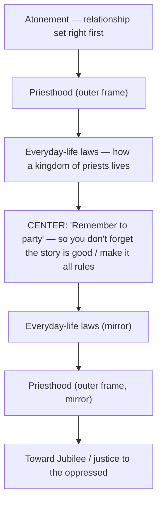

# Session 3 Capstone

BEMA 133 · Session 3
Source transcript: `~/workspace/bema/transcripts/3-133-session-3-capstone.md`
Book: Review — Genesis through the Gospels (a capstone/review episode; no single passage is worked)
Host: Marty Solomon · Co-host: Brent Billings

> **Session 3 overarching arc: the king/Messiah embodying the story.** This is the Session 3 capstone. It does not exposit a single passage; it retells the whole narrative *from Genesis through John* and then condenses Session 3 — the Gospels — to its role in the one unchanging story. Session 1 (Torah) built **partnership**: God rescues a people, marries them at Sinai, and commissions them as a kingdom of priests at the crossroads of the earth. Session 2 (the Prophets and Writings) traced **the partner's unfaithfulness and God's refusal to quit** — a monarchy that lusted for empire, a people who lost the plot, and prophets sent with warning, woe, and hope across the Assyrian, Babylonian, exilic, and remnant periods, then the 400 "silent years" that shaped the world Jesus was born into. Session 3 is **the Gospels: the king/Messiah stepping into Israel's story to embody it**. The capstone's own payoff — stated in its final movements and in Marty's opening clarification about discipleship — is that the four Gospels (Matthew the *mamzer*, Mark the Roman, Luke the "order"/*parashah* companion, John the "grafted" blended family) are not four disconnected biographies but four tellings of the one Messiah carrying the whole arc forward. The episode advances the one story by compressing Genesis→Gospels into a single sentence the hosts can tell "in the lobby," and then pointing forward — carefully, only as far as the evidence reaches — to Session 4 (Acts as the *Epilogue*, then the letters) and Session 5 (church history), without claiming any of that later ground yet. Because this is a narrative-arc anchor, the Episode Flow below doubles as the arc: each unit of the story is listed with the role it plays, and the Gospels close the sequence as the king who embodies everything that came before.

## Episode Flow (coverage backbone)

This episode is a review, so the flow *is* the Genesis→Gospels story thread. Each movement names a unit and its role in the arc; the final movements condense Session 3 and hand off to Session 4.

1. **Why listen to the capstone — "treasures and goodies," required listening.** Marty insists the capstones matter: *"There will be treasures and goodies in this episode. I don't know if people are listening to the capstones, they need to, it's required."* Brent frames the value: *"it's so good to step back every once in a while, and just reorient ourselves with the full perspective of what God is doing in the scriptures."*
2. **Clarifying "Go" / discipleship (a soapbox before the review).** Marty walks back any overclaim from the prior "Go" episode: rabbinic *"follow a rabbi 24 hours a day, seven days a week, 365 days a year"* discipleship is not a replacement for church assimilation, spiritual formation, or evangelism — *"Do all of the things, do all of the things... there's one thing we're not doing and I think it's the thing that Jesus asked us to do."*
3. **Why the arc matters — "it matters, it matters, it matters."** Marty states the capstone's purpose: *"We need to know how the Bible works, how the story of God's people is laid out... This narrative arc matters."*
4. **Roger's listener-made timeline (a visual of the arc).** Marty credits listener Roger Schmidgall, who *"took all of our material, and he put it in his own graphic representation of a biblical timeline,"* linked in the show notes — the hosts even fumble the pronunciation live.
5. **Genesis 1–11 — the Preface (role: the story is good; trust it).** Marty: *"We start with Torah... a preface, chapters 1-11. And in this preface, we learned that the story is good... that's the root of the Gospel itself,"* grounding the whole arc — including Session 3's capstone — in trusting the goodness of creation.
6. **Genesis 12–50 — the Introduction (role: the family of God).** Abraham, Isaac, Jacob, Joseph: *"they're very human, they're very normal, they're full of failure and yet... they always keep leaning back into trusting the story."* Marty quotes Jonathan Martin: *"we may fail but our faith doesn't have to."*
7. **Exodus–Deuteronomy — the Narrative begins, "A Tale of Two Kingdoms" (role: Empire vs. Shalom).** Rescue → marriage at Sinai → tabernacle (the "honeymoon suite" / where priests work) → Leviticus (manual for a kingdom of priests, with the party-command at its center) → Numbers (desert honeymoon) → Deuteronomy (remember → care for the alien, orphan, widow).
8. **Joshua / Judges / Ruth — the crossroads of the earth (role: placed among the nations).** God puts his people *"where the chaos of the world meets the Shalom of God,"* the redemption cycle shows *"the never-ending bottomless patience"* of God, and Ruth shows the righteous ones — a *"very Abraham-esque"* Boaz taking Ruth the Moabite.
9. **Samuel–Kings & Chronicles — the monarchy (role: the lust for empire).** Brent carries this stretch: *"We'd rather be like the nations around us. We want a king."* Samuel–Kings is Israel's *"agenda-driven headlines"* (immorality/idolatry); Chronicles is Judah's *"documentary perspective"* (the lust for empire); Solomon counts everything and goes *"back to Egypt like he's not supposed to."*
10. **Wisdom literature — the tools to survive the dark (role: endurance).** Psalms = songs, Proverbs = generally-true sayings, Ecclesiastes = meaning/purpose, Song of Songs = intimacy/*dowd*. Marty: *"God gives us lots of tools to make it through the darkness."*
11. **The Prophets — warning, woe, hope across four periods (role: calling the partner back).** Pre-Assyrian (Amos, Hosea; Micah, 1 Isaiah), Assyrian (Jonah/potential, Nahum/justice; Zephaniah/*t'shuva*, 2 Isaiah/woes), Babylonian (Jeremiah, Lamentations, Habakkuk, Obadiah, Joel), exilic (Ezekiel/strength, Daniel/son of man, Job/perspective, 3 Isaiah/servant), remnant (Esther/Purim, Ezra–Nehemiah/leadership, Haggai/build, Zechariah/apocalyptic, 4 Isaiah/hope, Malachi/Q&A).
12. **The contrast of empires (an aside).** Brent's note: *"Assyria wanted to destroy you, Babylon wanted to humiliate you"* — Babylon evolving a sociopolitical strategy of surrender-by-humiliation.
13. **The Silent Years — synagogue & Hellenism (role: shaping Jesus's world).** The 400-year gap with "no biblical text": the Text-centered synagogue and education system (memorizing from age five) and the five responses to Hellenism (Sadducees, Herodians, Essenes, Pharisees, Zealots).
14. **"Our capstones keep getting longer" — truth unfolds (meta-observation).** Marty notes the reviews lengthen as the story grows; Brent ties it to Episode 0: *"truth is unfolding and we're being revealed more and more truth as we go."*
15. **The Gospels — four tellings of the one king (role: the Messiah embodying the story).** Matthew = *mumzer* (Jewish author → Jewish audience; Matthew himself a tax-collector *mamzer*); Mark = Roman (Jewish author → Roman audience); Luke = "order," a possible *parashah* companion (proselyte author, per M. D. Goulder); John = "grafted"/"blended family" (Greek–Jewish).
16. **Hand-off to Session 4 and Session 5 (role: forward-pointing, carefully bounded).** Acts will be the *Epilogue* to the narrative, then every New Testament letter, then (Session 5) church history. Marty: *"Acts is going to serve as that epilogue to that narrative."*
17. **Housekeeping & ministry close.** No more summer schedule (weekly posting), ~67 registered discussion groups and the group map, the "News" link / BEMA Messenger newsletter, Torah should "always be free," and the donation appeal — specifically to one day pay Brent, who serves *"completely pro bono."*

**Coverage verification:** 17 segments. All are represented below — the arc movements (5–15) under Episode Flow + Passages Walked Through + Chiasms & Structure; the discipleship clarification, the "truth unfolds" meta-note, and the Session 4/5 hand-off under Key Lessons, East/West Lens, Terminology, and Callbacks & Foreshadowing; Roger's timeline and Jonathan Martin's book under Illustrations and References; the empire-contrast aside under Narrative Tensions and Terminology; and the housekeeping/ministry close parked in **Other Talking Points** (segments 1, 4, 17). Nothing substantive is dropped.

## Key Lessons

- **Session 3 condensed: the Gospels are four tellings of the one king who embodies the whole story.** The capstone's closing review treats Matthew, Mark, Luke, and John not as four biographies but as four audience-shaped presentations of the same Messiah carrying the arc forward. Marty: *"we have four Gospels that we looked at... Let's review the one-word theme association that we gave to that Gospel... and then just remember who is the author? Who is the audience?"* Against Session 1 (partnership) and Session 2 (the unfaithful partner God won't abandon), the king now steps into the story to live it.
- **"The story is good" is the bedrock — and the root of the Gospel itself.** Marty refuses to let the Gospels float free of Genesis: *"we need to remember that here in the capstone of Session 3, like that is the foundation... that's the root of the Gospel itself, sitting there in Genesis one and God inviting us to trust."* The king embodies a story that was good from the first page.
- **We may fail, but our faith doesn't have to.** The family of God models trust-through-failure, and the capstone makes that the posture carried all the way to the Gospels. Marty (quoting Jonathan Martin): *"we may fail but our faith doesn't have to... This family survives a lot of shipwrecks... they always keep leaning back into trusting the story."*
- **The whole Bible is a Tale of Two Kingdoms — Empire vs. Shalom.** The frame named in Session 1 governs the entire arc into the Gospels. Marty: *"the kingdom of Empire and the Kingdom of Shalom... These two world views are going to battle."* The Messiah of Session 3 is the king of the Shalom kingdom confronting Empire.
- **Rabbinic discipleship is one missing thing — not a demotion of everything else.** Marty's clarification reframes the "Go" of the previous episode: evangelism, church assimilation, and spiritual formation are *"amazing, worthwhile callings,"* but *"somebody out there should be finding the select few, the 1% of 1%, and saying, 'Hey, come follow me.'"* This is the Session 3 commission, deliberately held open for Session 4 and 5.
- **The monarchy is where the partner's unfaithfulness crystallizes (the Session 2 pivot restated).** Brent: *"with the rest of the Kings, you see how they mistrust the story and the kingdom divides."* Solomon's *"lust for empire"* — counting everything, returning to Egypt — is the partner choosing Empire over Shalom, the failure the prophets then address and the king will finally answer.
- **Wisdom literature exists to get a dark-struggling people through.** Marty: *"How are you going to make it when it appears that the story is so dark? Well, God gives us lots of tools... the light of song... a little bit of wisdom... meaning and purpose... intimacy and relationships."* Endurance is a theological gift, not an afterthought.
- **The silent years are not silent — they build the stage for the king.** Brent and Marty insist the 400-year gap is full of formative history: *"they're really not silent at all, all kinds of things are happening."* Synagogue/Text-centered education and the five Hellenism responses are exactly *"the world that Jesus is going to be born into."*
- **Truth unfolds — which is why the capstones keep getting longer.** Brent: *"the idea of truth in the Eastern world is that truth is unfolding and we're being revealed more and more truth as we go."* The growing review is itself an enactment of the Eastern view of truth from Episode 0.
- **Point only as far as the evidence reaches — Acts is the coming Epilogue, not yet told.** Marty names the next stage without claiming it: *"Acts is going to serve as that epilogue to that narrative,"* then the letters (Session 4), then church history (Session 5). The arc moves forward responsibly, one session at a time.

## East/West Lens

- **Truth over time — unfolding, not static.** The capstone explicitly invokes the Eastern view of truth to explain its own growing length. Brent: *"the idea of truth in the Eastern world is that truth is unfolding and we're being revealed more and more truth as we go, and so that's exactly what we're experiencing."*
- **Faith as story over faith as proof.** The entire episode is a retelling of a *narrative*, not a defense of propositions; the hosts measure understanding by whether you can tell the story. Marty: *"it's that important to have an understanding of how the general narrative arc of the scriptures works."*
- **Word-pictures over abstractions.** The arc is carried by concrete images, not doctrines — Sinai as a *wedding*, the tabernacle as the *"honeymoon suite,"* Numbers as a *"desert honeymoon,"* the people placed at *"the crossroads of the earth... where the chaos of the world meets the Shalom of God."*
- **Numbers as quality/symbol, not mere quantity.** The "400 year period" of silence is treated as a meaningful shaping interval rather than a bare count, and the hosts flag that the silent years are "silent" only in quotation marks. Brent: *"We have this 400 year period of history where we have no biblical text."*
- **Community over the individual.** The hosts repeatedly steer listeners into communal practice — discussion groups and being a resource to newcomers — reflecting the Hebraic priority of the community. Brent: *"being a resource for other people who are just starting the journey is a huge deal."*
- **Error/sin framed as losing the plot (wrong direction) more than wrong belief.** The recurring diagnosis is a people who *"lost the plot"* and must *"come back to the story that God wants to tell through you"* — a behavioral/relational drift, resolved by *t'shuva* (return), not merely a corrected idea. Marty: *"they've lost that plot. God sends them prophets trying to give them a message."*

## Recurring Through-lines

*(Motifs genuinely associated with this episode, each cited and tied to the arc. The registry file was not consulted or modified.)*

- **Trust the story / the one unified story (the overarching anchor) — (explicit).** The capstone *is* this motif made whole: the entire point is that Genesis through the Gospels is one continuous narrative you can tell start to finish. Marty roots even the Gospel in it: *"the story is good... that's the root of the Gospel itself... God inviting us to trust."* This episode advances the thread by compressing the one story down to a tellable arc that now reaches the king himself.
- **Empire vs. Shalom (fear vs. trust) — (explicit).** Named as the governing frame of the whole Bible and carried into the Gospels. Marty: *"the kingdom of Empire and the Kingdom of Shalom... These two world views are going to battle."* Session 3 advances it by setting up the Messiah as the king of the Shalom kingdom confronting Empire.
- **Partnership (God seeks partners / the family of God) — (explicit).** The Torah stage is recapped as God rescuing and marrying a partner and commissioning a kingdom of priests, and the discipleship clarification shows the partnership being handed forward: someone must *"come follow me."* Marty: *"after this marriage, he gives them this task of building this tabernacle... a kingdom of priests."* The episode moves the thread forward by framing the Gospels as where the king re-embodies the partner's calling.
- **A kingdom of priests / be the message — (explicit).** The Leviticus recap states the vocation directly: *"God said... 'You'll be for me a kingdom of priests,' and what are the priests going to do?"* Advances toward the Gospels as the model priesthood the king now fulfills and re-commissions.
- **The crossroads of the earth / placed among the nations — (explicit).** Marty: *"He wants them in the middle of it all... where the chaos of the world meets the Shalom of God and a kingdom of priests there bringing that order into the world's chaos."* The thread advances as the geography and mission the king will step into.
- **God's refusal to quit the unfaithful partner (the Session 2 arc) — (explicit).** The monarchy-and-prophets recap is exactly this: the partner mistrusts the story, the kingdom divides, and God keeps sending prophets with *"warning and woes and hope."* Marty: *"God sends them prophets trying to give them a message."* Session 3 advances it by moving from prophets-sent to king-sent.
- **The redemption cycle (not the sin cycle) — (explicit).** Explicitly corrected in the Judges recap. Marty: *"many people have called a sin cycle, but we said, it's not a sin cycle... it's a redemption cycle... the never-ending bottomless patience"* of God. The patience motif runs straight toward the patient king.
- **Repentance / return (*t'shuva*) — (explicit).** Carried in the Zephaniah recap and the whole prophetic call: *"Come back to the plot, come back to the story that God wants to tell through you."* The thread advances as the return the Gospels will finally make possible.
- **The prophets' "little dusting of hope" (warning → woe → hope) — (explicit).** Marty: *"We talk about the prophets having warning and woes and hope. That's what you see throughout the progression of prophetic history."* Advances toward the hope realized in the king.
- **The remnant — (explicit).** The remnant period is recapped as *"returning and yearning and learning"* — Esther, Ezra–Nehemiah, Haggai, Zechariah, 4 Isaiah, Malachi. It is the thread that carries the story through exile into the world the king enters.
- **Remember so you notice the marginalized (A-O-W) — (explicit).** The Deuteronomy recap ties memory to mercy: *"if you remember that you were aliens... you're going to take care of the alien and the orphan and the widow."* The *mamzer* theme of Matthew (segment 15) carries this straight into the Gospels.
- **Celebration guards memory of the good story — (explicit).** The Leviticus recap preserves the party-command: *"you have to remember to party because if you don't party, you're going to forget that the story is good... you're going to make this all about the rules."*

## Narrative Tensions

Each entry: surface problem, classification tag, cited quote (speaker + words), normalized verse citation + link, and a Hebraic-lens resolution or an open flag.

| Surface problem | Tag | Cited quote (speaker) | Verse citation + link | Resolution / status |
|---|---|---|---|---|
| There is a "400 year period of history where we have no biblical text" between Malachi and the Gospels — a large gap the hosts jump across. | `time-jump` | Brent: *"We have this 400 year period of history where we have no biblical text. We have no official record as far as God's word, but we do have some history that we can pull from."* | [Malachi 4](https://www.biblegateway.com/passage/?search=Malachi%204&version=NIV) | **Resolved (historical/Hebraic lens).** The gap is not empty: the synagogue, a Text-centered education system, and the five responses to Hellenism form in it, which *"greatly shapes the world that Jesus is going to be born into."* The silence is editorial, not historical. |
| The "silent years" are called silent but the hosts immediately deny they are silent. | `contradiction` | Marty: *"even though those were 400 'silent years' and we always put silent years in quotes, because they're really not silent at all, all kinds of things are happening in history."* | [Malachi 4](https://www.biblegateway.com/passage/?search=Malachi%204&version=NIV) | **Resolved (naming convention).** "Silent" means only that nothing from the period entered the biblical canon — *"They just don't show up in the biblical story in that way"* — not that history paused. |
| John's one-word theme keeps changing across the hosts' notes — "shephelah," then "blended family," then "grafted." | `translation-disagreement` | Brent: *"It was John with this idea of shephelah."* / Marty: *"I can't remember if it was shephelah or 'blended family'... I'm going to go with 'blended family.'"* / Brent: *"We titled our John episode 'Grafted,' didn't we?"* | [John 1](https://www.biblegateway.com/passage/?search=John%201&version=NIV) | **Resolved (same reality, many images).** The hosts settle it: *"They all work."* Each label names the same Greco-Jewish blend John writes into — a word-picture, not a fixed definition, fitting the Eastern "truth unfolds" lens. |
| Why would God not simply destroy the brutal Assyrians, yet Nahum insists God *will* render justice — the two prophets seem to contradict. | `logic-gap` | Marty: *"Jonah is sent in order to answer the question, why doesn't God just destroy the Assyrians?... Jonah's emphasis is on potential... and that's when Nahum shows up and says, 'No, of course not.' That's the other side of the coin."* | [Jonah 4](https://www.biblegateway.com/passage/?search=Jonah%204&version=NIV) | **Resolved (two sides of one coin).** Potential (God waits for repentance) and justice (God will act "but we have to wait for his timing and his wisdom") are held together, not opposed — the prophetic witness is a both/and. |
| Why did "humiliate" rather than simply "destroy" become Babylon's strategy — an unstated shift in how empire works? | `unstated-cultural-assumption` | Brent: *"the contrast of the Assyrians and the Babylonians. Assyria wanted to destroy you, Babylon wanted to humiliate you."* | [Jeremiah 52](https://www.biblegateway.com/passage/?search=Jeremiah%2052&version=NIV) | **Resolved (ANE strategy).** Marty supplies the assumption: *"war was evolving. Sociopolitical strategy was evolving"* — Babylon sought surrender by sending a message to onlookers, not just conquest. |

## Chiasms & Structure

The hosts do not say "chiasm" here, but the capstone deliberately rehearses a center-weighted literary structure they built in Session 1 — the Leviticus *"priestwich"* — and names its center as the interpretive key. Atonement opens, priesthood frames both sides, and the everyday-life laws sit in the middle, climaxing in the party-command that keeps the people from "making this all about the rules." Marty: *"Leviticus is the manual for priesthood... It begins with atonement, and then it has a whole section on priesthood. In the middle of that section of priesthood are all these laws about how the Jewish people are supposed to live... When we get done with that section, God says, you have to remember to party."*

The center is not a rule but a *celebration* — the safeguard against legalism — which is the structural point the capstone preserves on the way to the Gospels.

## Passages Walked Through

Each entry records the one-line point the hosts draw as they rehearse the arc. (This capstone works no single passage verse-by-verse; these are the reference points touched along the review.)

- [Genesis 1-11](https://www.biblegateway.com/passage/?search=Genesis%201-11&version=NIV) — The Preface: the story is good; trust the goodness and enoughness of creation. Marty: *"the story is good... that's the root of the Gospel itself."*
- [Genesis 12-50](https://www.biblegateway.com/passage/?search=Genesis%2012-50&version=NIV) — The Introduction: a very human family that keeps *"leaning back into trusting the story"* even after shipwrecks.
- [Exodus 1-20](https://www.biblegateway.com/passage/?search=Exodus%201-20&version=NIV) — Rescue from Empire, then marriage at Sinai: *"God has to come rescue his people from empire and lead them into Shalom... He's going to do this through a marriage."*
- [Exodus 25-40](https://www.biblegateway.com/passage/?search=Exodus%2025-40&version=NIV) — The tabernacle as the honeymoon suite and the priests' workplace, a retelling of Genesis 1–3. Marty: *"this tabernacle was in that marriage metaphor the honeymoon suite."*
- [Leviticus](https://www.biblegateway.com/passage/?search=Leviticus&version=NIV) — The manual for a kingdom of priests, centered on the command to party so the people don't *"forget that the story is good."*
- [Numbers](https://www.biblegateway.com/passage/?search=Numbers&version=NIV) — The desert honeymoon where the partners get to know one another. Marty: *"Numbers is that desert honeymoon."*
- [Deuteronomy](https://www.biblegateway.com/passage/?search=Deuteronomy&version=NIV) — Remember, so you care for the alien, orphan, and widow: *"if you remember that you were aliens... you're going to take care of the alien and the orphan and the widow."*
- [Joshua](https://www.biblegateway.com/passage/?search=Joshua&version=NIV) — The conquest places God's people at the crossroads of the earth, *"where the chaos of the world meets the Shalom of God."*
- [Judges](https://www.biblegateway.com/passage/?search=Judges&version=NIV) — Not a sin cycle but a redemption cycle revealing *"the never-ending bottomless patience"* of God.
- [Ruth](https://www.biblegateway.com/passage/?search=Ruth&version=NIV) — The righteous ones: a *"very Abraham-esque"* Boaz following Torah and taking Ruth the Moabite.
- [1 Samuel 8](https://www.biblegateway.com/passage/?search=1%20Samuel%208&version=NIV) — The people demand a king: *"We'd rather be like the nations around us. We want a king."*
- [1 Kings 10-11](https://www.biblegateway.com/passage/?search=1%20Kings%2010-11&version=NIV) — Solomon's lust for empire: counting everything and going *"back to Egypt like he's not supposed to."*
- [2 Chronicles](https://www.biblegateway.com/passage/?search=2%20Chronicles&version=NIV) — Judah's "documentary perspective," the end of the Tanakh, focused on the lust for empire and injustice rather than headline immorality.
- [Psalms](https://www.biblegateway.com/passage/?search=Psalms&version=NIV) — Songs; the *"light of song"* God gives to make it through the dark.
- [Proverbs](https://www.biblegateway.com/passage/?search=Proverbs&version=NIV) — Generally-true wise sayings; *"a little bit of wisdom in the nuggets."*
- [Ecclesiastes](https://www.biblegateway.com/passage/?search=Ecclesiastes&version=NIV) — Meaning and purpose: *"a reason to get up every morning, even though it's dark outside."*
- [Song of Songs](https://www.biblegateway.com/passage/?search=Song%20of%20Songs&version=NIV) — Intimacy/*dowd*; relationships that *"help guide us along our way."*
- [Amos](https://www.biblegateway.com/passage/?search=Amos&version=NIV) — Pre-Assyrian warning to Israel: the plumb line and ripe fruit.
- [Hosea](https://www.biblegateway.com/passage/?search=Hosea&version=NIV) — The visceral image of Gomer the prostitute, displaying God's relationship with his people.
- [Micah](https://www.biblegateway.com/passage/?search=Micah&version=NIV) — Pre-Assyrian warning to Judah: the presence/emphasis of the judge.
- [Isaiah 1-39](https://www.biblegateway.com/passage/?search=Isaiah%201-39&version=NIV) — 1 Isaiah's vineyard picture of God's people; Judah repents under Hezekiah and staves off Assyria.
- [Jonah](https://www.biblegateway.com/passage/?search=Jonah&version=NIV) — Potential: why God does not simply destroy even the brutal Assyrians.
- [Nahum](https://www.biblegateway.com/passage/?search=Nahum&version=NIV) — Justice: God will stand up for Shalom, *"but we have to wait for his timing and his wisdom."*
- [Zephaniah](https://www.biblegateway.com/passage/?search=Zephaniah&version=NIV) — *T'shuva*: return/repent, *"come back to the story that God wants to tell through you."*
- [Isaiah 40-55](https://www.biblegateway.com/passage/?search=Isaiah%2040-55&version=NIV) — 2 Isaiah, *"just full of woes."*
- [Jeremiah](https://www.biblegateway.com/passage/?search=Jeremiah&version=NIV) — The weeping prophet of the Babylonian conquest.
- [Lamentations](https://www.biblegateway.com/passage/?search=Lamentations&version=NIV) — A short book of lament with hope *"buried at its chiastic center"* — an alphabetic acrostic.
- [Habakkuk](https://www.biblegateway.com/passage/?search=Habakkuk&version=NIV) — The watchtower.
- [Obadiah](https://www.biblegateway.com/passage/?search=Obadiah&version=NIV) — Petra, written to Edom: *"you're not as safe as you think you are."*
- [Joel](https://www.biblegateway.com/passage/?search=Joel&version=NIV) — The locust plague; by the end of Babylon, *"everything is laid waste, just like Joel said."*
- [Ezekiel](https://www.biblegateway.com/passage/?search=Ezekiel&version=NIV) — Strength, to strengthen God's people in despair.
- [Daniel](https://www.biblegateway.com/passage/?search=Daniel&version=NIV) — The son of man; a message of perseverance.
- [Job](https://www.biblegateway.com/passage/?search=Job&version=NIV) — Perspective; used prophetically during the Babylonian exile.
- [Isaiah 56-66](https://www.biblegateway.com/passage/?search=Isaiah%2056-66&version=NIV) — 3 Isaiah's servant: suffer and persevere so *"your children aren't going to have to."* (4 Isaiah is the remnant message of hope.)
- [Esther](https://www.biblegateway.com/passage/?search=Esther&version=NIV) — Purim: what it looks like to stay in Persia and make a difference.
- [Ezra](https://www.biblegateway.com/passage/?search=Ezra&version=NIV) / [Nehemiah](https://www.biblegateway.com/passage/?search=Nehemiah&version=NIV) — Passionate leadership: Ezra the shepherd/pastor, Nehemiah the fire/*chutzpah*.
- [Haggai](https://www.biblegateway.com/passage/?search=Haggai&version=NIV) — Build: *"it's time to build"* a life with God, not just our own lives.
- [Zechariah](https://www.biblegateway.com/passage/?search=Zechariah&version=NIV) — Apocalyptic literature, and what it is/how it works.
- [Malachi](https://www.biblegateway.com/passage/?search=Malachi&version=NIV) — The Q&A discourse that concludes the Hebrew scriptures.
- [Matthew](https://www.biblegateway.com/passage/?search=Matthew&version=NIV) — The *mumzer*: a Jewish Gospel to a Jewish audience by a tax-collector who was *"a mumzer himself."*
- [Mark](https://www.biblegateway.com/passage/?search=Mark&version=NIV) — Roman: a Jewish author writing to *"very specifically a Roman audience."*
- [Luke](https://www.biblegateway.com/passage/?search=Luke&version=NIV) — "Order," a possible *parashah* companion (per M. D. Goulder); a proselyte author.
- [John](https://www.biblegateway.com/passage/?search=John&version=NIV) — "Grafted"/"blended family": a Gospel *"tailored for that Greco-Jewish experience."*

## Illustrations & Stories

- **Roger's biblical timeline (a visual of the whole arc).** A listener's graphic turned into a teaching aid for people who learn visually. Marty: *"he took all of our material, and he put it in his own graphic representation of a biblical timeline... some people are graph people... it kind of shows the story in a more graphical sense."*
- **Surviving shipwrecks (the family of God).** Jonathan Martin's line becomes the image for Genesis 12–50. Marty: *"we may fail but our faith doesn't have to... This family survives a lot of shipwrecks, metaphorical shipwrecks in Genesis. They lose their way... but they always keep leaning back into trusting the story."*
- **Marriage, honeymoon suite, and desert honeymoon (Exodus–Numbers).** The covenant is pictured as a wedding and its aftermath. Marty: *"In Exodus we had rescue, we had marriage and we had tabernacle... this tabernacle was in that marriage metaphor the honeymoon suite... Numbers is that desert honeymoon."*
- **The crossroads of the earth / the Shephelah (Joshua).** God refuses to let his people hide. Marty: *"He doesn't want them hiding in the holy huddle... He wants them in the Shephelah... where the chaos of the world meets the Shalom of God."*
- **"Drinking from the fire hydrant" (the learner's experience).** Marty names the Session-1 overwhelm to mark how far listeners have come. Marty: *"can you remember sitting back in Session 1 like eight episodes in, drinking from the fire hydrant, trying to figure out how you would ever make sense of all of this, and now here we are over two-thirds of the way through the story."*

## Terminology

- **Empire vs. Shalom** — the two kingdoms the whole Bible contrasts; fear/coercion/*"an upraised fist"* versus invitation/peace/*"leading by voice."* (Hebrew Words Explained; Marty in dialogue.)
- **mamzer / mumzer** — the outsider; the one in the margins. Matthew's agenda and Matthew's own identity as a tax collector. Brent: *"the mumzer or the idea of looking for the people in the margins... taking care of the alien, the orphan, the widow."*
- **AOW (the alien, the orphan, and the widow)** — Deuteronomy's charge to the ones to be pulled in. Marty: *"the alien, the orphan, and the widow... you're going to take care of the alien and the orphan and the widow."*
- **dowd** — intimate/erotic love in the marriage context (Song of Songs). Marty: *"Song of Songs is about intimacy or dowd in the marriage context — sexual, erotic love."*
- **t'shuva** — repentance / return; Zephaniah's encapsulated message. Marty: *"The Hebrew word Tshuva, repent... A message of repentance or a message of returning."*
- **chutzpah (hutzpah)** — bold fire; Nehemiah's passionate leadership. Marty: *"Nehemiah the passionate prophet, the fire, the Hutzpah."*
- **parashah** — the synagogue Torah-reading cycle; Luke proposed (per M. D. Goulder) as a lectionary/*parashah* companion. Brent: *"Luke: a Gospel of 'order.' A potential parashah companion to the reading of the Torah."*
- **grafted / blended family / shephelah** — the several labels for John's Greco-Jewish blend. Marty: *"They all work."*
- **discipleship (rabbinic sense)** — following a rabbi *"24 hours a day, seven days a week, 365 days a year... an all-or-nothing commitment,"* distinguished by Marty from evangelism, church assimilation, and spiritual formation.
- **the Eastern view of truth** — truth unfolds and is revealed progressively (Episode 0). Brent: *"truth is unfolding and we're being revealed more and more truth as we go."*

## References & Resources

- **Jonathan Martin, *How to Survive a Shipwreck*** — the book Marty is reading and recommending; source of *"we may fail but our faith doesn't have to."*
- **M. D. Goulder** (Harvard) — his theory of an "Evangelist's Calendar," used to frame Luke as a possible *parashah*/lectionary companion. Marty: *"We used MD Goulder from Harvard, his theory book, Evangelist Calendar."*
- **Roger Schmidgall** (listener, Peoria, Illinois) — his listener-made graphic biblical-timeline representation of the BEMA material, linked in the show notes.
- **BEMA Episode 0** — the Eastern vs. Western view of truth, invoked to explain the unfolding/growing capstones. Brent: *"as we talked about in our episode, zero..."*
- **BEMA groups + map, the "News" link, and the BEMA Messenger newsletter** — the ministry's community and communication resources named in the close.

## Callbacks & Foreshadowing

- **Backward — the entire Genesis→Gospels arc (callback to all of Sessions 1–3).** The episode is one sustained callback, rehearsing every prior stage: *"let's go back and take a look at the whole story."*
- **Backward — the previous episode "Go" / discipleship.** Marty explicitly reopens the prior episode to clarify it: *"in our last episode titled 'Go.' We chatted about discipleship, and in passing, I made these big grandiose claims."*
- **Backward — Episode 0's unfolding view of truth.** Brent reaches back to the series' first lesson to explain the growing reviews.
- **Backward — the Lamentations chiastic center.** The review recalls the earlier structural insight: hope *"buried at its chiastic center... this alphabetic-chiastic-acrostic."*
- **Forward — Session 4: Acts as the Epilogue, then the letters.** Marty points ahead without claiming the ground: *"Acts is going to serve as that epilogue to that narrative... we're going to take a look at all the rest of those letters in the New Testament."*
- **Forward — Session 5: church history.** Marty: *"in Session 5, we'll be able to talk about church history."*
- **Forward — discipleship revisited "at the end of our study altogether."** Marty: *"We're going to talk more about this in Session 4, we're going to come back at the end of Session 5."*
- **Forward — Gentile communities depending on Jewish siblings for Old Testament context.** Brent foreshadows Session 4: *"we have these communities of believers who are mostly Gentile and they will have references... to Old Testament scriptures... they're depending on their Jewish brothers and sisters."*

## Other Talking Points

- **Why the capstone is "required" listening.** Marty: *"There will be treasures and goodies in this episode... they need to, it's required."* Brent: stepping back lets us *"reorient ourselves with the full perspective of what God is doing."*
- **Housekeeping — weekly posting, no summer schedule.** Marty: *"we don't have a summer schedule... we're now just going every week."*
- **Discussion groups and the group map.** ~67 registered groups; volunteer-led groups on the Palouse; the ask to keep the map current and to respond to JT. Marty: *"we have like some 67 groups registered with us right now on our map."*
- **The "News" link and the BEMA Messenger newsletter.** Trips, events, stories from BEMA groups worldwide (Guatemala, the Philippines), and where Marty will be traveling.
- **Keeping Torah free + the donation appeal to pay Brent.** Marty: *"the study of Torah... should always be free,"* paired with the hope to one day pay Brent, who *"does this completely pro bono, completely volunteer."*

## Discussion Questions

1. The capstone insists Genesis 1–11 — "the story is good" — is *"the root of the Gospel itself."* How does starting the Jesus story at "creation is good" (rather than at human sin) change the way you tell or hear the good news?
2. Marty frames Session 3 as the king/Messiah embodying a story built in Session 1 (partnership) and strained in Session 2 (the unfaithful partner God won't abandon). Where in the four Gospels do you most clearly see Jesus *re-living* the earlier arc — the rescue, the wedding, the kingdom of priests, the crossroads?
3. The Bible is framed as a Tale of Two Kingdoms, Empire vs. Shalom. Where do you see "Empire" (fear, coercion, the upraised fist) and "Shalom" (invitation, leading by voice) competing in your own life and community today?
4. Marty clarifies that rabbinic "come, follow me" discipleship is *one missing thing*, not a replacement for evangelism, assimilation, or spiritual formation. Who in your life might be one of "the select few" — and what would it cost you to actually say "follow me"?
5. Brent connects the lengthening capstones to the Eastern view that *"truth is unfolding."* How does holding truth as *unfolding* (rather than fully settled) change how you read Scripture and how you hold your current convictions?
6. The hosts settle John's shifting theme — shephelah / blended family / grafted — with "They all work." When is it faithful to hold several word-pictures for the same reality instead of pinning down one definition?

## Sources

- Transcript: `3-133-session-3-capstone.md`
- [Genesis 1-11](https://www.biblegateway.com/passage/?search=Genesis%201-11&version=NIV)
- [Genesis 12-50](https://www.biblegateway.com/passage/?search=Genesis%2012-50&version=NIV)
- [Exodus 1-20](https://www.biblegateway.com/passage/?search=Exodus%201-20&version=NIV)
- [Exodus 25-40](https://www.biblegateway.com/passage/?search=Exodus%2025-40&version=NIV)
- [Leviticus](https://www.biblegateway.com/passage/?search=Leviticus&version=NIV)
- [Numbers](https://www.biblegateway.com/passage/?search=Numbers&version=NIV)
- [Deuteronomy](https://www.biblegateway.com/passage/?search=Deuteronomy&version=NIV)
- [Joshua](https://www.biblegateway.com/passage/?search=Joshua&version=NIV)
- [Judges](https://www.biblegateway.com/passage/?search=Judges&version=NIV)
- [Ruth](https://www.biblegateway.com/passage/?search=Ruth&version=NIV)
- [1 Samuel 8](https://www.biblegateway.com/passage/?search=1%20Samuel%208&version=NIV)
- [1 Kings 10-11](https://www.biblegateway.com/passage/?search=1%20Kings%2010-11&version=NIV)
- [2 Chronicles](https://www.biblegateway.com/passage/?search=2%20Chronicles&version=NIV)
- [Psalms](https://www.biblegateway.com/passage/?search=Psalms&version=NIV)
- [Proverbs](https://www.biblegateway.com/passage/?search=Proverbs&version=NIV)
- [Ecclesiastes](https://www.biblegateway.com/passage/?search=Ecclesiastes&version=NIV)
- [Song of Songs](https://www.biblegateway.com/passage/?search=Song%20of%20Songs&version=NIV)
- [Amos](https://www.biblegateway.com/passage/?search=Amos&version=NIV)
- [Hosea](https://www.biblegateway.com/passage/?search=Hosea&version=NIV)
- [Micah](https://www.biblegateway.com/passage/?search=Micah&version=NIV)
- [Isaiah 1-39](https://www.biblegateway.com/passage/?search=Isaiah%201-39&version=NIV)
- [Jonah](https://www.biblegateway.com/passage/?search=Jonah&version=NIV)
- [Nahum](https://www.biblegateway.com/passage/?search=Nahum&version=NIV)
- [Zephaniah](https://www.biblegateway.com/passage/?search=Zephaniah&version=NIV)
- [Isaiah 40-55](https://www.biblegateway.com/passage/?search=Isaiah%2040-55&version=NIV)
- [Jeremiah](https://www.biblegateway.com/passage/?search=Jeremiah&version=NIV)
- [Lamentations](https://www.biblegateway.com/passage/?search=Lamentations&version=NIV)
- [Habakkuk](https://www.biblegateway.com/passage/?search=Habakkuk&version=NIV)
- [Obadiah](https://www.biblegateway.com/passage/?search=Obadiah&version=NIV)
- [Joel](https://www.biblegateway.com/passage/?search=Joel&version=NIV)
- [Ezekiel](https://www.biblegateway.com/passage/?search=Ezekiel&version=NIV)
- [Daniel](https://www.biblegateway.com/passage/?search=Daniel&version=NIV)
- [Job](https://www.biblegateway.com/passage/?search=Job&version=NIV)
- [Isaiah 56-66](https://www.biblegateway.com/passage/?search=Isaiah%2056-66&version=NIV)
- [Esther](https://www.biblegateway.com/passage/?search=Esther&version=NIV)
- [Ezra](https://www.biblegateway.com/passage/?search=Ezra&version=NIV)
- [Nehemiah](https://www.biblegateway.com/passage/?search=Nehemiah&version=NIV)
- [Haggai](https://www.biblegateway.com/passage/?search=Haggai&version=NIV)
- [Zechariah](https://www.biblegateway.com/passage/?search=Zechariah&version=NIV)
- [Malachi](https://www.biblegateway.com/passage/?search=Malachi&version=NIV)
- [Malachi 4](https://www.biblegateway.com/passage/?search=Malachi%204&version=NIV)
- [Jeremiah 52](https://www.biblegateway.com/passage/?search=Jeremiah%2052&version=NIV)
- [Jonah 4](https://www.biblegateway.com/passage/?search=Jonah%204&version=NIV)
- [Matthew](https://www.biblegateway.com/passage/?search=Matthew&version=NIV)
- [Mark](https://www.biblegateway.com/passage/?search=Mark&version=NIV)
- [Luke](https://www.biblegateway.com/passage/?search=Luke&version=NIV)
- [John](https://www.biblegateway.com/passage/?search=John&version=NIV)
- [John 1](https://www.biblegateway.com/passage/?search=John%201&version=NIV)
